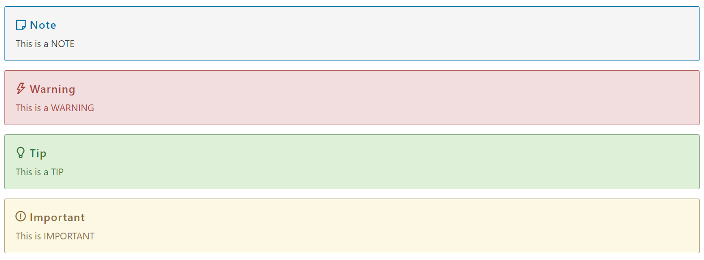

# Microsoft Edge Developer documentation


<!-- ====================================================================== -->
## Microsoft Open Source Code of Conduct

See [Microsoft Open Source Code of Conduct](CODE_OF_CONDUCT.md).


<!-- ====================================================================== -->
## Legal Notices

Microsoft and any contributors grant you a license to the Microsoft documentation and other content in this repository under the [Creative Commons Attribution 4.0 International Public License](https://creativecommons.org/licenses/by/4.0/legalcode) (see [LICENSE](./LICENSE)), and grant you a license to any code in the repository under the [MIT License](https://opensource.org/licenses/MIT) (see [LICENSE-CODE](./LICENSE-CODE)).

Microsoft, Windows, Microsoft Azure and/or other Microsoft products and services referenced in the documentation may be either trademarks or registered trademarks of Microsoft in the United States and/or other countries.  The licenses for this project do not grant you rights to use any Microsoft names, logos, or trademarks.  Microsoft general trademark guidelines can be found at [https://go.microsoft.com/fwlink/?LinkID=254653](https://go.microsoft.com/fwlink/?LinkID=254653).

Privacy information can be found at [https://privacy.microsoft.com](https://privacy.microsoft.com).

Microsoft and any contributors reserve all others rights, whether under their respective copyrights, patents, or trademarks, whether by implication, estoppel or otherwise.


<!-- ====================================================================== -->
## Contributing

This repo, `edge-developer`, is the repository for the source Markdown files for the Microsoft Edge Developer documentation.  The resulting rendered documentation is hosted at [Microsoft Edge documentation](https://docs.microsoft.com/microsoft-edge/developer/).  This repo also includes the hub page for the Microsoft Edge Enterprise documentation and the Microsoft Edge Developer documentation.  The source files for the Microsoft Edge Enterprise documentation are not in this repo, but are in the [Edge-Enterprise](https://github.com/MicrosoftDocs/Edge-Enterprise) repo.

If you want to include new coverage or have feedback, consider [contributing](CONTRIBUTING.md).  You can edit the existing content, add new content, or report new [issues](https://github.com/MicrosoftDocs/edge-developer/issues).  The Microsoft Edge team reviews a look at your suggestions and works to incorporate the suggestions into the docs.

Find the data for the [Status](https://developer.microsoft.com/microsoft-edge/status) webpage at: [https://github.com/MicrosoftEdge/Status](https://github.com/MicrosoftEdge/Status).  The `Status` webpage provides the latest implementation status and future plans for web platform features in Microsoft Edge.

### File names and directories

*   When adding a webpage (an article implemented as a .md file), you must add an entry for the new webpage in [toc.yml](./microsoft-edge/toc.yml), for the article to appear in the Table of Contents.
*   A directory can contain more directories or `readme.md` files.
*   Folder/directory names are dash-separated (for example, `f12-tools`) and lowercase.  Directories are used in URLs on the `docs.microsoft.com` site.  Avoid using underscores, PascalCase, or camelCase.


<!-- ====================================================================== -->
## Markdown tagging

This repo uses simple Markdown tagging that's standard for docs.microsoft.com per the _Docs Contributor Guide_.

*  [Docs Markdown reference](https://docs.microsoft.com/contribute/markdown-reference) - in _Docs Contributor Guide_.
*  [Writing on GitHub](https://docs.github.com/en/github/writing-on-github) - GitHub Flavored Markdown, in _GitHub Docs_.


### Lists

These other text elements have styling available:

*   Unordered lists
*   Have regular bullets
    *   You can also nest bullets.
    *   Bullets lists should have more than one entry.
*   Standard arrangement

1.  Ordered lists.
1.  Use regular western-style numbering.
1.  Should be used only when a list truly has order.

See [Lists (Numbered, Bulleted, Checklist)](https://docs.microsoft.com/en-us/contribute/markdown-reference#lists-numbered-bulleted-checklist) in the _Docs Contributor Guide_.


### Links

See [Use links in documentation](https://docs.microsoft.com/en-us/contribute/how-to-write-links) in the _Docs Contributor Guide_.


### Formatting code blocks

To format inline code in mid-sentence, such as a `functionName`, wrap the code with backticks.  A backtick is an angled single quote, typically in the upper left of the keyboard.

Or you can display multi-line blocks of code.  The following code snippet is a CSS example.

```css
body {
    background: #fff;
}
```

Valid coding languages, used for syntax coloring, include the following, and more.  Other values are usually safe; unknown "slug" strings are rendered the same way you type them.

| Slug | Rendered as |
|---|---|
| html | HTML |
| css | CSS |
| javascript | JavaScript | 
| typescript | TypeScript |
| json | JSON |
| cpp | C++ |
| console | Console |

For example, type three backticks and then the "css" slug.

See [How to include code in docs](https://docs.microsoft.com/en-us/contribute/code-in-docs) in the _Docs Contributor Guide_.


### Tables

| You can | use column headings | on tables |
|:-- |:--- |:--- |
| Left-aligned | Unless a # | 456 |
| Text value | More text | $0.00 |

See [Tables](https://docs.microsoft.com/en-us/contribute/markdown-reference#tables) in the _Docs Contributor Guide_.


### Notes (alerts)

Use alerts, such as Notes, sparingly.  The blocks are designed to highlight "don't-miss-it" information.

The following versions of alerts are available.  Replace the plain text with your own content.

```md
> [!NOTE]
> Information the user should notice even if skimming.
```

```md
> [!TIP]
> Optional information to help a user be more successful.
```

```md
> [!IMPORTANT]
> Essential information required for user success.
```

```md
> [!CAUTION]
> Negative potential consequences of an action.
```

```md
> [!WARNING]
> Dangerous certain consequences of an action.
```



For multi-line blockquote notes, use a greater-than (`>`) character in front of each line of the notes:

```md
> This is a line in a blockquote.  It's ok for it to be very long; it will wrap.
> *  This is a list item.
> *  This is another list item.
>
> This is another line in a blockquote.
```

See [Alerts (Note, Tip, Important, Caution, Warning)](https://docs.microsoft.com/en-us/contribute/markdown-reference#alerts-note-tip-important-caution-warning) in the _Docs Contributor Guide_.


### Images

Images should be stored in a `media` directory.  Reference the image with a relative path relative to the Markdown file, using the following triple-colon image markup:

```md
:::image type="content" source="./media/notes.png" alt-text="Describe what's shown in the image." lightbox="./media/notes.png":::
```

See [Images](https://docs.microsoft.com/en-us/contribute/markdown-reference#images) in the _Docs Contributor Guide_.


---

### Horizontal rules (divider lines)

To create a horizontal rule, use three hyphens alone on a line; `---`.  Use horizontal rules sparingly.  Avoid using a horizontal rule immediately above or below a heading; some headings already use line styles for visual hierarchy.
