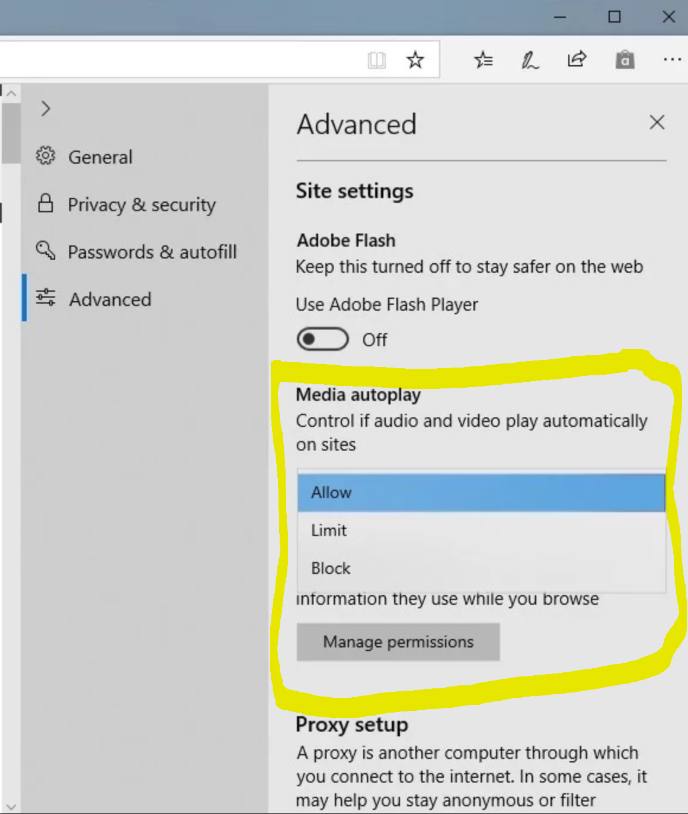

# Microsoft Edge Developer Guide

> [!TIP]
> We've [partnered](https://blogs.windows.com/msedgedev/2017/10/18/documenting-web-together-mdn-web-docs/) with other browsers and the web community in adopting [MDN Web Docs](https://developer.mozilla.org/) as the definitive place for useful, unbiased, browser-agnostic documentation for current and emerging standards-based web technologies. You can find details about EdgeHTML API support directly in each page of the [MDN web reference library](https://developer.mozilla.org/docs/Web). Visit Microsoft Edge's [Platform status](https://developer.microsoft.com/microsoft-edge/platform/status/?q=edge%3AShipped%20edge%3APrefixed%20edge%3A'Preview%20Release) for the latest features supported in Microsoft Edge. 

## What's new in EdgeHTML 18

EdgeHTML 18 includes the following new and updated features shipped in the current release of the Microsoft Edge platform, as of the [Windows 10 October 2018 Update](https://blogs.windows.com/windowsexperience/2018/04/27/make-the-most-of-your-time-with-the-new-windows-10-update/) (04/2018, Build 17134). For changes in specific [Windows Insider](https://insider.windows.com/) Preview builds, see the [Microsoft Edge Changelog](https://developer.microsoft.com/microsoft-edge/platform/changelog/) and [What's New in EdgeHTML](./dev-guide/whats-new.md).

Here's the permalink for the following list of changes: [https://aka.ms/devguide_edgehtml_18](https://aka.ms/devguide_edgehtml_18).

## New and updated features 

### Web Authentication

Microsoft Edge now includes [unprefixed support for the new Web Authentication API](https://blogs.windows.com/msedgedev/2018/07/30/introducing-web-authentication-microsoft-edge/) (aka [WebAuthN](https://w3c.github.io/webauthn/)). Web Authentication provides an open, scalable, and interoperable solution to simplify authentication, enabling better and more secure user experiences by replacing passwords with stronger hardware-bound credentials. The implementation in Microsoft Edge allows the use of [Windows Hello](https://www.microsoft.com/windows/windows-hello) enabling users to sign in with their face, fingerprint, or PIN, in addition to [external authenticators](https://fidoalliance.org) like FIDO2 Security Keys or FIDO U2F Security Keys, to securely authenticate to websites. 

For more information, head over to the blog post [Introducing Web Authentication in Microsoft Edge](https://blogs.windows.com/msedgedev/2018/07/30/introducing-web-authentication-microsoft-edge).

### Control whether media can play automatically

Beginning in the October 2018 Update, users can now control whether sites opened in Microsoft Edge can autoplay media. Find this setting under "Advanced settings" > "Media autoplay", with options to customize the behavior according to your preferences:
- “Allow” is the default and will continue to play videos when you open a tab, at the site’s discretion.
- “Limit” restricts autoplay to only work when videos are muted, so you‘re never surprised by sound. Once you click anywhere on the page, autoplay is re-enabled, and will continue to be allowed within that domain in that tab.
- “Block” prevents autoplay on all sites until you interact with the media content. 

> [!NOTE]
> The "Block" setting may break some sites due to the strict enforcement. You may need to click multiple times for some video or audio to play correctly. Some sites may not work at all – in those cases, you can enable or block autoplay on a case-by-case basis from the website permissions pane by clicking the icon next to the address in the Address Bar.

Microsoft Edge now allows users to control autoplay permissions on a per-site basis. Set media autoplay under the “Website permission” section of the Website Identification pane – just click the information icon or lock icon on the left side of the address bar, then click “manage permissions” to get started.

<!-- ### WebView control 

Improvements in the [WebView control for Windows 10 apps](https://docs.microsoft.com/microsoft-edge/hosting/webview) -->

### Microsoft WebDriver is now a Feature on Demand

WebDriver is now a [Windows Feature on Demand](https://docs.microsoft.com/windows-hardware/manufacture/desktop/features-on-demand-v2--capabilities) (FoD) making it easier than ever to automate testing in Microsoft Edge and get the right version for your device. You will no longer need to match the build/branch/flavor manually when installing WebDriver, your [WebDriver](https://www.w3.org/TR/webdriver) will automatically update to match any new Windows 10 updates. 

You can install WebDriver by turning on Developer Mode, or install it as a standalone by going to Settings > Apps > Apps & features > Manage optional features. For more information, check out the [WebDriver announcement on the Windows Blog site](https://blogs.windows.com/msedgedev/2018/06/14/webdriver-w3c-recommendation-feature-on-demand).

### DevTools

Visit [DevTools in the latest Windows 10 update (EdgeHTML 18)](./devtools-guide/whats-new.md) for more details.

### CSS masking

EdgeHTML 18 improves support for [CSS Masking](https://developer.mozilla.org/docs/Web/CSS/CSS_Masking). This implementation further supports the CSS [mask-image](https://developer.mozilla.org/docs/Web/CSS/mask-image) property with improved WebKit support, including  `webkitMask`, `webkitMaskComposite`, `webkitMaskImage`, `webkitMaskPosition`, `webkitMaskPositionX`, `webkitMaskPositionY`, `webkitMaskRepeat`, and `webkitMaskSize` .  

### New Microsoft Edge Group Policies

We’ve introduced new Group Policies and MDM settings for IT administrators to manage Microsoft Edge. The new policies include:
- enabling/disabling full-screen mode, printing, favorites bar, and saving history; 
- prevent certificate error overrides;
- configuring the Home button and startup options; 
- setting the New Tab page and Home button URL; and 
- managing extensions. 

Learn more about the new [Microsoft Edge policies](https://docs.microsoft.com/microsoft-edge/deploy/new-policies).

### Retired XSS Filter

We are retiring the XSS filter in Microsoft Edge beginning with the October 2018 Update. Our customers remain protected thanks to modern standards like Content Security Policy, which provide more powerful, performant, and secure mechanisms to protect against content injection attacks, with high compatibility across modern browsers.

## New APIs in EdgeHTML 18

Check out the full list of new APIs in EdgeHTML 18. They are listed in the format of [interface name].[api name].

> [!NOTE] 
> Although the following APIs are exposed in the DOM, the end-to-end behavior of some might still be in development. Refer to  [Microsoft Edge platform status](https://developer.microsoft.com/en-us/microsoft-edge/platform/status/) for the official word on feature support.

<iframe height='580' scrolling='no' title='New APIs in EdgeHTML 17' src='//codepen.io/MSEdgeDev/embed/da5b2bef3dfdcb6fea3ac324dc434a62/?height=608&theme-id=23401&default-tab=result&embed-version=2' frameborder='no' allowtransparency='true' allowfullscreen='true' style='width: 100%;'>See the Pen <a href='https://codepen.io/MSEdgeDev/pen/da5b2bef3dfdcb6fea3ac324dc434a62//'>New APIs in EdgeHTML 18</a> by MSEdgeDev (<a href='https://codepen.io/MSEdgeDev'>@MSEdgeDev</a>) on <a href='https://codepen.io'>CodePen</a>.</iframe>

## Previous EdgeHTML releases

[EdgeHTML 13 / Windows build 10586 (11/2015)](https://aka.ms/devguide_edgehtml_13)

[EdgeHTML 14 / Windows build 14393 (8/2016)](https://aka.ms/devguide_edgehtml_14)

[EdgeHTML 15 / Windows build 15063 (4/2017)](https://aka.ms/devguide_edgehtml_15)

[EdgeHTML 16 / Windows build 16299 (10/2017)](https://aka.ms/devguide_edgehtml_16)

[EdgeHTML 17 / Windows build 17134 (04/2018)](https://aka.ms/devguide_edgehtml_17)
