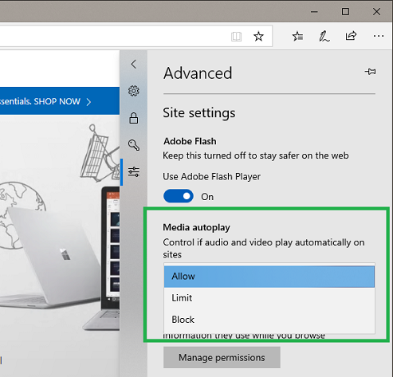

# Autoplay Policies

Microsoft Edge provides customers with the ability to personalize their browsing preferences on websites that autoplay media with sound in order to minimize distractions on the web and conserve bandwidth. Additionaly, Microsoft Edge automatically suppresses autoplay of media in background tabs.

Users can customize media behavior with both [global](#global-media-autoplay-settings) and [per-site](#per-site-media-autoplay-settings) autoplay controls, which provide the following options:

- **Allow**  is the default and will continue to play videos when a tab is first viewed in the foreground, at the site’s discretion.

- **Limit** will restrict autoplay to only work when videos are muted, so users are never surprised by sound. Once the user clicks anywhere on the page, autoplay is re-enabled, and will continue to be allowed within that domain in that tab.

- **Block** will prevent autoplay on all sites until users directly interact with the media content.

## Global media autoplay settings

Users can control the default autoplay behavior for all sites under **Advanced Setting** > **Media autoplay**.



## Per-site media autoplay settings

Users can control autoplay behavior on a per-site basis under the **Website permissions** section of the website information pane. This setting can be found by clicking the information icon or lock icon on the left side of the address bar and clicking on “Media autoplay settings” to get started.

Per-site settings override the global setting. For example, if a user has their global setting set to “Allow” but changes a per-site setting to “Block”, autoplay will be blocked for that site.


 
## Best Practices for Web Developers

Here's how to ensure a good user experience with media hosted on your site:

- Assume  each use of a media element wil require a user gesture to start the playback (as users can block autoplay at any point in time) and plan accordingly.  Global and per-site autoplay policies apply to all `<audio>` and `<video>` elements, regardless of how they are used on your site

- Ensure that media controls are always present on both site media and ad content. This will give users the ability to restart playback if autoplay is blocked on the page.

- Evaluate how autoplay may affect users’ experience on your website and consider using autoplay in a way that minimizes unwanted media playback. If autoplay is a crucial part of your experience, consider using muted content to start and allowing the user to unmute it. For muted content to autoplay, the audio source must be either explicitly muted or not be set. Otherwise the element will not be considered as muted.

- Unless absolutely necessary to do otherwise, use the native browser controls for media playback. This will ensure a consistent experience for users. If you are building custom controls instead, ensure that media controls are always present and that your controls properly react to autoplay suppression.

### Iframe delegation

Autoplay in an `<iframe>` will inherit the autoplay permission from the parent page regardless of content origin. In a playlist scenario where each media file is hosted by a separate iframe, the user would only need to initiate playback once for the entire playlist.

### Detecting when autoplay is allowed

You can adjust your playback controls to display the correct state when autoplay is blocked by examining the promise returned by the `play()` function on the media element:

```Javascript

var promise = document.querySelector('video').play();

if (promise !== undefined) { 
    promise.catch(_error => { 
        // Autoplay was blocked
        // Show user media controls to manually start playback
    }).then(() => { 
        // Autoplay started
    }); 
}

```
