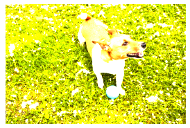
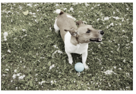
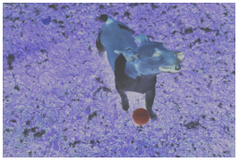

# CSS Filter effects

CSS filters allow you to manipulate graphics, similar to what you might do with a photo editing application directly in the browser.

To use CSS filter effects, apply the [filter](https://msdn.microsoft.com/library/Dn858632) property to a visible element, like the image below, on your web page.


## Syntax

Using this syntax, you can specify which filter function or functions you want to apply to your image.
```css
filter: none |  <filter-function-list> 
<filter-function-list> = [<filter-function]
<filter-function> = <blur()> | <brightness()> | <contrast()> | <drop-shadow()>| <grayscale()> | <hue-rotate()> | <invert()> | <opacity()> | <sepia()> | <saturate()>
```

## Examples
These examples are a few of the filters that you can apply to elements on your web page. 


For the full list of filters, see the [filter](https://msdn.microsoft.com/library/Dn858632) property page.


### Blur filter
The `blur` filter applies a Gaussian blur to an element. The value `2px` in the example below signifies a `<length>`, the radius, that specifies the value of standard deviation to the Gaussian function. The larger the `<length>`, the larger the blur.

Setting a blur on the image above would result in the following:

```css
.image {
  filter: blur(2px);
}
```


### Brightness filter
The `brightness` filter applies a linear multiplier to the element making the element look brighter or darker. Setting the value to 100% will leave the element unchanged and setting the value to 0% will make the element completely black. You can specify a value greater than 100% to make the image look brighter.

Applying the `brightness` [filter](https://msdn.microsoft.com/library/Dn858632) to the same image would result in the following:

```css
.image {
   filter: brightness(250%);
}
```



### Grayscale filter
The `grayscale` filter converts the element to grayscale. Setting the value to 100% makes the element completely grayscale, while setting the value to 0% will leave the element unchanged.

Applying the `grayscale` [filter](https://msdn.microsoft.com/library/Dn858632) to the image would result in the following:

```css
.image {
   filter: grayscale(80%);
}
```



### Invert filter
The `invert` filter inverts the samples in the element. The value that you specify defines the proportion of the conversion. Setting the value to 100% completely inverts the image, while setting the value to 0% leaves the element unchanged. You can specify a value greater than 100%. An increment between 0 and 1 can also be used, with 0 being no inversion and 1 being complete inversion.

Applying the `invert` [filter](https://msdn.microsoft.com/library/Dn858632) to the image would result in the following:

```css
.image {
   filter: invert(.75);
}
```



### Using multiple filters


You can add multiple filter effects to an element by adding a space between the `<filter-functions>`. The `<filter-functions>` will be applied to that element in the order that you list them. For example, the snippet below uses the `sepia`, `hue-rotate`, `saturate`, and `drop-shadow` filters on one image.

```css
.image {
   filter: sepia(55%) hue-rotate(20deg) saturate(185%) drop-shadow(2px 2px 5px gray);
}
```


## API Reference


[CSS Filter Effects](https://msdn.microsoft.com/library/Dn858632)

## Related topics


[SVG Filter effects](./../graphics/SVG.md)
