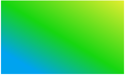
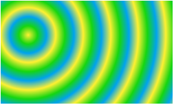
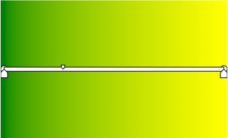

# Gradients

Gradients are images that transition smoothly from one color to another. Microsoft Edge supports linear, circular, and elliptical Cascading Style Sheets, Level 3 (CSS3) gradients, each of which are specified by a gradient line and two or more stop points. Each stop point has its own color, and Microsoft Edge fills in the area between each set of points with a continuous color transition from one to the other.

Microsoft Edge supports CSS3 Gradients in any property that accepts images, such as the [`background-image`](https://msdn.microsoft.com/library/ms530717) property (plus the *image* value of the [`background`](https://msdn.microsoft.com/library/ms530722) shorthand property), the [`list-style-image`](https://msdn.microsoft.com/library/ms530793) property, and generated content. Gradients act as specified in the [Gradients section of the CSS3 Image Values and Replaced Content Module](https://drafts.csswg.org/css-images/#gradients).

## Linear and repeating linear gradients

In a linear gradient, colors transition smoothly along a line. Linear gradients are created by first specifying a gradient line for the gradient to follow, and then the two or more color stop points and offsets. 

A repeating linear gradient's syntax and behavior are indentical to a linear gradient except for what happens after the last color stop has been reached. Upon reaching the last color stop, a repeating linear gradient starts again at the first color stop and repeats.

### Syntax

The basic [`linear-gradient()`](https://msdn.microsoft.com/library/jj152126) and [`repeating-linear-gradient()`](https://msdn.microsoft.com/library/jj152128) syntax are as follows:
```
linear-gradient([ [ <angle> | to <side-or-corner> ] , ] ? <color-stop> [ , <color-stop> ] +)
```

```
repeating-linear-gradient([ [ <angle> | to <side-or-corner> ] , ] ? <color-stop> [ , <color-stop> ] +)
```
### Properties
The `linear-gradient()` and `repeating-linear-gradient()` functions have identical properties which can be seen below.

Properties | Description
:-------------- | :-----------
&lt;angle&gt; | Optional. The angle that the gradient line should assume, expressed as a number followed by an [angle units designator](./length-units-relative-and-absolute.md) (for instance, "deg").  "0deg" points upward and positive angles increase in a clockwise direction. Therefore, "90deg" points toward the right, "180deg" points downward, and so on. If no angle is provided, the gradient line starts in the corner or side opposite the corner or side specified by `<side-or-corner>`.
&lt;side-or-corner&gt; | Optional value that specifies an ending corner or side for the gradient. This value begins with "to", which is followed by one or two of the following keywords. Including one keyword specifies an ending side, and two keywords specify an ending corner.  The following values can be used as the first value only: `left`  Indicates gradient ends on the left. `right`  Indicates gradient ends on the right.The following values can be used as the second value only:`top` Indicates gradient ends on the top.  `bottom` Indicates gradient ends on the bottom.Not including any keywords or angle is equivalent to `to bottom`. 
&lt;color-stop&gt; | At least two color stops are required. Each color stop has one or two components—a color component and an optional position component.  The first component defines the color component of a stop point for the gradient. Each stop point has its own designated color, and the area between each point is filled with a continuous color transition from one to the other. This value can be [any supported color value](./length-units-relative-and-absolute.md).  Each stop point can have an optional percentage or [supported length value](./length-units-relative-and-absolute.md) that indicates where along the gradient line to place the color stop. "0%" (or "0px", "0em", and so on) indicates the starting point (or side); "100%" indicates the ending point (or side).

### Examples
#### Linear gradients

The following linear gradient (used as the argument for the `background-image`) has three color stops:

* The first color stop is in the top-right corner and defines a gradient line that extends to the bottom-left corner. The first stop is a shade of yellow.
* The second color stop is halfway along the gradient line and is a shade of green.
* The final color stop is 80% of the way along the gradient line and is a shade of blue. From this stop to the end of the gradient line (between 80% and 100%), the color remains this shade of blue.


The gradient line starts in the top-right corner of the rectangle and ends in the bottom-left corner. The actual angle depends on the dimensions of the element that the gradient fills.
```css
background-image: linear-gradient(to bottom left, #FFF133 0%, #16D611 50%, #00A3EF 80%);
```




To replicate this gradient using an angle with the same size box (250px×150px), you would specify the following:

```
background-image: linear-gradient(210deg, #FFF133 0%, #16D611 50%, #00A3EF 80%);
```

Keep in mind that if the fill area is changed, the two gradients will look different from each other.

#### Repeating linear gradients
The following image is an example of a repeating linear gradient. It transitions between two colors—blue and yellow. It's a good idea to specify identical colors for the first and last color stops to prevent abrupt color changes between each repeating group.
```
background-image: repeating-linear-gradient(#00A3EF, #FFF133 30px, #00A3EF 50px);
```


## Radial and repeating radial gradients


In contrast to linear gradients, which progress from one end of a line to the other, radial gradients emerge from a single point and smoothly spread outward in a circle or ellipse. A radial gradient is created by defining a center point, the size and shape (if an ellipse) of the final—or 100%—circle or ellipse, and then the color stops in between. 


A repeating radial gradient's syntax and behavior are indentical to a radial gradient except for what happens after the last color stop has been reached. Upon reaching the last color stop, a repeating radial gradient starts again at the first color stop and repeats.

### Syntax


The basic [`radial-gradient()`](https://msdn.microsoft.com/library/jj152127) and [`repeating-radial-gradient()`](https://msdn.microsoft.com/library/jj152129) syntax are as follows:
```
radial-gradient([ [ <shape> || <size> ] [ at <position> ] ? , | at <position> , ] ? <color-stop> [ , <color-stop> ] +)
```
```
repeating-radial-gradient([ [ <shape> || <size> ] [ at <position> ] ? , | at <position> , ] ? <color-stop> [ , <color-stop> ] +)
```


### Properties
The `radial-gradient()` and `repeating-radial-gradient()` functions have identical properties which can be seen below.

Properties | Description
:----------| :-------------
&lt;shape&gt; | Optional value that specifies the ending shape of the gradient. If this value is omitted, the ending shape is a circle if the &lt;size&gt; parameter is a single length value, and an ellipse otherwise. `ellipse` Indicates gradient is in the shape of an ellipse.`circle`  Indicates gradient is in the shape of an circle.
&lt;size&gt; | Optional value that specifies the size of the gradient's ending shape. If this value is omitted, it defaults to `farthest-corner`
&lt;position&gt; | Optional value that specifies the center of the gradient. This value can take the same values as the [background-position](https://msdn.microsoft.com/en-us/library/ms530718(v=vs.85).aspx) property. If this value is omitted, it defaults to `center`.
&lt;color-stop&gt; | At least two color stops are required. Each color stop has one or two components—a color component and an optional position component.  The first component defines the color component of a stop point for the gradient. Each stop point has its own designated color, and the area between each point is filled with a continuous color transition from one to the other. This value can be [any supported color value](./length-units-relative-and-absolute.md).  The second component is an optional percentage or decimal value that indicates where along the gradient ray (similar to a gradient line in a [`linear-gradient`](https://msdn.microsoft.com/en-us/library/jj152126(v=vs.85).aspx), but from the center outward) to place the color stop. "0%" indicates the start of the gradient ray, and "100%" indicates the point where the gradient ray intersects the ending shape. For instance, a value of "20%" indicates the color stop should be placed at a point 20% of the length of the gradient ray, starting from the beginning of the line. Values can be negative, which indicates that the specified color for that value is at mid-transition to the next color at the center of the gradient, so the visible color at the center will be somewhere between the specified color and the next color. Values can be greater than 100%, which specifies a location a correspondingly greater distance from the center of the gradient.

### Examples

#### Radial gradients 

Often different radial gradient syntax can be used to produce the same results. For instance, all three of the following code snippets, when applied to a 250x150-pixel [div](https://msdn.microsoft.com/library/ms535240) element, produce the image shown here.


```css
background-image: radial-gradient(yellow, blue);

background-image: radial-gradient(ellipse at center, #FFFF00 0%, #0000FF 100%);

background-image: radial-gradient(farthest-corner at 50% 50%, yellow, blue);
```


You can also originate the radial gradient in locations other than the center of the gradient box. Use the `closest-side` or `farthest-side` keywords to size the gradient so that the ending shape meets either the closest or farthest side, respectively, of the gradient box.

```css
background-image: radial-gradient(farthest-side at left bottom, #FFF133, #16D611 100px, #00A3EF);
```


The following example sets the center of the gradient at 40px from the left side of the gradient box and 50px from the top side of the gradient box. The first example uses `closest-side`, so the ending shape of the gradient is defined by the closest sides of the gradient box—namely, the top and left sides.

```css
background-image: radial-gradient(closest-side at 40px 50px, #FFF133, #16D611, #00A3EF);
```


If you use `closest-side` or `farthest-side` with circular gradients, the size is determined by the closest side of the gradient box.

#### Repeating radial gradients
After the last color stop has been reached, the gradient starts again at the first color stop and repeats. It's a good idea to specify identical colors for the first and last color stops to prevent abrupt color changes between each repeating group.

The following declaration creates a repeating circular gradient.

```css
background-image: repeating-radial-gradient(closest-side circle at 40px 50px, #FFF133, #16D611, #00A3EF);
```



## Gradient Midpoints


With [CSS Gradient Midpoints](http://go.microsoft.com/fwlink/p/?LinkID=529536), you can specify an optional location between the color stops of a CSS gradient. The color will always be exactly between the colors of the two stops at that point. Other colors along the gradient line are calculated using an exponential interpolation function described by the [CSS Image Values and Replaced Content Module Level 3](http://go.microsoft.com/fwlink/p/?LinkId=530252) specification.

### Examples
In the following example of a 90 degree, green and yellow linear gradient, a midpoint is placed at 30%.

```css
background: linear-gradient(90deg, rgb(255, 255, 0) 0%, 30%, rgb(0, 128, 0) 100%)
```



Check out this [CSS Gradient Midpoints demo](http://go.microsoft.com/fwlink/p/?LinkId=529537) to see gradient midpoints in action.

## API Reference
[Gradients](https://msdn.microsoft.com/library/hh771876)

## Demos
[CSS Gradient Midpoints demo](http://go.microsoft.com/fwlink/p/?LinkId=529537)


## Specification


[CSS Image Values and Replaced Content Module Level 3: Section 3](https://drafts.csswg.org/css-images/#gradients)
