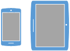

# Screen Orientation API


With support for the W3C [Screen Orientation API](https://www.w3.org/TR/2014/WD-screen-orientation-20140220/), you can detect the screen's current orientation, lock the orientation to a specific state, and be informed when it changes.

The Screen Orientation API enables you to prevent or override the browser from automatically reflowing your web app's content during changes to the orientation of your user's device. When using [device orientation events](./device-orientation-and-motion-events.md), you can also use the Screen Orientation API to lock the display so that your user's device orientation and motion sensor data is accurate, and not invalidated or complicated by random screen orientation changes made by the user.

> [!NOTE]
> This implementation for Screen Orientation API uses the `ms` prefix. Syntax seen in the [latest Screen Orientation API spec](https://www.w3.org/TR/screen-orientation/)(i.e. `screen.orientation.lock` instead of `screen.lockOrientation`) is not supported.


## Orientation values

The Screen Orientation API uses the following concepts to describe the various orientation states across different devices. The example diagrams assume the following normal (default) orientation of the example devices:


| Orientation value       | Description                                                                                                                                                                                                                         | Example device orientation                                                                                                       |
|-------------------------|-------------------------------------------------------------------------------------------------------------------------------------------------------------------------------------------------------------------------------------|----------------------------------------------------------------------------------------------------------------------------------|
| portrait-primary    | The screen is in portrait mode, and the host device is right side up (if its normal orientation is in portrait mode), or the host device is rotated 90 degrees clockwise (if its normal orientation is in landscape mode).          |        |
| landscape-primary   | The screen is in landscape mode, and the host device is right side up (if its normal orientation is in landscape mode), or the host device is rotated 90 degrees counter-clockwise (if its normal orientation is in portrait mode). |      |
| portrait-secondary  | The screen is in portrait mode, and the host device is upside down (if its normal orientation is in portrait mode), or the host device is rotated 90 degrees counter-clockwise (if its normal orientation is in landscape mode).    |    |
| landscape-secondary | The screen is in landscape mode, and the host device is upside down (if its normal orientation is in landscape mode), or the host device is rotated 90 degrees clockwise (if its normal orientation is in portrait mode).           |  |


## Detecting changes and locking orientation

To monitor when the orientation of your user's screen changes, listen for the the [`MSOrientationChange`](https://msdn.microsoft.com/library/Dn342936) event of the [`screen`](https://msdn.microsoft.com/library/ms535868) object, which dispatches a simple [`Event`](https://msdn.microsoft.com/library/Ff974340) object. From this, you can determine the current screen orientation from the [`msOrientation`](https://msdn.microsoft.com/library/Dn342934) property of the `screen` object:

```javascript
function orientationChangeHandler(evt) {
  var orientation = evt.target.msOrientation;
  // Respond to the screen orientation change
}
```

To lock the display to a specific orientation, call the [`msLockOrientation`](https://msdn.microsoft.com/library/Dn342933) method and pass it one or more of the values described in the Orientation values section above:

```javascript
screen.msLockOrientation("portrait-primary", "portrait-secondary"); 
```

Alternatively, you can pass it one of the following "shorthand" values:

| Value | Description |
|-------------|-----------------------------------------------------------------------------|
| portrait | Value that represents both portrait-primary and portrait-secondary cases. |
| landscape | Value that represents both landscape-primary and landscape-secondary cases. |


Locking the screen orientation is only possible when Microsoft Edge is in full screen mode (by the user pressing F11, or via the [Fullscreen API](./fullscreen-API.md)).
If the lock is done on only one orientation, the screen stays on the given orientation and never changes until the screen orientation is unlocked. Otherwise, the screen orientation can change between any of the specified orientations it is locked to, as the user rotates the host device.

To unlock, call the [`screen.msUnlockOrientation`](https://msdn.microsoft.com/library/Dn342935) method.


## API reference

[msOrientation](https://msdn.microsoft.com/library/Dn342934)

[MSOrientationChange](https://msdn.microsoft.com/library/Dn342936)

[msLockOrientation](https://msdn.microsoft.com/library/Dn342933)

[msUnlockOrientation](https://msdn.microsoft.com/library/Dn342935)

## Specification

[Screen Orientation API](https://www.w3.org/TR/2014/WD-screen-orientation-20140220/)


