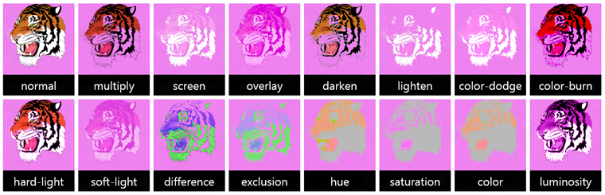

# SVG

Scalable Vector Graphics (SVG), an XML markup language for describing two-dimensional vector graphics, offer a powerful way to add high-fidelity, easily scalable visuals—from small and simple to large and complex— to a website without the need for a plug-in or separate viewer. In addition, SVG images offer unique opportunities for interactivity and animation.

## CSS Transitions & Animations for SVG elements

Microsoft Edge build 10240+ supports [CSS Transitions & Animations for SVG elements](http://dev.w3.org/csswg/css-animations-1/). SVG elements blur the line between content / structure (HTML) and look / style (CSS). SVG elements can be coded into HTML with [presentation attributes](https://msdn.microsoft.com/library/hh801971(v=vs.85).aspx), *(note that they are case-sensitive)*. Some of these presentation attributes are unique to SVG, such as `fill`, `stroke` and `stroke-width`, others are  are shared with CSS, such as `opacity` or `font-size`. The [SVG specification](http://www.w3.org/TR/SVG/propidx.html) lists the SVG attributes that may be set as CSS properties.

> [!NOTE]
> In the [SVG 2 specification](http://www.w3.org/TR/SVG2/styling.html#SVGStylingProperties), this list will include `x`, `y`, `width`, `height`, `cx`, and `cy`. Microsoft Edge support is currently [under consideration](https://developer.microsoft.com/en-us/microsoft-edge/platform/status/?q=svg2).


Most CSS selectors can be used to select SVG elements, including class and ID selectors, as well as pseudo-classes, including `:hover`, `:active`, `:focus`, `:first-child`, `:visited`, `:link` and `:lang` (but not including `::before` and `::after`). SVGs can be animated the same way that HTML elements can, using CSS transitions or CSS keyframes.

The following CSS presentation attributes are supported on SVG. *Find [a full list of CSS Animation and transition properties](https://msdn.microsoft.com/library/dn254934.aspx) on the Web Platform API Reference.*
```CSS
fill, fill-opacity, stroke, stroke-width, stroke-opacity, opacity, position (top, right, bottom, left, z-index), font-size; font-weight, letter-spacing, ...
```

> [!NOTE]
> Currently CSS transforms are not supported on SVG elements by Microsoft Edge, but this support is [in the development backlog](https://wpdev.uservoice.com/forums/257854-microsoft-edge-developer/suggestions/6820655-add-css-transforms-on-svg-elements).


Some SVG properties cannot be animated through CSS. An SVG path, for example, comes with a set of data (a d="" attribute) that defines the shape of the path. This data can be modified and animated through [SMIL](https://msdn.microsoft.com/library/gg193979(v=vs.85).aspx), but not CSS. *More CSS friendly SVG attributes may be coming soon: [See SVG2 Styling Properties Spec](https://www.w3.org/TR/SVG2/styling.html#SVGStylingProperties). Visit Microsoft Edge [platform status for SVG2 updates](https://developer.microsoft.com/en-us/microsoft-edge/platform/status/?filter=f3f0000bf&search=svg2).*

SVG elements can be animated with CSS using the following properties:

Property | Description
:------------ | :-------------
[animation](https://msdn.microsoft.com/library/hh772212.aspx) |  Shorthand values that define animation properties for object properties identified in the @keyframes at-rule of the animations-name property. Typically ordered as `animation`: `animation-name` `animation-duration` `animation-timing-function` `animation-delay` `animation-iteration-count` `animation-direction;`.
[animation-name](https://msdn.microsoft.com/library/hh772236.aspx) | Declares the name of the @keyframes at-rule to manipulate.
[animation-duration](https://msdn.microsoft.com/library/hh772219.aspx) |  Specifies the length of time it takes for an animation to complete one cycle.
[animation-timing-function](https://msdn.microsoft.com/library/hh772240.aspx) | Establishes preset acceleration curves, such as ease (gradually increases speed at the start, then gradually decreases speed at the end, equivalent to `cubic-bezier(0.25,0.1,0.25,1)`; or linear (consistent speed from start to end, equivalent to `cubic-bezier(0,0,1,1)`.
[animation-delay](https://msdn.microsoft.com/library/hh772215.aspx) |  The offset time between the element being loaded and the start of the animation sequence. Value listed in seconds `s` or milliseconds `ms`.
[animation-direction](https://msdn.microsoft.com/library/hh772217.aspx) | Sets the direction of the animation after the cycle. Its default resets on each cycle.
[animation-iteration-count](https://msdn.microsoft.com/library/hh772233.aspx) |  Specifies the number of times an animation cycle is played. Value can be a number or `infinite`.
[animation-fill-mode](https://msdn.microsoft.com/library/hh772232.aspx) | Specifies whether the effects of an animation are visible before or after it plays. Value can be `forwards` (final property value as defined in the last @keyframes rule is maintained after the animation completes), `backwards` (beginning property value applied before the animation), `both`, or `none` (no change to value except during animation).
[animation-play-state](https://msdn.microsoft.com/library/hh772238.aspx) | Specifies whether an animation is playing or paused. Values can be `running` or `paused`.

The following is an example of using the `animation` shorthand property to set the animation-name of 'sample' with a 3 second duration, an animation-timing-function of 'ease-out', a delay of 2 seconds before beginning, alternating direction back-and-forth, with 4 iterations, no values held before or after the animation, currently in a paused play-state.
```CSS
	animation: sample 3s ease-out 2s alternate 4 none paused;
```

> [!NOTE]
> If there are multiple animations specifying behavior for the same property at the same time, the animation which occurs last in the value of `animation-name` will override the other animations at that point.


## The @keyframes Rule

To get an animation to work, you must bind the animation to an SVG element by defining and calling it with the `@keyframes` rule. Each `@keyframes` at-rule defines what should happen at specific moments during the animation. To use keyframes, create a `@keyframes` rule with a name that will be used by the `animation-name` property to match an animation to its keyframe. Every `@keyframes` rule must contain a list of keyframe selectors. Keyframe selector values represent a percentage along the animation at which the keyframe occurs, in addition to the style information for that keyframe.

Keyframe selector values can be a percentage of the animation sequence time at which the keyframe style properties should occur, or can be `from` (representing the start, 0%) and `to` (representing the end, 100%).
```HTML
<svg></svg>
```
```CSS
@keyframes example {
    from {background-color: black;}
    to {background-color: white;}
}

/* Applying the @keyframes rule to an SVG element */
svg {
    width: 100px;
    height: 100px;
    animation: example 3s alternate infinite;
}
```


Utilizing more steps in the Keyframe.

```CSS
@keyframes example {
    0%   {background-color: black;}
    25%  {background-color: red;}
    50%  {background-color: yellow;}
    100% {background-color: white;}
}

/* Applying the @keyframes rule to an SVG element */
svg {
    width: 100px;
    height: 100px;
    animation: example 3s alternate infinite;
}
```


## Example CSS transition on an SVG elements

The following shows the CSS `transition` property being used on the SVG `fill` presentation attribute:
```HTML
<svg>
  <rect width="100" height="100" fill="black" />
</svg>
```
```CSS
rect {
  transition-property: fill;
  transition-duration: 3s;
}
rect:hover {
  fill: blue;
}
```


## foreignObject
Microsoft Edge now supports the [`foreignObject`](https://msdn.microsoft.com/library/dn806280(v=vs.85).aspx) element, allowing developers to use an HTML and CSS layout within a fixed size SVG element. With `foreignObject` content from a different (foreign) XML namespace can be inserted into the SVG namespace. In the example below, an HTML [**div**](https://msdn.microsoft.com/library/ms535240(v=vs.85).aspx) element is inserted between a circle and rectangle drawn in SVG.

<div class="codepen-wrap"><p data-height="300" data-theme-id="23761" data-slug-hash="ONxPZV" data-default-tab="result" data-user="MicrosoftEdgeDocumentation" data-embed-version="2" data-editable="true" class="codepen">See this example by <a href="https://codepen.io/MicrosoftEdgeDocumentation">Microsoft Edge Docs</a> on <a href="https://codepen.io/MicrosoftEdgeDocumentation/pen/ONxPZV">CodePen</a>.</p></div><script async src="//assets.codepen.io/assets/embed/ei.js"></script>

For more information on `foreignObject` properties, go to the [`foreignObject` API reference page](https://msdn.microsoft.com/library/dn806280.aspx).

## feBlend
Microsoft Edge also introduces full support for [`<feBlend>`](https://msdn.microsoft.com/library/hh773211(v=vs.85).aspx) blend modes, providing filter effects to blend together two inputs (similar to image layers). The new blend modes expand the existing values normal, multiply, screen, overlay, darken, and lighten with color-dodge, color-burn, hard-light, soft-light, difference, exclusion, hue, saturation, color, and luminosity.

> [!NOTE]
> The [W3C Filter Effects spec](http://www.w3.org/TR/2014/WD-filter-effects-1-20141125/#element-attrdef-feblend-mode) extended `<feBlend>` to support all blend modes per the [CSS compositing and blending specification](http://www.w3.org/TR/compositing-1/#ltblendmodegt).


To use the new modes just specify the desired mode in the `<feBlend>` element. For example:
```html
<feBlend mode='luminosity’ in2=’SourceGraphic' />
```

#### Microsoft Edge


Try the [Adobe feBlend demo on CodePen](https://codepen.io/adobe/pen/emedOj).

### xlink:href
Also new in Microsoft Edge is support for referencing external resources with xlink:href in the SVG `<use>` element. The SVG `<use>` element finds a chunk of an SVG with an #identifier, copies it, and places it at the coordinates given. It is often used in SVG icon systems.

For example, you can now reference a shape defined in the **same document** using: `<svg><use xlink:href="#circle-2"></use></svg>`. Or reference an **external** resource using: `<svg> <use xlink:href="defs.svg#rect-2"></use> </svg>`. External references also leverage the browser cache -- the server can be set to serve the referenced file with all of the correct headers so that the browser will store it just like any other cached asset.


### Legacy support

Microsoft Edge supports the following SVG implementation:
 - Most SVG document structure, interactivity (scripting events), and styling (inline and through CSS)
 - Many presentation elements and their corresponding attributes and DOM interfaces, including:
	 - basic shapes
	 - filling, stroking, marker, and color
	 - gradients and patterns
	 - paths
	 - text
	 - the following methods to display SVG markup:
 		- SVG fragments in HTML5 embedding, without using a foreign object (that is, simply include an **`<svg>`** tag within your HTML)
 		- SVG as full document type (with .svg file extension)
 		- SVG in XML or XHTML (similar to the HTML5 method, only with XML or XHTML files)
 		- SVG as a CSS image
 		- SVG using the **object** element, as in the following (note the type, height, and width attributes):
		```html
		 <object data="rect2.svg" width="100%" height="400px"
		    type="image/svg+xml"></object>
		```

		 - SVG using the **img**, **embed**, **iframe**, or **frame** elements, as in the following:

		```html
		<embed id="Smiley" src="smiley.svg" type="image/svg+xml">
		```


## API reference

[Scalable Vector Graphics (SVG)](https://msdn.microsoft.com/library/ff971903)

## Demos

[SVG Gradient Background Maker](https://developer.microsoft.com/en-us/microsoft-edge/testdrive/demos/svgradientbackgroundmaker/) ([GitHub repo](https://github.com/MicrosoftEdge/Demos/tree/master/svgradientbackgroundmaker))


## Specification

[Scalable Vector Graphics (SVG) 1.1 (Second Edition)](http://go.microsoft.com/fwlink/p/?LinkID=223328)
