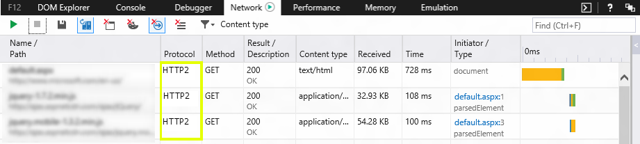

# HTTP/2

HTTP/2, the first significant rework of the Hypertext Transfer Protocol since 1999, improves web performance, enabling a more efficient use of network resources and reducing the perception of latency. HTTP/2 introduces header compression (eliminating entire roundtrips of unnecessary network latency), Server Push (an unsolicited push of representations from servers to clients), utilizes multiplexing (allowing multiple concurrent exchanges on the same connection), enables prioritizing while making multiple HTTP requests to a domain, and uses binary protocol (whereas HTTP/1.1 uses text protocol). HTTP/2 does not require any changes to the way that existing web applications work, but adds new features that new applications can take advantage of for increased speed.

> [!NOTE]
> Microsoft Edge implements the HTTP/2 standard and has removed support for the experimental SPDY/3 protocol. SPDY/3, also known as [TCP Connection Sharing](https://msdn.microsoft.com/library/dn265035(v=vs.85).aspx), was an experimental precursor to HTTP/2 that implemented some network use optimizations.

## Can I use HTTP/2 now?

HTTP/2 will be used by Microsoft Edge on SSL/TLS connections (https) when supported by the host server. Microsoft Edge will fall back to HTTP/1.1 when HTTP/2 is not available or the connection is not secure. Client-side developers will see HTTP/2 noted in the [F12 developer tools Network tool](../../devtools-guide/network.md) where applicable. To see a list of over thirty independent implementations of the HTTP/2 protocol by clients, servers, intermediaries, and network tools, visit the [HTTP/2 Implementations Wiki](https://github.com/http2/http2-spec/wiki/Implementations) on GitHub.

## What does HTTP/2 do to improve security?

HTTP/2 defines a profile of TLS that is required; this includes the version, a [ciphersuite](https://msdn.microsoft.com/library/windows/desktop/aa374757(v=vs.85).aspx) blacklist, and extensions used. [See the spec](https://tools.ietf.org/html/rfc7540#section-9.2) for details.

## Related topics

[HTTP/2 Homepage maintained by the IETF HTTP Working Group](https://http2.github.io/)

[HTTP/2 Frequently Asked Questions](https://http2.github.io/faq/)

[Tools for analysing, debugging and visualising HTTP/2](https://github.com/http2/http2-spec/wiki/Tools)

[Microsoft HTTP 2 Prototype](https://github.com/http2/http2-spec/wiki/Microsoft-HTTP-2-Prototype)

[Using the HTTP Server Version 2.0 API](https://msdn.microsoft.com/library/windows/desktop/aa364703.aspx)

[[IE Blog] HTTP/2: The Long-Awaited Sequel](http://blogs.msdn.com/b/ie/archive/2014/10/08/http-2-the-long-awaited-sequel.aspx)

[CanIUse.com](http://caniuse.com/#search=http%2F2)

## Demos

[HTTP/2 Image Load Demo](http://www.http2demo.io/)

[Browser Support Test](https://http2.akamai.com/demo)

## Specification

[HTTP/2 - RFC7540](https://tools.ietf.org/html/rfc7540)

[HPACK - Header Compression for HTTP/2 - RFC7541](https://tools.ietf.org/html/rfc7541)
