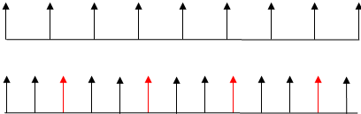

# Animation Timing API

The [Animation Timing API](https://msdn.microsoft.com/library/hh772738(v=vs.85).aspx) deals with the control of script-based animations, specifically the [`requestAnimationFrame()`](https://msdn.microsoft.com/library/hh773174(v=vs.85).aspx) method of the [`window`](https://msdn.microsoft.com/library/ms535873(v=vs.85).aspx) object. The `requestAnimationFrame` method provides a smoother and more efficient way to create animated webpages by calling the animation frame when the system is ready to paint the frame. Prior to this API, animations drawn using [`setTimeout()`](https://msdn.microsoft.com/library/ms536753(v=vs.85).aspx) and [`setInterval()`](https://msdn.microsoft.com/library/ms536749(v=vs.85).aspx) didn't provide web developers an efficient way to schedule graphics timers for animations. This resulted in overdrawn animations, wasted CPU cycles, and extra power usage. Further, animation frequently occurs even when a website isn't visible, particularly when the website uses pages in background tabs or when the browser is minimized.


When an animation uses a JavaScript timer resolution of 10ms to draw animations, you get a timing mismatch as shown here.



The top row represents the 16.7ms display frequency displayed on most monitors and the bottom row represents a typical [`setTimeout`](http://go.microsoft.com/fwlink/p/?LinkID=233102) of 10ms. Every third draw cannot be painted (indicated by the red arrow) because another draw request occurs before the display refresh interval. This overdrawing results in choppy animations because every third frame is lost. This timer resolution reduction can also negatively impact battery life, and reduce performance of other apps.

The `requestAnimationFrame` method (defined in the World Wide Web Consortium (W3C)'s [Timing control for script-based animations](http://go.microsoft.com/fwlink/p/?LinkID=229562) specification) can solve the lost frame problem because it enables apps to be notified when (and only when) the browser needs to update the page display. As a result, apps are perfectly aligned with the browser painting interval and use only the appropriate amount of resources. Switching from `setTimeout` to `requestAnimationFrame` is easy, as they both schedule a single callback. For continued animation, call `requestAnimationFrame` again after the animation function has been called.

## Using requestAnimationFrame


To use this new API, you just call `requestAnimationFrame` using a callback function. The timing is handled by the system. If you're currently using [`setTimeout`](https://msdn.microsoft.com/library/ms536753) to drive your animation timing, like this:

```js
var handle = setTimeout(renderLoop, PERIOD);
```

You can replace [`setTimeout`](http://go.microsoft.com/fwlink/p/?LinkID=233102) with `requestAnimationFrame`, as shown here:

```js
var handle = requestAnimationFrame(renderLoop);
```

This takes care of your first repaint. To keep the animation going, call `requestAnimationFrame` again from within your callback function (shown as renderLoop here).

```html
<!DOCTYPE html>
<html>
  <head>
    <title>Script-based animation using requestAnimationFrame</title>
    <style type="text/css">
     #animated {
       position: absolute; top:100px;
       padding: 50px; background: crimson; color: white;
       }
    </style>
  </head>
  <body>
    <div>Click the box to stop and start it</div>
    <div id="animated">Hello there.</div>
    <script type="text/javascript">
      // global variables
      var elm = document.getElementById("animated");
      var handle = 0;
      var lPos = 0;
      renderLoop();  // call animation frame to start
      function renderLoop() {
          elm.style.left = ((lPos += 3) % 600) + "px";
          handle = window.requestAnimationFrame(renderLoop);
      }
      // click the box to stop the animation
      document.getElementById("animated").addEventListener("click", function () {
        if (handle) {
          window.cancelAnimationFrame(handle);
          handle = null;
        } else {
          renderLoop();
        }
      }, false);
      </script>
  </body>
</html>
```

This examples starts by saving the `<div>` element to a global variable using [`getElementById`](https://msdn.microsoft.com/library/ms536437(v=vs.85).aspx). The `renderLoop()` function is called to start the animation. After the `<div>` element is repositioned, `requestAnimationFrame` is called again to set up for the next move. This continues until you close the browser or click the `<div>` element.

The [`addEventListener`](https://msdn.microsoft.com/library/ff975245(v=vs.85).aspx) method handles the click event on the `<div>` element. When you click the element, [`cancelAnimationFrame`](https://msdn.microsoft.com/library/hh773172(v=vs.85).aspx) is called with the current handle.

## Time in a callback function

You can use the callback function to animate almost anything, for example, SVG, Canvas, or as we show here, CSS properties. The callback function has one incoming *time* parameter, which represents the time the callback function is called. This is a `DOMHighResTimeStamp`, a high resolution time measured from the beginning of the navigation of the page. `DOMHighResTimeStamp` is measured in milliseconds accurate to a thousandth of a millisecond. This time value isn't directly comparable with `Date.now()`, which measures time in milliseconds since 01 January 1970. If you want to compare the *time* parameter with the current time, use [`window.performance.now`](https://msdn.microsoft.com/library/hh973355(v=vs.85).aspx) for the current time.

> [!NOTE]
> Changing the time value from `DOMTimeStamp` to `DOMHighResTimeStamp` was a change in 2012 (see Editors Draft of the [W3C Timing control for script-based animation](http://go.microsoft.com/fwlink/p/?LinkID=229562) specification). Earlier versions of the W3C specification used the DOMTimeStamp, which allowed you to use `Date.now` for the current time. The difference being `DOMTimeStamp` has a millisecond precision and `DOMHighResTimeStamp` has a minimal precision of ten microseconds.


## Browser support

Older browsers might still implement the `DOMTimeStamp` parameter, or not support the [`window.performance.now`](https://msdn.microsoft.com/library/hh973355(v=vs.85).aspx) timing function. This example provides a sample animation program that works across several browsers and uses time to move the `<div>` element.

```html
<!DOCTYPE html>
<html>
<head>
<title>Script-based animation using requestAnimationFrame</title>
<style type="text/css">
div { position: absolute; left: 10px; top:100px; padding: 50px;
  background: crimson; color: white; }
</style>
<script type="text/javascript">
    var requestId = 0;
    var startime = 0;
    var lpos = 0;
    var elm;

    function init() {
        elm = document.getElementById("animated");
    }

    function render() {
        elm.style.left = ((lpos += 3) % 600) + "px";
        requestId = window.requestAFrame(render);
    }

    function start() {
        if (window.performance.now) {
            startime = window.performance.now();
        } else {
            startime = Date.now();
        }
        requestId = window.requestAFrame(render);
    }
    function stop() {
        if (requestId)
            window.cancelAFrame(requestId);        
    }


    // handle multiple browsers for requestAnimationFrame()
    window.requestAFrame = (function () {
        return window.requestAnimationFrame ||
                window.webkitRequestAnimationFrame ||
                window.mozRequestAnimationFrame ||
                window.oRequestAnimationFrame ||
                // if all else fails, use setTimeout
                function (callback) {
                    return window.setTimeout(callback, 1000 / 60); // shoot for 60 fps
                };
    })();

    // handle multiple browsers for cancelAnimationFrame()
    window.cancelAFrame = (function () {
        return window.cancelAnimationFrame ||
                window.webkitCancelAnimationFrame ||
                window.mozCancelAnimationFrame ||
                window.oCancelAnimationFrame ||
                function (id) {
                    window.clearTimeout(id);
                };
    })();
</script>
</head>
<body onload="init();">
<div id="animated">Hello there.</div>
<button onclick="start()">Start</button>
<button onclick="stop()">Stop</button>
</body>
</html>
```

This example is an updated version of a sample from the W3C specification, with vender prefixed elements added. The example tests for `window.performance.now`, and if it isn't supported, uses `Date.now` to get the current time. If `requestAnimationFrame` and `cancelAnimationFrame` aren't supported, then [`setTimeout`](https://msdn.microsoft.com/library/ms536753(v=vs.85).aspx) and [`clearTimeout`](https://msdn.microsoft.com/library/ms536357(v=vs.85).aspx) are used. This gives compatibility for earlier versions of the browser.


## Specification

[Timing control for script-based animations](https://www.w3.org/TR/animation-timing/)
