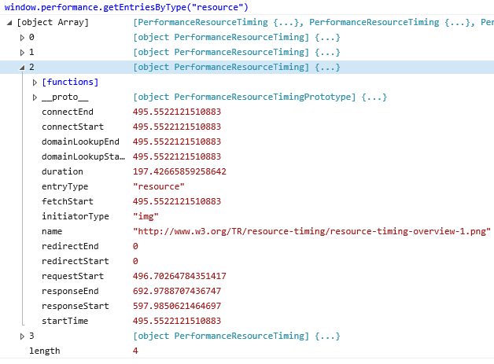

# Resource Timing API

The [*Resource Timing API*](https://www.w3.org/TR/resource-timing/) allows web applications to access network timing information regarding how long it takes for resources to load in a document (such as images, CSS files, Javascript files, etc). These timing metrics are helpful to measure user latency, crucial for benchmarking, and toward optimizing a web application's performance. 

> [!NOTE]
> The [Resource Timing API Specification](http://www.w3.org/TR/resource-timing/) is a W3C Candidate Recommendation with most significant features locked in, but as minor changes occur, there may be divergence in the browser implementation. Currently Microsoft Edge build 10240+ offers unprefixed standard support. 


Similar to the [*Navigation Timing API*](./navigation-timing-api.md), the Resource Timing API is unique in that it creates a resource loading timeline providing the name and type of each resource, timestamps for network events such as redirect start and end times, fetch start, DNS lookup start and end times, response start and end times, and calculates duration for you (using [`responseEnd`](https://msdn.microsoft.com/library/ff974730.aspx) - [`startTime`](https://msdn.microsoft.com/library/jj585581.aspx)). The Resource Timing API offers a more complete picture of performance than most JavaScript-based mechanisms due to it's ability to provide a complete end-to-end latency picture, accounting for external resources (such as CDN libraries, external images or videos) that need to be accurately measured to determine what may be slowing down page load and in need of optimization.

## Exposing the Resource Timing API

The Resource Timing API is exposed through the [`performance`](https://msdn.microsoft.com/library/ff974680) property of the [`window`](https://msdn.microsoft.com/library/ms535873) object. The information collected for each resource can be retrieved using the [`getEntriesByType()`](https://msdn.microsoft.com/library/jj585590) method. Try entering the code below in the [F12 Developer Tools Console](../../f12-devtools-guide/console.md) to expose the performance of all of the resources on a page open in your browser.

```JS
window.performance.getEntriesByType("resource")
```


*The image above represents a resource from exposing `performance` on the [Resource Timing API W3C Specification](http://www.w3.org/TR/resource-timing/).*

The same method is used by the [User Timing API](http://go.microsoft.com/fwlink/p/?LinkId=248169), with the difference of needing to pass the string `resource` to `getEntriesByType()` in order to retrieve information about these resources. The `getEntriesByType()` method returns a list of `PerformanceResourceTiming` objects, which extend the `PerformanceEntry` interface. These objects expose timestamps for the various phases of resource loading, represented in the following inherited properties:

Property | Description
:------------ | :-------------
name | The resolved URL of the requested resource.
entryType | The value is always equal to resource.
startTime | The time immediately before the user agent starts to queue the resource for fetching.
duration | The difference between `responseEnd` and `startTime`.
initiatorType | Represents the type of resource that initiated the performance event. Possible values include img, script, css, background:url(...), xmlhttprequest, etc.
redirectStart | The start time of the fetch which that initiates the redirect.
redirectEnd | The time immediately after receiving the final byte of the response of the last redirect.
fetchStart | The time immediately before the browser starts to fetch the resource. When HTTP redirects are present, the time immediately before the user agent starts to fetch the final resource in the redirection is returned.
domainLookupStart | The time immediately before the browser starts the domain name lookup for the resource.
domainLookupEnd | The time immediately after the browser finishes the domain name lookup for the resource.
connectStart | The time immediately before the browser starts the handshake process to secure the current connection.
connectEnd | The time immediately after the browser finishes establishing the connection to the server to retrieve the resource.
requestStart | The time immediately before the browser starts requesting the resource from the server (or cache or local resource). Value returns the start time of the retry request if transport connection fails and request is retired. There is no end property for requestStart.
responseStart | The start time of the fetch initiating the redirect. When HTTP redirects are present, the starting time of the fetch that initiates the redirect is returned.
responseEnd | The time immediately after receiving the last byte of the response of the last redirect. When HTTP redirects are present, the time immediately after receiving the last redirect is returned. (If timing allow check algorithm does not pass for a redirected resource, zero is returned.)


## High Resolution Timestamps

The Resource Timing API returns time in the form of a `DOMHighResTimeStamp` enabling reliable, high-resolution timing of client-side performance. Unlike regular timestamps created with [`Date.now()`](https://msdn.microsoft.com/library/hh973355), a high resolution timestamp represents a time in milliseconds accurate to a thousandth of a millisecond*.

> [!NOTE]
> While `Date.now()` returns the number of milliseconds elapsed since 1 January 1970 00:00:00 UTC, `performance.now()` returns the number of milliseconds, with microseconds in the fractional part, from `performance.timing.navigationStart()`, the start of navigation of the document, to the `performance.now()` call. `DOMTimeStamp` has millisecond precision, but `DOMHighResTimeStamp` actually has a minimal precision of five microseconds (5 µs). However, not all browsers are able to provide a time value accurate to 5 microseconds, because hardware or software constraints may interfere. The browser then represents the value as a time in milliseconds accurate to a millisecond.


This level of precision can be very useful when testing code that needs to run really fast. Try retrieving a `DOMHighResTimeStamp` using the [`now`](https://msdn.microsoft.com/library/hh973355) method on the [`performance`](https://msdn.microsoft.com/library/ff974680) object in the F12 Console Tool:
```JS
performance.now()
```

Note the results of `performance.now()` compared to `Date.now()` below.
```JS
Date.now()         //result:  1337376068250
performance.now()  //result:  20303.427000007
```
 
 `performance.now()` is a measurement of floating point milliseconds since that particular page started to load (the `performance.navigationStart` to be specific).

### Example performance test 

The following is a simple test to measure a function's performance utilizing High Resolution Time Stamps... just insert your own functions in place of foo() and bar().

```JavaScript
var startTime = performance.now();

// A time consuming function foo();
var test1 = performance.now();

// Another time consuming function bar();
var test2 = performance.now();

// Print more accurate results
console.debug("Test1 time: " + (test1 - startTime));
console.debug("Test2 time: " + (test2 - test1));
```


## API Reference

[Timing and Performance APIs](https://msdn.microsoft.com/library/hh772738)

[Objects](https://msdn.microsoft.com/library/hh772729)

## Specification

[Resource Timing API Specification](http://www.w3.org/TR/resource-timing/)
