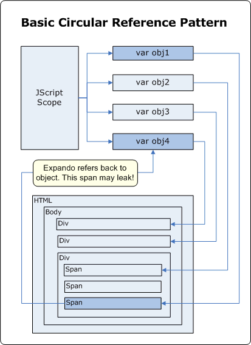
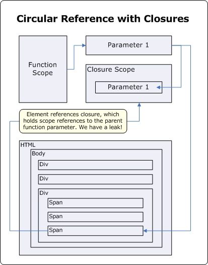
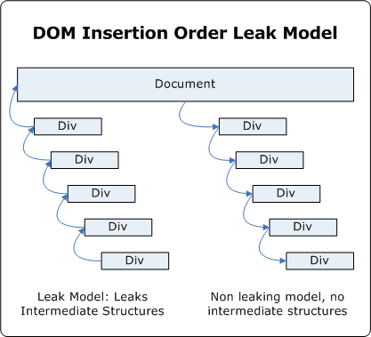

# Understanding and Solving Internet Explorer Leak Patterns


As of December 2011, this topic has been archived. As a result, it is no longer actively maintained. For more information, see [Archived
Content](http://go.microsoft.com/fwlink/?linkid=236039). For information, recommendations, and guidance regarding the current version
of Internet Explorer, see [IE Developer Center](http://go.microsoft.com/fwlink/?linkid=204313).

Justin Rogers  
Microsoft Corporation

June 2005

## The Evolution of the Web Developer

In the past, memory leaks haven't posed huge problems for Web developers. Pages were kept relatively simple and navigation between different locations within a site was a great way to clean up any loose memory. If there was a leak, it was most likely small enough to go unnoticed.

New Web applications live up to higher standards. A page might run for hours without being navigated and retrieve updated information dynamically through Web services. Language features are pushed to the breaking point by combining complex event schemes, object-oriented JScript, and closures to produce entire applications. With these and other changes, certain memory leak patterns are becoming more prominent, especially those previously hidden by navigation.

The good news is that memory leak patterns can be easily spotted if you know what to look for. Most of the troublesome patterns you might face have known workarounds requiring only a small amount of extra work on your behalf. While some pages might still fall prey to small memory leaks, the most noticeable ones can be easily removed.

## Leak Patterns

The following sections will discuss patterns of memory leaks and point out some common examples of each pattern. One great example of a pattern is the closure feature of JScript, while another example is the use of closures in hooking events. If you're familiar with the event hooking example, you might be able to find and fix many of your memory leaks, but other closure-related issues might go unnoticed. 

Now, let's look at the following patterns:

1.  Circular References—When mutual references are counted between Internet Explorer's COM infrastructure and any scripting engine, objects can leak memory. This is the broadest pattern.
2.  Closures—Closures are a specific form of circular reference that pose the largest pattern to existing Web application architectures. Closures are easy to spot because they rely on a specific language keyword and can be searched for generically.

3.  Cross-Page Leaks—Cross-page leaks are often very small leaks of internal book-keeping objects as you move from site to site. We'll examine the DOM Insertion Order issue, along with a workaround that shows how small changes to your code can prevent the creation of these book-keeping objects.

4.  Pseudo-Leaks—These aren't really leaks, but can be extremely annoying if you don't understand where your memory is going. We'll examine the script element rewriting and how it appears to leak quite a bit of memory, when it is really performing as required.

## Circular References

Circular references are the root of nearly every leak. Normally, script engines handle circular references through their garbage collectors, but certain unknowns can prevent their heuristics from working properly. The unknown in the case of IE would be the status of any DOM elements that a portion of script has access to. The basic principle would be as follows:



**Figure 1. Basic Circular Reference Pattern**

The cause of the leak in this pattern is based on COM reference counting. The script engine objects will hold a reference to the DOM element and will be waiting for any outstanding references to be removed before cleaning up and releasing the DOM element pointer. In our case we have two references on the script engine object: the script engine scope, and the DOM element expando property. While terminating the script engine will release the first reference, the DOM element reference will never be released because it is waiting on the script engine object to release it! You might think it would be easy to detect this scenario and fix the problem, but in practice the basic case presented is only the tip of the iceberg. You could have circular references at the end of a 30 object chain and those would be much harder to detect.

If you are wondering what this pattern looks like in HTML, you can cause a leak by using a global script engine variable and a DOM element as shown.

```html
<html>
    <head>
        <script language="JScript">

        var myGlobalObject;

        function SetupLeak()
        {
            // First set up the script scope to element reference
            myGlobalObject =
                document.getElementById("LeakedDiv");

            // Next set up the element to script scope reference
            document.getElementById("LeakedDiv").expandoProperty =
                myGlobalObject;
        }


        function BreakLeak()
        {
            document.getElementById("LeakedDiv").expandoProperty =
                null;
        }
        </script>
    </head>

    <body onload="SetupLeak()" onunload="BreakLeak()">
        <div id="LeakedDiv"></div>
    </body>
</html>
```

To break the leak pattern you can make use of explicit null assignments. By assigning null before the document unloads you are telling the script engine there is no longer an association between the element and the object inside the engine. It can now properly clean up references and will release the DOM element. In this case, you as the Web developer know more about the relationships between your objects than the script engine does.

While that is the basic pattern, it can be difficult to spot more complex scenarios. A common usage of object-oriented JScript is to extend DOM elements by encapsulating them inside of a JScript object. During the construction process, you generally pass in the DOM element you want to attach to and then store a reference to the DOM element on the newly constructed object while at the same time storing an instance of the newly constructed object on the DOM element. That way your application model always has access to everything it needs. The problem is this is a very explicit circular reference, but because it uses 
different language aspects it might go unnoticed. Breaking up this kind of pattern can become more complex, and you can use the same simple methods discussed earlier.

```html
<html>
    <head>
        <script language="JScript">

        function Encapsulator(element)
        {
            // Set up our element
            this.elementReference = element;

            // Make our circular reference
            element.expandoProperty = this;
        }

        function SetupLeak()
        {
            // The leak happens all at once
            new Encapsulator(document.getElementById("LeakedDiv"));
        }

        function BreakLeak()
        {
            document.getElementById("LeakedDiv").expandoProperty =
                null;
        }
        </script>
    </head>

    <body onload="SetupLeak()" onunload="BreakLeak()">
        <div id="LeakedDiv"></div>
    </body>
</html>
```

More complex solutions to this problem involve registration schemes to note which elements/properties need to be unhooked, having the peer element hook events so that it can clean up before the document unloads, but often you can run into additional leak patterns without actually fixing the problem.

## Closures

Closures are very often responsible for leaks because they create circular references without the programmer being fully aware. It isn't immediately obvious that parent function parameters and local variables will be frozen in time, referenced, and held until the closure itself is released. In fact this has become such a common programming tactic, and users have run into issues so often, there are quite a few resources already available. Because they detail some of the history behind closures as well as some of the specific instances of closure leaks we'll check those out after applying the closure model to our circular
reference diagram and figuring out where these extra references are coming from.



**Figure 2. Circular References with Closures**

With normal circular references there were two solid objects holding references to each other, but closures are different. Rather than make the references directly, they are made instead by importing information from their parent function's scope. Normally, a function's local variables and the parameters used when calling a function only exist for the lifetime of the function itself. With closures, these variables and parameters continue to have an outstanding reference as long as the closure is alive, and since closures can live beyond the lifetime of their parent function so can any of the locals and parameters in that function. In the example, Parameter 1 would normally be released as soon as the function call was over. Because we've added a closure, a second reference is made, and that second reference won't be released until the closure is also released. If you happened to attach the closure to an event, then you would have to detach it from that event. If you happened to attach the closure to an expando then you would need to null that expando.

Closures are also created per call, so calling this function twice will create two individual closures, each holding references to the parameters passed in each time. Because of this transparent nature it is really easy to leak closures. The following example provides the most basic of leaks using closures:

```js
<html>
    <head>
        <script language="JScript">

        function AttachEvents(element)
        {
            // This structure causes element to ref ClickEventHandler
            element.attachEvent("onclick", ClickEventHandler);

            function ClickEventHandler()
            {
                // This closure refs element
            }
        }

        function SetupLeak()
        {
            // The leak happens all at once
            AttachEvents(document.getElementById("LeakedDiv"));
        }

        function BreakLeak()
        {
        }
        </script>
    </head>

    <body onload="SetupLeak()" onunload="BreakLeak()">
        <div id="LeakedDiv"></div>
    </body>
</html>
```
If you are wondering how to break this leak, it won't be as easy as a normal circular reference. The "closure" can be viewed as a temporary object that exists in the function scope. Once the function exits, you lose reference to the closure itself, so what would you end up calling **detachEvent** with? One of the most interesting approaches to this problem was demonstrated on [MSN spaces thanks to Scott Isaacs](http://spaces.msn.com/members/siteexperts/blog/cns!1pncl8jwtfkkjv4gg6lkvcpw!338.entry).
The approach uses a second closure to additionally hook the window's **onUnload** event, and because this closure has the same "scoped" objects it is able to detach the event, detach itself, and finish the clean up process. To make everything easily fit with our model we can also store the closure on an expando, detach it, and then null the expando, as in the following example.

```js
<html>
    <head>
        <script language="JScript">

        function AttachEvents(element)
        {
            // In order to remove this we need to put
            // it somewhere. Creates another ref
            element.expandoClick = ClickEventHandler;

            // This structure causes element to ref ClickEventHandler
            element.attachEvent("onclick", element.expandoClick);

            function ClickEventHandler()
            {
                // This closure refs element
            }
        }

        function SetupLeak()
        {
            // The leak happens all at once
            AttachEvents(document.getElementById("LeakedDiv"));
        }

        function BreakLeak()
        {
            document.getElementById("LeakedDiv").detachEvent("onclick",
                document.getElementById("LeakedDiv").expandoClick);
            document.getElementById("LeakedDiv").expandoClick = null;
        }
        </script>
    </head>

    <body onload="SetupLeak()" onunload="BreakLeak()">
        <div id="LeakedDiv"></div>
    </body>
</html>
```

In a [Knowledge Base article](http://support.microsoft.com/default.aspx?scid=kb;en-us;830555), we actually recommend that you try not to use closures unless they are necessary. In the example I've given, we don't need to use a closure as the event handler, instead we can move the closure to a global scope.
When the closure becomes a function, it no longer inherits the parameters or local variables from its parent function so we don't have to worry about closure-based circular references at all. Most code can be fixed by creating an architecture that doesn't rely on closures where they aren't necessary.

Finally, Eric Lippert, one of the developers of the scripting engines, has a [great post on closures in general](http://blogs.msdn.com/ericlippert/archive/2003/09/17/53028.aspx). His final recommendations are also along the lines of only using closures when truly necessary. While his article doesn't mention any of the workarounds for the closure pattern, hopefully we've covered enough examples here to get you started.

## Cross-Page Leaks

Leaks that are based on order of insertion are almost always caused by the creation of intermediate objects that don't get cleaned up properly. That is exactly the case when creating dynamic elements and then attaching them to the DOM. The basic pattern is attaching two dynamically created objects together temporarily which creates a scope from the child to the parent element. Later, when you attach this two-element tree to the primary tree, they both inherit the scope of the
document and a temporary object is leaked. The following diagram shows two methods for attaching dynamically created elements to the tree. In the first model, attach each child element to its parent, and finally attach the entire subtree to the primary tree. This method can cause leaks through temporary objects if other conditions are met. In the second model, we attach elements into the primary tree working our way from top-level dynamically created element down through all of the children. Because each attachment inherits the scope of the primary document we never generate temporary scopes. This method is much better at avoiding potential memory leaks.



**Figure 3. DOM Insertion Order Leak Model**

Next, we are going to cover an example of a leak that is transparent to most leak-detection algorithms. Because we don't leak any publicly visible elements and the objects we leak are very small you might never notice this problem. For our example to work, the dynamically created elements will have to contain a script pointer in the form of an inline function. This will allow us to leak an internal script object that is created temporarily as we attach elements together. Because the leak is small, we'll have to run thousands of samples. In fact, the objects leaked are only a few bytes. By running the sample and navigating to an
empty page, you can see the difference in memory consumption between the two versions. When we use the first DOM model of attaching child to parent, then parent to the primary tree, our memory usage goes up a bit. This is a cross-navigation leak and the memory isn't reclaimed until you restart the IE process. If you run the sample a few more times, using the second DOM model of attaching the parent to the primary tree and then the child to the parent, your memory won't continue to climb and you'll find that you've fixed the cross-page navigation leak.

```html
<html>
    <head>
        <script language="JScript">

        function LeakMemory()
        {
            var hostElement = document.getElementById("hostElement");

            // Do it a lot, look at Task Manager for memory response

            for(i = 0; i < 5000; i++)
            {
                var parentDiv =
                    document.createElement("<div onClick='foo()'>");
                var childDiv =
                    document.createElement("<div onClick='foo()'>");

                // This will leak a temporary object
                parentDiv.appendChild(childDiv);
                hostElement.appendChild(parentDiv);
                hostElement.removeChild(parentDiv);
                parentDiv.removeChild(childDiv);
                parentDiv = null;
                childDiv = null;
            }
            hostElement = null;
        }


        function CleanMemory()
        {
            var hostElement = document.getElementById("hostElement");

            // Do it a lot, look at Task Manager for memory response

            for(i = 0; i < 5000; i++)
            {
                var parentDiv =
                    document.createElement("<div onClick='foo()'>");
                var childDiv =
                    document.createElement("<div onClick='foo()'>");

                // Changing the order is important, this won't leak
                hostElement.appendChild(parentDiv);
                parentDiv.appendChild(childDiv);
                hostElement.removeChild(parentDiv);
                parentDiv.removeChild(childDiv);
                parentDiv = null;
                childDiv = null;
            }
            hostElement = null;
        }
        </script>
    </head>

    <body>
        <button onclick="LeakMemory()">Memory Leaking Insert</button>
        <button onclick="CleanMemory()">Clean Insert</button>
        <div id="hostElement"></div>
    </body>
</html>
```

This leak deserves clarification, because our workaround goes against some best practices in IE. The key points to understand about the leak are that DOM elements are being created with scripts already attached. This is actually crucial to the leak, because if we create DOM elements that don't contain any script and attach them together in the same manner we don't have a leak problem. This gives rise to a second workaround that might be even better for larger subtrees (in the example we only have two elements, so building the tree off the primary DOM isn't a performance hit). The second workaround would be to create your
elements with no scripts attached initially so that you can safely build your subtree. After you've attached your subtree to the primary DOM, go back and wire up any script events at that point. Remember to follow the principles for circular references and closures so you don't cause a different leak in your code as you hook up your events.

I really wanted to point out this issue because it shows that not all memory leaks are easy to find. It could take thousands of iterations of a smaller pattern to become visible, and it might be something slight, like the order of insertion of DOM elements that causes the problem to arise. If you tend to program using only best practices, then you think you are safe, but this leak shows that even best practices can exhibit leaks. Our solution here was to improve upon the best practice or even introduce a new best practice in order to remove the leaking condition.

## Pseudo-Leaks

Often times the actual behavior and expected behavior of some APIs can lead you to misdiagnose memory leaks. Pseudo-leaks almost always appear on the same page during dynamic scripting operations and should rarely be visible after navigation away from the page to a blank page. That is how you can eliminate the issue as a cross-page leak and then start to work on whether the memory consumption is expected. We'll use script text rewriting as our example of a pseudo-leak.

Like the DOM Insertion Order issue, this issue also relies on the creation of temporary objects in order to "leak" memory. By rewriting the script text inside of a script element over and over again, slowly you'll begin to leak various script engine objects that were attached to the previous contents. In particular, objects related to debugging script are left behind as are fully formed code elements.

```html
<html>
    <head>
        <script language="JScript">

        function LeakMemory()
        {
            // Do it a lot, look at Task Manager for memory response

            for(i = 0; i < 5000; i++)
            {
                hostElement.text = "function foo() { }";
            }
        }
        </script>
    </head>

    <body>
        <button onclick="LeakMemory()">Memory Leaking Insert</button>
        <script id="hostElement">function foo() { }</script>
    </body>
</html>
```

If you run the above code and use the Task Manager trick again, while navigating between the "leaking" page and a blank page, you won't notice a script leak. This script leak is entirely within a page and when you navigate away then you get your memory back. The reason this one is bad is due to expected behavior. You expect that after rewriting some script that the original script won't stay around. But it really has to, because it might have been used already for event attachments and there might be outstanding reference counts. As you can see, this is a pseudo-leak. On the surface the amount of memory consumption looks
really bad, but there is a completely valid reason.

## Conclusion

Every Web developer builds a personal list of code examples that they know leak and learns to work around those leaks when they see them in code. This is extremely handy and is the reason the Web is relatively leak-free today. Thinking about the leaks in terms of patterns instead of individual code examples, you can start to develop even better strategies for dealing with them. The idea is to take them into account during the design phase and make sure you have plans for any potential leaks. Use defensive coding practices and assume that you'll need to clean up all your own memory. While this is an overstatement of the 
problem, you very rarely need to clean up your own memory; it becomes obvious which variables and expando properties have the potential for leaking.

In the interest of patterns and design I highly recommend [Scott's short blog entry](http://spaces.msn.com/members/siteexperts/blog/cns!1pncl8jwtfkkjv4gg6lkvcpw!338.entry) because it demonstrates a general purpose example of removing all
closure-based leaks. It does require a bit more code, but the practice is sound and the improved pattern is easy to spot in code and to debug. Similar registration schemes can be used for expando-based circular references as long as care is taken that the registration method itself
isn't riddled with leaks (especially where closures are used)!

**About the author**

**Justin Rogers** recently joined the Internet Explorer team as an Object Model developer working on extensibility and previously worked on such notable projects as the .NET QuickStart Tutorials, .NET Terrarium, and SQL Reporting Services Management Studio in SQL Server 2005.
