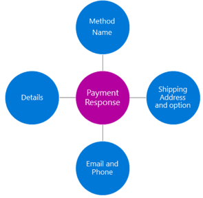
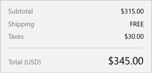
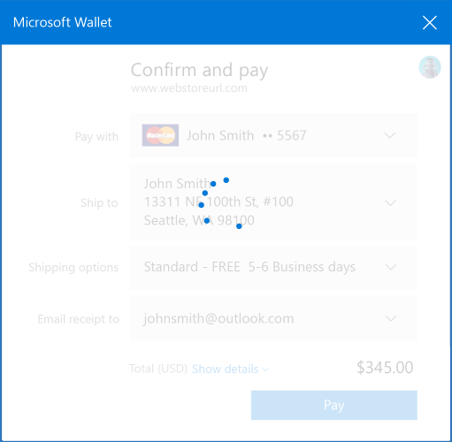
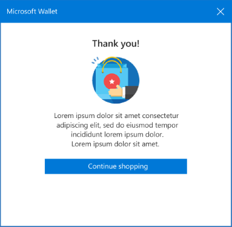

# Payment Request API

E-commerce sales continue growing at a rapid pace. According to [eMarketer](https://www.emarketer.com/), by 2018 digital sales are forecasted to increase by 23% from the levels measured in 2013.  While consumers and businesses enjoy the convenience of e-commerce sales, challenges remain.  Today each e-commerce website owner needs to invest time to develop high quality payment checkout flows and validation rules.  Consumers need to navigate different payment checkout flows and re-enter the same payment and shipping information on every site where they shop.  This can be time consuming and frustrating for consumers, leading to a high rate of shopping cart abandonment and decreased sales for merchants. Merchants [estimate](http://baymard.com/lists/cart-abandonment-rate) between 60% and 70% of shopping carts are abandoned.      

The [Payment Request API](http://www.w3.org/TR/payment-request/) standardizes the payment checkout process. This API requires less customization for web developers and provides a faster, more consistent, and therefore, less confusing experience for consumers.  Because consumers can select payment instruments and shipping addresses from their Microsoft account, they are required to enter less data to complete purchases which reduces the time and data entry required to complete a payment.   

The [Payment Request API](http://www.w3.org/TR/payment-request/) is an open, cross-browser standard that enables browsers to act as an intermediary between merchants, consumers, and the payment methods (e.g. credit cards) that consumers have stored in the cloud. 
  
In summary, when using the [Payment Request API](http://www.w3.org/TR/payment-request/), customers shop on merchant websites as normal.  When ready to pay, the merchant website calls the **Payment Request** API to create a **Payment Request** and passes the relevant payment information (e.g. supported payment methods, purchase amount, currency, etc.) to the browser.


The browser authenticates the user, enables the user to select a supported payment method on file, and processes the payment details. The browser then sends the payment information details back to the merchant website, so that the merchant can complete the payment.  In addition to receiving payment information, the merchant can also elect to receive shipping information as part of the **Payment Request**.  



To see the Payment Request API in action, as well as get an overview of how to use it, check out this video.

> [!VIDEO https://channel9.msdn.com/Blogs/One-Dev-Minute/Using-the-Payments-Request-API/player]


> [!NOTE]
> The Payment Request API is supported in Microsoft Edge build 14992+.


## Creating a Payment Request 
Web pages create a **Payment Request** typically when the user initiates a payment process by clicking a "buy" button.  The **Payment Request** [constructor](https://msdn.microsoft.com/library/mt790440) includes methodData, details, and options. 

```js
var payment = new PaymentRequest ( 
    methodData,  // required payment method data including payment method identifiers 
    details,     // required transaction information 
    options      // optional information like shipping or contact info to be returned 
); 
```

The [`methodData`](https://msdn.microsoft.com/library/mt790440#PaymentRequest_params) parameter contains a list of the payment methods and networks accepted by the website and any associated payment method specific data. In Microsoft Edge, this list is matched with the supported payment methods that the shopper has saved in their Microsoft account and results in the "pay with" list in the payment user experience.


```js
var supportedInstruments = [{
    supportedMethods: ['basic-card'],
    data: {
        supportedNetworks: ['visa', 'mastercard', 'amex'],
        supportedTypes: ['credit'] 
    }         
}]; 
```
The [`details`](https://msdn.microsoft.com/library/mt790440#PaymentRequest_params) parameter contains information that the merchant wishes to convey to the customer about the transaction.  These include order summary items like total, tax, shipping amount, and other summary level items impacting the payment amount. These are not intended to be order line items. 
  
The [`details`](https://msdn.microsoft.com/library/mt790440#PaymentRequest_params) parameter is also used to define shipping options available to the customer when required.  More details are included in the **Payment Request** with Shipping section below. 

Each [`detail`](https://msdn.microsoft.com/library/mt790440#PaymentRequest_params) line includes a label for the currency and the amount.  

> [!NOTE]
> The **Payment Request** does not calculate the sum or total of these amounts.  It is the responsibility of the merchant's website to ensure that the line items total correctly.   




```js
var details = {
    total: {
        label: 'Total (USD)',
        amount: {currency: 'USD', value: '193.98'}
    },
    displayItems: [{
        label: 'Subtotal',
        amount: {currency: 'USD', value: '174.99'}
    }, {
        label: 'Taxes',
        amount: {currency: "USD", '18.99'}
    }],
};  
```

[`PaymentRequest`](https://msdn.microsoft.com/library/mt790440) does not support refunds, so the amounts should always be positive; individual list items can be negative, such as discounts. 

The browser will render the labels as you define them and automatically render the correct currency formatting based on the customer's locale. Note that the labels should be rendered in the same language as your content. 

The [`options`](https://msdn.microsoft.com/library/mt790440#PaymentRequest_params) parameter defines data the web page wants returned from the **Payment Request**. This also defines the data that needs to be collected, including if shipping, email address, and/or phone number are required.


```js
var options =
    {
        requestPayerEmail: true
    }; 
``` 

## Showing the Payment Request

The [`show()`](https://msdn.microsoft.com/library/mt790448) method is called by the web page to allow the user to interact with the **Payment Request** user interface.  The [`show()`](https://msdn.microsoft.com/library/mt790448) method returns a Promise that will be resolved when the user authorizes the payment request.  

```js
paymentRequest.show().then(paymentInstrumentResponse => {

paymentInstrumentResponse.complete('success').then((); }).catch(error {
   handlePaymentRequestError(error); 
});
```


## Aborting a Payment Request
 
The [`abort()`](https://msdn.microsoft.com/library/mt790437) method can be called by the web page any time after the [`show()`](https://msdn.microsoft.com/library/mt790448) method is called, up until the point where the Promise is resolved.  The [`abort()`](https://msdn.microsoft.com/library/mt790437) method will cause the browser to abort the **Payment Request** and close the **Payment Request** user interface.  For example, a web page may choose to abort if the user did not complete the transaction in the required amount of time.

```js
payment.abort();
``` 

## Payment Response
When the customer approves the **Payment Request**, a **Payment Response** is returned to the website. The **Payment Response** includes the following: 

 Property      | Description | Required | Additional Info
|---------------|-----------------|-------|-----------------|
[`methodName`](https://msdn.microsoft.com/library/mt790656) | The ID for the payment method selected by the user | Y | | 
[`details`](https://msdn.microsoft.com/library/mt790655) | A JSON object that includes all of the data the merchant requires to process the transaction using the selected payment method or a payment token | Y | [Basic Card](https://go.microsoft.com/fwlink/?linkid=834965) Dictionary: cardholderName; cardNumber; expiryMonth; expiryYear; cardSecurityCode; billingAddress; | 
[`shippingAddress`](https://msdn.microsoft.com/library/mt790445) | The shipping address selected by the user  |  Optional. Required when [`requestShipping`](https://msdn.microsoft.com/library/mt790440#PaymentOptions) is **True**  | Address dictionary: country; addressLine; region; city; dependentLocality; postalCode; sortingCode; languageCode; organization; recipient; phone |
[`shippingOption`](https://msdn.microsoft.com/library/mt790446) | The ID for the selected shipping option | Optional. Required when [`requestShipping`](https://msdn.microsoft.com/library/mt790440#PaymentOptions) is **True**  | | 
[`payerName`](https://msdn.microsoft.com/library/mt790440#PaymentOptions) | The name provided by the user  | Optional. Required when [`requestPayerName`](https://msdn.microsoft.com/library/mt790440#PaymentOptions) is **True** | |
[`payerEmail`](https://msdn.microsoft.com/library/mt790440#PaymentOptions) | The email address selected by the user | Optional. Required when [`requestPayerEmail`](https://msdn.microsoft.com/library/mt790440#PaymentOptions) is **True**  | |
[`PayerPhone`](https://msdn.microsoft.com/library/mt790440#PaymentOptions) | The phone number selected by the user | Optional. Required when [`requestPayerPhone`](https://msdn.microsoft.com/library/mt790440#PaymentOptions) is **True** | |

The [`details`](https://msdn.microsoft.com/library/mt790655#PaymentRequest_params) JSON object in the **Payment Response** will contain the payment data required by the merchant to process a payment. In its simplest form, the response will be a [Basic Card](https://go.microsoft.com/fwlink/?linkid=834965) payload containing cleartext payment card details. Where merchants have arrangements with additional gateway/processor partners for them to provide payments support, the merchant may require a payload the processor can handle. These can take the shape of a processor/gateway token or an encrypted payment instrument. These payment methods are outside the scope of this document and will be covered in documentation specific to the processor. Additionally, to receive a [Basic Card](https://go.microsoft.com/fwlink/?linkid=834965) response, no additional onboarding to Microsoft is required by the developer, unlike other processor/gateway specific payment methods which may require encryption key onboarding or request authorization (oauth). 

Upon receiving the **Payment Response**, the website submits the payment information to their payment processor.  The browser will display a spinner page while the payment is being processed.



Once the payment is complete, the web page calls the [`complete()`](https://msdn.microsoft.com/library/mt790642) method and passes a value of **success** or **fail**.  The [`complete()`](https://msdn.microsoft.com/library/mt790642) method informs the browser that the purchase is finished and the appropriate terminating UI screen should be shown depending on the value of **success** or **fail**. 




## Payment Request with Shipping

### Shipping Address

For sales that require shipping physical goods, a shipping address is required.  To include a shipping address, set `requestShipping = True` in the [`options`](https://msdn.microsoft.com/library/mt790440#PaymentRequest_params) parameter of the request.   

When the user selects or updates the shipping address, the [`onshippingaddresschange`](https://msdn.microsoft.com/library/mt790442) event will run.  The website, using an event listener, will be aware of the change and can then validate the address, re-calculate shipping costs and taxes, and update [`shippingOptions`](https://msdn.microsoft.com/library/mt790440) to reflect the changed costs and shipping options available for the address selected (if applicable). 

### Shipping Options 

Shipping options can be presented to the customer by adding [`shippingOptions`](https://msdn.microsoft.com/library/mt790440) to the [`details`](https://msdn.microsoft.com/library/mt790440#PaymentRequest_params) parameter.  A default can be established by setting `selected = True` for one of the shipping options. 
 
When the user selects or updates the shippingOptions, the [`onshippingoptionchange`](https://msdn.microsoft.com/library/mt790436) event will run.  The website, using an event listener, will be aware of the change and can update the [`details`](https://msdn.microsoft.com/library/mt790440#PaymentRequest_params) parameter with the correct shipping amount.   
```js
var details = {
    total: {
        label: 'Total (USD)',
        amount: {currency: 'USD', value: '193.98'}
    },
    displayItems: [{
         label: 'Subtotal',
         amount: {currency: 'USD', value: '174.99'}
        }, {
            label: 'Shipping',
            amount: {currency: 'USD', value: '0.00'}
        }, {
            label: 'Taxes',
            amount: {currency: "USD", '18.99'}
    }],
    shippingOptions: [{
        id: 'STANDARD',
        label: 'Standard – FREE (5-6 Business days)',
        amount: {currency: 'USD', value: '0.00'},
        selected: true
    }, {
        id: 'EXPEDITED',
        label: 'Two-Day Shipping',
        amount: {currency: 'USD', value: '7.00'}
    }]
};
        
var options = {
    requestShipping: true,
    requestPayerEmail: true
}; 
 
```

## API Reference
[Payment Request API](https://msdn.microsoft.com/library/mt790447)

## Specification
[Payment Request API](http://www.w3.org/TR/payment-request/)
