# Videos about web development with Microsoft Edge

Discover and learn about new Microsoft Edge web development technologies and products including DevTools, web platform APIs and features, Progressive Web Apps, and WebView2.

This page contains links to short videos, each focused on just one feature and including a demo.

Microsoft publishes new videos on a regular basis on the [Microsoft Edge YouTube channel](https://www.youtube.com/channel/UCIGx7oT8p6-jUpOfg98yelA), and they are also listed below.

Click on a thumbnail from the following list to watch the corresponding video on YouTube.

<!--
To add a new video:
- Create a thumbnail image for the video: 300px wide, no faces of people, big blue play button.
- Place the video thumbnail image in the ./images folder next to this page.
- Prepare the YouTube URL, title, and description.
- Add a new H2 heading below this comment, with the title of the video.
- Add the publish date next (same as the one on YouTube).
- Add a markdown image below the date, with the thumbnail you added before, and link this image tag to the YouTube video.
- Place the description below that, fixing any links that came from YouTube and that might have been shortened.
-->

<!-- ====================================================================== -->
## DevTools - What's New in DevTools 105

_Published on 6 September 2022._

[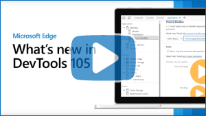](https://www.youtube.com/watch?v=h0XJH_iLoUk)

Learn more about our latest announcements from the Microsoft Edge DevTools team at [What's New in DevTools 105](../devtools-guide-chromium/whats-new/2022/09/devtools-105.md).

<!-- ====================================================================== -->
## DevTools - Understand the DevTools user interface

_Published on 1 September 2022._

[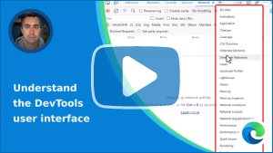](https://www.youtube.com/watch?v=ayemJLeE55c)

Understand how the Microsoft Edge DevTools UI is organized. If you are confused about what tools are available, and what the main parts of the DevTools interface do, this video will help get more comfortable.

In this video, we go over the UI structure, with its main toolbar and panel and its drawer area. We also go over how to find, open, and close tools, restore the default settings, and go over the list of available tools.

<!-- ====================================================================== -->
## DevTools - What's New in DevTools 104

_Published on 5 August 2022._

[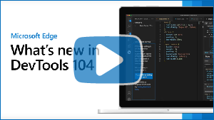](https://www.youtube.com/watch?v=0_ZprFX8x0I)

Learn more about our latest announcements from the Microsoft Edge DevTools team at [What's New in DevTools 104](../devtools-guide-chromium/whats-new/2022/08/devtools-104.md).

<!-- ====================================================================== -->
## DevTools - What's New in DevTools 103

_Published on 5 July 2022._

[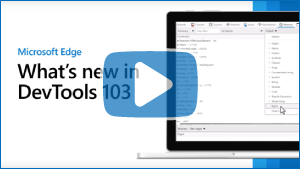](https://www.youtube.com/watch?v=aa0C6BRdaPA)

Learn more about our latest announcements from the Microsoft Edge DevTools team at [What's New in DevTools 103](../devtools-guide-chromium/whats-new/2022/06/devtools-103.md).

<!-- ====================================================================== -->
## DevTools - Debug the web in 3D

_Published on 21 June 2022._

[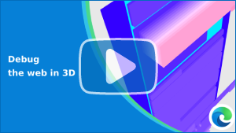](https://www.youtube.com/watch?v=LVb1Xzzd72w)

The **3D View** tool in Microsoft Edge DevTools provides a 3-dimensional representation of the webpage you're inspecting.  Use the **3D View** tool to debug common web development problems such as:

* Deeply nested DOM nodes.
* Out-of-document elements.
* Unwanted scrollbars.
* Z-index stacking issues.
* Composited layers performance.

To learn more about the 3D View tool, check out [Navigate webpage layers, z-index, and DOM using the 3D View tool](../devtools-guide-chromium/3d-view/index.md), or [Debug the web in 3D with the 3D View tool](https://blogs.windows.com/msedgedev/2022/06/21/debug-the-web-in-3d-with-the-3d-view-tool/).

<!-- ====================================================================== -->
## DevTools - Use your preferred language in DevTools

_Published on 9 June 2022._

[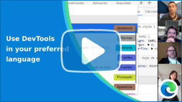](https://www.youtube.com/watch?v=AeF0AvWpUO8)

Microsoft Edge DevTools supports 13 different languages. In this video, the team shows how to choose the language that's most comfortable to you for coding and debugging.

To learn more about changing DevTools language settings, check out [Change DevTools language settings](../devtools-guide-chromium/customize/localization.md).

To report any translation errors, check out [Contact the Microsoft Edge DevTools team](../devtools-guide-chromium/contact.md).

<!-- ====================================================================== -->
## DevTools - What's New in DevTools 102

_Published on 1 June 2022._

[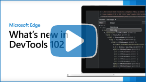](https://www.youtube.com/watch?v=JY6DfhSdr_A)

Learn more about our latest announcements from the Microsoft Edge DevTools team at [What's New in DevTools 102](../devtools-guide-chromium/whats-new/2022/05/devtools-102.md).

<!-- ====================================================================== -->
## Web Platform - Fully style the drop-down part of a `<select>` with the new `<selectmenu>` element

_Published on 31 May 2022._

[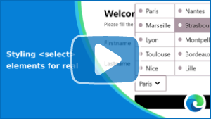](https://www.youtube.com/watch?v=Ts7jvRyQACY)

Styling `<select>` elements has been challenging. The experimental `<selectmenu>` element promises to overcome the remaining limitations by enabling web developers to style all parts of the element.

To learn more about styling `<select>` elements and the new `<selectmenu>` element, see the blog post [Styling `<select>` elements for real](https://blogs.windows.com/msedgedev/2022/05/05/styling-select-elements-for-real/).

<!-- ====================================================================== -->
## DevTools - Advanced issues filtering in Edge DevTools and VSCode

_Published on 20 May 2022._

[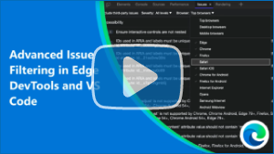](https://www.youtube.com/watch?v=_dePgo89bq0)

Every web product has issues. The Microsoft Edge DevTools **Issues** tool analyzes the current webpage and reports issues grouped by type including accessibility, compatibility, performance, and more.

If you have Visual Studio Code, the Microsoft Edge DevTools extension for Visual Studio Code makes issues available in your source code directly.

Released products can also have many issues. Based on your feedback, we added useful ways to filter issues. You can disable issues coming from third-party libraries for example, and choose which browsers to view issues about.

To learn more about the Issues tool, see [Find and fix problems using the Issues tool](../devtools-guide-chromium/issues/index.md).

To learn more about the Microsoft Edge DevTools extension for Visual Studio Code, see [Microsoft Edge DevTools extension for Visual Studio Code](../visual-studio-code/microsoft-edge-devtools-extension.md).

<!-- ====================================================================== -->
## Web Platform - Create a scroll-linked animation without JavaScript

_Published on 12 May 2022._

Learn about the upcoming CSS scroll-linked animations feature and how it can be used to create a reading progress indicator on a webpage, without using JavaScript.

CSS scroll-linked animations is an experimental feature in Microsoft Edge.  To try this feature, go to `edge://flags` and then enable the **Experimental Web Platform features** setting.

To play with the demo application that's shown in the video, see the rendered [reader demo](https://microsoftedge.github.io/Demos/reader/) and its [source code](https://github.com/MicrosoftEdge/Demos/tree/main/reader).

To learn more about the CSS scroll-linked animations feature, see [@scroll-timeline](https://developer.mozilla.org/docs/Web/CSS/@scroll-timeline) at MDN.

<!-- ====================================================================== -->
## DevTools - Customizing Microsoft Edge Developer Tools and quick feature access

_Published on 5 May 2022._

[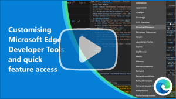](https://www.youtube.com/watch?v=ypRzEBYNptQ)

Learn how to customize DevTools to fit your needs.

This video covers how to dock or undock DevTools, open new tools, and close those you don't need. It describes how to move tools in the bottom drawer and customize the text size and theme. The video also explains how you can use the Command Menu keyboard shortcuts to quickly customize DevTools.

<!-- ====================================================================== -->
## DevTools - What's New in DevTools 101

_Published on 28 Apr 2022._

[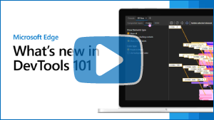](https://www.youtube.com/watch?v=kv6Q8a9bsbA)

Learn more about our latest announcements from the Microsoft Edge DevTools team at [What's New in DevTools 101](../devtools-guide-chromium/whats-new/2022/04/devtools-101.md).

<!-- ====================================================================== -->
## Web Platform - Highlight text on the web with the CSS Custom Highlight API

_Published on 28 Apr 2022._

[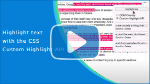](https://www.youtube.com/watch?v=1qldqyT324o)

Styling ranges of text on the web is very useful but has historically been a complicated thing to do.

The new [CSS Custom Highlight API](https://www.w3.org/TR/css-highlight-api-1/) is the future of highlighting text ranges on the Web. It provides web developers with JavaScript and CSS features that make it easier and more efficient to style any range of text.

For more information see [CSS Custom Highlight API: The Future of Highlighting Text Ranges on the Web](https://css-tricks.com/css-custom-highlight-api-early-loo/).

<!-- ====================================================================== -->
## DevTools - What's New in DevTools 100

_Published on 19 Apr 2022._

[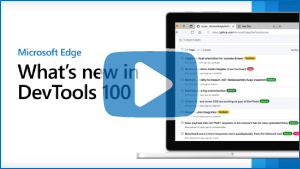](https://www.youtube.com/watch?v=aP6d2PIU7hc)

Learn more about our latest announcements from the Microsoft Edge DevTools team at [What's New in DevTools 100](../devtools-guide-chromium/whats-new/2022/03/devtools-100.md).

<!-- ====================================================================== -->
## DevTools - What's New in DevTools 99

_Published on 21 Mar 2022._

[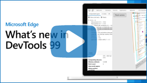](https://www.youtube.com/watch?v=Z5-tEE_cNTo)

Learn more about our latest announcements from the Microsoft Edge DevTools team at [What's New in DevTools 99](../devtools-guide-chromium/whats-new/2022/03/devtools.md).

<!-- ====================================================================== -->
## DevTools - What's New in DevTools 98

_Published on 23 Feb 2022._

[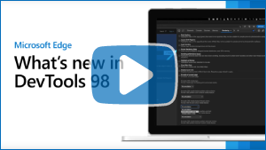](https://www.youtube.com/watch?v=HpaRDwU_AZI)

Learn more about our latest announcements from the Microsoft Edge DevTools team at [What's New in DevTools 98](../devtools-guide-chromium/whats-new/2022/03/devtools.md).

<!-- ====================================================================== -->
## DevTools - What's New in DevTools 97

_Published on 1 Feb 2022._

[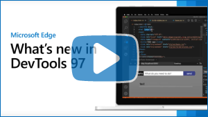](https://www.youtube.com/watch?v=qbDLtE0a_yQ)

Learn more about our latest announcements from the Microsoft Edge DevTools team at [What's New in DevTools 97](../devtools-guide-chromium/whats-new/2022/01/devtools.md).

<!-- ====================================================================== -->
## DevTools - What's New in DevTools 96

_Published on 9 Dec 2021._

[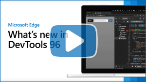](https://www.youtube.com/watch?v=H6dYeoGOIDk)

Learn more about our latest announcements from the Microsoft Edge DevTools team at [What's New in DevTools 96](../devtools-guide-chromium/whats-new/2021/11/devtools.md).

<!-- ====================================================================== -->
## DevTools - Debug memory leaks with the Microsoft Edge Detached Elements tool

_Published on 9 Dec 2021._

[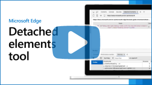](https://www.youtube.com/watch?v=v2iy17ptmBk)

We're excited to announce the new Detached Elements tool in Microsoft Edge DevTools which helps you investigate and resolve DOM memory leaks.

Memory leaks occur when the JavaScript code of an application retains more and more objects in memory instead of releasing them for the browser to garbage collect.
We built this tool with the Microsoft Teams developers, and it has already helped us find and fix memory leaks across many of our own websites and apps.

For more information see [Debug DOM memory leaks with the Detached Elements tool](../devtools-guide-chromium/memory-problems/dom-leaks.md), and read the corresponding blog post [Debug memory leaks with the Microsoft Edge Detached Elements tool](https://blogs.windows.com/msedgedev/2021/12/09/debug-memory-leaks-detached-elements-tool-devtools/).

<!-- ====================================================================== -->
## DevTools - What's New in DevTools 95

_Published on 8 Dec 2021._

Learn more about our latest announcements from the Microsoft Edge DevTools team at [What's New in DevTools 95](../devtools-guide-chromium/whats-new/2021/10/devtools.md).

<!-- ====================================================================== -->
## Web Platform - The EyeDropper API

_Published on 22 Nov 2021._

[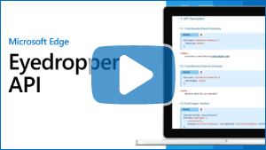](https://www.youtube.com/watch?v=XZUEnUbI7dE)

The Microsoft Edge team specified and implemented the new EyeDropper API in collaboration with the Chromium open-source project. Provide feedback at [Issues - WICG/eyedropper | github.com](https://github.com/WICG/eyedropper-api/issues).

Many creative applications enable users to pick colors from parts of an app window or even from the entire screen, typically using an eyedropper metaphor. The EyeDropper API enables authors to use a browser-supplied eyedropper in the construction of custom color pickers on the web.

For more information see [Picking colors of any pixel on the screen with the EyeDropper API | web.dev](https://web.dev/eyedropper/) and [EyeDropper API - Web APIs | MDN developer.mozilla.org](https://developer.mozilla.org/docs/Web/API/EyeDropper_API).

<!-- ====================================================================== -->
## DevTools - What's New in DevTools 94

_Published on 12 Nov 2021._

[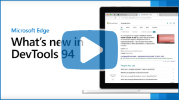](https://www.youtube.com/watch?v=S-g1E_W9wQQ)

Learn more about our latest announcements from the Microsoft Edge DevTools team at [What's New in DevTools 94](../devtools-guide-chromium/whats-new/2021/09/devtools.md).
