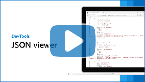
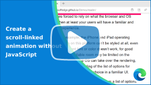

# Videos about web development with Microsoft Edge

Discover and learn about new Microsoft Edge web development technologies and products including DevTools, web platform APIs and features, Progressive Web Apps, and WebView2.

This page contains links to short videos, each focused on just one feature and including a demo.

Microsoft publishes new videos on a regular basis on the [Microsoft Edge YouTube channel](https://www.youtube.com/channel/UCIGx7oT8p6-jUpOfg98yelA), and they are also listed below.

Click on a thumbnail from the following list to watch the corresponding video on YouTube.

<!-- to add a new video: wiki > Publishing videos -->

<!-- ====================================================================== -->
## Microsoft Edge channel at YouTube

You can find all videos about development using Microsoft Edge at the [Microsoft Edge (@MSFTEdge) channel at YouTube](https://www.youtube.com/@MSFTEdge/videos).

The Microsoft Edge channel includes the following playlists:
* [Developer](https://www.youtube.com/playlist?list=PL4z1-7pjJU6zvxxsa2GzzuaXf1neBzrmI)
* [What's New in DevTools](https://www.youtube.com/playlist?list=PL4z1-7pjJU6wCla3QZuWuWjsCB2hCnTvr)
* [Extensions](https://www.youtube.com/playlist?list=PL4z1-7pjJU6ykO2iptfxT7T68W5WEK4ff)

<!-- ====================================================================== 
## What's new in DevTools 115-125

Date

Covers:
* 

See also:
* [What's New in DevTools (Microsoft Edge 125)](../devtools/whats-new/2024/05/devtools-125.md)
* [What's New in DevTools (Microsoft Edge 124)](../devtools/whats-new/2024/04/devtools-124.md)
* [What's New in DevTools (Microsoft Edge 123)](../devtools/whats-new/2024/03/devtools-123.md)
* [What's New in DevTools (Microsoft Edge 122)](../devtools/whats-new/2024/02/devtools-122.md)
* [What's New in DevTools (Microsoft Edge 121)](../devtools/whats-new/2024/01/devtools-121.md)
* [What's New in DevTools (Microsoft Edge 120)](../devtools/whats-new/2023/12/devtools-120.md)
* [What's New in DevTools (Microsoft Edge 119)](../devtools/whats-new/2023/11/devtools-119.md)
* [What's New in DevTools (Microsoft Edge 118)](../devtools/whats-new/2023/10/devtools-118.md)
* [What's New in DevTools (Microsoft Edge 117)](../devtools/whats-new/2023/09/devtools-117.md)
* [What's New in DevTools (Microsoft Edge 116)](../devtools/whats-new/2023/08/devtools-116.md)
* [What's New in DevTools (Microsoft Edge 115)](../devtools/whats-new/2023/07/devtools-115.md)
-->

<!-- ====================================================================== -->
## Explain DevTools Console errors using Copilot in Edge

February 8, 2024

The **Console** and **Sources** tools in Microsoft Edge DevTools now integrate with Copilot in Microsoft Edge to help you understand errors and source code.  Use this feature to get help with debugging your code.

See also:
* [Explain Console errors and warnings using Copilot in Edge](../devtools/console/copilot-explain-console.md)<!-- has Video section -->

<!-- ====================================================================== -->
## The JSON viewer

August 17, 2023

The JSON viewer automatically formats and highlights JSON responses and files in browser tabs.  When your web server responds to HTTP requests with data encoded as JSON, this data isn't always easy to read and is sometimes returned as one line of text.  The JSON viewer changes the returned data to make it easier to read.  The JSON syntax is highlighted with different colors, object properties are displayed on their own lines and indented, and objects can be collapsed or expanded.

See also:
* [View a JSON file or server response with formatting](../web-platform/json-viewer.md)

<!-- ====================================================================== -->
## Microsoft Edge | What's New in DevTools 113 and 114

July 24, 2023

Covers:
* The **Crash Analyzer** tool.
* Aggregate CSS selector stats.
* Warnings for CSS properties that trigger layout.
* **Memory** tool improvements.
* Accessibility improvements.
* Better high-contrast mode support in the DevTools extension for VS Code.
* `console.table()`.

See also:
* [What's New in DevTools (Microsoft Edge 114)](../devtools/whats-new/2023/06/devtools-114.md)<!-- has Video section -->
* [What's New in DevTools (Microsoft Edge 113)](../devtools/whats-new/2023/05/devtools-113.md)<!-- has Video section -->

<!-- ====================================================================== -->
## Microsoft Edge | What's New in DevTools 112

April 26, 2023

Covers:
* Unminified JS names for OOPIFs in the **Performance** tool.
* Non-simple CSS selectors in the **CSS overview** tool.
* Code folding in the JSON viewer.
* Improvements in the DevTools UI.
* New markers for logpoints and conditional breakpoints.
* How to change themes in DevTools.

See also:
* [What's New in DevTools (Microsoft Edge 112)](../devtools/whats-new/2023/04/devtools-112.md)<!-- has Video section -->
* [Analyze CSS selector performance during Recalculate Style events](../devtools/performance/selector-stats.md) - CSS selector stats.
* [View a JSON file or server response with formatting](../web-platform/json-viewer.md)

<!-- ====================================================================== -->
## Microsoft Edge | What's New in DevTools 111

March 28, 2023

Covers:
* Remotely debug web content on Xbox and HoloLens devices.
* Unminified file and function names in the **Performance** tool.
* Can copy the CSS **Selector Stats** table to Excel.
* Rendering emulation features in the Device Mode toolbar.
* Better **Elements** tool sidebar.
* Better **Quick View** accessibility.
* High-definition color features.
* Customize the **Network** tool's columns.

See also:
* [What's New in DevTools (Microsoft Edge 111)](../devtools/whats-new/2023/03/devtools-111.md)<!-- has Video section -->
* [Securely debug original code by publishing source maps to the Azure Artifacts symbol server](../devtools/javascript/publish-source-maps-to-azure.md)

<!-- ====================================================================== -->
## Microsoft Edge | What's New in DevTools 110

February 16, 2023

Covers:
* Faster heap snapshot recordings.
* Improved customization of Focus Mode (DevTools UI).
* Accessibility and contrast themes improvements.
* Automatic in-place pretty-printing in the **Sources** tool.
* Simulate `prefers-color-scheme`.

See also:
* [What's New in DevTools (Microsoft Edge 110)](../devtools/whats-new/2023/02/devtools-110.md)<!-- has Video section -->
* [Overview of DevTools](../devtools/overview.md)

<!-- ====================================================================== -->
## Microsoft Edge | What's New in DevTools 109

January 17, 2023

Covers:
* Enhanced traces to share memory and performance recordings.
* Selector Stats in the **Performance** tool.
* Track garbage-collected (GC'd) objects in the **Memory** tool.
* Heap Snapshot visualizer extension.
* Redesigned **Quick View** panel in Focus Mode.
* New commands for the **Styles** panes.
* Inspecting elements.

See also:
* [What's New in DevTools (Microsoft Edge 109)](../devtools/whats-new/2023/01/devtools-109.md)<!-- has Video section -->
* [Share enhanced performance and memory traces](../devtools/experimental-features/share-traces.md)
* [Analyze CSS selector performance during Recalculate Style events](../devtools/performance/selector-stats.md) - selector stats.
* [Investigate memory allocation, with reduced garbage ("Include objects" checkboxes)](../devtools/rendering-tools/js-runtime.md#investigate-memory-allocation-with-reduced-garbage-include-objects-checkboxes) in _Speed up JavaScript runtime ("Allocation sampling" profiling type)_.
* [Trash talk: the Orinoco garbage collector](https://v8.dev/blog/trash-talk)
* [Heap Snapshot visualizer](https://microsoftedge.microsoft.com/addons/detail/heap-snapshot-visualizer/fceldlhognbemkgfacnffkdanocidgce) extension.

<!-- ====================================================================== -->
## Microsoft Edge | What's New in DevTools 108

December 16, 2022

Covers:
* Improved navigation in Command Palette.
* High-contrast mode fixes.
* Disabled JavaScript warning.
* See inactive CSS properties.
* New documentation to create your own tools.
* WebDriver available on macOS on Apple M1.
* Use Detached Elements to find DOM leaks.

See also:
* [What's New in DevTools (Microsoft Edge 108)](../devtools/whats-new/2022/12/devtools-108.md)<!-- has Video section -->
* [Create a DevTools extension, adding a custom tool tab and panel](../extensions/developer-guide/devtools-extension.md)
* [The heap snapshot file format](../devtools/memory-problems/heap-snapshot-schema.md)
* [Microsoft Edge WebDriver](https://developer.microsoft.com/microsoft-edge/tools/webdriver/?form=MA13LH) - download Edge WebDriver.

<!-- The [initial, December 6 video](https://www.youtube.com/watch?v=2fuTHag4EOw) is cut off at the end.  Use the above video instead. -->

<!-- ====================================================================== -->
## Microsoft Edge | What's New in DevTools 107

November 8, 2022

Covers:
* Text labels in the Focus Mode DevTools UI.
* New shortcut for Command Palette.
* Large heap snapshots in the **Memory** tool.
* High-contrast mode fixes.
* Switch off "search as you type".
* Automate WebView2 with Playwright.
* Customize shortcuts.

See also:
* [What's New in DevTools (Microsoft Edge 107)](../devtools/whats-new/2022/10/devtools-107.md)<!-- has Video section -->

<!-- ====================================================================== -->
## Microsoft Edge | Learn to Use the Network Tool

October 6, 2022

Learn to use the **Network** tool in Microsoft Edge DevTools.

Covers:
* Why the **Network** tool in DevTools is essential for web developers.
* How websites get the information they need from the internet to get displayed in the web browser.
* When to use the **Network** tool.
* A tour of the **Network** tool UI.
* Displaying requests in the **Network** tool.
* Viewing the details for a request/response.
* Customizing the **Network** tool.
* Sorting, filtering, and searching requests.
* Investigating performance issues.
* Blocking requests and exporting as HAR files.
* Editing and resending requests.

See also:
* [Inspect network activity](../devtools/network/index.md)<!-- has Video section -->

<!-- ====================================================================== -->
## Microsoft Edge | What's New in DevTools 106

October 3, 2022

Covers:
* The Command Palette experiment.
* Quick Fix issues in the Edge DevTools VS Code extension.
* DevTools uses less disk space.
* Better accessibility in Focus Mode (DevTools UI), and high-contrast bug fix.
* Deprecated Chromium Light/Dark themes.
* New interactions track in the **Performance** tool.
* Using Snippets.

See also:
* [What's New in DevTools (Microsoft Edge 106)](../devtools/whats-new/2022/09/devtools-106.md)<!-- has Video section -->

<!-- ====================================================================== -->
## Microsoft Edge | What's New in DevTools 105

September 6, 2022

Covers:
* PWA protocol handling debugging.
* Focus Mode improvements.
* Focus Mode bug fixes.
* Improved Network and Issues tools reliability.
* Live edit function code while debugging.
* Using log points.

See also:
* [What's New in DevTools 105](../devtools/whats-new/2022/09/devtools-105.md)<!-- has Video section -->

<!-- ====================================================================== -->
## Understand the DevTools user interface

September 1, 2022

This slightly older (September 2022) video shows the legacy UI for DevTools:
* Instead of the **Activity Bar**, the video shows the main toolbar.
* Instead of the **Quick View** panel, the video shows the **Drawer** at bottom of DevTools.

Covers:
* The UI structure of DevTools, with the main toolbar and panel at top, and the **Drawer** toolbar and panel at bottom.
* How the Microsoft Edge DevTools UI is organized.
* What the main parts of the DevTools interface do.
* What tools are available.
   * The **Inspect** tool.
   * **Device Emulation** mode.
   * Tools in the main toolbar or in the **Drawer**.
* The **More tabs** button.
* The **More tools** button to see all 30+ tools.
* Closing tools.
* Reordering tools in the main toolbar.
* The **Drawer** and its toolbar.
* Moving tools between the main toolbar and **Drawer** toolbar.
* How to restore the default settings.

See also:
* [Overview of DevTools](../devtools/overview.md)<!-- has Video section -->
* [About the list of tools](../devtools/about-tools.md)

<!-- ====================================================================== -->
## Microsoft Edge | What's New in DevTools 104

August 5, 2022

Covers:
* Rendering/accessibility bug fixes.
* Composited layers are now in the **3D View** tool, and the **Layers** tool was removed.
* Group files in the **Sources** tool.
* Find where nodes get slotted in web components.
* Where to find more information.
* How to change where the **Activity Bar** is placed.

See also:
* [What's New in DevTools 104](../devtools/whats-new/2022/08/devtools-104.md)<!-- has Video section -->
* [Debug the web in 3D with the 3D View tool](https://aka.ms/debug-in-3d) - blog post.

<!-- ====================================================================== -->
## Microsoft Edge | What's New in DevTools 103

July 5, 2022

Covers:
* Redesigned **Welcome** tool.
* New color picker.
* New memory heap snapshot node types.
* High contrast mode bug fix.
* Open any HTML page in the VS Code extension.

See also:
* [What's New in DevTools 103](../devtools/whats-new/2022/06/devtools-103.md)<!-- has Video section -->

<!-- ====================================================================== -->
## Debug the web in 3D

June 21, 2022

The **3D View** tool in Microsoft Edge DevTools provides a 3-dimensional representation of the webpage you're inspecting.  Use the **3D View** tool to debug common web development problems, such as:
* Deeply nested DOM nodes.
* Out-of-document elements.
* Unwanted scrollbars.
* Z-index stacking issues.
* Composited layers performance.

See also:
* [Navigate webpage layers, z-index, and DOM using the 3D View tool](../devtools/3d-view/index.md)<!-- has Video section -->
* [Debug the web in 3D with the 3D View tool](https://blogs.windows.com/msedgedev/2022/06/21/debug-the-web-in-3d-with-the-3d-view-tool/) - blog post.

<!-- ====================================================================== -->
## Use your preferred language in Microsoft Edge DevTools

June 9, 2022

How to select the UI language that's most comfortable to you for coding and debugging.  Microsoft Edge DevTools supports 13+ different languages.

See also:
* [Change DevTools language settings](../devtools/customize/localization.md)<!-- has Video section -->

<!-- ====================================================================== -->
## Microsoft Edge | What's New in DevTools 102

June 1, 2022

Covers:
* Visual Studio Code.
* Heap Snapshot Export.
* Cycles Internal Nodes.
* Help Icon.
* Issues Fixed.

See also:
* [What's New in DevTools 102](../devtools/whats-new/2022/05/devtools-102.md)<!-- has Video section -->

<!-- ====================================================================== -->
## Fully style the drop-down part of a HTML `<select>` with the `<selectmenu>` element

May 31, 2022

Styling `<select>` elements has been challenging. The experimental `<selectmenu>` (or `<selectlist>`) element promises to overcome the remaining limitations, by enabling web developers to style all parts of the element.

June 2024 update: This element is still experimental.  The `<selectmenu>` element was renamed to `<selectlist>` in 2023.

See also:
* [Open UI's `<selectlist>` demos](https://microsoftedge.github.io/Demos/selectlist/)
   * [/selectlist/](https://github.com/MicrosoftEdge/Demos/tree/main/selectlist) - Source code and Readme.
* [Reader demo app](https://microsoftedge.github.io/Demos/reader/)
   * [/reader/](https://github.com/MicrosoftEdge/Demos/tree/main/reader) - Source code and Readme.
* [Styling `<select>` elements for real](https://blogs.windows.com/msedgedev/2022/05/05/styling-select-elements-for-real/) - blog post about styling `<select>` elements and the `<selectmenu>` element.

<!-- ====================================================================== -->
## Advanced issues filtering in Edge DevTools and VSCode

May 20, 2022

Every web product has issues. The Microsoft Edge DevTools **Issues** tool analyzes the current webpage and reports issues grouped by type including accessibility, compatibility, performance, and more.

The Microsoft Edge DevTools extension for Visual Studio Code makes issues available in your source code directly.

Released products can have issues. Based on your feedback, we added useful ways to filter issues.  You can disable issues coming from third-party libraries, and choose which browsers to view issues about.

See also:
* [Find and fix problems using the Issues tool](../devtools/issues/index.md)<!-- has Video section -->
* [Inline and live issue analysis](../visual-studio-code/microsoft-edge-devtools-extension/inline-live-issue-analysis.md) in the DevTools extension for VS Code<!-- has Video section -->

<!-- ====================================================================== -->
## Create a scroll-linked animation without JavaScript

May 12, 2022

Learn about the CSS scroll-linked animations feature and how it can be used to create a reading progress indicator on a webpage, without using JavaScript.  This is a feature of the web platform as a whole, not only Microsoft Edge.

As of July 21, 2023, this feature is no longer experimental, and is now supported in Microsoft Edge without a flag.  From 2022 description: CSS scroll-linked animations is an experimental feature in Microsoft Edge; to try this feature, go to `edge://flags` and then enable the **Experimental Web Platform features** setting.

See also:
* [Reader demo](https://microsoftedge.github.io/Demos/reader/) - demo app that's shown in the video.
  * [Source code and Readme for Reader demo](https://github.com/MicrosoftEdge/Demos/tree/main/reader)
* [CSS scroll-driven animations](https://developer.mozilla.org/docs/Web/CSS/CSS_scroll-driven_animations) at MDN.
* [@scroll-timeline](https://developer.mozilla.org/docs/Web/CSS/@scroll-timeline) at MDN: original page about the experimental CSS scroll-linked animations feature.

<!-- ====================================================================== -->
## Customizing Microsoft Edge Developer Tools and quick feature access

May 5, 2022

Learn how to customize DevTools to fit your needs.  Covers:
* Dock or undock DevTools.
* Open new tools.
* Close tools that you don't need.
* Move tools in the bottom **Drawer** (now the **Quick View** panel).
* Customize the text size.
* Customize the theme.
* Use the **Command Menu** keyboard shortcuts to quickly customize DevTools.

See also:
* [Overview of DevTools](../devtools/overview.md#change-where-devtools-is-docked-in-the-browser)
* [Run commands in the Command Menu](../devtools/command-menu/index.md)<!-- Video h2 is ok -->

<!-- ====================================================================== -->
## Highlight text on the web with the CSS Custom Highlighting API

April 28, 2022

Styling ranges of text on the web is very useful but has historically been a complicated thing to do.

The [CSS Custom Highlight API](https://www.w3.org/TR/css-highlight-api-1/) is the future of highlighting text ranges on the Web.  This API provides web developers with JavaScript and CSS features that make it easier and more efficient to style any range of text.

See also:
* [CSS Custom Highlight API: The Future of Highlighting Text Ranges on the Web](https://css-tricks.com/css-custom-highlight-api-early-loo/)
* [CSS Custom Highlight API demo](https://github.com/MicrosoftEdge/Demos/tree/main/custom-highlight-api)

<!-- ====================================================================== -->
## Microsoft Edge | What's New in DevTools 101

April 28, 2022

Covers:
* Using the Console.
* Source Maps Cache.
* Status Text Column.
* Switching Themes.

See also:
* [What's New in DevTools 101](../devtools/whats-new/2022/04/devtools-101.md)<!-- has Video section -->
* Console integration: https://aka.ms/ConsoleIntegration
* Network Columns: https://aka.ms/NetworkColumns

<!-- ====================================================================== -->
## Microsoft Edge | What's New in DevTools 100

April 19, 2022

Covers:
* The Microsoft Edge Developer Tools repo, to submit feedback and ideas.
* Added Czech and Vietnamese languages for DevTools UI.
* In the **Memory** tool, filter heap snapshots by node type.
* The **Network** tool has a **Fulfilled By** column, showing service worker or cache.
* The links from an imported performance profile use source maps from Azure Artifacts symbol server to map back to your familiar original source code.

See also:
* [What's New in DevTools 100](../devtools/whats-new/2022/03/devtools-100.md)<!-- has Video section -->
* [DevTools feedback repo](https://github.com/MicrosoftEdge/DevTools)

<!-- ====================================================================== -->
## Microsoft Edge | What's New in DevTools 99

March 21, 2022

Covers:
* Azure Artifacts Symbol Server and sourcemaps.
* Improved **Layers** pane in the **3D View** tool.
* Use sourcemaps to unminify performance profiles.
* Live ASP.NET debugging in DevTools for Visual Studio.
* Accessibility in **Network Console** tool and **3D View** tool.

See also:
* [What's New in DevTools 99](../devtools/whats-new/2022/03/devtools.md)<!-- has Video section -->

<!-- ====================================================================== -->
## Automatic image descriptions in Microsoft Edge

March 17, 2022

Microsoft Edge provides auto-generated alt text for images that don't include it. Auto-generated alt text helps users of assistive technology such as screen readers discover the meaning or intent of an images on the web.

Many people who are blind or low-vision experience the web primarily through a screen reader: an assistive technology that reads the content of each page aloud.  Screen readers depend on having image labels (alternative text or "alt text") provided that allows them to describe visual content - like images and charts - so the user can understand the full content of the page.  Alt text is critical for making the web accessible, yet it's often overlooked.  More than half of the images processed by screen readers are missing alt text. 

See also:
* [Appears to say: Microsoft Edge now provides auto-generated image labels](https://blogs.windows.com/msedgedev/2022/03/17/appears-to-say-microsoft-edge-auto-generated-image-labels/) - blog post

<!-- ====================================================================== -->
## Microsoft Edge | What's New in DevTools 98

February 23, 2022

Covers:
* Emulate Forced Colors mode.
* Activity icons in the **Performance** tool event log have tooltips.
* Shallow sizes in the **Memory** tool are represented as decimal values.
* In the **Network** tool, the Search box resizes as needed.
* In the **Application** tool, UI is aligned correctly.
* Updates for the Chromium browser engine.

See also:
* [What's New in DevTools 98](../devtools/whats-new/2022/02/devtools.md)<!-- has Video section -->

<!-- ====================================================================== -->
## Microsoft Edge | What's New in DevTools 97

February 1, 2022

Covers:
* The **Detached Elements** tool is available by default.
* The **3D View** tool supports changing color themes in DevTools.
* Focus Mode (DevTools UI) improvements.
* DevTools extension for VS Code has additional features.

See also:
* [What's New in DevTools 97](../devtools/whats-new/2022/01/devtools.md)<!-- has Video section -->
* Refresh the device list: https://aka.ms/RefreshDeviceList
* Autocomplete with Edit as HTML https://aka.ms/AutocompleteEditHTML
* Improved debugging experience: https://aka.ms/NewDebugging

<!-- ====================================================================== -->
## Debug memory leaks with the Microsoft Edge Detached Elements tool

December 9, 2021

March 2025 update: The **Detached Elements** tool has been removed.  To debug DOM memory leaks, use the **Detached elements** profiling type in the **Memory** tool.

Memory leaks occur when the JavaScript code of an application retains more and more objects in memory instead of releasing them for the browser to garbage-collect.  We built the **Detached Elements** tool with the Microsoft Teams developers, and it has already helped us find and fix memory leaks across many of our own websites and apps.

See also:
* [Find DOM tree memory leaks from detached elements](../devtools/memory-problems/index.md#find-dom-tree-memory-leaks-from-detached-elements) in _Fix memory problems_.
* [Debug memory leaks with the Microsoft Edge Detached Elements tool](https://blogs.windows.com/msedgedev/2021/12/09/debug-memory-leaks-detached-elements-tool-devtools/) - blog post.

<!-- ====================================================================== -->
## Microsoft Edge | What's New in DevTools 96

December 9, 2021

Covers:
* New DevTools UI: Focus Mode.
* The **Console** tool can be in both the top and bottom panels of DevTools.
* The **Sources** tool notifies you when sourcemaps can't be loaded.
* Clicking a dropdown's triangle icon opens the menu.
* Opening source files in Visual Studio Code integrates with the **Sources** tool.

See also:
* [What's New in DevTools 96](../devtools/whats-new/2021/11/devtools.md)<!-- has Video section -->
* [Microsoft Edge DevTools extension for Visual Studio Code](../visual-studio-code/microsoft-edge-devtools-extension.md)

<!-- ====================================================================== -->
## Microsoft Edge | What's New in DevTools 95

December 8, 2021

Covers:
* **Search Web** icon for all error and warning messages.
* Improved access for defining User-Agent Client Hints.
* Console filters display grouped messages.

See also:
* [What's New in DevTools 95](../devtools/whats-new/2021/10/devtools.md)<!-- has Video section -->

<!-- ====================================================================== -->
## Microsoft Edge | The EyeDropper API

November 22, 2021

The Microsoft Edge team specified and implemented the new EyeDropper API in collaboration with the Chromium open-source project. Provide feedback at [Issues - WICG/eyedropper | github.com](https://github.com/WICG/eyedropper-api/issues).

Many creative applications enable users to pick colors from parts of an app window or even from the entire screen, typically using an eyedropper metaphor. The EyeDropper API enables authors to use a browser-supplied eyedropper in the construction of custom color pickers on the web.

See also:
* [Picking colors of any pixel on the screen with the EyeDropper API | web.dev](https://web.dev/eyedropper/)<!-- todo: mdn link -->
* [EyeDropper API - Web APIs | MDN developer.mozilla.org](https://developer.mozilla.org/docs/Web/API/EyeDropper_API)
* [EyeDropper API demos](https://github.com/MicrosoftEdge/Demos/tree/main/eyedropper)

<!-- ====================================================================== -->
## Microsoft Edge | What's New in DevTools 94

November 12, 2021

Covers:
* Search for Console errors on the web.
* Breakpoint icons are displayed when using Visual Studio Code themes.
* DevTools extension for Visual Studio Code includes the latest tools, theme support, and helpful links.  JavaScript Debugger connection to remote workspaces.

Update: The Themes feature of Visual Studio Code has been removed, and such themes revert to the default themes:
* Light+
* Dark+

See also:
* [What's New in DevTools 94](../devtools/whats-new/2021/09/devtools.md)<!-- has Video section -->
* [Keyboard shortcuts](../devtools/shortcuts/index.md) - Navigating DevTools with a keyboard.

<!-- ====================================================================== -->
## Microsoft Edge | What's New in DevTools 93

October 11, 2021

Covers:
* DevTools UI.
* Debug DOM node memory leaks with the **Detached Elements** tool.
* Change Display Language.
* Copy CSS declarations in the **Elements** tool's **Styles** pane for CSS-in-JS libraries.
* Easier customization of User-Agent Client Hints.
* Screen readers announce errors, warnings, and issues displayed in the toolbar and **Console**.
* Copy as PowerShell in the **Network** tool includes cookies.
* The Visual Studio Code debugger integrates with the DevTools Extension for VS Code.

See also:
* [What's New in DevTools (Microsoft Edge 93)](../devtools/whats-new/2021/07/devtools.md)<!-- has Video section -->

<!-- ====================================================================== -->
## Microsoft Edge | State of the Platform

May 25, 2021

Microsoft Edge brings a compelling and consistent platform and tools for developers.  As our legacy browsers phase out of support, Edge will soon be the only supported browser from Microsoft on Windows 10.  Learn about the latest across the Edge platform, tools, and web apps.

Covers:
* Delegated Ink Trails.
* New Web Capabilities for developers.
* Run on OS login.
* Microsoft Edge Tools for VS Code.

See also:
* [The future of Internet Explorer on Windows 10 is in Microsoft Edge](https://blogs.windows.com/windowsexperience/2021/05/19/the-future-of-internet-explorer-on-windows-10-is-in-microsoft-edge/) - IE mode.
* [Adopt Microsoft Edge with FastTrack](https://www.microsoft.com/fasttrack/microsoft-365/microsoft-edge)
* ["Microsoft Edge: State of the Platform": Session Resources](https://aka.ms/build-2021-msedge)

<!-- ====================================================================== -->
## Ignite | March 2021 | Igniting the Web Apps Story

March 2, 2021

Progressive Web Apps (PWA) are supported in Microsoft Edge, and they represent an opportunity to enhance discoverability and engagement with your application.  New capabilities of the Web platform.  How these modern Web applications integrate seamlessly with Microsoft Windows.

Covers:
* The ability to modernize.
* Joint efforts to empower the Web platform.
* Microsoft Edge and the Chromium browser engine.
* Microsoft Edge and web capabilities (Project Fugu).
* Making PWAs shine on Windows.
* Best-in-class reach.
* Install a website as an app.
* Get involved with PWAs on Windows.

See also:
* [Overview of Progressive Web Apps (PWAs)](../progressive-web-apps/index.md)<!-- has Video section -->

<!-- ====================================================================== -->
## Ignite | September 2020 | The latest in developer tooling

September 22, 2020

Microsoft Edge developer tools help make web development, testing, and automation easier.  Learn how we prioritize accessibility in our tooling and applications, and how we help to empower others to do the same. 

Covers:
* DevTools extension for VS Code.
* Cross-browser testing and automation.  Selenium, WebDriver, Puppeteer, Playwright, and CI/CD via Docker containers.
* Collaboration on the Chromium browser engine.  How to contribute.
* Localized UI in developer tools.
* Accessibility in developer tools.

See also:
* [Microsoft Edge DevTools documentation](../devtools/landing/index.yml)

<!-- ====================================================================== -->
## See also

YouTube:
* [Microsoft Edge (@MSFTEdge) channel at YouTube](https://www.youtube.com/@MSFTEdge/videos)
   * [Developer](https://www.youtube.com/playlist?list=PL4z1-7pjJU6zvxxsa2GzzuaXf1neBzrmI) - playlist.
   * [What's New in DevTools](https://www.youtube.com/playlist?list=PL4z1-7pjJU6wCla3QZuWuWjsCB2hCnTvr) - playlist.
   * [Extensions](https://www.youtube.com/playlist?list=PL4z1-7pjJU6ykO2iptfxT7T68W5WEK4ff) - playlist.
* [Building, Deploying, and Managing WebView2 Applications](https://www.youtube.com/watch?v=LX-eXvcSx6c) - March 2, 2021.<!-- video partly outdated by more recent WebView2 developments, and no longer represents an up-to-date intro -->
