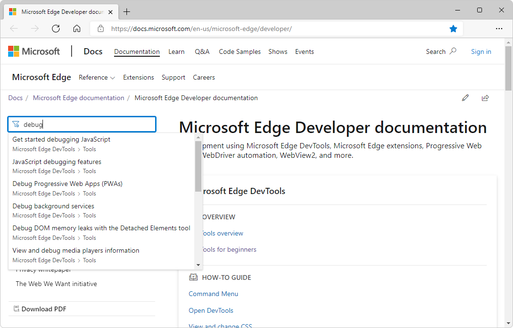

# Develop webpages and products for Microsoft Edge

Develop webpages and products for Microsoft Edge by using Microsoft Edge DevTools, Microsoft Edge extensions, Progressive Web Apps, WebDriver automation, WebView2, and more.

| Development Aspect | Description |
|---|---|
| Microsoft Edge DevTools | A set of web development tools that appears next to a rendered webpage in the Microsoft Edge Browser. <!--todo: expand--> |
| Microsoft Edge extensions | Create an extension for Microsoft Edge, to add to or modify its features.  Extensions improve the browser experience, to provide a specialized function that's important to a target audience. |
| Progressive Web Apps | Create Progressive Web App that uses open web technologies, to provide cross-platform interoperability.  They work like native apps on supporting platforms, and like regular websites on other browsers. They combine the best of the web and compiled apps, to provide users an app-like experience, customized for their devices. |
| WebView2 | The WebView2 control is powered by Microsoft Edge, and enables you to embed web technologies (HTML, CSS, and JavaScript) in your native applications.  Combine the ubiquity of the web platform, with the full capabilities of native platforms. |
| Test and automation | Tools to automate testing in Microsoft Edge.  **DevTools Protocol** instruments, inspects, debugs, and profiles browsers.  Use **Origin Trials** to try experimental APIs.  **Playwright** gives cross-browser automation through a single API.  **Puppeteer**'s API controls Microsoft Edge via DevTools Protocol.  **WebDriver** simulates user interaction with Microsoft Edge.  **webhint** linting checks code for errors and best practices. |
| Web platform | Site compatibility-impacting changes coming to Microsoft Edge.  Move users to Microsoft Edge from Internet Explorer.  Tracking prevention in Microsoft Edge.  Detect Microsoft Edge from your website.  Detect Windows 11 using User-Agent Client Hints.  Customize the password reveal button. |
| Microsoft Edge IDE integration | Various features of Microsoft tools provide integration of development using Microsoft Edge, Visual Studio Code, and Visual Studio, to develop your products, webpages, and web apps that use and work with full integration in Microsoft Edge. |
| Accessibility in Microsoft Edge | Development of your webpages, web apps, and web-enabled products is robustly supported through the extensive Accessibility features in Microsoft Edge and its tooling ecosystem. |
| Privacy whitepaper | The Microsoft Edge _browser privacy promise_ provides you with protection, transparency, control, and respect.  Microsoft Edge has many features and services associated with privacy.  This whitepaper explains how your data is used, how to control the different features, and how to manage your collected data. |
| The Web We Want initiative | A cross-browser, open initiative focused on identifying missing features and functionalities in the web platform for potential development as web standards or browser features.  Let browser vendors and standards groups know what you think is missing from the web platform. |

<!-- ====================================================================== -->
## Microsoft Edge DevTools

<!-- update/replace the below text after "Reasons to use Microsoft Edge" article is drafted accordingly to fulfill this top-down, Progressive Disclosure model -->

Microsoft Edge DevTools is a set of web development tools that appears next to a rendered webpage in the Microsoft Edge Browser.

When you install Microsoft Edge, you not only get a browser, you also get Developer Tools, which provide a powerful way to inspect, debug, and even create web projects. These developer tools are partly based on the tools in the Chromium open-source project. The Microsoft Edge Developer Tools are also called Microsoft Edge DevTools, or simply DevTools.

[Reasons to use Microsoft Edge DevTools](devtools-guide-chromium/why-use-microsoft-edge-devtools.md)

<!-- ====================================================================== -->
## Microsoft Edge extensions
   
A Microsoft Edge extension is a small program that developers use to add or modify features of Microsoft Edge. An extension improves a user's browsing experience. It usually provides a niche function that is important to a target audience.

You can create a Microsoft Edge extension if you have an idea or product that is based upon either a specific web browser, or improvements to features of specific webpages. Examples of companion experiences include ad blockers and password managers.

An extension is structured similar to a regular web app. An extension should include at least the following features:

An app manifest JSON file that contains basic platform information.
A JavaScript file that defines the function.
HTML and CSS files that define the user interface.

[Overview of Microsoft Edge extensions](extensions-chromium/index.md)

<!-- ====================================================================== -->
## Progressive Web Apps

Progressive Web Apps (PWAs) provide access to open web technologies, to provide cross-platform interoperability.  PWAs provide your users with an app-like experience that's customized for their devices.
   
PWAs are websites that are **[progressively enhanced](https://alistapart.com/article/understandingprogressiveenhancement)** to function like installed, native apps on supporting platforms, while functioning like regular websites on other browsers.

The qualities of a PWA combine **the best of the web and compiled apps**. PWAs run in browsers, like websites.  But PWAs also have access to app features; for example:
*  A PWA can still work when the device is offline.
*  PWAs can be installed on the operating system.
*  PWAs support push notifications and periodic updates.
*  PWAs can access hardware features.

When installed, PWAs are **just like other apps on Windows**.  For example:
*  A PWA can be added to the Start Menu.
*  A PWA can be pinned to the Taskbar.
*  PWAs can handle files.
*  PWAs can run when the user signs in.
*  PWAs **can be submitted to the Microsoft Store** where millions of Windows users can discover and easily install them alongside other Windows apps.

PWAs have the **same reach as websites**:
*  PWAs can be indexed by search engines.
*  A PWA can be linked to.
*  A PWA can work on all devices, from a single codebase.

PWAs have a **much lower cross-platform development cost** than compiled apps that require a specific codebase for each platform, such as a separate codebase for Android, for iOS, and for each desktop operating system.

[Overview of Progressive Web Apps (PWAs)](progressive-web-apps-chromium/index.md)

<!-- ====================================================================== -->
## WebView2

The Microsoft Edge WebView2 control allows you to embed web technologies (HTML, CSS, and JavaScript) in your native apps.  The WebView2 control uses [Microsoft Edge](https://www.microsoftedgeinsider.com) as the rendering engine to display the web content in native apps.

With WebView2, you can embed web code in different parts of your native app, or build all of the native app within a single WebView instance.

<!-- todo: reduce more? -->

Developers must often decide between building a web app or a native app.  This decision hinges on the tradeoff between reach and power:

*  Web apps allow for a broad reach.  As a Web developer, you can reuse most of your code across different platforms.

*  To access all the powerful capabilities of a native platform, use a native app.

The following diagram shows the spectrum of apps, from maximum reach, to maximum power:

<!-- png copy used in main article is named "web-native.png" -->

*  Wide **reach** includes websites and Progressive Web Apps.

*  In the middle are hybrid apps, such as WebViews and Electron.

*  Maximum **power** is native apps.

Hybrid apps, in the middle of this spectrum, allow you to enjoy the best of both worlds: the ubiquity and strength of the web platform, combined with the power and full capabilities of the native platform.

[Introduction to Microsoft Edge WebView2](webview2/index.md)

<!-- ====================================================================== -->
## Test and automation

There are many tools to automate your testing of Microsoft Edge:

*  **DevTools Protocol** instruments, inspects, debugs, profiles browsers.
*  **Origin Trials** to try experimental APIs.
*  **Playwright** gives cross-browser automation through a single API.
*  **Puppeteer**'s API controls Microsoft Edge via DevTools Protocol.
*  **WebDriver** automates Microsoft Edge by simulating user interaction.
*  **webhint** linting checks code for errors and best practices.
<!-- todo: move DevTools Protocol w/ Puppeteer) -->

[Test and automation for Microsoft Edge](test-and-automation/test-and-automation.md)

<!-- ====================================================================== -->
## Web platform

_Web platform_ means aspects of web development such as:

*  Site compatibility-impacting changes coming to Microsoft Edge.
*  Move users to Microsoft Edge from Internet Explorer.
*  Tracking prevention in Microsoft Edge.
*  Detect Microsoft Edge from your website.
*  Detect Windows 11 using User-Agent Client Hints.
*  Customize the password reveal button.

[Web platform](web-platform/web-platform.md)

<!-- ====================================================================== -->
## Microsoft Edge IDE integration

Various features of Microsoft tools provide integration of development using Microsoft Edge, Visual Studio Code, and Visual Studio, to develop your products, webpages, and web apps that use and work with full integration in Microsoft Edge.

[Microsoft Edge IDE integration](visual-studio-code/ide-integration.md)

<!-- ====================================================================== -->
## Accessibility in Microsoft Edge

Development of your webpages, web apps, and web-enabled products is robustly supported through the extensive Accessibility features in Microsoft Edge and its tooling ecosystem.

[Accessibility in Microsoft Edge](accessibility/index.md)

<!-- ====================================================================== -->
## Privacy whitepaper

Our browser privacy promise is to provide you with protection, transparency, control, and respect. 

Microsoft Edge has many features and services associated with privacy.  This whitepaper gives you a full understanding of how your data is used, how to control the different features, and how to manage your collected data.

[Microsoft Edge Privacy Whitepaper](privacy-whitepaper/index.md)

<!-- ====================================================================== -->
## The Web We Want initiative

The Web We Want initiative is a cross-browser, open initiative focused on identifying missing features and functionalities in the web platform for potential development as web standards or browser features.

If you build for the web, you inevitably run into problems.  Perhaps there's no way to achieve an aspect of your design with CSS, or it may require an incredible amount of experimenting with CSS.  Maybe there's a device feature you want to tap into using JavaScript, or there's a needed Developer Tools feature that can make your job easier.

The Web We Want initiative is the place to let browser vendors and standards groups know what you think is missing from the web platform.

[The Web We Want initiative](web-we-want/index.md)

<!-- ====================================================================== -->
## How to use this documentation

These are tips for using the documentation UI at docs.microsoft.com.

<!-- ====================================================================== -->
## Zoom an image in the docs

To see details of a screenshot or diagram, right-click the image, and then select **Open image in new tab**.  Close the image tab to return to the article.

<!-- ====================================================================== -->
## Look up key words and terms in "Filter by title" text box

The multi-purpose **Filter by title** text box supports:
*  Navigating the table of contents (TOC).
*  Index term lookup of key words.
*  Full-text searching the docs.

In the **Filter by title** box in the upper left, enter a term or keyword to find:

If the desired article isn't found, select **Search for "_search-term_" in all Microsoft Edge documentation**:

The full-text search page initially searches all _Microsoft Edge_ docs.  Or, click the **View all results on Microsoft Docs** link for a broader search:

<!-- alt-text: 40-150 chars -->

<!-- ====================================================================== -->
## Report or fix errors or bugs in the docs

For feedback, log issues, enter issues, report issues, reporting issues, support:

* [Contact the Microsoft Edge DevTools team](devtools-guide-chromium/contact.md)
* [Contact Microsoft Edge extensions support](extensions-chromium/publish/contact-extensions-team.md)
* [Contact the WebView2 team](webview2/contact.md)

To enter an Issue at GitHub for this repo, at the bottom of the page, use the GitHub link and button.

If you are signed in to Microsoft corpnet, you might see an **Edit** button in the upper right.  You can submit a forked Pull Request to push commits to this documentation repo.
