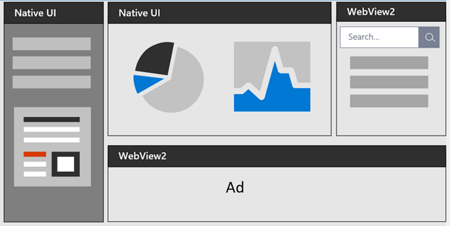
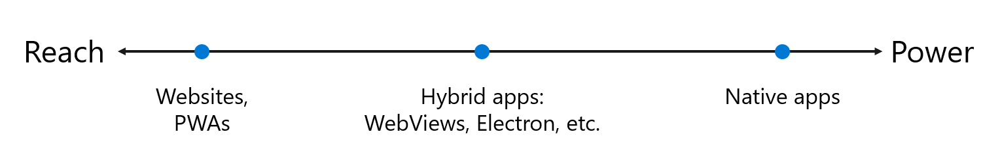
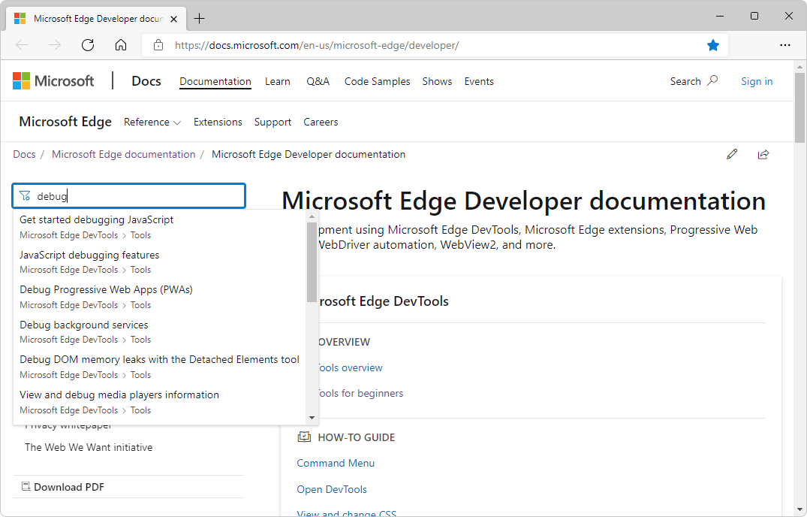
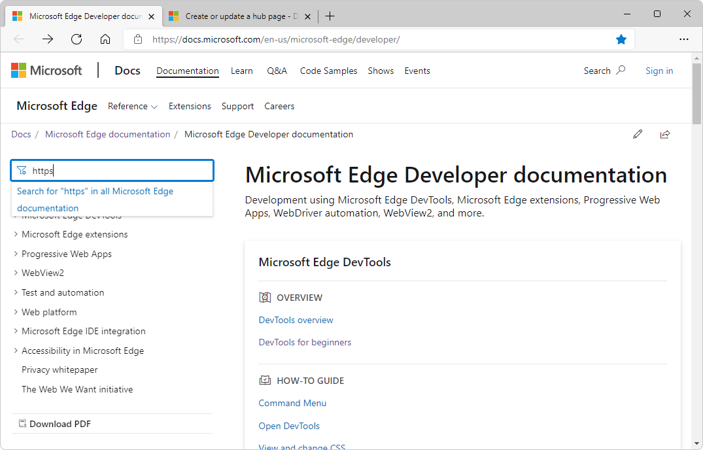
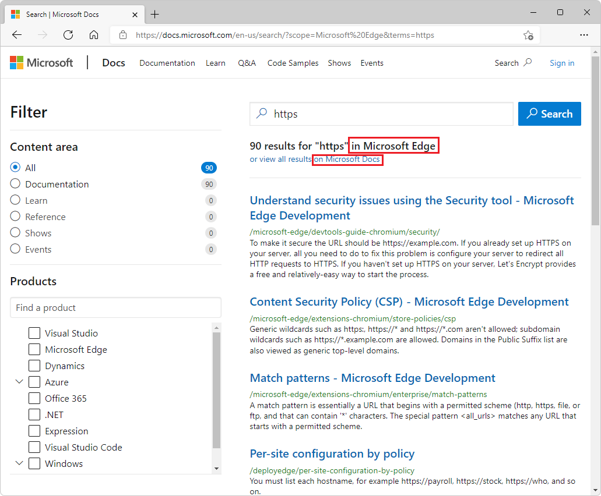

# Develop for the web with Microsoft Edge

Develop for the web with Microsoft Edge by using standards-based web platform features, Microsoft Edge DevTools, Microsoft Edge extensions, Progressive Web Apps, WebDriver automation, WebView2, and more.

For end-user documentation about how to use Microsoft Edge, see [Microsoft Edge help & learning](https://support.microsoft.com/microsoft-edge).

<!-- ====================================================================== -->
## Release notes

To stay up to date with web platform feature changes in Microsoft Edge and the Chromium open-source project, see:
* [Release notes for Microsoft Edge web platform](./web-platform/release-notes/index.md)
* [Site compatibility-impacting changes coming to Microsoft Edge](./web-platform/site-impacting-changes.md)

<!-- ====================================================================== -->
## Experimental web platform features

Use origin trials to try out experimental APIs on your own live site for a limited period of time.  When using origin trials, users of Microsoft Edge that visit your site can run code that uses experimental APIs.

See:
* [Use origin trials in Microsoft Edge](./origin-trials/index.md)
* [Sign up for the Ad Selection API](./web-platform/ad-selection-api.md)

<!-- ====================================================================== -->
## Microsoft Edge DevTools
<!-- ====================================================================== -->
<!-- keep sync'd:
* [Overview of DevTools](devtools/overview.md) - intro section
* [Microsoft Edge DevTools](../develop-web-microsoft-edge.md#microsoft-edge-devtools) in _Develop for the web with Microsoft Edge_
-->

The Microsoft Edge browser comes with built-in web development tools, called Microsoft Edge DevTools.  DevTools is a set of web development tools that appears next to a rendered webpage in the browser.  DevTools provides a powerful way to inspect and debug webpages and web apps.  You can even edit source files and create website projects, all within the DevTools environment.

With DevTools, you can do the following:

*  Inspect, tweak, and change the styles of elements in the webpage using live tools with a visual interface.  Inspect where the browser stored content to construct the webpage, including `.html`, `.css`, `.js`, and `.png` file formats.

*  Emulate how your webpage behaves on different devices and simulate a mobile environment, complete with different network conditions.  Inspect the network traffic and see the location of the problems.

*  Debug your JavaScript using breakpoint debugging and with the live console.  Find memory problems and rendering issues with your web apps.

*  Find accessibility, performance, compatibility, and security issues in your products, and use DevTools to fix the accessibility issues that are found.

*  Use a development environment to sync changes in DevTools with the file system and from the web.

<!-- /keep sync'd -->

See [Overview of DevTools](./devtools/overview.md).

<!-- ====================================================================== -->
## Microsoft Edge extensions
   
Create an extension for Microsoft Edge, to add to or modify the browser's features.  Extensions improve the browser experience, to provide a specialized function that's important to a target audience.

You can create a Microsoft Edge extension if you have an idea or product that is based upon either a specific web browser, or improvements to features of specific webpages. Examples of companion experiences include ad blockers and password managers.

A Microsoft Edge extension is structured similarly to a regular web app, and usually includes:

*  An app manifest JSON file that contains basic platform information.
*  A JavaScript file that defines the behavior of the browser extension.
*  HTML and CSS files that define the user interface.

See [Overview of Microsoft Edge extensions](./extensions/index.md).

<!-- ====================================================================== -->
## Progressive Web Apps

Progressive Web Apps use open web technologies to provide cross-platform interoperability.  They work like native apps on supporting platforms, and like regular websites on other browsers.

Progressive Web Apps combine the best of the web and compiled apps, to provide users an app-like experience, customized for their devices.  A Progressive Web App is a website that's progressively enhanced to function like installed, native apps on supporting platforms, while functioning like regular websites on other browsers.

Progressive Web Apps have a much lower cross-platform development cost than compiled apps that require a specific codebase for each platform, such as a separate codebase for Android, for iOS, and for each desktop operating system.

See [Overview of Progressive Web Apps (PWAs)](./progressive-web-apps/index.md).

<!-- ====================================================================== -->
## WebView2

The WebView2 control is powered by Microsoft Edge, and enables you to embed web technologies (HTML, CSS, and JavaScript) in your native applications.  Combine the ubiquity of the web platform, with the full capabilities of native platforms.

The following diagram shows the spectrum of apps, from maximum reach, to maximum power:

<!-- png copy used in main article is named "web-native.png" -->

Hybrid apps, in the middle of this spectrum, allow you to enjoy the best of both worlds: the ubiquity and strength of the web platform, combined with the power and full capabilities of the native platform.

See [Introduction to Microsoft Edge WebView2](./webview2/index.md).

<!-- ====================================================================== -->
## Test and automation

The following are tools to automate testing in Microsoft Edge:

*  **DevTools Protocol** is used to instrument, inspect, debug, and profile browsers.
*  Use **origin trials** to try experimental APIs.
*  **Playwright** provides cross-browser automation through a single API.
*  **Puppeteer**'s API controls Microsoft Edge via DevTools Protocol.
*  **WebDriver** simulates user interaction with Microsoft Edge.
*  **webhint** linting checks code for errors and best practices.

See [Test and automation in Microsoft Edge](./test-and-automation/test-and-automation.md).

<!-- ====================================================================== -->
## Edge-specific web development tips

Microsoft Edge implements standards-based web features and APIs, which you can use to develop websites that work across browser engines.  In addition, Microsoft Edge offers a few Edge-specific web development features.

See [Edge-specific web development tips](./web-platform/web-platform.md).

<!-- ====================================================================== -->
## Microsoft Edge IDE integration

Various features of Microsoft tools provide integration of development using Microsoft Edge, Visual Studio Code, and Visual Studio, to develop your products, webpages, and web apps that use and work with full integration in Microsoft Edge.

See [Microsoft Edge IDE integration](./visual-studio-code/ide-integration.md).

<!-- ====================================================================== -->
## Accessibility in Microsoft Edge

Development of your webpages, web apps, and web-enabled products is robustly supported through the extensive Accessibility features in Microsoft Edge and its tooling ecosystem.

See [Accessibility in Microsoft Edge](./accessibility/index.md).

<!-- leaf node (article; omit per PR review) -->
<!-- ====================================================================== -->
<!-- ## User data and privacy in Microsoft Edge

The Microsoft Edge _browser privacy promise_ provides you with protection, transparency, control, and respect.  Microsoft Edge has many features and services associated with privacy.  This whitepaper explains how your data is used, how to control the different features, and how to manage your collected data.

See [User data and privacy in Microsoft Edge](/legal/microsoft-edge/privacy).
-->

<!-- leaf node (article; omit per PR review) -->
<!-- ====================================================================== -->
<!-- ## The Web We Want initiative

The Web We Want initiative is a cross-browser, open initiative focused on identifying missing features and functionalities in the web platform for potential development as web standards or browser features.  Let browser vendors and standards groups know what you think is missing from the web platform.

If you build for the web, you inevitably run into problems.  Perhaps there's no way to achieve an aspect of your design with CSS, or it may require an incredible amount of experimenting with CSS.  Maybe there's a device feature you want to tap into using JavaScript, or there's a needed Developer Tools feature that can make your job easier.

See [The Web We Want initiative](./web-we-want/index.md).
-->

<!-- ============================================================================================================================================ -->
<!-- ============================================================================================================================================ -->
## How to use this documentation

The following sections are tips for using the Microsoft Learn website.

<!-- ====================================================================== -->
## Zoom an image in an article

To see details of a screenshot or diagram:

1. Right-click the image, and then select **Open image in new tab**.

1. Close the image tab to return to the article.

<!-- ====================================================================== -->
## Look up key words and terms in "Filter by title" text box

The multi-purpose **Filter by title** text box supports:

* Navigating the table of contents (TOC).
* Index term lookup of key words.
* Full-text search of the documentation.

In the **Filter by title** box in the upper left, enter a term or key word to find:

If the desired article isn't found, select **Search for "_search-term_" in all Microsoft Edge documentation**:

The full-text search page initially searches all _Microsoft Edge_ documentation.  Or, click the **View all results** link for a broader search:

<!-- ====================================================================== -->
## Provide feedback or report issues in the Microsoft Edge Developer documentation

To provide feedback or enter issues:

* [Contact the Microsoft Edge DevTools team](./devtools/contact.md)
* [Contact the Microsoft Edge extensions team](./extensions/contact.md)
* [Contact the WebView2 team](./webview2/contact.md)

To submit and view feedback for a specific page of the documentation, at the bottom of the page, click the **This page** button.
