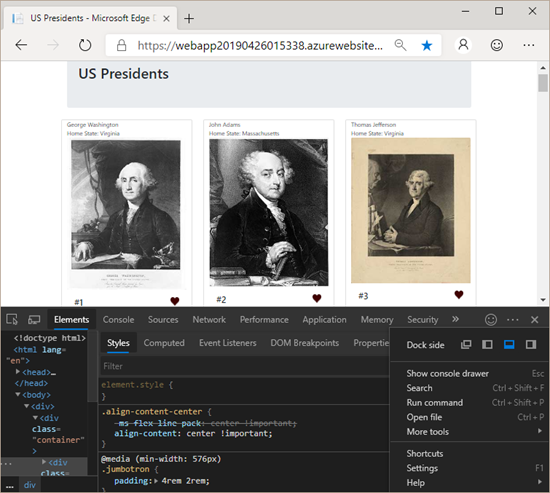
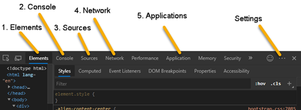
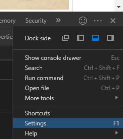
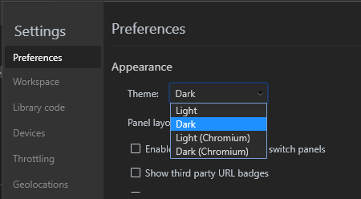
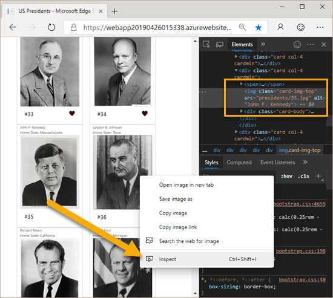
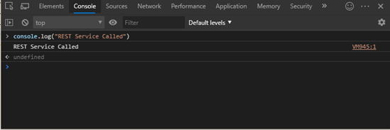
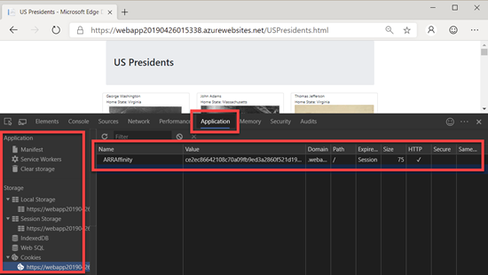

# Microsoft Edge Chromium Developer Documentation

  * [Overview](#overview)
  * [First Steps](#first-steps)
  * [Digging Deeper](#digging-deeper)
    + [Settings](#settings) (LINK TO ./SETTING_DETAIL.MD WHICH WILL HAVE A LINK TO DEV.GOOGLE AT THE BOTTOM)
    + [1. Elements Tab and Viewing the DOM](#1-elements-tab-and-viewing-the-dom) (LINK TO ./ELEMENT_DETAIL.MD WHICH WILL HAVE A LINK TO DEV.GOOGLE AT THE BOTTOM)
    + [2. Console and Viewing Logged Messages](#2-console-and-viewing-logged-messages)
    + [3. Sources](#3-sources)
    + [4. Network Traffic](#4-network-traffic)
    + [5. Application  Cookies, Session Info and More](#5-application--cookies--session-info-and-more)

## Overview
Edge DevTools are web developer tools built directly into Microsoft Edge that can help you edit pages on the fly, diagnose and fix problems quickly resulting in faster and better web sites.  With Edge DevTools you can make changes to the behind the scenes HTML that's rendered the page and instantly see the change in your browser. You can also step through and set break points in running JavaScript to figure out why things work as well as discover how to fix those that do not.

## First Steps

To get started with Edge DevTools, browse to the site <a href="https://webapp20190426015338.azurewebsites.net/uspresidents.html" target="_blank">http://uspresidents.azurewebsites.com</a>.  This site simply uses Bootstrap 4 with some static image files. After browsing to the site, you launch Edge DevTools and Windows by pressing the keys Command+Option+C on a Mac or Control+Shift+C (Windows or Linux). Once you've done that, the Edge DevTools will appear on the bottom half of your display as shown below.

Immediately, I'm sure you notice the dark theme setting that appears in the Edge DevTools bottom section, and you may like it or you may not.  It's easy to change as well as many other preferences.  Next, we'll  dig deeper into the DevTools settings as well as five of the major sections (tabs) available to you.

Read on and learn how to start using these features in Edge DevTools.

## Digging Deeper

### Settings

To change you settings, or more specifically, say you want to change to a different theme, you first have to click on the three dots next to the `x` on the far right of the screen.  You'll get a dialog with one of the choices as settings.

Then, you'll get a panel that on top lets you change the appearance (or Theme) to Light, Dark, Light Chromium, or dark Chromium.  Besides Appearance, there are a lot more settings available to you on the other tabs on the left side as shown here.

### 1. Elements Tab and Viewing the DOM

If you want to see what HTML elements actually created what you are seeing on the browser display, The Elements tab will do that for you.  Though I've not mentioned it yet, when you click the three dots like you did a moment ago to bring up settings, you can also choose where you want your Edge DevTools to be brought up.  I find that for inspecting the DOM, that is, when we use this elements tab, it's most conventient to have these tools docked to the right and not below as was the case earlier.

While mousing over an element I want to dig into, I simply right mouse button over it, then choose `Inspect`.  That automatically opens Edge DevTools and takes me directly to the Elements Tab.

(notice the dev tools are now on the right side and just the first tab, `elements` is showing)

### 2. Console and Viewing Logged Messages

Web developers often log messages to the Console to make sure that their JavaScript is working as expected. To log a message, you insert an expression like console.log('Hello, Console!') into your JavaScript. When the browser executes your JavaScript and sees an expression like that, it knows that it's supposed to log the message to the Console. For example, suppose that you're in the process of writing the HTML and JavaScript for a page: {NOTE: COPIED DIRECTLY FROM CHROME DOCS)

### 3. Sources

The `Sources` tab gives you a window into all the separate files that are downloaded on your web page usually requested directly by your first HTML page.  That is, the referenceds css, JavaScript, manifest files, images, and more.  It's also the place that you can see and set break points in your running JavaScript files so it's very powerful.

### 4. Network Traffic

aklsdfdfj asdkls afkl;j aslkf asfas asdfsad

### 5. Application  Cookies, Session Info and More

asdf adsf jsdaf sdalf asfalsfads fdsf sad;f

