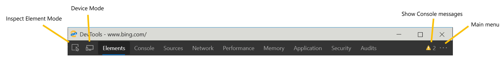
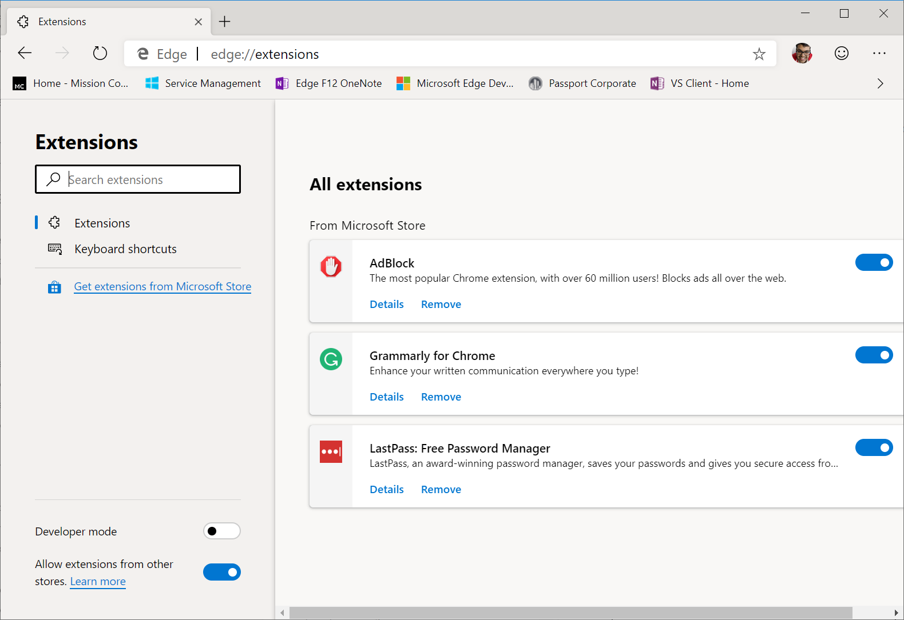
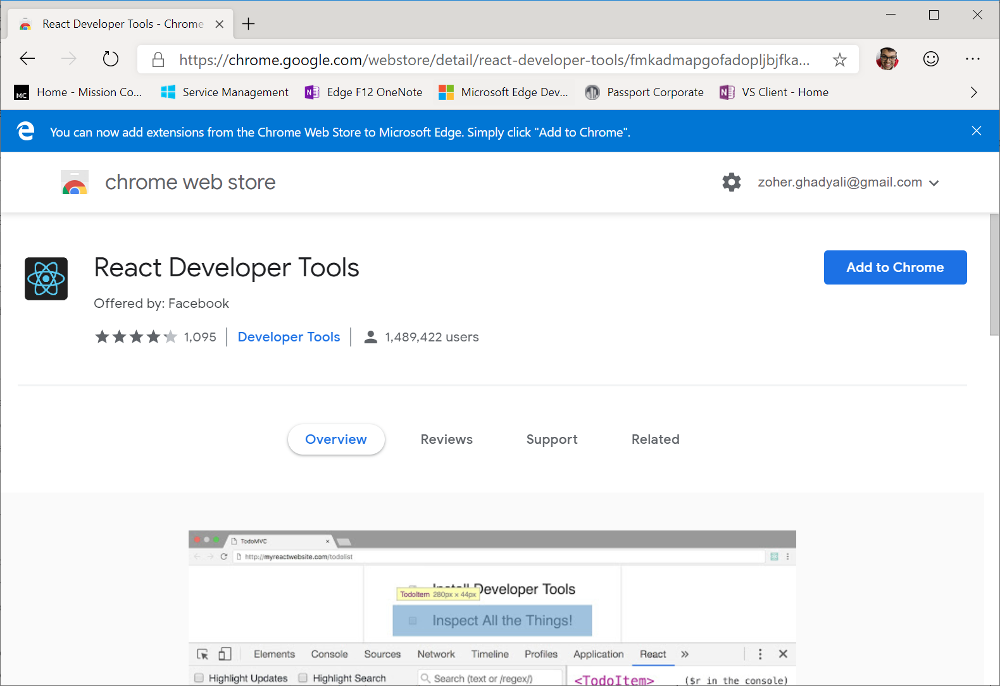

# Microsoft Edge (Chromium) Developer Tools

In the next version of Microsoft Edge, we will be adopting the Chromium open source project to create better web compatibility and less fragmentation of different underlying web platforms. This change should make it easier for you to build and test your web sites in Microsoft Edge and ensure they will still work as expected even if your users are browsing in a different Chromium-based browser, like Google Chrome, Vivaldi, Opera, or Brave.

As the web has grown in usage across an ever-widening array of device types, the complexity and overhead involved in testing web sites has exploded. Since web developers— particulary those at small companies— need to test so many different systems, it's nearly impossible to ensure that interesting sites will work well across all device types and all browsers. With the next version of Microsoft Edge, we hope to simplify this matrix for you by aligning the Microsoft Edge web platform with other Chromium-based browsers and providing a best-in-class developer tooling experience, both inside the browser and with the other developer tools you use every day, like Visual Studio Code.

If you are checking out Microsoft Edge and you mainly develop in a Chromium-based browser, you should feel right at home. The Microsoft Edge (Chromium) Developer Tools are exactly like the developer tools you already know and use. So far, we have made a couple changes we hope you love so for more info, check out [What's new in the Microsoft Edge (Chromium) DevTools](./devtools-guide-chromium/whats-new.md).

If you are checking out the next version of Microsoft Edge and you mainly developed in Microsoft Edge (EdgeHTML), we have got some great new tools that we hope will make it easier and faster for you to build and test your web sites in Microsoft Edge!

## Open the DevTools

If you've never used the DevTools before, the Microsoft Edge Developer Tools are a set of tools built directly into the Microsoft Edge browser. With these DevTools, you can:

* Inspect and make changes to your HTML web site 
* Edit CSS and instantly see how your web site would render 
* See all the `console.log()` statements from your front-end JavaScript code 
* Debug your script by setting breakpoints and stepping through it line by line 

all directly within the browser. These are just examples of a couple features the DevTools provide to make it easier and faster for you to build and test your web sites in Microsoft Edge.

To open the DevTools, you can press the `F12` key or `Ctrl` + `Shift` + `I` on your keyboard on Windows (`Command` + `Option` + `I` on Mac). 

If there's an element on your site that you want to see the HTML and CSS for, you can right-click the element and select **Inspect** to jump into the Elements panel. You can also press `Ctrl` + `Shift` + `C` on Windows (`Command` + `Option` + `C` on Mac) to open the DevTools in **Inspect Element Mode** which lets you select an element on the site and see its HTML and CSS in the Elements panel.

<!-- potentially put gif here of Inspect element in action -->

If you want to see logs from your front-end JavaScript code or quickly execute some script, press `Ctrl` + `Shift` + `J` on Windows (`Command` + `Option` + `J`) to launch the Console panel in the DevTools.

## Core tools

The Microsoft Edge (Chromium) DevTools include:

 - An **Elements** panel to edit HTML and CSS, inspect accessibility properties, view event listeners, and set DOM mutation breakpoints
 - A **Console** to view and filter log messages, inspect JavaScript objects and DOM nodes, and run JavaScript in the context of the selected window or frame
 - A **Sources** panel to open and live edit your code, set breakpoints, step through code, and see the state of your web site one line of JavaScript at a time
 - A **Network** panel to monitor and inspect requests and responses from the network and browser cache 
 - A **Performance** panel to profile the time and system resources required by your site
 - A **Memory** panel to measure your use of memory resources and compare heap snapshots at different states of code execution
 - An **Application** panel to inspect, modify, and debug web app manifests, service workers, and service worker caches. You can also inspect and manage storage, databases, and caches from this panel.
 - A **Security** panel to debug security issues and ensure that you have properly implemented HTTPS on your web site. HTTPS provides critical security and data integrity for both your site and your users that provide personal information on your site.
 - An **Audits** panel to run an audit of your web site. The results of the audit will help you improve the quality of your site, catching common errors around making your web site accessible, secure, performant, building a PWA, etc. and helping you fix them. 

> [!NOTE]
> The **Audits** panel provides links to content hosted on third-party websites. Microsoft is not responsible for and has no control over the content of these sites and any data they might collect.

Please keep sending your [feedback and feature requests](#feedback)!

## Extensions

You may have used extensions to the DevTools to help you diagnose and debug issues when building your web sites or apps. You can acquire extensions for Microsoft Edge from [the Microsoft Edge Addons](https://microsoftedge.microsoft.com/addons/category/Edge-Extensions) page.

However, we do not have any extensions to the DevTools on that page. To acquire extensions to the DevTools, navigate to the extension you want to add to the DevTools in the [Chrome Web Store](https://chrome.google.com/webstore/category/extensions). 

At the top, click **Allow extensions from other stores** and then select **Allow** in the dialog that appears. 

> [!NOTE]
> Extensions installed from sources other than the Microsoft Store are unverified, and may affect browser performance.

Click on **Add to Chrome** and your DevTools extension will be added to Microsoft Edge!

## Feedback

Please send us your feedback so we can continue improving the Microsoft Edge DevTools for you! Simply click the **Feedback** icon in the DevTools or press `Alt` + `Shift` + `I` on Windows (`Option` + `Shift` + `I` on Mac) and enter any feedback or feature requests you have for the DevTools.

If you want to preview the [latest features coming to the DevTools](./devtools-guide-chromium/whats-new.md), download [Microsoft Edge Canary](https://www.microsoftedgeinsider.com/download), which builds nightly.

## Shortcuts

These shortcuts control the main DevTools window and/or work across all tools.

Action | Windows | Mac
:------------ | :------------- | :-------------
Show/Hide DevTools (opens to last viewed panel) | `F12` or `Ctrl` + `Shift` + `I` | `Command` + `Option` + `I`
Show the Console panel | `Ctrl` + `Shift` + `J` | `Command` + `Option` + `J`
Show the DevTools in **Inspect Element Mode** which lets you select an element on the site and see its HTML and CSS in the Elements panel | `Ctrl` + `Shift` + `C` | `Command` + `Option` + `C`
Show Settings | `?` or `Fn` + `F1` | `?` or `Fn` + `F1`
Show the next panel | `Ctrl` + `]` | `Command` + `]`
Show the previous panel | `Ctrl` + `[` | `Command` + `[`
Dock the DevTools in the last position used. If the DevTools have been in their default position for the entire session, this shortcut undocks the DevTools into a separate window | `Ctrl` + `Shift` + `D` | `Command` + `Shift` + `D`
Toggle **Device Mode** | `Ctrl` + `Shift` + `M` | `Command` + `Shift` + `M`
Toggle **Inspect Element Mode** which lets you select an element on the site and see its HTML and CSS in the Elements panel | `Ctrl` + `Shift` + `C` | `Command` + `Shift` + `C`
Show the Command Menu | `Ctrl` + `Shift` + `P` | `Command` + `Shift` + `P`
Show/Hide the Drawer | `Esc` | `Esc`
Refresh. This will refresh the page using the cache. **Note:** if you're debugging and paused at a breakpoint, this resumes execution first. | `F5` or `Ctrl` + `R` | `Command` + `R`
Hard Refresh. This forces Microsoft Edge to download resources again and reload. It is possible that the used resources may come from a cached version | `Ctrl` + `F5` or `Ctrl` + `Shift` + `R` | `Command` + `Shift` + `R`
Search for text within the current panel. Not supported in the Audits, Application, and Security panels | `Ctrl` + `F` | `Command` + `F`
Show the Search panel in the Drawer, which lets you search for text across all loaded resources | `Ctrl` + `Shift` + `F` | `Command` + `Option` + `F`
Open a file in the Sources panel | `Ctrl` + `O` or `Ctrl` + `P` | `Command` + `O` or `Command` + `P`
Zoom in | `Ctrl` + `Shift` + `+` | `Command` + `Shift` + `+`
Zoom out | `Ctrl` + `-` | `Command` + `-`
Restore default zoom level | `Ctrl` + `0` | `Command` + `0`
Run snippet | Press `Ctrl` + `O` or `Ctrl` + `P`, type `!` followed by the name of the script, then press `Enter` | Press `Command` + `O` or `Command` + `P`, type `!` followed by the name of the script, then press `Enter`
Show non-editable HTML source code in a new tab | `Ctrl` + `U` | N/A
