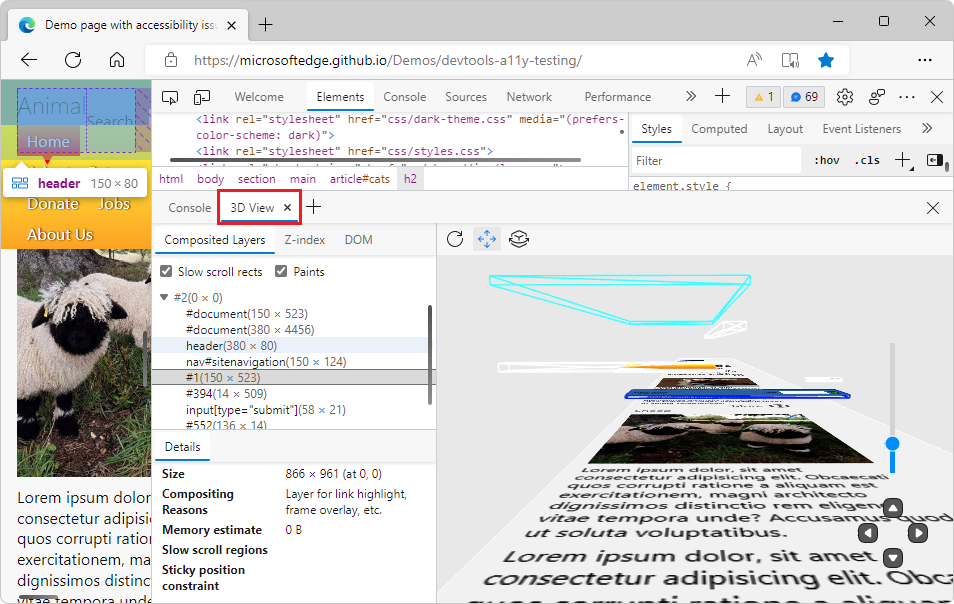
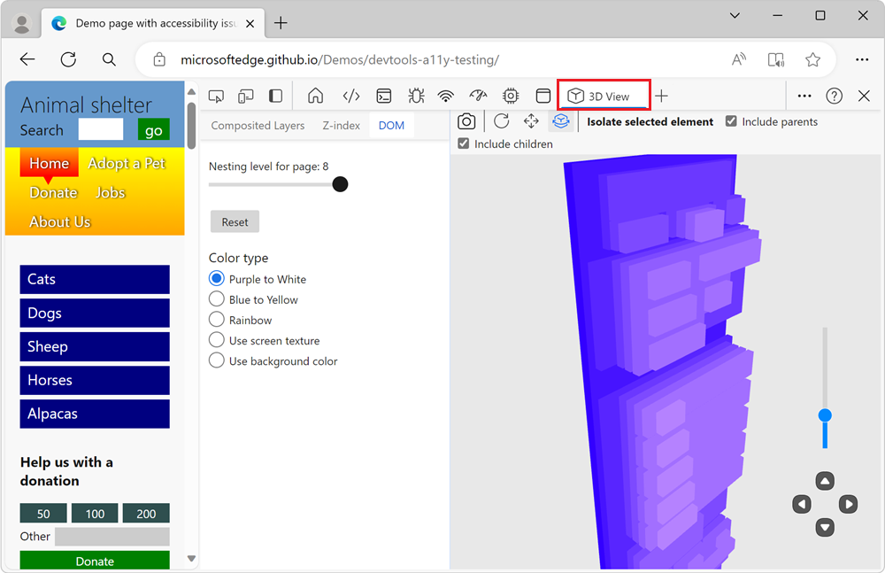
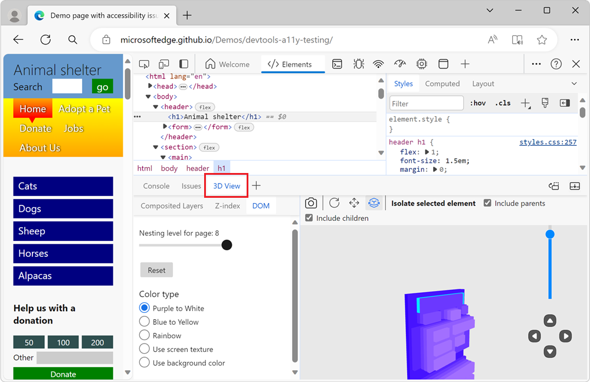
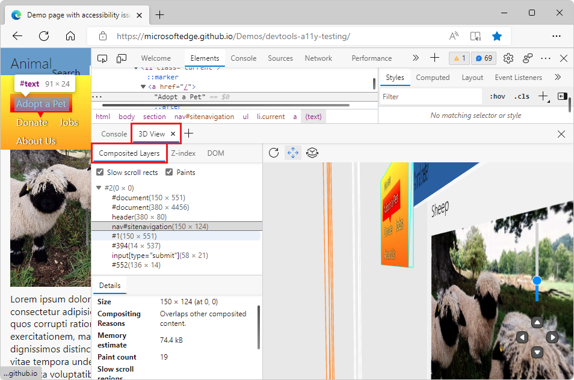
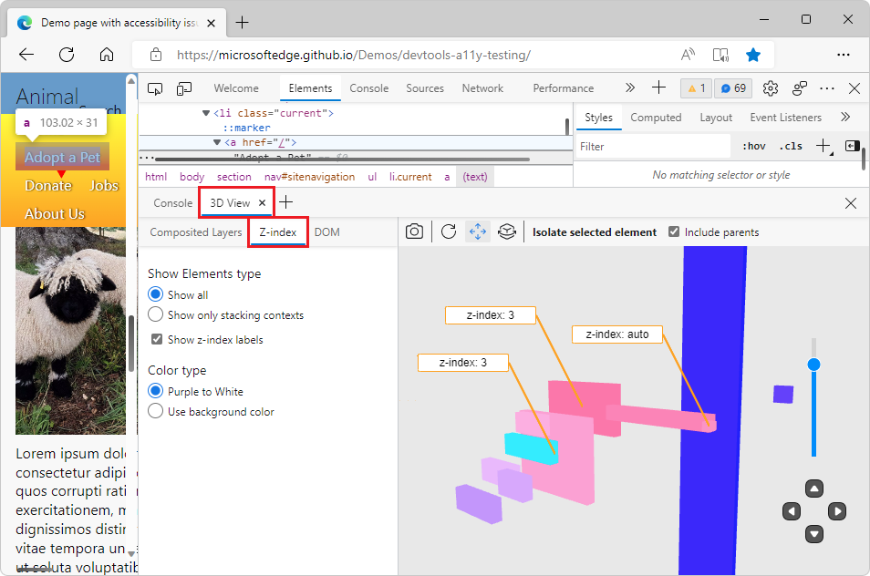
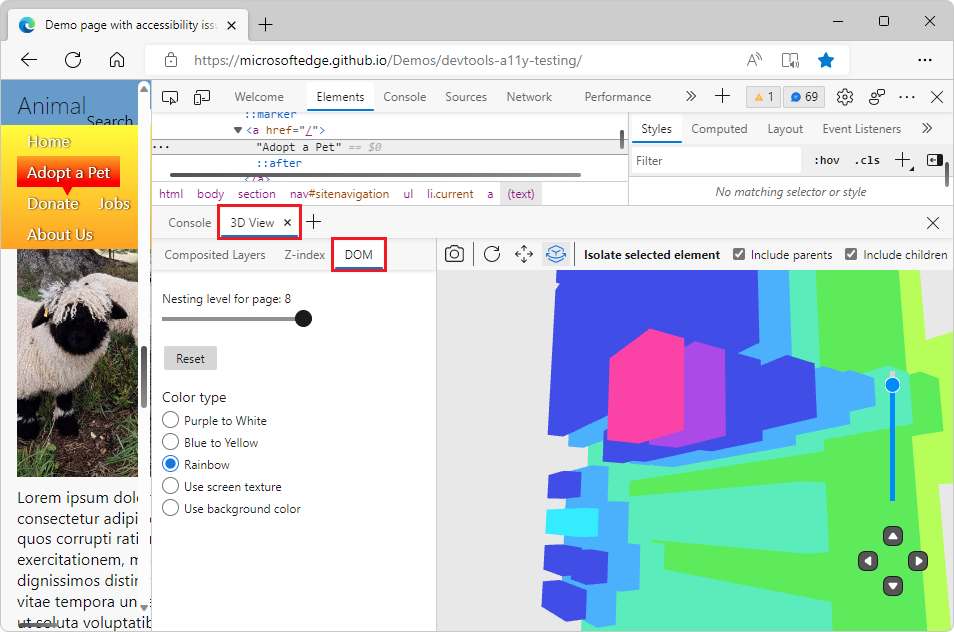
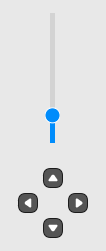

# Navigate webpage layers, z-index, and DOM using the 3D View tool

Use the **3D View** tool to debug DOM, z-index, and composited layer problems in a webpage by rotating the page in 3D space.  The 3D visualization helps you understand the DOM tree hierarchy, the z-index stacking context tree hierarchy, and the composited layers created on the page.

On the left, the **3D View** tool has 3 tabs:

*  The **Composited Layers** tab shows the composited layers that are created by the browser for your webpage. Each layer includes a realistic rendering of the content in the layer, for a comprehensive experience as you move the page around in 3D space.
*  The **Z-index** tab shows a 3D representation of the stacking context tree.  Use this tab to debug z-index stacking issues on your webpage.
*  The **DOM** tab shows a 3D representation of the DOM tree.  Use this tab to explore the DOM as a whole, with all of the elements easily accessible.

On the right, the 3D canvas represents the webpage according to which tab and options you select.

<!-- ====================================================================== -->
## Open the 3D View tool

You can open the **3D View** tool either in the **Activity Bar** or in the **Quick View** panel.

* To get maximum canvas space, open the **3D View** tool in the **Activity Bar**.

* To use the **Elements** tool and **3D View** tool at the same time, open the **3D View** tool in the **Quick View** panel.  This enables you to view the DOM tree elements represented in the 3D canvas.  This is the default; in the Command Menu, **Show 3D View** is indicated as opening in the **Quick View** panel.

<!-- ------------------------------ -->
#### Open the 3D View tool in the Activity Bar

1. Open the webpage you want to visualize in 3D. For example, use the [Animal shelter](https://microsoftedge.github.io/Demos/devtools-a11y-testing/) demo page.

1. To open DevTools, right-click the webpage, and then select **Inspect**.  Or, press **Ctrl+Shift+I** (Windows, Linux) or **Command+Option+I** (macOS).  DevTools opens.

1. In DevTools, on the **Activity Bar**, select the **3D View** tab.  If that tab isn't visible, click the **More tools** () button. The **3D View** tab opens in the **Activity Bar**:

   

<!-- ------------------------------ -->
#### Open the 3D View tool in the Quick View panel

1. Open the webpage you want to visualize in 3D. For example, use the [Animal shelter](https://microsoftedge.github.io/Demos/devtools-a11y-testing/) demo page.

1. To open DevTools, right-click the webpage, and then select **Inspect**.  Or, press **Ctrl+Shift+I** (Windows, Linux) or **Command+Option+I** (macOS).  DevTools opens.

1. If the **Quick View** panel isn't displayed, select **Customize and control DevTools** (**...**), and then select **Toggle Quick View panel**.  Or, when focus is on DevTools, press **Esc**.

1. In the **Quick View** toolbar, select the **3D View** tab.  If that tab isn't visible, click the **More tools** () button. The **3D View** tab opens in the **Quick View** panel:

   

<!-- ====================================================================== -->
## Zoom, pan, and rotate the 3D canvas

To view the webpage from different angles, you can zoom, pan, and rotate the 3D canvas that's displayed on the right side of the **3D View** tool.

<!-- ------------------------------ -->
#### Zoom the page in or out

To zoom the webpage in or out on the 3D canvas, use the mouse scroll wheel, or use the slider in the lower right.

<!-- ------------------------------ -->
<!-- instance 1 of this section, keep synd'c -->
#### Pan view (button)

To shift the page left, right, up, or down, click the **Pan view** () button and then drag the page on the 3D canvas in the desired direction with your mouse.

<!-- no right-click
To pan around the DOM, right-click and drag in the direction you want the DOM to move.
-->

<!-- ------------------------------ -->
<!-- instance 1 of this section, keep synd'c -->
#### Rotate view (button)

To rotate the page by using the mouse, click the **Rotate view** () button and then drag the page on the 3D canvas in the desired angle with your mouse.

To rotate the page by using the keyboard, click in the 3D canvas to put focus on it so that a black border appears, and then press the arrow keys.
*  To rotate the page horizontally, press the **Left Arrow** or **Right Arrow** key.
*  To rotate the page vertically, press the **Up Arrow** or **Down Arrow** key.

The keys rotate the page, regardless of whether the **Pan view** or **Rotate view** button is selected in the toolbar.

For more information, see these other sections in this page:
*  [Toolbar above the 3D canvas](#toolbar-above-the-3d-canvas)
*  [Movement controls in lower right](#movement-controls-in-lower-right)

<!-- ====================================================================== -->
## The Composited Layers tab

In the Composited Layers view, the 3D canvas displays the list of layers created by the browser rendering engine for the webpage.

Use the Composited Layers view to analyze how many layers are created by your CSS code, how big they are, and how often they change.

On the 3D canvas on the right, select an element of the webpage.  In the **Composited Layers** tab, the layers tree expands automatically, and the **Details** tab below the layers tree shows information about the selected layer:

<!-- ------------------------------ -->
#### Slow scroll rects (checkbox)

The **Slow scroll rects** checkbox highlights sections of the page that cause slow scrolling.  This checkbox is helpful to investigate performance problems.  Certain webpages use JavaScript to detect scroll (or touch) on certain page elements in a way that may make scrolling through the webpage slower than it normally could be.

This checkbox highlights (in pink) the boxes of the rendered webpage that may cause these performance issues.
<!-- To try this checkbox, you can go to [YouTube](https://www.youtube.com). -->

This checkbox is similar to the **Scrolling performance issues** checkbox in the **Rendering** tool, which highlights the slow rects on the page directly (in yellow).  See [Find scroll performance issues in realtime](../evaluate-performance/reference.md#find-scroll-performance-issues-in-realtime) in _Performance features reference_.  Both checkboxes are based on the same debugging info, but these two tools present this information differently.
<!-- https://developer.chrome.com/docs/devtools/rendering/performance/#scrolling-performance-issues -->

<!-- ------------------------------ -->
#### Paints (checkbox)

Renders the content from the webpage (color or image file) onto the elements.

<!-- ------------------------------ -->
#### Layers expander tree

Expand this tree to display the list of composited layers. Click on a layer to display detailed information about it in the **Details** info pane.

<!-- ------------------------------ -->
#### Details (info pane)

The **Details** info pane below the **Composited Layers** pane contains the following fields.

###### Size

The width and then the height of the selected composited layer, along with the location of the upper left of the layer relative to the upper left of the page viewport.  For example, "1034 x 28055 (at 0, 0)".

###### Compositing Reasons

Reasons why the browser rendering engine created the layer.  For example: "Secondary layer, to house contents that can be scrolled."

###### Memory estimate

The memory consumed for the selected layer.  For example: "116 MB".

###### Paint count

How many times the selected layer was painted by the rendering engine.

<!-- #### Slow scroll regions -->

<!-- need desc -->

<!-- #### Sticky position constraint -->

<!-- need desc -->

<!-- ====================================================================== -->
## The Z-index tab

The **Z-index** tab shows only the elements of the webpage that are stacking contexts or that are positioned along the z-axis:

To learn more, see [Stacking context](https://developer.mozilla.org/docs/Web/CSS/CSS_positioned_layout/Understanding_z-index/Stacking_context) and [Using z-index](https://developer.mozilla.org/docs/Web/CSS/CSS_positioned_layout/Understanding_z-index/Using_z-index) at MDN.

<!-- ------------------------------ -->
#### Show Elements type (section)

The **Show Elements type** section in the **Z-index** tab controls which elements of the page are shown in the 3D canvas.

*  The **Show all** radio button shows both the stacking context elements and the elements which are positioned on the z-axis.  This view is useful to debug issues with elements that are incorrectly positioned on the z-axis.

*  The **Show only stacking contexts** radio button only shows the page elements which are stacking contexts.  This view is useful to quickly find out which elements are stacking contexts on the webpage.

The **Show z-index labels** checkbox shows or hides the z-index labels in the 3D canvas.  By default, this checkbox is selected.

<!-- ------------------------------ -->
#### Color type (section)

In the **Z-index** tab, you can choose from the following color schemes to visualize the DOM in the 3D canvas:

*  **Purple to White** radio button - The 3D canvas shows elements ranging from purple to white.

*  **Use background color** radio button - The 3D canvas shows elements rendered using the background color that's defined for each element.

These radio buttons allow you to toggle through the options and pick the color type.  The color type is either most appropriate for your project or one that you like the most.  The z-index labels add visual information on the 3D canvas, so per user feedback, there are fewer color options in the **Z-index** tab than in the **DOM** tab.

<!-- ====================================================================== -->
## The DOM tab

The **DOM** tab provides a general debugging view of the DOM tree.  The **DOM** tab shows all the elements of the webpage in the 3D canvas:

An element's X and Y coordinates in the 3D canvas match the element's coordinates in the webpage. An element's Z coordinate is based on how deeply nested the element is in the DOM tree.

<!-- ------------------------------ -->
#### Nesting level for page (slider)

The slider controls how many levels of the DOM tree are displayed in the 3D canvas. The value displayed next to the slider indicates the maximum depth of the elements that are displayed in the 3D canvas.  Dragging the slider to the left causes the outermost layers to peel away until you are left with a nesting level set to `1`, which displays only the furthest-back element in the DOM.  To remove some of the clutter, drag the slider, to get a closer look at what's happening in the lower levels.

###### Reset button

Resets the **Nesting level for page** slider to the default value for the page.

<!-- ------------------------------ -->
#### Color type (section)

In the **DOM** tab, you can choose from the following color schemes visualize the DOM in the 3D canvas:

*  **Purple to White** radio button - The 3D canvas shows elements ranging from purple to white.

*  **Blue to Yellow** radio button - The 3D canvas shows elements ranging from blue to yellow.

*  **Rainbow** radio button - The 3D canvas shows elements as purple, blue, green, yellow, orange, and red.

*  **Use screen texture** radio button - Renders the content from the webpage (color or image file) onto the elements.

*  **Use background color** radio button - The 3D canvas shows elements rendered using the background color that's defined for each element.

<!-- ====================================================================== -->
## Toolbar above the 3D canvas

<!-- ------------------------------ -->
#### Retake snapshot (button)

Click the **Retake snapshot** () button in the **DOM** tab or **Z-index** tab to refresh the 3D representation of the DOM tree or stacking context tree to match the latest webpage viewport.  For example, after you make the viewport narrower or when you switch to a Device Emulation view, per [Emulate mobile devices (Device Emulation)](../device-mode/index.md).

When the **Composited Layers** tab is selected, this button is omitted, because retaking the snapshot happens automatically when you resize the viewport.

<!-- ------------------------------ -->
#### Reset view (button)

Click the **Reset view** button () to reset the panning and rotation of the page.

<!-- instance 2 of this section, keep synd'c -->
<!-- ------------------------------ -->
#### Pan view (button)

To shift the page left, right, up, or down, click the **Pan view** () button and then drag the page on the 3D canvas in the desired direction with your mouse.

<!-- no right-click
To pan around the DOM, right-click and drag in the direction you want the DOM to move.
-->

<!-- instance 2 of this section, keep synd'c -->
<!-- ------------------------------ -->
#### Rotate view (button)

To rotate the page by using the mouse, click the **Rotate view** () button and then drag the page on the 3D canvas in the desired angle with your mouse.

To rotate the page by using the keyboard, click in the 3D canvas to put focus on it so that a black border appears, and then press the arrow keys.
*  To rotate the page horizontally, press the **Left Arrow** or **Right Arrow** key.
*  To rotate the page vertically, press the **Up Arrow** or **Down Arrow** key.

The keys rotate the page, regardless of whether the **Pan view** or **Rotate view** button is selected in the toolbar.

<!-- ------------------------------ -->
#### Isolate selected element (button and section)

Instead of showing all the page's DOM elements in the 3D canvas, you can focus on just displaying a portion of the DOM.

Select an element of the webpage in the 3D canvas, and then click the **Isolate selected element** button.  The 3D canvas displays the selected element and the element's parents or children, without displaying the rest of the page elements.

Use this button to display the element that you selected on the 3D canvas, while reducing the clutter that complex webpages can create in the 3D canvas.

###### Include parents (checkbox)

The **Include parents** checkbox controls whether the parent elements of a selected page element are displayed in the 3D canvas.  The **Include parents** checkbox is turned on by default.  When this checkbox is selected, to display an element and any of its parent elements on the 3D canvas, select an element in the 3D canvas or in the **Elements** tool, and then click the **Isolate selected element** button.

This checkbox is shown when the **Z-index** or **DOM** tab is selected.

###### Include children (checkbox)

The **Include children** checkbox is only shown when the **DOM** tab is selected.

<!-- select select -->
To display only the DOM element that you selected, along with and parents and children of the element:
*  Select the **Include parents** and **Include children** checkboxes, and then click the **Isolate selected element** button.  This is the default.

<!-- select clear -->
To display only the DOM element that you selected, along with the element's parent elements, but not the element's child elements:
*  Select the **Include parents** checkbox, clear the **Include children** checkbox, and then click the **Isolate selected element** button.

<!-- clear select -->
To display only the DOM element that you selected, along with the element's child elements, but not the element's parent elements:
*  Clear the **Include parents** checkbox, select the **Include children** checkbox, and then click the **Isolate selected element** button.

<!-- clear clear -->
To display only the DOM element that you selected, without its parent or child elements:
*  Clear the **Include parents** and the **Include children** checkbox, and then click the **Isolate selected element** button.

<!-- ====================================================================== -->
## Movement controls in lower right

The controls in the lower right of the 3D canvas work the same, regardless of which tab you select.

*  Zoom slider - This zooms the page in or out, same as the mouse scroll wheel, or dragging two fingers across the touchpad.

*  Up button - Moves the page up, relative to the page's coordinate system.

*  Down button - Moves the page down, relative to the page's coordinate system.

*  Left button - Moves the page right, relative to the page's coordinate system.

*  Right button - Moves the page left, relative to the page's coordinate system.

<!-- ====================================================================== -->
## See also

* [MDN > Web APIs > Document Object Model (DOM)](https://developer.mozilla.org/docs/Web/API/Document_Object_Model)
* [MDN > CSS Reference > z-index](https://developer.mozilla.org/docs/Web/CSS/z-index)
