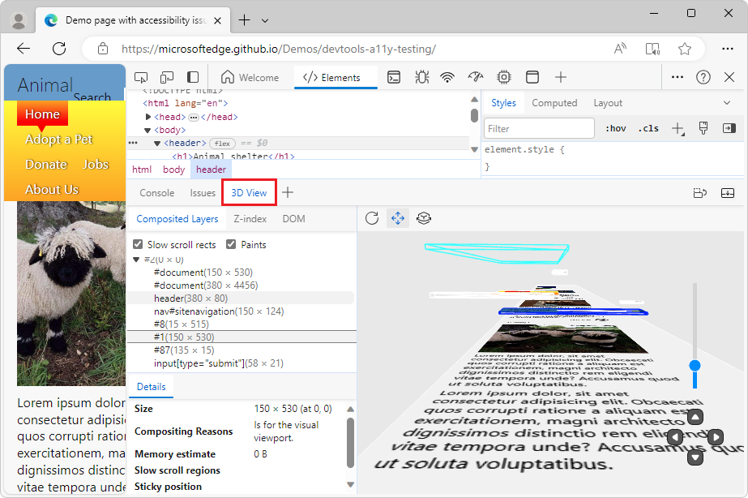
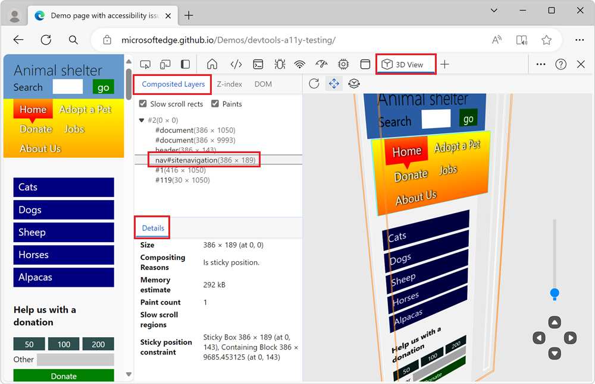
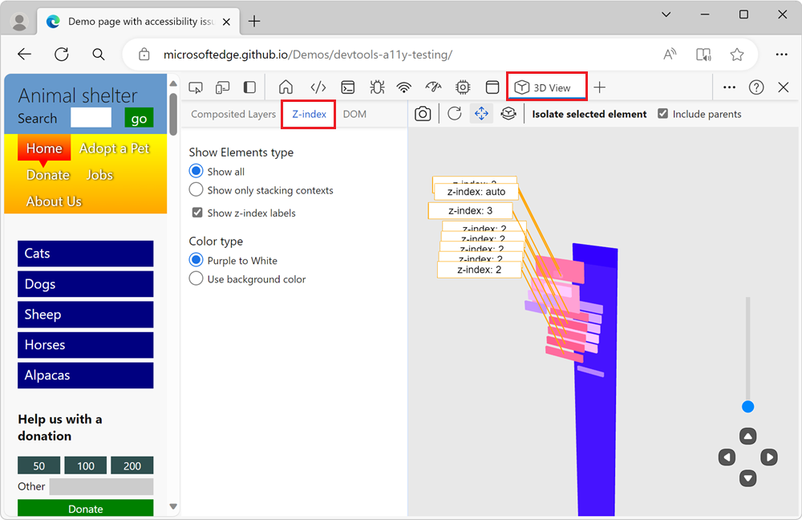
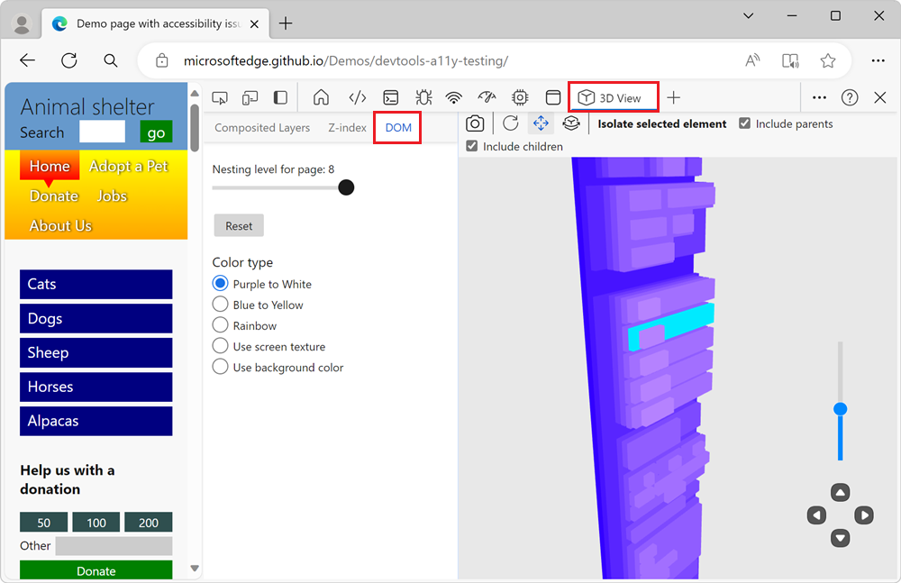

# Navigate webpage layers, z-index, and DOM using the 3D View tool

Use the **3D View** tool to debug your web app by rotating your page in 3D space to get a perspective on your webpage, represented as layers.  3D visualization helps you understand the DOM hierarchy for your webpage in terms of z-index layers.

On the left, the **3D View** tool has 3 tabs:

*  The **Composited Layers** tab shows a realistic rendering of the webpage, including images, for a comprehensive experience as you move the page around in 3D space.
*  The **Z-index** tab.  Explore the elements of the webpage, with an emphasis on the z-index layer context.  Use this tab, or view, to debug the webpage based on the z-index stacking context.
*  The **DOM** tab.  Explore the DOM as a whole, with all of the elements easily accessible.  Explore all the elements of the webpage, translated into a 3D perspective.

On the right, the 3D canvas represents the webpage according to which tab and options you select.

<!-- ====================================================================== -->
## Zoom, pan, and rotate the 3D canvas

To zoom the webpage in or out on the 3D canvas, use the mouse scroll wheel, or use the slider in the lower right.

Use the mouse to pan (shift) the webpage on the 3D canvas up, down, left, and right.

Use the mouse or keyboard to rotate the webpage on the 3D canvas around the horizontal or vertical axis.

To only show part of the page when the **Composited Layers** tab is selected:
*  In the expander tree in the tab, select a DOM element.

To only show part of the page when the **Z-layer** or **DOM** tab is elected:
*  Select an element in the **Elements** tool, and then click the **Retake snapshot** button.

For more information, see these other sections in this page:
*  [Toolbar above the 3D canvas](#toolbar-above-the-3d-canvas)
*  [Movement controls in lower right](#movement-controls-in-lower-right)

<!-- ====================================================================== -->
## The Composited Layers tab

In the Composited Layers view, the 3D canvas displays the rendered webpage, including colors and images.  In the tab's pane on the left, you can select each layer and view details about the layer.

<!-- == checkboxes == -->

### Slow scroll rects (checkbox)

<!-- need desc -->

### Paints (checkbox)

<!-- need desc -->

<!-- ===== -->
### DOM expander tree

Expand this tree to display DOM tree information about the selected DOM element.

<!-- ===== -->
### Details info pane

#### Size

The width and then the height of the selected DOM element, along with the location of the upper left of the element relative to the upper left of the page viewport.  For example, "1034 x 28055 (at 0, 0)".

#### Compositing Reasons

Reasons for the layer-compositing of the selected DOM element, if any compositing is done.  For example: "Secondary layer, to house contents that can be scrolled."

#### Memory estimate

The memory consumed for the selected DOM element and its children.  For example: "116 MB".

#### Paint count

<!-- need desc -->

#### Slow scroll regions

<!-- need desc -->

#### Sticky position constraint

<!-- need desc -->

<!-- ====================================================================== -->
## The Z-index tab

The **Z-index** tab contains some of the same features as the **DOM** tab, but adds z-index labels on the 3D canvas.

For background information, see [MDN > CSS Reference > z-index](https://developer.mozilla.org/docs/Web/CSS/z-index).

### Show Elements type (section)

The **Show Elements type** section in the **Z-index** tab controls which elements of the page are shown in the 3D canvas.

*  The **Show all** radio button shows all elements of the page.  This view is the quickest way to display all the page elements after changing the other 3D display settings.

*  The **Show only stacking contexts** radio button only shows the page elements which are relevant to z-index stacking.  This view removes elements that don't participate in a stacking context, and flattens the DOM to produce easier navigation in the 3D canvas.

The **Show z-index labels** checkbox shows or hides the z-index labels in the 3D canvas.  By default, this checkbox is selected.

### Color type (section)

In the **Z-index** tab, you can choose from the following color schemes to visualize the DOM in the 3D canvas:

*  **Purple to White** radio button - The 3D canvas shows elements ranging from purple to white.

*  **Use background color** radio button - The 3D canvas shows elements rendered using the background color that's defined for each element.

The z-index labels add visual information on the 3D canvas, so per user feedback, there are fewer color options in the **Z-index** tab than in the **DOM** tab.
These radio buttons allow you to toggle through the options and pick the color type.  The color type is either most appropriate for your project or one that you like the most.

<!-- ====================================================================== -->
## The DOM tab

The **DOM** tab provides a general debugging view, rather than focusing on z-index.  The DOM is stacked more closely and cleanly than in the **Z-index** tab, because there aren't z-index context labels on the 3D canvas.

### Nesting level for page (slider)

The number next to the slider indicates the number of layers for the document.  Dragging the slider to the left causes the outermost layers to peel away until you are left with a nesting level set to `1`, which displays only the furthest-back element in the DOM.  To remove some of the clutter, drag the slider.  It helps you get a closer look at what is happening in the lower levels.

#### Reset button

Resets the **Nesting level for page** slider to the default value for the page.

### Color type (section)

In the **DOM** tab, You can choose from the following color schemes visualize the DOM in the 3D canvas:

*  **Purple to White** radio button - The 3D canvas shows elements ranging from purple to white.

*  **Blue to Yellow** radio button - The 3D canvas shows elements ranging from blue to yellow.

*  **Rainbow** radio button - The 3D canvas shows elements as purple, blue, green, yellow, orange, and red.

*  **Use screen texture** radio button - displays the content from the webpage (color or image file) onto the elements.

*  **Use background color** radio button - The 3D canvas shows elements rendered using the background color that's defined for each element.

<!-- ====================================================================== -->
## Toolbar above the 3D canvas

### Retake snapshot (button)

Click the **Retake snapshot** () button to re-load the DOM to match the latest webpage viewport.  For example, after you make the viewport narrower or when you switch to a Device Emulation view, per [Emulate mobile devices (Device Emulation)](../device-mode/index.md).

When the **Composited Layers** tab is selected, this button is omitted, because retaking the snapshot happens automatically when you resize the viewport.

### Reset view (button)

Click the **Reset view** button () to reset the panning and rotation of the page.

### Pan view (button)

To shift the page left, right, up, or down, click the **Pan view** () button and then drag in the desired direction with your mouse.

<!-- no right-click
To pan around the DOM, right-click and drag in the direction you want the DOM to move.
-->

### Rotate view (button)

To rotate the page by using the mouse, click the **Rotate view** () button and then drag in the desired direction with your mouse.

To rotate the page by using the keyboard, click in the 3D canvas to put focus on it so that a black border appears, and then press the arrow keys.
*  To rotate the page horizontally, press the `left arrow` and `right arrow` keys.
*  To rotate the page vertically, press the `up arrow` and `down arrow` keys.

The keys rotate the page, regardless of whether the **Pan view** or **Rotate view** button is selected in the toolbar.

### Isolate selected element (button and section)

Instead of showing all the page's DOM elements in the 3D canvas, you can focus on just displaying a portion of the DOM.

First, select an element in the **Elements** tool.  Then, click the **Isolate selected element** button.  The 3D canvas displays the selected element and the element's parents or children, without displaying the rest of the page elements.

Use this button and these checkboxes to display the element that you selected on the 3D canvas, while reducing the clutter that complex web pages can create in the 3D canvas.

#### Include parents (checkbox)

The **Include parents** checkbox controls whether the parent elements of a selected page element are displayed in the 3D canvas.  The **Include parents** checkbox is turned on by default.  When this checkbox is selected, to display an element and any of its parent elements on the 3D canvas, select an element in the 3D canvas or in the **Elements** tool, and then click the **Isolate selected element** button.

This checkbox is shown when the **Z-index** or **DOM** tab is selected.

#### Include children (checkbox)

The **Include children** checkbox is only shown when the **DOM** tab is selected.

<!-- select select -->
To display only the DOM element that you selected, along with and parents and children of the element:
*  Select the **Include parents** and **Include children** checkboxes, and then click the **Isolate selected element** button.  This is the default.

<!-- select clear -->
To display only the DOM element that you selected, along with the element's parent elements, but not the element's child elements:
*  Select the **Include parents** checkbox, clear the **Include children** checkbox, and then click the **Isolate selected element** button.

<!-- clear select -->
To display only the DOM element that you selected, along with the element's child elements, but not the element's parent elements:
*  Clear the **Include parents** checkbox, select the **Include children** checkbox, and then click the **Isolate selected element** button.

<!-- clear clear -->
To display only the DOM element that you selected, without its parent or child elements:
*  Clear the **Include parents** and the **Include children** checkbox, and then click the **Isolate selected element** button.

<!-- ====================================================================== -->
## Movement controls in lower right

The controls in the lower right of the 3D canvas work the same, regardless of which tab you select.

*  Zoom slider - This zooms the page in or out, same as the mouse scroll wheel, or dragging two fingers across the touchpad.

*  Up button - Moves the page up, relative to the page's coordinate system.

*  Down button - Moves the page down, relative to the page's coordinate system.

*  Left button - Moves the page right, relative to the page's coordinate system.

*  Right button - Moves the page left, relative to the page's coordinate system.

<!-- ====================================================================== -->
## See also

* [MDN > Web APIs > Document Object Model (DOM)](https://developer.mozilla.org/docs/Web/API/Document_Object_Model)
* [MDN > CSS Reference > z-index](https://developer.mozilla.org/docs/Web/CSS/z-index)
