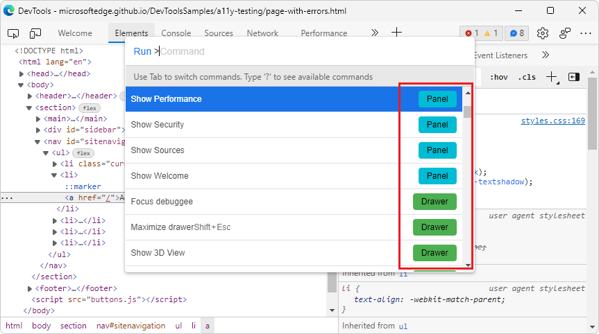

# About the list of tools

DevTools provides 35 tools:
*  2 toolbar icons, for the **Inspect tool** () and **Device Emulation** ().
*  3 permanent toolbar tabs, for the **Elements**, **Console**, and **Sources** tools.
*  30 optional toolbar tabs, for the optional tools.

The following features are additional ways to access the tools:
*  The **Drawer** is an additional toolbar and area to hold tool tabs.
*  The **Command Menu** is a way to directly use features of tools.
*  The **Settings** pages can turn on additional features of tools.

<!-- ====================================================================== -->
## The More Tools menus

The **More Tools** (**+**) menu on the main toolbar and on the Drawer toolbar is dynamic: it omits any tab tools that are open on that toolbar.

The **More tools** menu in the **Customize and control DevTools** () menu is static: it always lists all of the optional tools.  The selected tool opens in the main toolbar if it's a Panel tool, or on the Drawer if it's a Drawer tool.  You can right-click the tool's tab to move it to the other toolbar.

<!-- ====================================================================== -->
## Panel tools vs. Drawer tools

In the **Command Menu**:

* _Panel tools_ are tools which open in the main toolbar by default.

* _Drawer tools_ are tools which open in the Drawer toolbar by default, at the bottom of DevTools.  Press `Esc` to show or hide the Drawer.

The **Command Menu** first lists the Panel tools, and then the Drawer tools:

To move a tool to the other toolbar, right-click the tool's tab and then select **Move to bottom** or **Move to top**.

To open the **Command Menu**, press `Ctrl`+`Shift`+`P` (Windows/Linux) or `Command`+`Shift`+`P` (macOS).  Or, click the **Customize and control DevTools** () button and then select **Run command**.

<!-- ====================================================================== -->
## Closing tool tabs

To close a tool tab that's on a toolbar:

*  Click the **x** on the tab.

   The **Elements**, **Console**, and **Sources** tool tabs cannot be closed.

To close all of the optional tabs at once:

*  Right-click an optional tab on the toolbar (a tab that has an **x** button), and then select **Close all**.

   Only the **Elements**, **Console**, and **Sources** remain on the main toolbar.  (The **Drawer** toolbar is unaffected.)

   If you closed all tabs on the **Drawer**, only the **Console** tab remains on the **Drawer** toolbar.  (The main toolbar is unaffected.)

<!-- ====================================================================== -->
## Restoring the default tool tabs

To restore all of the default tabs on the main toolbar:

1. In DevTools, select **Settings** () > **Preferences**.

1. Click the **Restore defaults and refresh** button.

   The main toolbar again has all of the default tabs.  The **Drawer** then has only the **Console** tab.

<!-- ====================================================================== -->
## See also
 
* [Overview of DevTools](index.md) - Similar to the present article, but broader coverage, with a top-level introduction of DevTools.
* [Focus Mode](experimental-features/index.md#focus-mode), in _Experimental features_.  In **Focus Mode**, the **Activity Bar** is a compact replacement for the main toolbar, and the **Quick View** list is a replacement for the tabs on the Drawer toolbar.
