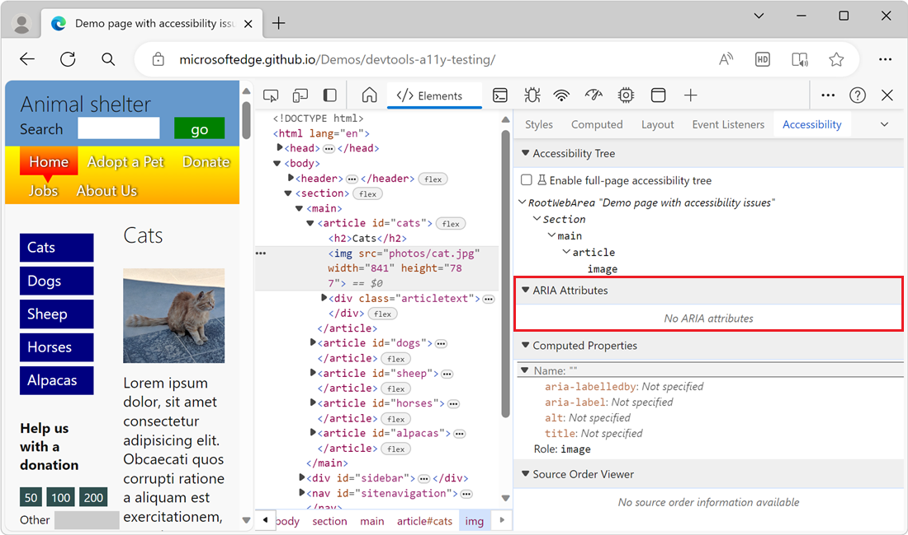

<!-- this article was created on 05/11/2021 by moving a section out from the "Accessibility reference" article (reference.md) -->
<!-- Copyright Kayce Basques

   Licensed under the Apache License, Version 2.0 (the "License");
   you may not use this file except in compliance with the License.
   You may obtain a copy of the License at

       https://www.apache.org/licenses/LICENSE-2.0

   Unless required by applicable law or agreed to in writing, software
   distributed under the License is distributed on an "AS IS" BASIS,
   WITHOUT WARRANTIES OR CONDITIONS OF ANY KIND, either express or implied.
   See the License for the specific language governing permissions and
   limitations under the License.  -->
# Test accessibility using the Accessibility tab

The **Accessibility** tab is where you view the accessibility tree, ARIA attributes, and computed accessibility properties of DOM nodes.

To open the **Accessibility** tab:

1. In a rendered webpage, right-click an element and then select **Inspect**.

   DevTools opens, with the **Elements** tool selected.  The DOM tree opens to show the element that you right-clicked.

1. In the **DOM Tree**, click the element that you want to inspect.  You can use the arrow keys to move through the DOM tree.

1. Click the **Accessibility** tab, to the right of the **Styles** tab.  You might need to first click the **More tabs** () button to the right of the **Styles** tab.

<!-- ====================================================================== -->
## View the position of an element in the accessibility tree

The [accessibility tree](https://developer.mozilla.org/docs/Glossary/AOM) is a subset of the DOM tree.  The accessibility tree only contains elements from the DOM tree that are relevant and useful for displaying the contents of a page through assistive technologies such as screen readers.

Inspect the position of an element in the accessibility tree from the **Accessibility** tab.

<!-- ====================================================================== -->
## View the ARIA attributes of an element

ARIA attributes ensure that assistive technologies such as screen readers have all of the information that they need in order to properly represent the contents of a page.

View the ARIA attributes of an element in the **Accessibility** tab.

<!-- ====================================================================== -->
## View the computed accessibility properties of an element

Some accessibility properties are dynamically calculated by the browser.  These properties are displayed in the **Computed Properties** section of the **Accessibility** tab.

View the computed accessibility properties of an element in the **Accessibility** tab.

Computed accessibility properties are different than computed CSS properties. To learn more about how to view computed CSS properties, see [View only the CSS that is actually applied to an element](../css/reference.md#view-only-the-css-that-is-actually-applied-to-an-element) in _CSS features reference_.

<!-- ====================================================================== -->
> [!NOTE]
> Portions of this page are modifications based on work created and [shared by Google](https://developers.google.com/terms/site-policies) and used according to terms described in the [Creative Commons Attribution 4.0 International License](https://creativecommons.org/licenses/by/4.0).
> The original page is found [here](https://developer.chrome.com/docs/devtools/accessibility/reference/) and is authored by [Kayce Basques](https://developers.google.com/web/resources/contributors/kaycebasques) (Technical Writer, Chrome DevTools \& Lighthouse).

This work is licensed under a [Creative Commons Attribution 4.0 International License](https://creativecommons.org/licenses/by/4.0).
