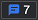

# Overview of accessibility testing using DevTools

In this article, we cover some of the features you can use in DevTools to test for accessibility problems.  We go through using different features of DevTools to detect the accessibility problems in a demo page, and we discuss how to fix them.  Open the [demo page](https://microsoftedge.github.io/DevToolsSamples/a11y-testing/page-with-errors.html) in a new tab to try it out yourself and you can test along.

:::image type="content" source="../media/a11y-testing-basics-demopage.msft.png" alt-text="The demo page used in this article with a few accessibility issues." lightbox="../media/a11y-testing-basics-demopage.msft.png":::


<!-- ====================================================================== -->
## Automated testing by using the Issues tool

When you open the demo page in the browser and open DevTools, notice that some issues are automatically detected in the **Issues counter**.  Click the **Issues counter** () to open the [Issues tool][DevToolsIssuesTool] to view the issues and more information.

:::image type="content" source="../media/a11y-testing-issues-tracker.msft.png" alt-text="The Issues counter shows how many problems there are in the current webpage, and opens the Issues tool." lightbox="../media/a11y-testing-issues-tracker.msft.png":::

For this article, we'll focus on the **Accessibility** section of the **Issues** tool.

:::image type="content" source="../media/a11y-testing-accessibility-issues.msft.png" alt-text="Accessibility warnings displayed in the Issues tool." lightbox="../media/a11y-testing-accessibility-issues.msft.png":::

For detailed walkthrough steps, see [View the Accessibility section of the Issues tool](test-issues-tool.md#view-the-accessibility-section-of-the-issues-tool).


### Automatically checking that input fields have labels

The first warning displayed is `Form elements must have labels: Element has no title attribute. Element has no placeholder attribute`.  When you expand this section and then click the **Open in Elements** link, the **Elements** tool opens, with the element highlighted in the DOM tree.  The **Styles** tab shows the CSS that's applied to the element.

For detailed walkthrough steps, see [Verify that input fields have labels](test-issues-tool.md#verify-that-input-fields-have-labels).

:::image type="content" source="../media/a11y-testing-inspect-problematic-element.msft.png" alt-text="Elements tool showing the problematic HTML after clicking the link in the Issues tool." lightbox="../media/a11y-testing-inspect-problematic-element.msft.png":::

In this case, the HTML has a `label` element that doesn't work.

```html
<label>Search</label>
<input type="search">
<input type="submit" value="go">
```

The use of the `label` element here is wrong, because there's no connection between the `label` element and the `input` element.  A valid HTML label would put focus on the search input textbox when you click the **Search** label.

You can solve this problem by either nesting the `input` element in a `label` element, or adding a `for` attribute that points to an `id` attribute of the `input` element.  To view a correct connection, click the **Other** label on the donation form.

You can also click the explanatory links in the **Issues** tool to get this information.

:::image type="content" source="../media/a11y-testing-more-information-links.msft.png" alt-text="Links in the Issues tool pointing to more in-depth information about the issue." lightbox="../media/a11y-testing-more-information-links.msft.png":::


### Automatically checking that images have alt text

The other automatically detected problem is that many of the images in the page don't have any alternative text.  If you expand the `Images must have alternate text: Element has no title attribute` warning, you get four instances of images with that problem.

:::image type="content" source="../media/a11y-testing-images-without-alt.msft.png" alt-text="The Issues tool, reporting images with missing alternative text." lightbox="../media/a11y-testing-images-without-alt.msft.png":::

For detailed walkthrough steps, see [Verify that images have alt text](test-issues-tool.md#verify-that-images-have-alt-text).


### Automatically checking that text colors have enough contrast

The **Issues** tool also reports when two elements on the page don't have enough contrast.

:::image type="content" source="../media/a11y-testing-contrast-issues.msft.png" alt-text="Contrast problems reported in the Issues tool." lightbox="../media/a11y-testing-contrast-issues.msft.png":::

The **Issues** tool provides detailed explanations of the warning.  When you drill down, you get a list of the elements that have this issue.  In the **Issues** tool, clicking a link that points to an element highlights that element on the rendered page.

:::image type="content" source="../media/a11y-testing-element-with-contrast-issues.msft.png" alt-text="Element in the page highlighted after clicking the link to it." lightbox="../media/a11y-testing-element-with-contrast-issues.msft.png":::

For detailed walkthrough steps, see [Verify that text colors have enough contrast](test-issues-tool.md#verify-that-text-colors-have-enough-contrast).


### Verify that the webpage layout is usable when narrow

<!-- corresponding how-to article: narrow.md -->

An important part of accessibility is to make sure that your web products work well on a narrow viewport. Many users need to zoom the page to be able to use it, and this means that there is not much space left. When there is not enough space, your multi-column layout should turn into a single-column layout, with content placed in an understandable order. This means placing the most important content at the top of the page, and placing additional content further down the page.

By making the browser window narrow and using the arrow keys to scroll the page, you can see that the top navigation bar of the demo page has some accessibility issues.  The top navigation bar overlaps the **Search** form, as shown in the previous image, and that issue needs to be fixed.

You can simulate a narrow viewport by resizing the browser window, but a better way to test the responsiveness of your design is to use the **Device Emulation** tool.  Here are some features of the **Device Emulation** tool that help you find accessibility issues of any website:

*  Without resizing the browser window, resize the page and test whether your [CSS media queries](../device-mode/index.md#show-media-queries) trigger a change in layout.
*  Check for dependencies that use a mouse. By default, device emulation assumes a touch device. This means that any functionality of your product that relies on hover interaction will not work.
*  Do visual testing by simulating different devices, zoom levels, and pixel ratios.
*  Test how your product behaves on unreliable connections or when the user is offline.  Showing the most important interactions to a user on a slow connection is also an accessibility consideration.

To learn more about the **Device Emulation** tool, see [Emulate mobile devices in Microsoft Edge DevTools](../device-mode/index.md).


### Wavy underlines in the DOM tree indicate automatically detected issues

The DOM tree in the **Elements** tool automatically flags issues directly in the HTML by adding a wavy underline.  If you `Shift`+`click` any element that has a wavy underline, the **Issues** tool opens.

:::image type="content" source="../media/a11y-testing-wavy-underlines.msft.png" alt-text="An element that is shown with wavy underlining in the DOM tree has issues.  Shift+click the element to get directly to the issue." lightbox="../media/a11y-testing-wavy-underlines.msft.png":::

These issues that were found by the **Issues** tool are some relatively obvious accessibility problems that can be avoided.  Using the **Issues** tool and its guided explanations to fix them sets you on the way towards an accessible product.


<!-- ====================================================================== -->
## Limits of automated testing

The [Issues tool](../issues/index.md), [Accessibility Insights](https://accessibilityinsights.io), and [Lighthouse](https://developers.google.com/web/tools/lighthouse/) are tools that automatically generate an accessibility report for a webpage.  Getting an automated report from such tools is only the beginning of your accessibility-testing journey.

Accessibility is about human interaction—people with different needs using your products within various technical environments.  This testing can't be fully automated, but needs verification by a human navigating the product.  In the best scenario, you'd have access to testers with different accessibility needs, and testers using various environments.  But you can already do a lot yourself by using the keyboard to navigate and by inspecting different parts of the page.

On the demo page, there are additional issues that automated testing can't detect including:

*  Issues that arise after you interact with the page.
*  Issues related to changes in display, such as making the window narrow.

One of those issues is the donation form.  When you use a mouse, you can click the different options to donate money.  But when you try to use the keyboard to access the donation form, nothing happens. To solve this issue, you need to use the **Inspect** tool.

:::image type="content" source="../media/a11y-testing-basics-donation-form-issue.msft.png" alt-text="The Donation form on the demo page is highlighted." lightbox="../media/a11y-testing-basics-donation-form-issue.msft.png":::


<!-- ====================================================================== -->
## Using the Inspect tool to detect accessibility issues

Use the **Inspect** tool to detect accessibility issues by hovering over parts of the webpage.  The **Inspect** () tool is in the top-left corner of DevTools.  Turn on the Inspect tool by clicking the **Inspect** tool button.

:::image type="content" source="../media/a11y-testing-basics-inspector.msft.png" alt-text="Turn on the Inspect tool by clicking the Inspect tool button." lightbox="../media/a11y-testing-basics-inspector.msft.png":::

After you click the **Inspect** tool button, you can move your pointer over any element on the rendered page.  The Inspect tool shows the element's layout as a multicolored flexbox overlay, and shows element details as an information overlay similar to a tooltip.

:::image type="content" source="../media/inspect-tool-flexbox-overlay.msft.png" alt-text="Multicolor flexbox overlay and information overlay when using the Inspect tool." lightbox="../media/inspect-tool-flexbox-overlay.msft.png":::

The Inspect tool's **Accessibility** section includes a **Contrast** line, when applicable.

:::image type="content" source="../media/a11y-testing-basics-inspector-overlay.msft.png" alt-text="The Inspect tool's Accessibility section includes a Contrast line, when applicable." lightbox="../media/a11y-testing-basics-inspector-overlay.msft.png":::

For detailed walkthrough steps, see [Identify nested regions using color highlighting](test-inspect-tool.md#identify-nested-regions-using-color-highlighting).
<!-- = test-inspect-tool.md##identify-nested-regions-using-color-highlighting -->

The upper section of the **Inspect** tool's information overlay displays the following information:

* Layout type; if the element is positioned using a flexbox or grid, you see an appropriate icon ().
* The name of the element, such as **a**, **h1**, or **div**.
* The dimensions of the element, in pixels.
* The color, as a color swatch (a small, colored square) and as a formatted value (such as `#336699`).
* Font information (size and font families).
* Margin and padding, in pixels.

The **Accessibility** part of the **Inspect** overlay is described in the following section.


### Checking individual elements for text contrast, screen reader text, and keyboard support

The **Accessibility** section of the **Inspect** overlay contains the following rows:

*   **Contrast** defines whether an element can be understood by people with low vision.
    *   The [contrast ratio](https://www.w3.org/TR/WCAG21/#dfn-contrast-ratio) as defined by the [WCAG Guidelines](https://www.w3.org/TR/WCAG21/) indicates whether there is enough contrast between text and background colors.  A green check mark icon indicates there's enough contrast, and an orange exclamation-point icon indicates there's not enough contrast.

*   **Name** and **Role** indicate what information assistive technology, such as screen readers, will report about the element.
    *   The **Name** is the text content of an `a` element.  For the element `<a href="/">About Us</a>`, the **Name** shown in the Inspect tool is "About Us".
    *   The **Role** of the element.  The **Role** is usually the element name, such as `article`, `img` , `link`, or `heading`.  The `div` and `span` elements are represented as `generic`.

*   **Keyboard-focusable** indicates whether users can reach the element using input devices other than a mouse.
    *   A green check mark icon indicates that the element is keyboard-focusable.
    *   A gray circle with diagonal line indicates that the element isn't keyboard-focusable.

For detailed walkthrough steps, see [Check individual elements for text contrast, screen reader text, and keyboard support](test-inspect-tool.md#check-individual-elements-for-text-contrast-screen-reader-text-and-keyboard-support).


### Using the Inspect tool to hover over the webpage to highlight the DOM and CSS

When using the **Inspect** tool, clicking an element on the rendered page opens the **Elements** tool.  The DOM tree shows the HTML of the element, and **Styles** shows the CSS properties that are applied to the element.

:::image type="content" source="../media/a11y-testing-basics-inspector-selected-element.msft.png" alt-text="Details about the clicked element displayed in the Elements tool." lightbox="../media/a11y-testing-basics-inspector-selected-element.msft.png":::

When using the **Inspect** tool, as you hover over different parts of the rendered page with **Elements** open, you'll notice that the DOM tree automatically refreshes.

For detailed walkthrough steps, see [Use the Inspect tool to hover over the webpage to highlight the DOM and CSS](test-inspect-tool.md#use-the-inspect-tool-to-hover-over-the-webpage-to-highlight-the-dom-and-css).


<!-- ====================================================================== -->
## Verify keyboard support by using the Tab and Enter keys

Not all people use pointer or touch devices, and some people may have low vision. To cater for these scenarios, ensure that UIs work with keyboards.

You can test using a keyboard to navigate the page, by using `Tab` or `Shift+Tab` to jump from element to element.  If you press `Tab` on the demo page, the first thing that receives focus is the **Search** form in the page header.  Pressing `Enter` even allows you to submit the form, so that works, despite the label issue we discovered earlier when using the **Issues** tool.

For detailed walkthrough steps, see [Check for keyboard support by using the Tab and Enter keys](test-tab-enter-keys.md).

When you press `Tab` instead of `Enter`, the next element that gets focus is the first **More** link in the content section of the page, as indicated by an outline.

:::image type="content" source="../media/a11y-testing-keyboard-focus-on-element.msft.png" alt-text="Navigating the page by using the Tab key.  Focus is shown on a More link in the page." lightbox="../media/a11y-testing-keyboard-focus-on-element.msft.png":::

After you go past the last **More** link, the page scrolls up, and it's unclear which element has focus.

If you look to the bottom left of the screen or if you use a screen reader, you can tell that the blue **Cats** link in the sidebar navigation menu has focus, because the browser shows the URL `#cats`.

:::image type="content" source="../media/a11y-testing-lack-of-focus-style.msft.png" alt-text="A lack of focus styling makes it impossible to know where you currently are in the page.  The only hint is the display of the link target in the bottom left of the window." lightbox="../media/a11y-testing-lack-of-focus-style.msft.png":::

Pressing `Tab` again takes you to the input textbox of the donation form.  However, you can't reach the **50**, **100** or **200** buttons above the input textbox.  Also, when focus is on that input textbox, pressing `Enter` doesn't submit the form.

:::image type="content" source="../media/a11y-testing-form-field-with-outline.msft.png" alt-text="The only keyboard-accessible element in the donation form is the entry text field." lightbox="../media/a11y-testing-form-field-with-outline.msft.png":::

Pressing `Tab` again puts focus on the top navigation bar, where you can press `Enter` to go to a different section of the page or a different page of the site.  You know which element you are on, because there's a focus outline.  To click a link in the top navigation bar, use `Tab` or `Shift+Tab` to put focus on a link, and then press `Enter`.

:::image type="content" source="../media/a11y-testing-menu-with-outline.msft.png" alt-text="The top navigation bar has a highlight and a focus outline, and thus is keyboard-accessible." lightbox="../media/a11y-testing-menu-with-outline.msft.png":::

We found some issues here to fix:

* The sidebar navigation menu doesn't show users where the `Tab` focus is, when using keyboards to move around on the page.
* On the donation form, the **50, 100, ** and **200** buttons and form submit functionality doesn't work when using the keyboard.
* The keyboard tab order is incorrect. The `Tab` key navigates through all the **More** links on the page before the sidebar navigation menu.  This `Tab` order isn't helpful because the sidebar navigation is intended to take you to the different sections of that page.

Let's analyze these problems using DevTools.


<!-- ====================================================================== -->
## Analyze keyboard accessibility issues using DevTools


### Analyzing the lack of indication of keyboard focus in the sidebar menu

To find out why the sidebar navigation isn't optimized as expected for use with keyboards, start by using the **Inspect** tool to highlight a link in the sidebar navigation menu, and then drill down in the DOM tree to the `a` element.

:::image type="content" source="../media/a11y-testing-menu-link.msft.png" alt-text="Inspecting the source code and the applied styles of a link in the sidebar navigation menu." lightbox="../media/a11y-testing-menu-link.msft.png":::

In the **Styles** tab, you can see the CSS that's applied to the link, and if you click the link to `styles.css`, the file opens in the **Sources** tool.

:::image type="content" source="../media/a11y-testing-menu-link-styles.msft.png" alt-text="The styles that are applied to the link, shown in the Sources tool." lightbox="../media/a11y-testing-menu-link-styles.msft.png":::

In the above example, the styles of the page include a `hover` state on the menu item when you use a mouse, but there's no `focus` state in the CSS for keyboard users.

Also, in this example, the links use `outline: none`. This style is used to remove the outline that's automatically added by browsers to elements when they have focus and keyboards are used.  To avoid this problem, don't use `outline: none`.

For detailed walkthrough steps, see [Analyze the lack of indication of keyboard focus in a sidebar menu](test-analyze-no-focus-indicator.md).


### Analyzing the lack of keyboard support in the donation form

The buttons on the donation form are implemented using the `div` element, which is not recognized by automated testing tools as a control on a form.

To investigate this, you can use the **Inspect** tool to hover over the donation form's buttons.  The result is that none of them are keyboard-accessible, as indicated by the gray ring on the **Keyboard-focusable** line of the information overlay.  As shown in the **Name** and **Role** lines of the information overlay, the buttons of the donation form also have no name, and have a role of `generic` (representing `div` or `span` elements), which means they aren't accessible to assistive technology.

:::image type="content" source="../media/a11y-testing-donation-button-info.msft.png" alt-text="Inspecting the buttons of the form shows that they aren't keyboard-accessible." lightbox="../media/a11y-testing-donation-button-info.msft.png":::

For detailed walkthrough steps, see [Analyze the lack of keyboard support in a form](test-analyze-no-keyboard-support.md).

If you click the **Donate** button, the **Inspect** tool takes you to the **Elements** tool and shows you the form's HTML.

```HTML
<div class="donationrow">
    <div class="donationbutton">50</div>
    <div class="donationbutton">100</div>
    <div class="donationbutton">200</div>
</div>
<div class="donationrow">
    <label for="freedonation">Other</label>
    <input id="freedonation" class="smallinput">
</div>
<div class="donationrow">
    <div class="submitbutton">Donate</div>
</div>
```

The use of the `label` and `input` elements are valid, which result in the label working as intended and the `input` textbox is keyboard-accessible.  The rest of the form uses `div` elements, which are easy to style but have no semantic meaning.

Next, let's analyze the form's JavaScript functionality. In **Elements**, click the **Event Listeners** tab to analyze the form's JavaScript.

:::image type="content" source="../media/a11y-testing-event-handlers-on-button.msft.png" alt-text="The Event Listeners tab, with a link to the JavaScript for the form." lightbox="../media/a11y-testing-event-handlers-on-button.msft.png":::

On the **Event Listeners** tab, click the `buttons.js:18` link to open the **Sources** tool, and then inspect the JavaScript that's responsible for the form's functionality.

:::image type="content" source="../media/a11y-testing-form-handling-javascript.msft.png" alt-text="The JavaScript that's responsible for the donation form's functionality, shown in the Sources tool." lightbox="../media/a11y-testing-form-handling-javascript.msft.png":::

Using `click` events with buttons is recommended because `click` events work with both mouse pointers and keyboards.  However, because a `div` element isn't keyboard-accessible, and the **Donate** button is implemented as a `div` element, this JavaScript only runs when a mouse is used.

Using a `div` as a button is a classic example where extra JavaScript is needed to create functionality that `button` elements provide. As a result, this leads to an experience that is inaccessible.


### Checking the Accessibility Tree for keyboard and screen reader support

Using the **Inspect** tool to individually check each element on the page is time-consuming.  Instead, use the **Accessibility** tab to navigate the page's **Accessibility Tree**.  The Accessibility Tree indicates what information the page provides to assistive technology such as screen readers.

:::image type="content" source="../media/a11y-testing-accessibility-tree.msft.png" alt-text="Donation form button in the Accessibility Tree." lightbox="../media/a11y-testing-accessibility-tree.msft.png":::

Any element in the tree that doesn't have a name, or that has a role of `generic`, is a problem, because that element won't be available to keyboard users or to people using assistive technology.

For detailed walkthrough steps, see [Check the Accessibility Tree for keyboard and screen reader support](test-accessibility-tree.md).


### Analyzing the order of keyboard access to sections of the page

Another issue is the unclear tab order on the page.  Keyboard users reach the sidebar navigation menu only after tabbing through all the **More** links throughout the entire page.  In this example, the sidebar navigation menu is intended to be a shortcut to different sections of that page.  This tab order leads to a poor user experience.

The reason for the confusing `Tab` order is that it is determined by the source order of the document.  The tab order can also be modified by using the `tabindex` attribute on an element which takes that element out of the default source order.

In the source code of the document, the sidebar navigation menu appears after the main content of the page.  The sidebar navigation menu appears above the main content of the page only because the sidebar navigation menu has been positioned using CSS.

The source order of a document is important for assistive technology, and can be different than the order in which elements appear on the rendered page.  Using CSS, you can re-order page elements in a visual way, but that doesn't mean that assistive technology such as screen readers would represent page elements in the same order as that CSS.

You can test the order of page elements by using the **Source Order Viewer** in the **Accessibility** tab.  Scroll down all the way and select the **Show Source Order** checkbox.  Now, when you navigate the DOM tree in the **Elements** tool, such as clicking the `header` element, numeric overlays are displayed on sections of the rendered page which represent the source order.

:::image type="content" source="../media/a11y-testing-source-order-viewer.msft.png" alt-text="Turning on the Source Order Viewer shows the order of the elements in the source code as numeric overlays on the page." lightbox="../media/a11y-testing-source-order-viewer.msft.png":::

For detailed walkthrough steps, see [Test keyboard support using the Source Order Viewer](test-tab-key-source-order-viewer.md).


<!-- ====================================================================== -->
## Testing contrast of text colors in various states

The **Inspect** tool reports accessibility issues for one state at a time.  First, we'll describe the limitation of using the Inspect tool to view only the static state of a page element.  Then we'll explain how to inspect other states of a page element, by clicking **\:hov (Toggle Element State)** on the **Styles** tab.

### Checking text color contrast in the default state

In addition to the automatic color-contrast tests in the **Issues** tool, you can also use the **Inspect** tool to check whether individual page elements have enough contrast.  If contrast information is available, the **Inspect** overlay shows the contrast ratio and a checkbox item.  A green check mark icon indicates there's enough contrast, and a yellow alert icon indicates not enough contrast.

For example, the links in the sidebar navigation menu have enough contrast, but the green **Dogs** list item in the **Donation status** section doesn't.  An element that doesn't have enough contrast is flagged by a warning in the **Inspect** overlay.

:::row:::
    :::column:::
        :::image type="content" source="../media/a11y-testing-enough-contrast.msft.png" alt-text="The links in the sidebar navigation menu have enough contrast, as shown in the Inspect overlay." lightbox="../media/a11y-testing-enough-contrast.msft.png":::
    :::column-end:::
    :::column:::
        :::image type="content" source="../media/a11y-testing-not-enough-contrast.msft.png" alt-text="An element that doesn't have enough contrast is flagged by a warning in the Inspect overlay." lightbox="../media/a11y-testing-not-enough-contrast.msft.png":::
    :::column-end:::
:::row-end:::

Using the **Inspect** tool in this way doesn't fully test your elements. Elements on the page may have different states, all of which need to be tested. For example, if you hover the mouse over the sidebar navigation menu, notice the animation which changes the color of the links.

:::image type="content" source="../media/a11y-testing-hover.msft.png" alt-text="The menu item showing different colors when the mouse pointer is over it." lightbox="../media/a11y-testing-hover.msft.png":::

### Verify accessibility of all states of elements, such as the contrast on hover

When using the DevTools, you'll need to simulate all states of your element, because the **Inspect** tool doesn't display information for all states at the same time. In this example, when using the **Inspect** tool, you can't reach the `hover` state of the **Cats** link on the sidebar navigation menu to analyze the contrast ratio in a `hover` state, because the `hover` state in your styles isn't triggered.  Instead, you need to simulate the state of the **Cats** menu item, by using the state simulation in the **Styles** tab.

For detailed walkthrough steps, see [Verify accessibility of all states of elements](test-inspect-states.md).

Turn on the **Inspect** tool and then in the rendered page, click the blue **Cats** link in the sidebar navigation menu.  The **Elements** tool opens, with the `a` element selected in the DOM tree.  If needed, in the DOM tree, navigate to the element that has a `hover` state in the CSS.  In this case, the `a` element has a `hover` state.

:::image type="content" source="../media/a11y-testing-inspecting-link-to-hover.msft.png" alt-text="Inspecting the element that has a hover state in the Elements tool." lightbox="../media/a11y-testing-inspecting-link-to-hover.msft.png":::

On the **Styles** tab, click the **\:hov (Toggle Element State)** button.  Then use the **Force element state** checkboxes to choose which state to simulate.

:::image type="content" source="../media/a11y-testing-state-simulation.msft.png" alt-text="The state simulation feature showing all the options." lightbox="../media/a11y-testing-state-simulation.msft.png":::

Select the **\:hover** checkbox.  A yellow dot now appears next to the DOM element, indicating that the DOM element has a simulated state.  Also, the **Cats** link in the sidebar navigation menu is now highlighted in the page, as if the mouse pointer were hovering over it.

:::image type="content" source="../media/a11y-testing-hover-simulated.msft.png" alt-text="DevTools simulating a hover state." lightbox="../media/a11y-testing-hover-simulated.msft.png":::

After the simulated state is applied, you can use the **Inspect** tool again to check the contrast of the element when the user hovers over it.  In this case, the contrast isn't high enough.

:::image type="content" source="../media/a11y-testing-hover-contrast-testing.msft.png" alt-text="Testing the contrast of an element in a simulated hover state." lightbox="../media/a11y-testing-hover-contrast-testing.msft.png":::

State simulation is also a good way to check whether you considered different user needs.  For the sidebar navigation menu, you can detect that the `:focus` state has a contrast issue.


<!-- ====================================================================== -->
## Use the Rendering tool to test accessibility for visual impairment

### Check contrast issues with dark theme and light themes

Another consideration when it comes to color accessibility is that there could be different themes that you need to test for contrast issues.  Most operating systems have a dark mode and a light mode.  Your webpage can react to these different settings using CSS media queries.

This demo page has a light and a dark theme.  You can test both themes without changing your operating system, by using [Dark or light color scheme simulation](./preferred-color-scheme-simulation.md) in the **Rendering** tool.  So far, this article looked at the demo page with an operating system using a dark theme setting.  If we instead simulate a light scheme and then refresh the page, the **Issues** tool shows six color contrast problems instead of two.

For detailed walkthrough steps, see [Check for contrast issues with dark theme and light theme](test-dark-mode.md).


When switching to a light theme in the **Rendering** tool, notice the following items.

*  New contrast issues are detected because of the change to light theme.
*  The entire **Donation Status** section of the page is unreadable in light mode.

:::row:::
    :::column:::
        :::image type="content" source="../media/a11y-testing-new-contrast-issues-in-light-mode.msft.png" alt-text="New contrast issues detected because of the change to light theme." lightbox="../media/a11y-testing-new-contrast-issues-in-light-mode.msft.png":::
    :::column-end:::
    :::column:::
        :::image type="content" source="../media/a11y-testing-donation-state-light-contrast.msft.png" alt-text="The donation status items flagged as contrast issues when in light mode." lightbox="../media/a11y-testing-donation-state-light-contrast.msft.png":::
    :::column-end:::
:::row-end:::


### Verify that the webpage is usable by people with color blindness

The different donation states use color (red, green, yellow) as the only means to differentiate between the states of funding.  You can't expect all of your users to experience these colors as intended, though.  If you use the [vision deficiencies emulation](./emulate-vision-deficiencies.md) feature of DevTools, you can find out that this is not good enough, by simulating how people with different vision would perceive your design.
For detailed walkthrough steps, see [Verify that the page is usable by people with color blindness](test-color-blindness.md).

:::image type="content" source="../media/a11y-testing-simulating-protanopia.msft.png" alt-text="Showing the page as someone with protanopia (red color blindness) would see it." lightbox="../media/a11y-testing-simulating-protanopia.msft.png":::


### Verify that the webpage is usable with blurred vision

Another interesting feature of the **Rendering** tool is that you can simulate blurred vision.  If we select the **Blurred vision** option from the **Emulate vision deficiencies** dropdown list, we can see that the drop shadow on the text in the upper menu makes it hard to read the menu items.
For detailed walkthrough steps, see [Verify that the page is usable with blurred vision](test-blurred-vision.md).

:::image type="content" source="../media/a11y-testing-simulating-blur.msft.png" alt-text="Simulating a blurred page can reveal accessibility issues." lightbox="../media/a11y-testing-simulating-blur.msft.png":::


### Verify that the page is usable with UI animation turned off (reduced motion)

Another setting that operating systems come with these days are a way to turn off animations.  Animations can help the usability of a product, but they can also cause a lot of problems, ranging from confusion to nausea. That's why your products should not show animations to users who turned them off in the operating system.  By using a CSS media query, you can check whether the user wants to see animations, and turn them off accordingly.  And, much like with dark and light mode, there is a way to [simulate reduced motion using DevTools](./reduced-motion-simulation.md).

In the demo page here, turning off animations will stop the smooth scrolling of the page when you click different parts of the sidebar navigation menu.  This is achieved by wrapping the smooth scrolling setting in CSS in a media query:

:::image type="content" source="../media/a11y-testing-simulating-reduced-motion.msft.png" alt-text="Simulating reduced motion and the CSS that makes sure that smooth scrolling only happens when the user wants it." lightbox="../media/a11y-testing-simulating-reduced-motion.msft.png":::

```css
@media (prefers-reduced-motion: no-preference) {
  html {
    scroll-behavior: smooth;
  }
}
```

This CSS media query conditionally runs the "smooth scrolling" animation.  But the animation of the top navigation bar, sidebar navigation menu, and **More** links still run, even when the user doesn't want to see animations. Those other animations need to be conditionally run, such as by adding additional media queries.

For detailed walkthrough steps, see [Verify that the page is usable with UI animation turned off](test-reduced-ui-motion.md).


<!-- ====================================================================== -->
## What to do next?

We've covered quite a few tools you can use to make sure that you catch accessibility problems in your products.  Such tools range from automated checks and manual detail checks to simulation of different states and environments.  These tools are summarized in [Accessibility-testing features in DevTools](reference.md).  Automated tools can't find all the problems in a product, because many of the accessibility barriers show up only during interactive use.

None of these tools can replace a proper round of testing your products with people that use assistive technologies and following a plan to check for all the required tests. You can also use the [Assessments](https://accessibilityinsights.io/docs/en/web/getstarted/assessment/) feature of [Accessibility Insights](https://accessibilityinsights.io).  You may need to perform additional checks such as:

* Testing when zoomed-in.
* Testing with screen readers.
* Testing with voice recognition.
* Testing in high-contrast mode.

Another way to find out what to do to improve your web product is to use the [webhint extension for Visual Studio Code](https://aka.ms/webhint4code).  This extension flags the readily detectable accessibility problems in your source code and gives insights on how to fix them.

:::image type="content" source="../media/a11y-testing-webhint-in-vs-code.msft.png" alt-text="Webhint in Visual Studio Code, showing an accessibility issue by underlining the HTML element and showing an explanation of the problem." lightbox="../media/a11y-testing-webhint-in-vs-code.msft.png":::
