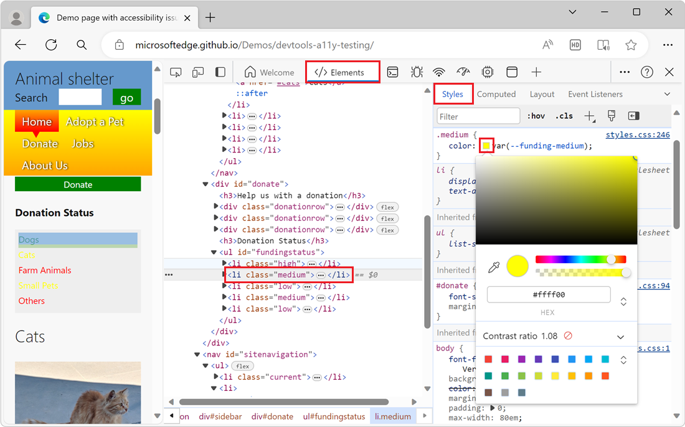
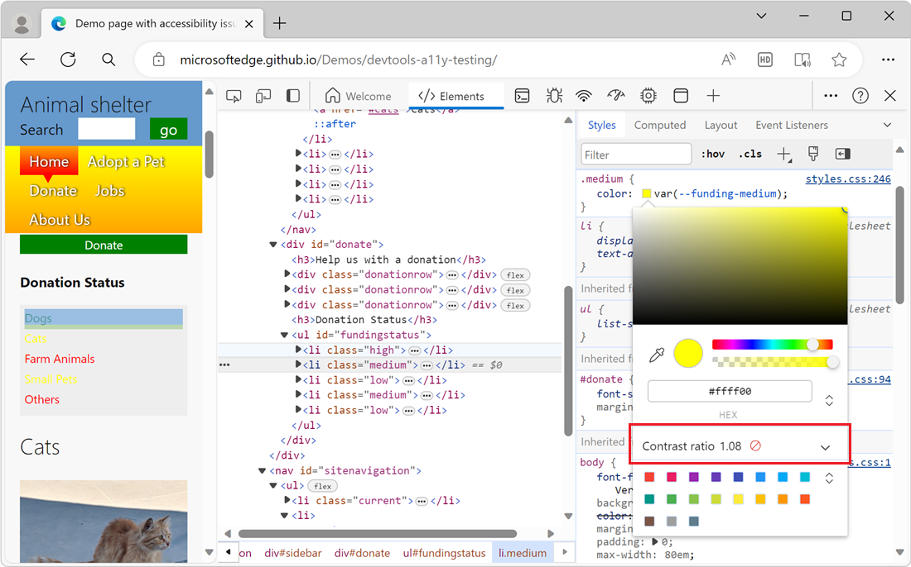
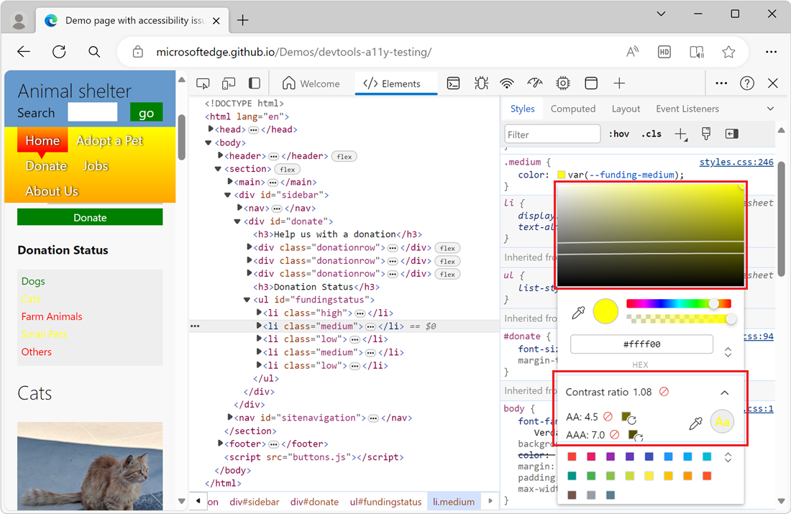

<!-- this article was created on 05/11/2021 by moving a section out from the "Accessibility reference" article (reference.md) -->
<!-- Copyright Kayce Basques

   Licensed under the Apache License, Version 2.0 (the "License");
   you may not use this file except in compliance with the License.
   You may obtain a copy of the License at

       https://www.apache.org/licenses/LICENSE-2.0

   Unless required by applicable law or agreed to in writing, software
   distributed under the License is distributed on an "AS IS" BASIS,
   WITHOUT WARRANTIES OR CONDITIONS OF ANY KIND, either express or implied.
   See the License for the specific language governing permissions and
   limitations under the License.  -->
# Test text-color contrast using the Color Picker

People with low vision might not see areas that are very bright or very dark.  Everything tends to appear at about the same level of brightness, which makes it hard to distinguish outlines and edges.

Contrast ratio measures the difference in brightness between the foreground and background of text.  If your text has a low contrast ratio, then people with low vision might experience your site as a blank screen.

In DevTools, one way to view the contrast ratio of a text element is to use the [Color Picker](../css/reference.md#change-colors-with-the-color-picker), from the **Styles** tab of the **Elements** tool.  The Color Picker helps you verify that your text meets recommended contrast ratio levels.

**To check the text-color contrast using the Color Picker:**

1. In DevTools, open the **Elements** tool.

1. In the **DOM Tree**, select the text element that you want to inspect.

1. On the **Styles** tab, locate the **color** property that's applied to the element, and then click the color square next to the **color** property.

   The Color Picker opens:

   

1. Examine the **Contrast ratio** section of the Color Picker:

   

   The **Contrast ratio** section shows a score for the contrast ratio between the text and the background and an icon that indicates whether the contrast ratio meets recommendations:
   
   * A red crossed-out circle means that the element doesn't meet the [minimum recommendation](https://www.w3.org/WAI/WCAG21/quickref/#contrast-minimum).
   * One check mark means that the element meets the minimum recommendation.
   * Two check marks means that the element meets the [enhanced recommendation](https://www.w3.org/WAI/WCAG21/quickref/#contrast-enhanced).

1. For more information, click the **Contrast ratio** section to expand it:

   

   In the visual picker at the top of the Color Picker, two lines appear, running across the visual picker, along with a circle for the current color.  If the current color meets recommendations, then anything on the same side of the line also meets recommendations.  If the current color doesn't meet recommendations, then anything on the same side also doesn't meet recommendations.

1. To try different colors, click within the visual picker, or select a color swatch at the bottom of the Color Picker.

<!-- ====================================================================== -->
## See also

* [Change colors with the Color Picker](../css/reference.md#change-colors-with-the-color-picker) in _CSS features reference_

<!-- ====================================================================== -->
> [!NOTE]
> Portions of this page are modifications based on work created and [shared by Google](https://developers.google.com/terms/site-policies) and used according to terms described in the [Creative Commons Attribution 4.0 International License](https://creativecommons.org/licenses/by/4.0).
> The original page is found [here](https://developer.chrome.com/docs/devtools/accessibility/reference/) and is authored by [Kayce Basques](https://developers.google.com/web/resources/contributors/kaycebasques) (Technical Writer, Chrome DevTools \& Lighthouse).

This work is licensed under a [Creative Commons Attribution 4.0 International License](https://creativecommons.org/licenses/by/4.0).
