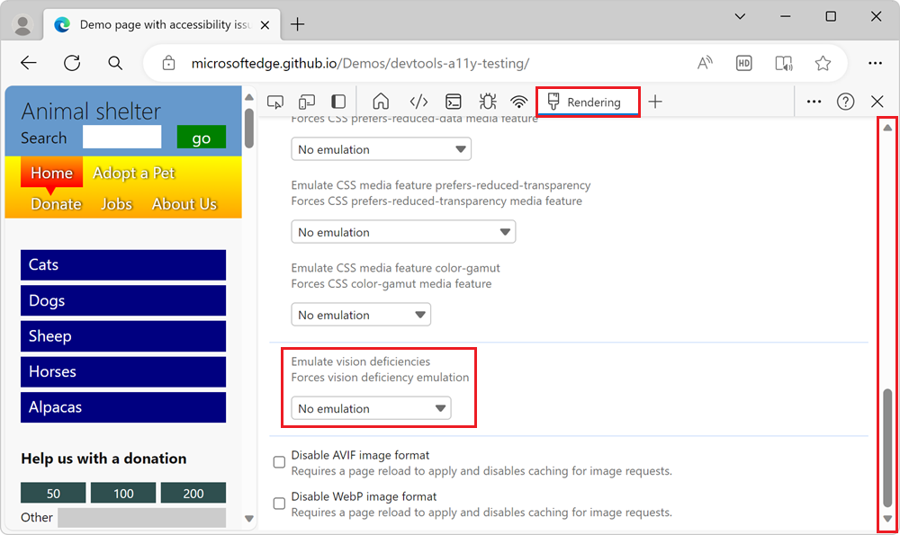
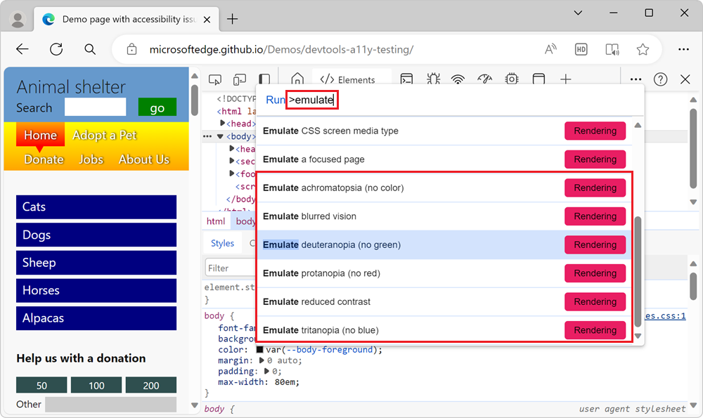

# Emulate vision deficiencies

To better meet the needs of your users with [color vision deficiency](https://www.colourblindawareness.org) (color blindness) or blurred vision, [Microsoft Edge DevTools](../index.md) allows you to simulate blurred vision and specific color vision deficiencies.  The **Emulate vision deficiencies** tool simulates the following categories:

| Color vision deficiency | Details |
|:--- |:--- |
| Blurred vision | The user has difficulty focusing on fine details. |
| Protanopia | The user is unable to perceive any red light. |
| Deuteranopia | The user is unable to perceive any green light. |
| Tritanopia | The user is unable to perceive any blue light. |
| Achromatopsia | The user is unable to perceive any color, which reduces all color to a shade of grey. |

The **Emulate vision deficiencies** tools simulate approximations of how a person with each deficiency may see your product.  Each person is different, therefore vision deficiencies vary in severity from person to person.  To better meet the needs of your users, avoid any color combination that may be an issue.  The **Emulate vision deficiencies** tools don't provide a full accessibility assessment of your product, but provide a good first step to avoid problems.

<!-- ====================================================================== -->
## Open the Rendering tool

To simulate how a person with a vision deficiency would see your web page, open the [Rendering Tools](../rendering-tools/index.md).

1. Click **Customize and control DevTools** (`...`) in the toolbar.

1. Go to **More tools** > **Rendering** to open the **Rendering** panel in the drawer.

   > [!div class="mx-imgBorder"]
   > 

1. Scroll down to the **Emulate vision deficiencies** section, click the **No emulation** dropdown list, and then select an option.

   > [!div class="mx-imgBorder"]
   > 

1. The browser window simulates the selected vision deficiency on the current page.

   > [!div class="mx-imgBorder"]
   > 

<!-- ====================================================================== -->
## Use the Command Menu

As an alternative approach, you can use the **Command Menu** to access the different simulations.

1. Press **Ctrl+Shift+P** (Windows, Linux) or **Command+Shift+P** (macOS) to open the **Command Menu**.

1. Type **emulate**, select the type of vision deficiency you want to simulate, and then press **Enter**.

   > [!div class="mx-imgBorder"]
   > 

<!-- ====================================================================== -->
## See also

*  [Verify that a page is usable with blurred vision](test-blurred-vision.md)
