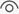
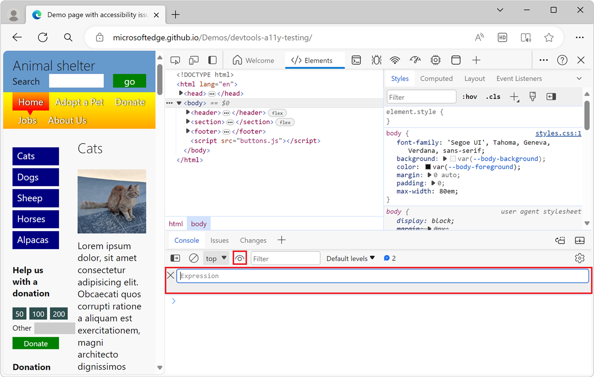

<!-- Copyright Kayce Basques

   Licensed under the Apache License, Version 2.0 (the "License");
   you may not use this file except in compliance with the License.
   You may obtain a copy of the License at

       https://www.apache.org/licenses/LICENSE-2.0

   Unless required by applicable law or agreed to in writing, software
   distributed under the License is distributed on an "AS IS" BASIS,
   WITHOUT WARRANTIES OR CONDITIONS OF ANY KIND, either express or implied.
   See the License for the specific language governing permissions and
   limitations under the License.  -->
# Track which element has focus

Suppose that you're testing the keyboard navigation accessibility of a page.  When you navigate the rendered webpage by pressing **Tab** or **Shift+Tab**, the focus ring indicator in the webpage sometimes disappears, because the element that has focus is hidden.  The solution is to create a Live Expression in the DevTools **Console**, and watch that, and right-click it to expand the DOM tree in the **Elements** tool.

That's how you can determine which item in the page you have navigated to using the **Tab** key, even when the element that has focus is hidden and not displayed on the rendered page.

As you **Tab** through the page, the DOM tree doesn't automatically update to select the corresponding DOM tree node.  But the Live Expression output changes, at least when you go from one kind of page element to another.  To see which exact element the **Tab** key has focused (not just what _kind_ of element), you right-click the result of the Live Expression (below the Live Expression), to go to the particular node of the DOM tree in the **Elements** tool.

## Defining a Live Expression to be able to determine which DOM node has focus

To track the **Tab**-focused element in the **Console** in DevTools by using a Live Expression:

1. Open the [accessibility-testing demo webpage](https://microsoftedge.github.io/Demos/devtools-a11y-testing/) in a new window or tab.

1. Right-click anywhere in the webpage and then select **Inspect**.  Or, press **F12**.  DevTools opens next to the webpage.

1. In DevTools, open the **Console**.

1. Click **Create live expression** ().

   

1. Type the following: **document.activeElement**

1. Click outside of the **Live Expression** UI to save the Live Expression.

1. Click in the rendered webpage to put focus on it, and then press **Tab** or **Shift+Tab** to move focus around in the rendered webpage.

   The value that's displayed below `document.activeElement` is the result of the expression.  As you press **Tab** to move among UI items in the webpage, the `activeElement` value changes when you move to a new type of page element.

   The expression `document.activeElement` is updated live in realtime, so that its output result always represents the currently focused element.  This way, you can keep track of which element has focus, in the DevTools **Console**.  You need to right-click the Live Expression output, as follows:

1. In the DevTools **Console**, hover on the result of the Live Expression (below the `document.activeElement` Live Expression).

   The focused element is highlighted in the viewport (that is, in the rendered webpage).

1. In the DevTools **Console**, right-click the result of the Live Expression (below the `document.activeElement` Live Expression), and then select **Reveal in Elements panel**. 

   In the **Elements** tool, the DOM tree automatically expands and selects the active element (DOM tree node).  The _active element_ is the DOM tree representation of the webpage item that you navigated to by pressing **Tab** or **Shift+Tab**.

   <!-- Another right-click command on the Live Expression result is **Store outerHTML as global variable**, which is different than the command discussed below.  If you select that command, an expandable element such as `<input id="freedonation" class="smallinput">` is output in the **Console**. -->

1. To create a variable reference<!--why do we call it a "variable reference"? is that wording correct? --> to the node that you can use in the **Console**, right-click the Live Expression result and then select **Store outerHTML as global variable**.<!--upstream doc (click "here" below) omits "outerHTML".  which is correct?-->

   In the **Console**, new output is produced, such as `<a href="#alpacas">Alpacas</a>`.

1. Right-click the new output, and then select **Copy** > **Copy element**.<!--correct; do these steps make sense?-->

<!--
how is it "outer HTML"?
what are we supposed to do w/ this "global variable"?
what are we supposed to use this "global variable" for?
why is it called a "global variable"?
what's the name of the global variable?
-->

<!-- ====================================================================== -->
## See also

*  [Analyze the lack of indication of keyboard focus in a sidebar menu](test-analyze-no-focus-indicator.md)

<!-- ====================================================================== -->
> [!NOTE]
> Portions of this page are modifications based on work created and [shared by Google](https://developers.google.com/terms/site-policies) and used according to terms described in the [Creative Commons Attribution 4.0 International License](https://creativecommons.org/licenses/by/4.0).
> The original page is found [here](https://developer.chrome.com/docs/devtools/accessibility/focus/) and is authored by [Kayce Basques](https://developers.google.com/web/resources/contributors/kaycebasques) (Technical Writer, Chrome DevTools & Lighthouse).

This work is licensed under a [Creative Commons Attribution 4.0 International License](https://creativecommons.org/licenses/by/4.0).
