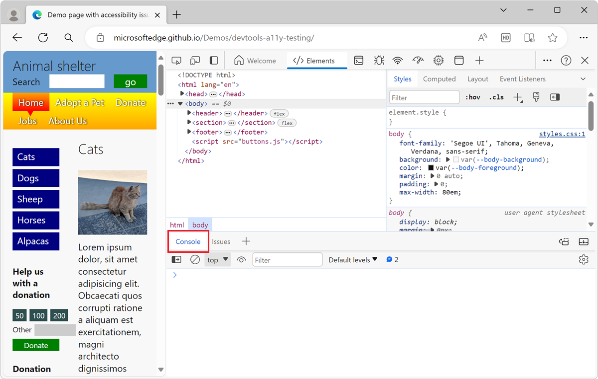
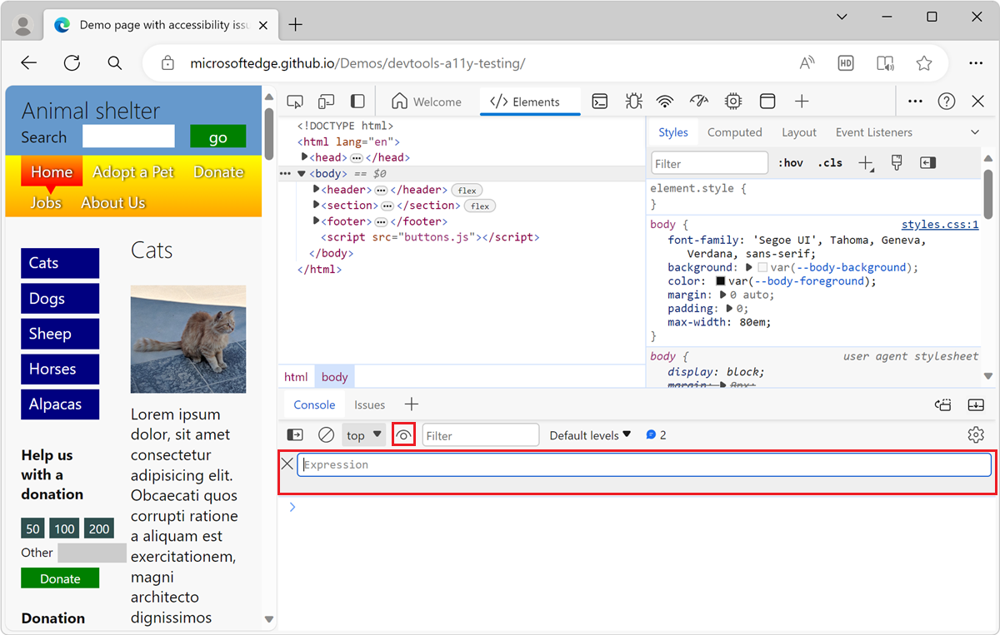
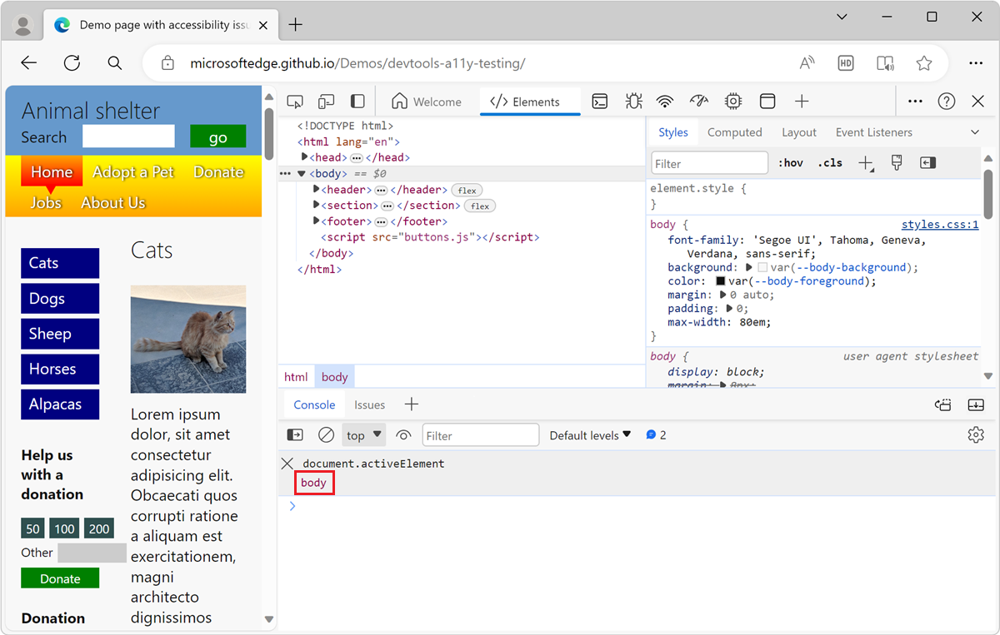
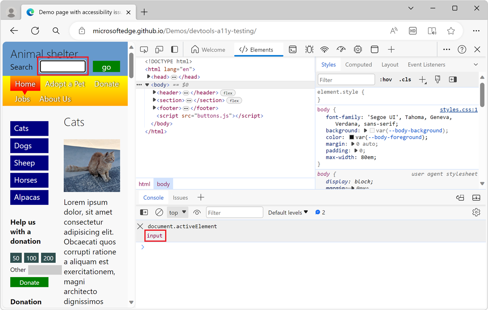
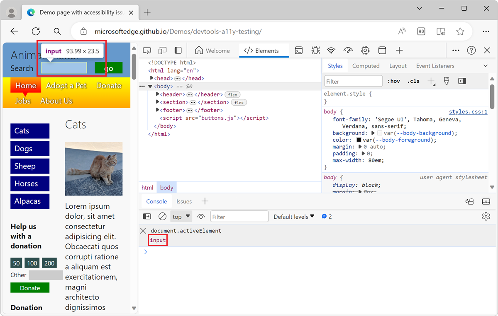
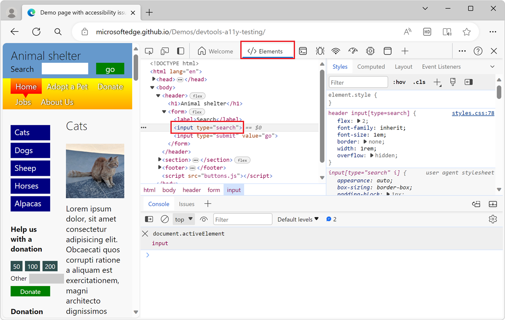
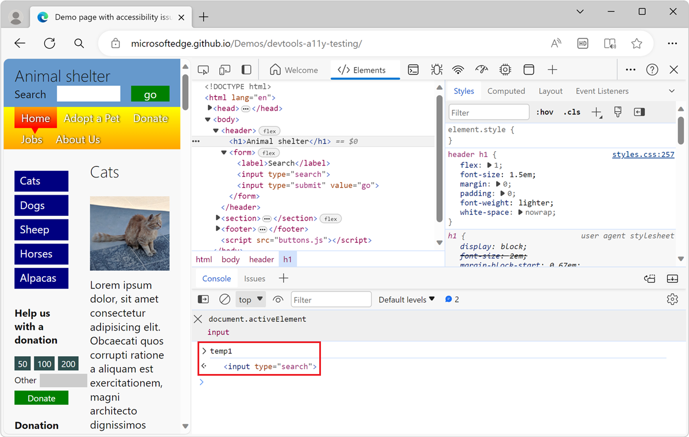
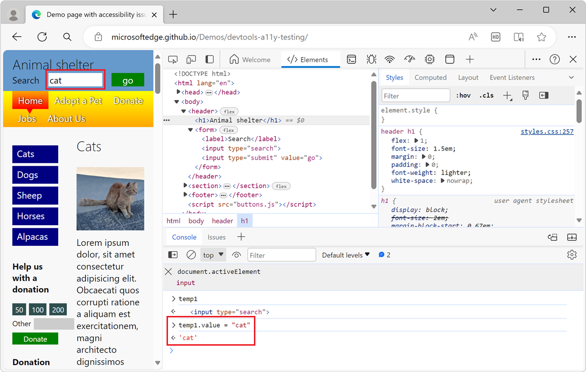

<!-- Copyright Kayce Basques

   Licensed under the Apache License, Version 2.0 (the "License");
   you may not use this file except in compliance with the License.
   You may obtain a copy of the License at

       https://www.apache.org/licenses/LICENSE-2.0

   Unless required by applicable law or agreed to in writing, software
   distributed under the License is distributed on an "AS IS" BASIS,
   WITHOUT WARRANTIES OR CONDITIONS OF ANY KIND, either express or implied.
   See the License for the specific language governing permissions and
   limitations under the License.  -->
# Track which element has focus

To indicate at all times which element has focus, use a Live Expression in the **Console** tool.  This is helpful because when you're testing the keyboard navigation accessibility of a page, when you navigate the rendered webpage by pressing **Tab** or **Shift+Tab**, the focus ring indicator in the webpage sometimes disappears, because the element that has focus is hidden or out of view.

<!-- ====================================================================== -->
## Use a Live Expression to determine which element has focus

To track the **Tab**-focused element in the **Console** in DevTools by using a Live Expression:

1. Open the [accessibility-testing demo webpage](https://microsoftedge.github.io/Demos/devtools-a11y-testing/) in a new window or tab.

1. To open DevTools, right-click the webpage, and then select **Inspect**.  Or, press **Ctrl+Shift+I** (Windows, Linux) or **Command+Option+I** (macOS).  DevTools opens.

1. If the **Quick View** toolbar isn't visible in DevTools, press **Esc** to show the **Quick View** panel.

1. On the **Quick View** toolbar, select the **Console** tab:

   

1. Click the **Create live expression** () button.  The Live Expression section appears:

   

1. In the **Expression** text box, type the following: **document.activeElement**

1. Click outside of the **Expression** text box to save the Live Expression. The Live Expression is evaluated, and the result is displayed below the **Expression** text box:

   

1. Click in the rendered webpage to put focus on it, and then press **Tab** or **Shift+Tab** to move focus around in the rendered webpage.

   The value that's displayed below `document.activeElement` is the result of the expression.  As you press **Tab** to move among elements of the webpage, the `document.activeElement` value changes:

   

The JavaScript code in a Live Expression is evaluated in realtime and the result displayed below the code always represents the current expression value.

The Live Expression value is displayed in the **Console** as a text preview only. DOM nodes are rendered by using their tag names and optional class or ID attributes. For example:

* An anchor element `<a href="#alpacas">Alpacas</a>` is displayed `a#alpacas` in the Live Expression result.
* A text box `<input>` is displayed `input` in the Live Expression result.

To indicate which element has focus in the rendered webpage, use the **Elements** tool as described in the next section.

<!-- ====================================================================== -->
## Open the element with focus in the Elements tool

The result of the `document.activeElement` Live Expression is only a preview of the DOM element that has focus. To know exactly which element has focus in the rendered webpage, use the **Elements** tool:

1. In the **Console** tool, hover over the result of the Live Expression (below the `document.activeElement` Live Expression).

   The focused element is highlighted in the rendered webpage:

   

1. Right-click the result of the Live Expression, and then select **Reveal in Elements panel**. 

   In the **Elements** tool, the DOM tree automatically expands and selects the DOM node that's currently focused:

   

   The _active element_ is the DOM tree representation of the webpage item that you navigated to by pressing **Tab** or **Shift+Tab**.

<!-- ====================================================================== -->
## Create a reference to the focused element in the Console tool

To manipulate the focused element in the **Console** tool, create a reference to it:

1. In the **Console** tool, hover over the result of the Live Expression (below the `document.activeElement` Live Expression).

1. Right-click the result of the Live Expression, and then select **Store outerHTML as global variable**.<!-- the UI string is confusing, it should be "Store as global variable", see https://bugs.chromium.org/p/chromium/issues/detail?id=1507776 -->

   A new variable name such as `temp1` appears in the **Console** tool, and its value is rendered below:

   

1. Use the element in the **Console** tool as necessary by using the `temp1` variable.  For example, run `temp1.value = "cat"` to change the value of the focused element to "cat":

   

<!-- ====================================================================== -->
## See also

*  [Analyze the lack of indication of keyboard focus](test-analyze-no-focus-indicator.md)

<!-- ====================================================================== -->
> [!NOTE]
> Portions of this page are modifications based on work created and [shared by Google](https://developers.google.com/terms/site-policies) and used according to terms described in the [Creative Commons Attribution 4.0 International License](https://creativecommons.org/licenses/by/4.0).
> The original page is found [here](https://developer.chrome.com/docs/devtools/accessibility/focus/) and is authored by [Kayce Basques](https://developers.google.com/web/resources/contributors/kaycebasques) (Technical Writer, Chrome DevTools & Lighthouse).

This work is licensed under a [Creative Commons Attribution 4.0 International License](https://creativecommons.org/licenses/by/4.0).
