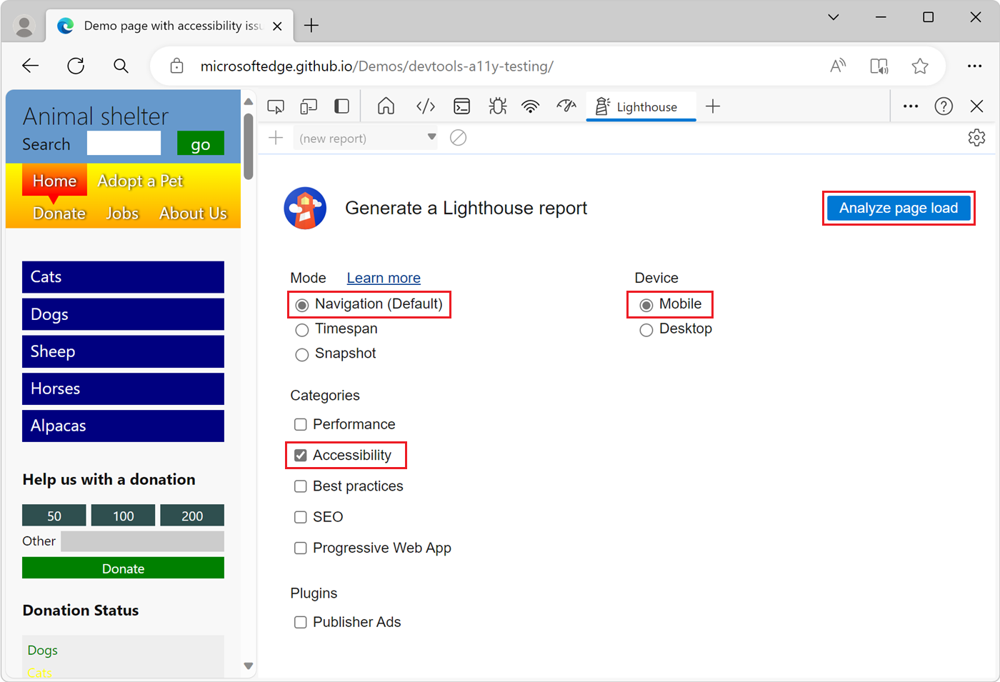

<!-- this article was created on 05/11/2021 by moving a section out from the "Accessibility reference" article (reference.md) -->
<!-- Copyright Kayce Basques

   Licensed under the Apache License, Version 2.0 (the "License");
   you may not use this file except in compliance with the License.
   You may obtain a copy of the License at

       https://www.apache.org/licenses/LICENSE-2.0

   Unless required by applicable law or agreed to in writing, software
   distributed under the License is distributed on an "AS IS" BASIS,
   WITHOUT WARRANTIES OR CONDITIONS OF ANY KIND, either express or implied.
   See the License for the specific language governing permissions and
   limitations under the License.  -->
# Test accessibility using Lighthouse

You can use Lighthouse from within DevTools to audit the accessibility of a page and generate a report. You can use the Lighthouse tool to determine:

*  Whether a page is properly marked up for screen readers.

*  Whether the text elements on a page have sufficient contrast ratios using the Color Picker. See [Test text-color contrast using the Color Picker](color-picker.md).

The **Lighthouse** tool provides links to content hosted on third-party websites.  Microsoft is not responsible for and has no control over the content of these sites and any data that may be collected.

To audit a page using the Lighthouse tool:

1. Go to the URL that you want to audit.

1. To open DevTools, right-click the webpage, and then select **Inspect**.  Or, press **Ctrl+Shift+I** (Windows, Linux) or **Command+Option+I** (macOS).  DevTools opens.

1. In DevTools, on the **Activity Bar**, select the **Lighthouse** tab.  If that tab isn't visible, click the **More tools** () button.

   The **Lighthouse** tool configuration options are displayed:

   

1. Set the following configuration options:

   * For **Mode**, select **Navigation**.
   * For **Device**, select **Mobile** if you want to simulate a mobile device.  This option changes your user agent string and resizes the viewport.  This option can affect the audit results.
   * In the **Categories** section, select **Accessibility**, and clear the other categories:

   

1. Click the **Analyze page load** button.

   Lighthouse analyzes the page, and then DevTools displays a report.  The report shows a score for the page's accessibility, out of 100.  The report also gives tips on how to improve the accessibility of the page:

   

1. Select an item in the report.  The item is expanded to show more information:

   

1. Click the **Learn ...** link.  Documentation about the issue is displayed:

   

1. To return to the configuration options, in DevTools, click **Perform an audit** (`+`).

<!-- ====================================================================== -->
> [!NOTE]
> Portions of this page are modifications based on work created and [shared by Google](https://developers.google.com/terms/site-policies) and used according to terms described in the [Creative Commons Attribution 4.0 International License](https://creativecommons.org/licenses/by/4.0).
> The original page is found [here](https://developer.chrome.com/docs/devtools/accessibility/reference/) and is authored by [Kayce Basques](https://developers.google.com/web/resources/contributors/kaycebasques) (Technical Writer, Chrome DevTools \& Lighthouse).

This work is licensed under a [Creative Commons Attribution 4.0 International License](https://creativecommons.org/licenses/by/4.0).
