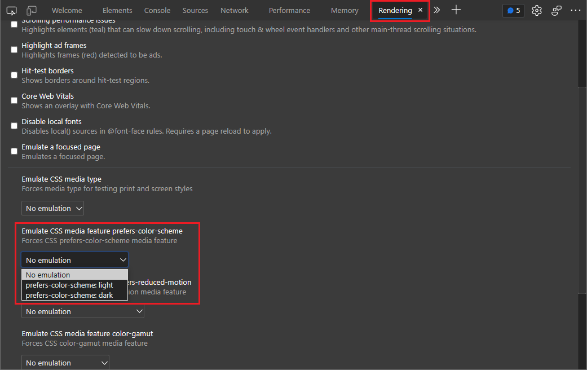
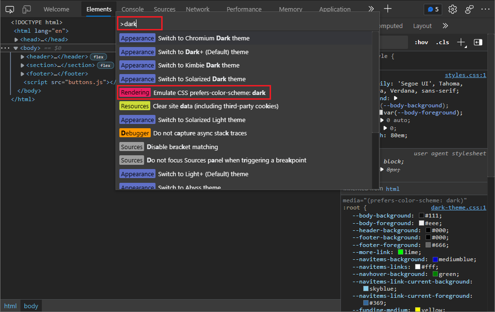

# Emulate dark or light schemes in the rendered page

Use the **Rendering** tool to see what your webpage looks like with different display options or vision deficiencies.

Many operating systems have a way to display any application in darker or lighter colors.  Having a website that has a light scheme in a dark-mode operating system can be hard to read and can be an accessibility issue for some users.

To test how a webpage will render when the user has selected dark or light mode, instead of changing your own machine's dark-mode or light-mode setting, you can select **Emulate CSS prefers-color-scheme: dark** or **light** in Microsoft Edge DevTools.  You can do this from the **Rendering** tool or from the **Command Menu**, as described below.

Alternatively, you can make your webpage automatically select dark or light mode based on your own preferred settings on your machine, by selecting **No emulation**, which is the default.

To specify the CSS to use for both light and dark schemes, use the [prefers-color-scheme](https://developer.mozilla.org/docs/Web/CSS/@media/prefers-color-scheme) CSS media query to detect whether the user prefers to display your product in a dark or light color scheme, and then automatically select your own custom light- or dark-mode CSS.  Example CSS code is shown in [Check for contrast issues with dark theme and light theme](test-dark-mode.md).

This article is about changing the appearance of the webpage under development.  To instead change how DevTools appears, see [Apply color themes to DevTools](../customize/theme.md).

<!-- ====================================================================== -->
## Emulating dark or light mode using the Rendering tool

1. In DevTools, open the **Rendering** tool.  To do this, click the **More Tools** (+) icon on the main toolbar or on the Drawer, and then select **Rendering**.

   Or, if the Rendering tool is already open, but is hidden, click the **More tabs** (>>) icon on the toolbar, and then select **Rendering**.

1. In the **Emulate CSS media feature prefers-color-scheme** dropdown list, select **prefers-color-scheme: dark** or **prefers-color-scheme: light**.

   

1. Refresh the page to display the rendered result.

   Now you can modify your CSS and view the rendered result the same way as for any other web page.  See [Get started viewing and changing CSS](../css/index.md).

1. To restore the setting, in the **Rendering** tool, in the **Emulate CSS media feature prefers-color-scheme** dropdown list, select **No emulation**.  When you refresh the page, your own operating system or browser setting for light or dark mode preference will be applied.

<!-- ====================================================================== -->
## Emulating dark or light mode using the Command Menu

1. When DevTools has focus, open the **Command Menu** by selecting **Ctrl+Shift+P** (Windows, Linux) or **Command+Shift+P** (macOS).

1. Type **dark**, **light**, or **emulate**, select **Rendering: Emulate CSS prefers-color-scheme: dark** or **Rendering: Emulate CSS prefers-color-scheme: light**, and then press **Enter**.

   

   Select a **Rendering** command rather than an **Appearance** command.  The **Rendering** commands affect the rendered webpage under development.  The **Appearance** commands instead affect the DevTools part of the window.

1. Refresh the page to display the rendered result.

   Now you can modify your CSS and view the rendered result the same way as for any other web page.  See [Get started viewing and changing CSS](../css/index.md).

1. To restore the setting, in the Command Menu, type **emulate** or **scheme** and then select **Rendering: Do not emulate CSS prefers-color-scheme**.  When you refresh the page, your own operating system or browser setting for light or dark mode preference will be applied.

<!-- ====================================================================== -->
## See also

* [Analyze rendering performance with the Rendering tool](../evaluate-performance/reference.md#analyze-rendering-performance-with-the-rendering-tool) in _Performance features reference_

The Rendering tool is also used for the following:

* [Check for contrast issues with dark theme and light theme](test-dark-mode.md)
* [Verify that a page is usable by people with color blindness](test-color-blindness.md)
* [Verify that a page is usable with blurred vision](test-blurred-vision.md)
* [Verify that a page is usable with UI animation turned off](test-reduced-ui-motion.md)
* [Emulate vision deficiencies](emulate-vision-deficiencies.md)
* [Simulate reduced motion](reduced-motion-simulation.md)
