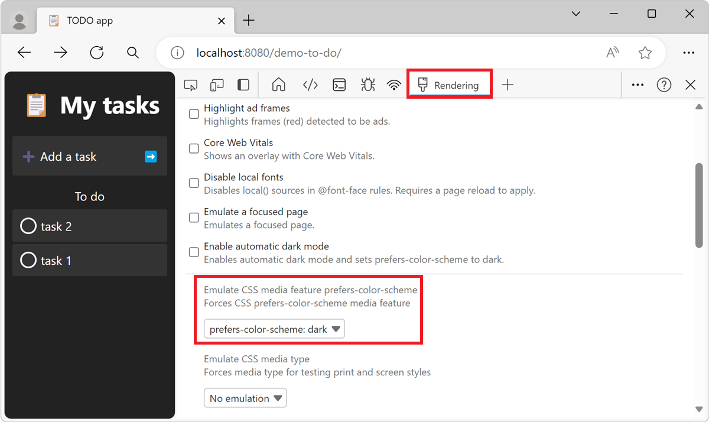
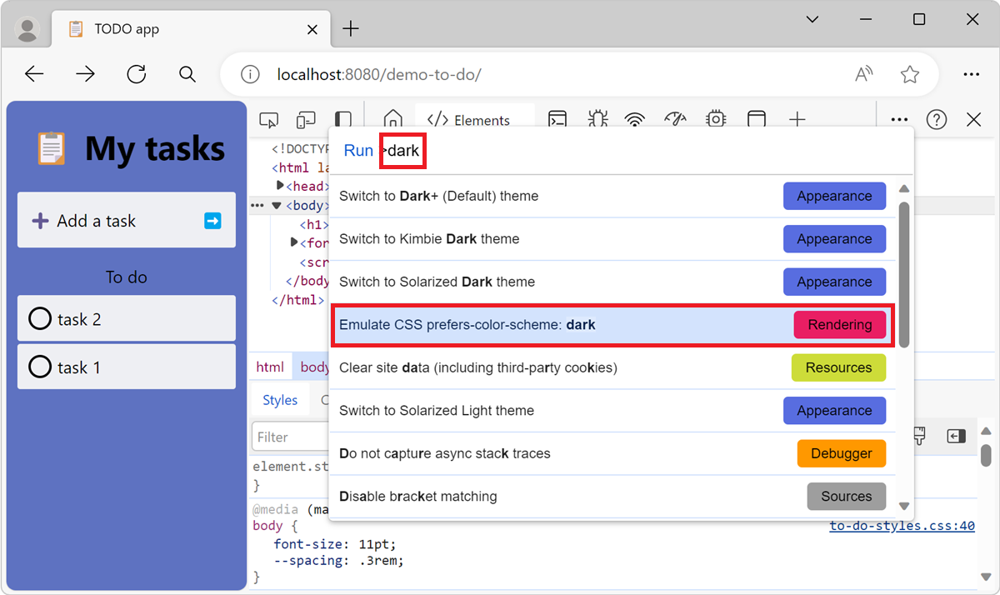

# Emulate dark or light schemes in the rendered page

Use the **Rendering** tool to see what your webpage looks like with different display options or vision deficiencies.

Many operating systems have a way to display any application in darker or lighter colors.  Having a website that has a light scheme in a dark-mode operating system can be hard to read and can be an accessibility issue for some users.

To test how a webpage will render when the user has selected dark or light mode, instead of changing your own machine's dark-mode or light-mode setting, you can select **Emulate CSS prefers-color-scheme: dark** or **light** in Microsoft Edge DevTools.  Or, you can make your webpage automatically select dark or light mode based on your own preferred settings on your machine, by selecting **No emulation**, which is the default. 

You can select these settings from the **Rendering** tool or from the **Command Menu**, as described below.

To specify the CSS to use for both light and dark schemes, use the [prefers-color-scheme](https://developer.mozilla.org/docs/Web/CSS/@media/prefers-color-scheme) CSS media query to detect whether the user prefers to display your product in a dark or light color scheme, and then automatically select your own custom light- or dark-mode CSS.  Example CSS code is shown in [Check for contrast issues with dark theme and light theme](test-dark-mode.md).

This article is about changing the appearance of the webpage under development.  To instead change how DevTools appears, see [Apply color themes to DevTools](../customize/theme.md).

<!-- ====================================================================== -->
## Emulating dark or light mode using the Rendering tool

1. To open DevTools, right-click the webpage, and then select **Inspect**.  Or, press **Ctrl+Shift+I** (Windows, Linux) or **Command+Option+I** (macOS).  DevTools opens.

1. In DevTools, on the **Activity Bar** or on the **Quick View**, select the **Rendering** tab.  If that tab isn't visible, click the **More tools** () button.

1. In the **Emulate CSS media feature prefers-color-scheme** dropdown list, select **prefers-color-scheme: dark** or **prefers-color-scheme: light**:

   

   The rendered webpage renders as if the user had selected dark or light mode in their operating system. The webpage uses the CSS that you have specified for that mode.

1. Modify your CSS and view the rendered result the same way as for any other webpage.  See [Get started viewing and changing CSS](../css/index.md).

1. To restore the setting, in the **Rendering** tool, in the **Emulate CSS media feature prefers-color-scheme** dropdown list, select **No emulation**. Your own operating system's setting for light or dark mode is applied.

<!-- ====================================================================== -->
## Emulating dark or light mode using the Command Menu

1. When DevTools has focus, open the **Command Menu** by selecting **Ctrl+Shift+P** (Windows, Linux) or **Command+Shift+P** (macOS).

1. Type **dark**, **light**, or **emulate**, select **Emulate CSS prefers-color-scheme: dark** or **Emulate CSS prefers-color-scheme: light**, and then press **Enter**:

   

   The rendered webpage renders as if the user had selected dark or light mode in their operating system. The webpage uses the CSS that you have specified for that mode.

   Select a **Rendering** command rather than an **Appearance** command.  The **Rendering** commands affect the rendered webpage under development.  The **Appearance** commands instead affect the DevTools part of the window.

1. Modify your CSS and view the rendered result the same way as for any other webpage.  See [Get started viewing and changing CSS](../css/index.md).

1. To restore the setting, in the Command Menu, type **emulate** or **scheme** and then select **Do not emulate CSS prefers-color-scheme**. Your own operating system's setting for light or dark mode is applied.

<!-- ====================================================================== -->
## See also

* [Analyze rendering performance with the Rendering tool](../evaluate-performance/reference.md#analyze-rendering-performance-with-the-rendering-tool) in _Performance features reference_.

The **Rendering** tool is also used for the following tasks:

* [Check for contrast issues with dark theme and light theme](test-dark-mode.md)
* [Verify that a page is usable by people with color blindness](test-color-blindness.md)
* [Verify that a page is usable with blurred vision](test-blurred-vision.md)
* [Verify that a page is usable with UI animation turned off](test-reduced-ui-motion.md)
* [Emulate vision deficiencies](emulate-vision-deficiencies.md)
* [Simulate reduced motion](reduced-motion-simulation.md)
