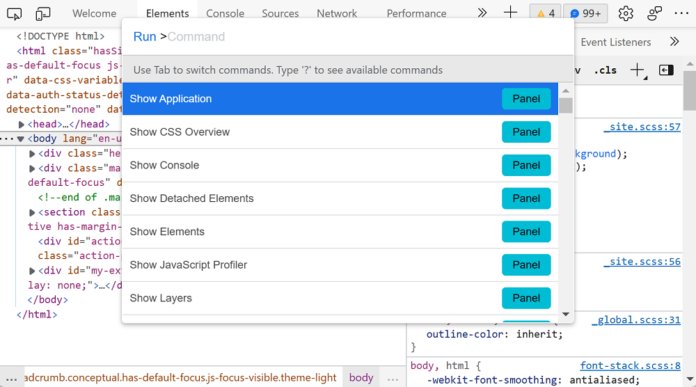
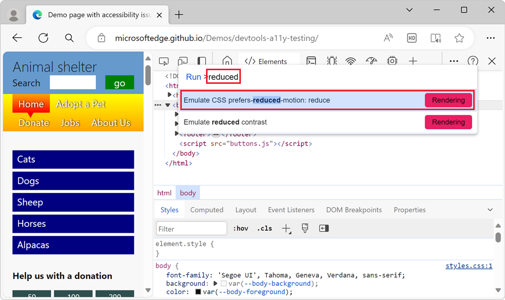

# Simulate reduced motion

CSS animation can be an accessibility problem.  Operating systems deal with this problem by including an option to turn off animations to avoid user confusion and potential health-related problems, such as triggering seizures.

On a webpage, you can use the [prefers-reduced-motion](https://developer.mozilla.org/docs/Web/CSS/@media/prefers-reduced-motion) CSS media query to detect whether the user prefers to display any animations.  Then wrap your animation code in a test, to conditionally run animations.

```css
@media (prefers-reduced-motion: reduce) {
  /* in case the .header element has an animation, turn it off */
  .header {
    animation: none;
  }
}
```

Then test your code, as follows.

To simulate the operating system's reduced motion setting, without having to change your operating system setting:

1. Press **Ctrl+Shift+P** on Windows/Linux or **Command+Shift+P** on macOS to open the **Command Menu**.
    
    > [!div class="mx-imgBorder"]
    > 

1. Type **reduced**, to turn the simulation on or off.  Select the **Emulate CSS prefers-reduced-motion** option, and then press **Enter**.

    > [!div class="mx-imgBorder"]
    > 

1. Refresh the webpage and check whether your animations run.


<!-- ====================================================================== -->
## See also

*  [Verify that the page is usable with UI animation turned off](test-reduced-ui-motion.md) - A walkthrough using a demo page, with explanations.
