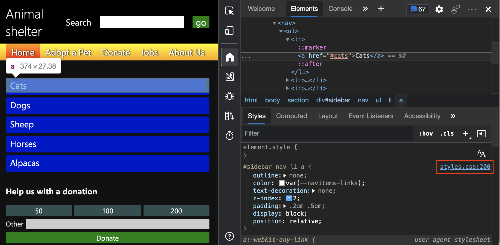

# Analyze the lack of indication of keyboard focus in a sidebar menu

<!-- Inspect tool, and CSS rules: pseudo-classes for states -->

In the accessibility-testing demo page, the sidebar navigation menu with blue links doesn't visually indicate which link has focus, when using a keyboard.  To find out why the sidebar menu is confusing to keyboard users, we'll look for CSS pseudo-class rules for the `hover` and `focus` states, along with the CSS property for link outlines.

This analysis finds that the lack of indication of keyboard focus in the links of the page's sidebar navigation menu is because:
*  The `a` links have a CSS property setting of `outline: none`.
*  The `a` links lack a CSS pseudo-class rule for the `:focus` state.

To navigate to the CSS, we'll use the **Inspect** tool to highlight a blue link on the page's sidebar navigation menu, and then view the DOM tree and CSS for the `a` element that defines that link.

1. Open the [accessibility-testing demo webpage](https://microsoftedge.github.io/Demos/devtools-a11y-testing/) in a new window or tab.

1. Right-click anywhere in the webpage and then select **Inspect**.  Or, press **F12**.  DevTools opens next to the webpage.

1. Click the **Inspect** () button in the top-left corner of DevTools so that the button is highlighted (blue).

1. Hover over the blue **Cats** link in the page's sidebar navigation menu.  The Inspect overlay appears, showing that the `a` element is keyboard-focusable.  But the overlay doesn't show that there's no visual indication when the link has focus.

   Next, we'll inspect the CSS styling of this link.

1. Click the **Cats** link in the sidebar navigation menu.  The **Inspect** tool turns off, and the **Elements** tool opens, highlighting the `a` node in the DOM tree.

1. In DevTools, select the **Styles** tab.  The CSS rule `#sidebar nav li a` appears, along with a link to a line number in `styles.css`.

   

1. Click the `styles.css` link.  The CSS file opens within the **Sources** tool.

   

   The styles of the page have a CSS pseudo-class rule for the `hover` state that indicates which menu item you're on when you use a mouse: `#sidebar nav li a:hover`.  However, there is no CSS pseudo-class rule for the `focus` state to visually indicate which menu item you're on when you use a keyboard, such as `#sidebar nav li a:focus`.

   Also, notice that the links have a CSS property setting of `outline: none`.  This is a common practice, to remove the outline which browsers automatically add to elements when you focus on them using a keyboard.  Not using `focus` styling causes confusion for your users.

<!-- ====================================================================== -->
## See also

*  [Track which element has focus](focus.md)
*  [Overview of accessibility testing using DevTools](accessibility-testing-in-devtools.md)
