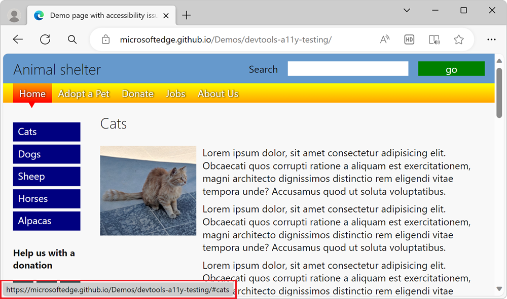
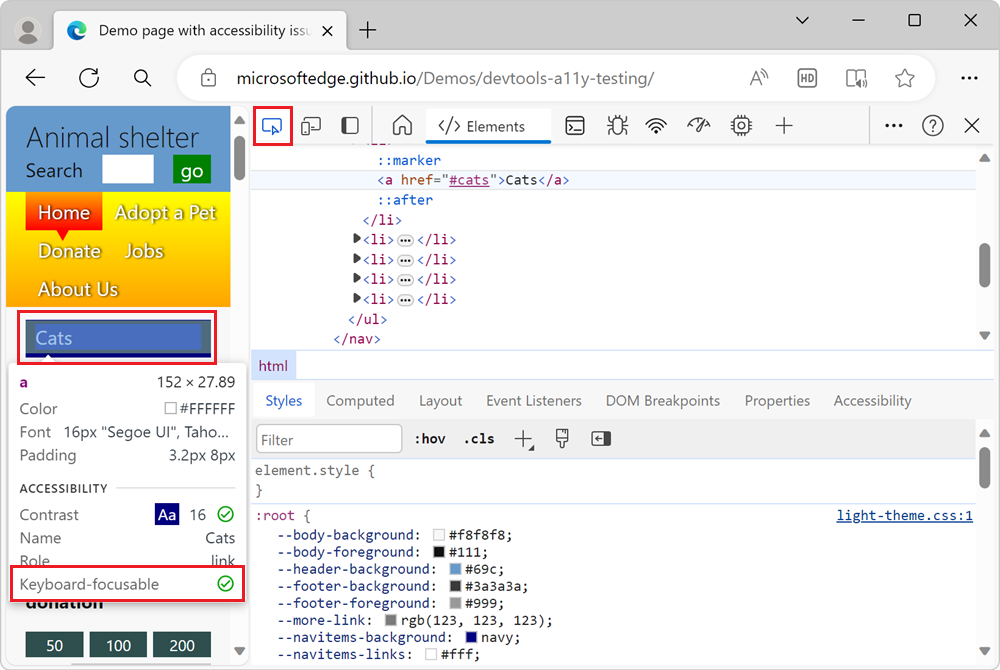
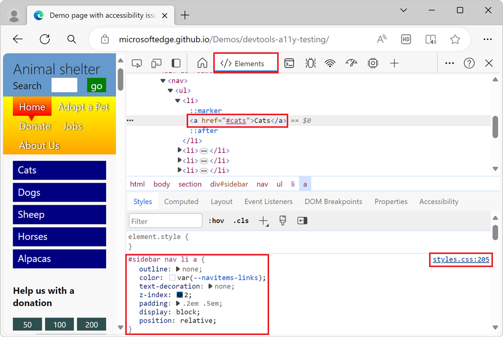
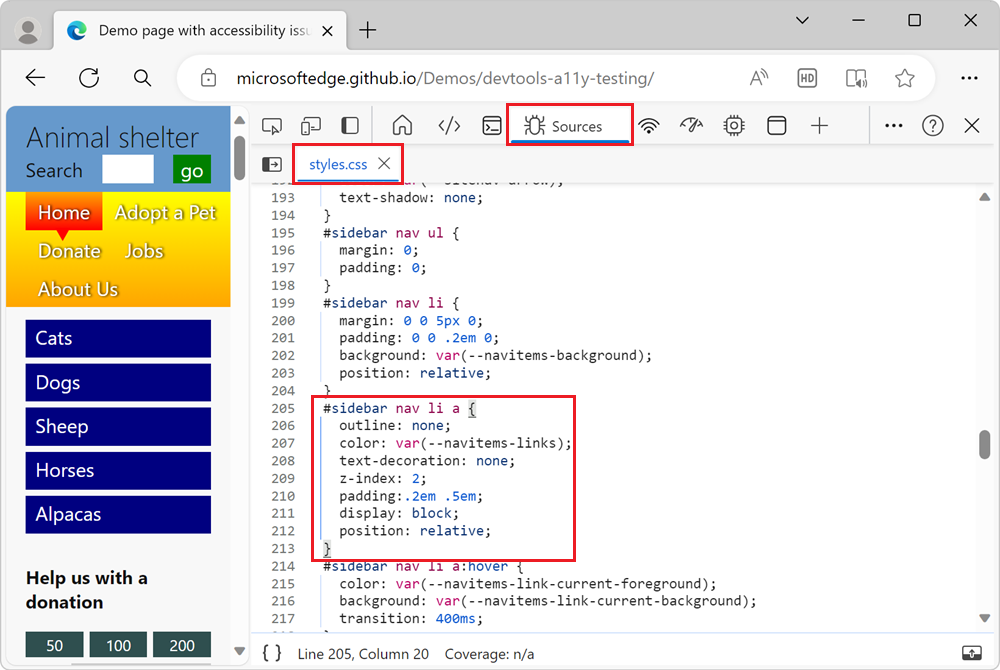
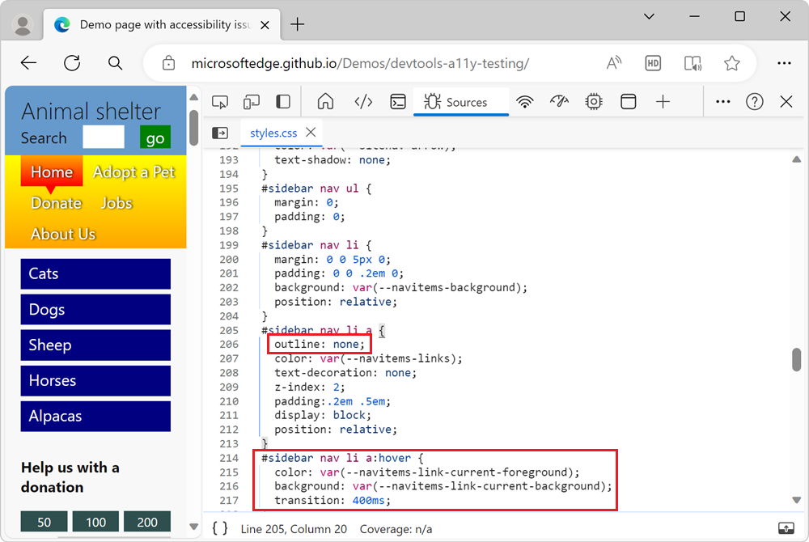
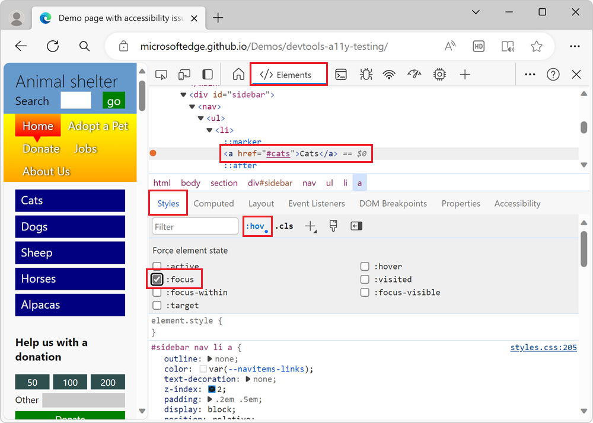

# Analyze the lack of indication of keyboard focus

<!-- Inspect tool, and CSS rules: pseudo-classes for states -->

Keyboard users need to know where they are on a webpage.  When a keyboard user tabs to a link or a button, the link or button should have a visual indication that it has focus.  This visual indication is usually an outline around the focused element.

In the [accessibility-testing demo webpage](https://microsoftedge.github.io/Demos/devtools-a11y-testing/), the sidebar navigation menu with blue links doesn't visually indicate which link has focus, when using a keyboard.  To find out why the lack of visual keyboard focus indication is confusing, try to tab to the blue links on the demo page.  The blue **Cats** button has focus, as evidenced by the target link information that's displayed in the bottom left corner of the browser window, but there's no visual indication that focus is on that button:

<!-- ====================================================================== -->
## Analyze the lack of focus indication by using the Sources tool

To see what CSS styles are applied to a link, such as a linked button, use the **Sources** tool:

1. Open the [accessibility-testing demo webpage](https://microsoftedge.github.io/Demos/devtools-a11y-testing/) in a new window or tab.

1. Right-click anywhere in the webpage, and then select **Inspect**.  Or, press **F12**.  DevTools opens next to the webpage.

1. Click the **Inspect** () button in the top-left corner of DevTools so that the button is highlighted (blue).

1. Hover over the blue **Cats** button in the page's sidebar navigation menu.  The Inspect overlay appears, and indicates that the `a` element is **Keyboard-focusable**:

   

   But the Inspect overlay doesn't show that the element lacks a visual indication when the link has focus.

1. In the rendered webpage, click the **Cats** button.

   The **Inspect** tool turns off, and the **Elements** tool opens, highlighting the `a` node in the DOM tree. The CSS rule `#sidebar nav li a` appears in the **Styles** tab, along with a link to a line number in `styles.css`:

   

1. Click the `styles.css` link.  The CSS file opens within the **Sources** tool:

   

   Notice that the `#sidebar nav li a` CSS rule has a CSS property setting of `outline: none`, which removes the outline that browsers automatically add when you focus links using a keyboard.

   The CSS file contains a CSS rule that uses the `:hover` pseudo-class, which is used to indicate which menu item you're on when you use a mouse: `#sidebar nav li a:hover`.  However, the CSS file doesn't contain a CSS rule that uses the `:focus` pseudo-class, such as `#sidebar nav li a:focus`. This means that there is no CSS styles used to visually indicate which menu item you're on when you use a keyboard.

   

<!-- ====================================================================== -->
## Simulate the focus state by using the Styles pane

Instead of focusing the link by using a keyboard, you can simulate the focus state by using the **Styles** pane:

1. Open the [accessibility-testing demo webpage](https://microsoftedge.github.io/Demos/devtools-a11y-testing/) in a new window or tab.

1. Right-click anywhere in the webpage, and then select **Inspect**.

1. Click the **Inspect** () button in the top-left corner of DevTools, and then click the **Cats** link in the rendered webpage. The `<a href="#cats">Cats</a>` node is highlighted in the **Elements** tool.

1. In the **Styles** pane, click the **Toggle element state** (`:hov`) button. The **Force element state** section appears.

1. Select the `:focus` checkbox. The focus state is applied to the link, but the link doesn't have a visual indication of focus:

   

<!-- ====================================================================== -->
## See also

*  [Track which element has focus](./focus.md)
