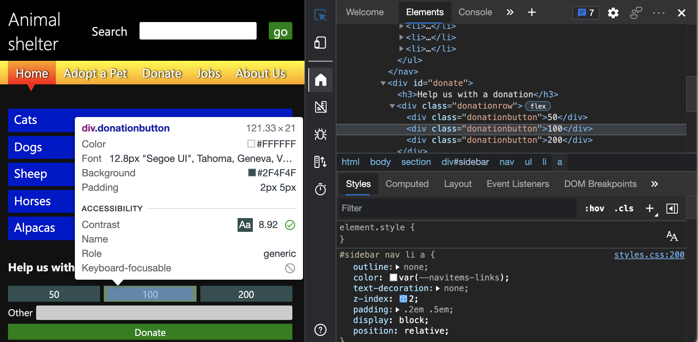
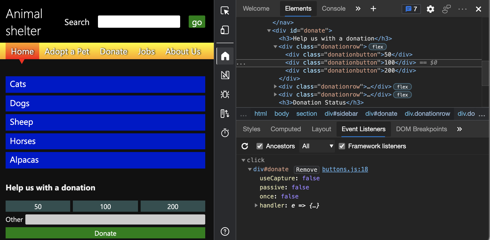
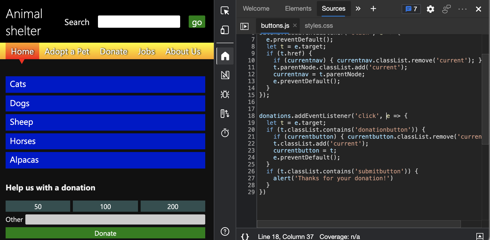

# Analyze keyboard support on forms

This article uses the **Inspect** tool and **Event Listeners** tab to analyze the lack of keyboard support on a demo page which has buttons that use the `div` element.

On the **Donate** form, the amount buttons and **Donate** button doesn't work with a keyboard.  Debugging the donation form requires understanding why the lack of focus styling isn't flagged as a problem with automatic testing tools like the **Issues** tool.  In this example, the buttons are implemented using `div` elements, which aren't recognized by these tools as a control on a form.

To use the Inspect tool and Event Listeners tab to analyze the lack of keyboard support on the demo page:

<!-- 1. Inspect tool: Accessibility section: keyboard-focusable row -->

1. Open the [accessibility-testing demo webpage](https://microsoftedge.github.io/Demos/devtools-a11y-testing/) in a new window or tab.

1. Right-click anywhere in the webpage and then select **Inspect**.  Or, press `F12`.  DevTools opens next to the webpage.

1. Click the **Inspect** () button in the top-left corner of DevTools so that the button is highlighted (blue).

1. Hover over the **50**, **100**, and **200** donation buttons.  The Inspect tool appears on the webpage, as an overlay.  The **keyboard-focusable** row of the Inspect overlay shows that none of the donation amount buttons are keyboard-accessible, as indicated by a gray circle with diagonal line.  The buttons have no name, and have a role of `generic` because they are `div` elements, which means that the buttons aren't accessible to assistive technology.

   

1. When the **Inspect** tool is active, on the webpage, select the **Other** input text box, above the **Donate** button.  The **Elements** tool opens, showing the DOM tree for the webpage.  The element `<input id="freedonation" class="smallinput">` is selected.

   ```html
   <div class="donationrow">
       <div class="donationbutton">50</div>
       <div class="donationbutton">100</div>
       <div class="donationbutton">200</div>
   </div>
   <div class="donationrow">
       <label for="freedonation">Other</label>
       <input id="freedonation" class="smallinput">
   </div>
   <div class="donationrow">
       <div class="submitbutton">Donate</div>
   </div>
   ```

   The use of the `label` and `input` elements on the **Other** text box is valid, which means that the **Other** label is correctly linked with the input text box.  The `input` text box is also keyboard-accessible.  The rest of the form's markup are `div` elements, which are easy to style, but have no semantic meaning.

   <!-- 2. Elements tool: Event Listeners tab -->

   The form's functionality is created with JavaScript, and you can test this by checking the **Event Listeners** tab, as follows.

1. With the element `<input id="freedonation" class="smallinput">` still selected in the DOM tree, select the **Event Listeners** tab to the right of the **Styles** tab, and then expand the `click` event listener.

   

1. Select the `buttons.js:18` link.  The **Sources** tool opens, showing the applied JavaScript.

   

   Here's a code listing of the applied JavaScript:

    ```javascript
    donations.addEventListener('click', e => {
      let t = e.target;
      if (t.classList.contains('donationbutton')) {
        if (currentbutton) { currentbutton.classList.remove('current'); }
        t.classList.add('current');
        currentbutton = t;
        e.preventDefault();
      }
      if (t.classList.contains('submitbutton')) {
        alert('Thanks for your donation!')
      }
    })
    ```
    
   Using a `click` event to read the buttons is good practice, because a `click` event fires both on mouse pointer and keyboard interaction.  However, because a `div` element isn't keyboard-accessible, and this **Donate** button is implemented as a `div` element (`<div class="submitbutton">Donate</div>`), this JavaScript functionality never runs unless you use a mouse or another source of a `click` event, such as a special button available on some keyboards.

This is a classic example where JavaScript was added to create functionality that `button` elements provide natively.  Simulating the functionality of buttons with `div` elements ended up producing an inaccessible experience.


<!-- ====================================================================== -->
## See also

*  [Overview of accessibility testing using DevTools](accessibility-testing-in-devtools.md)
