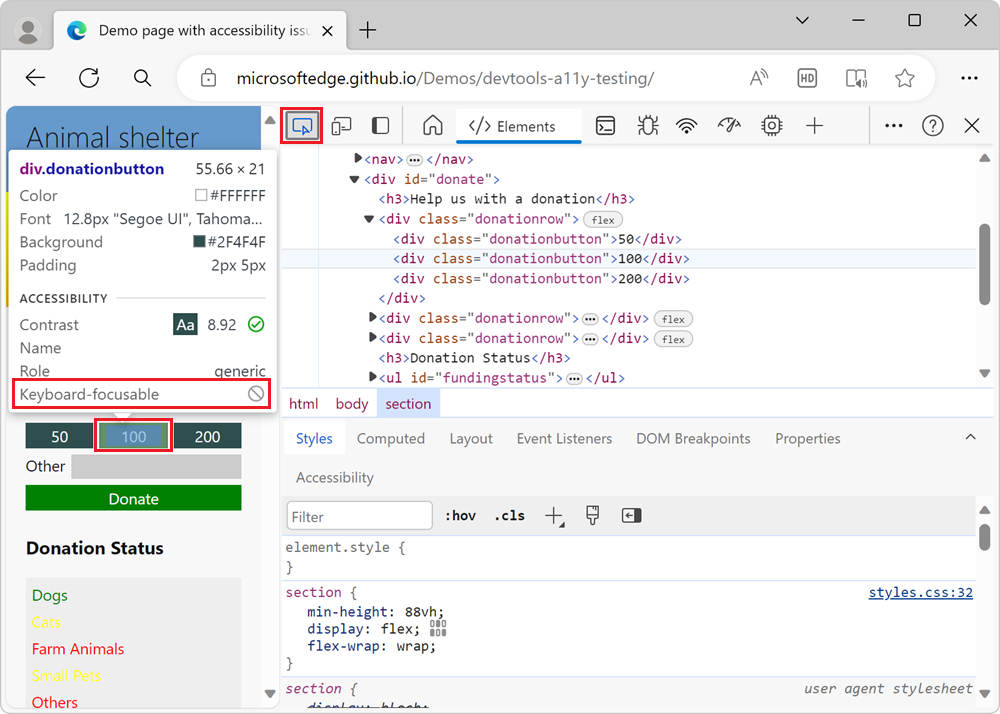
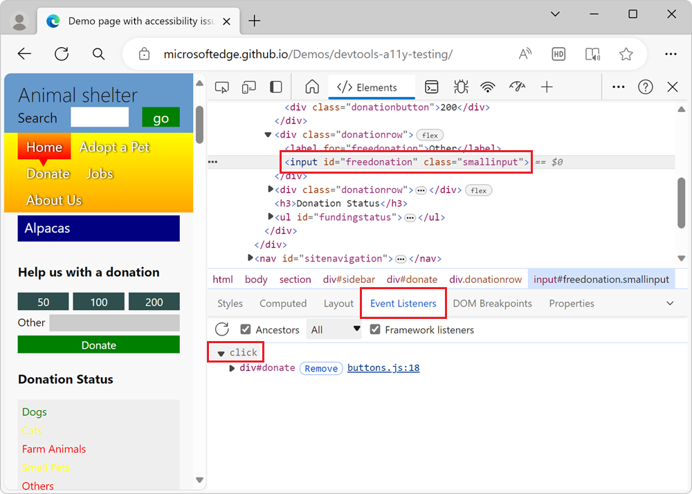
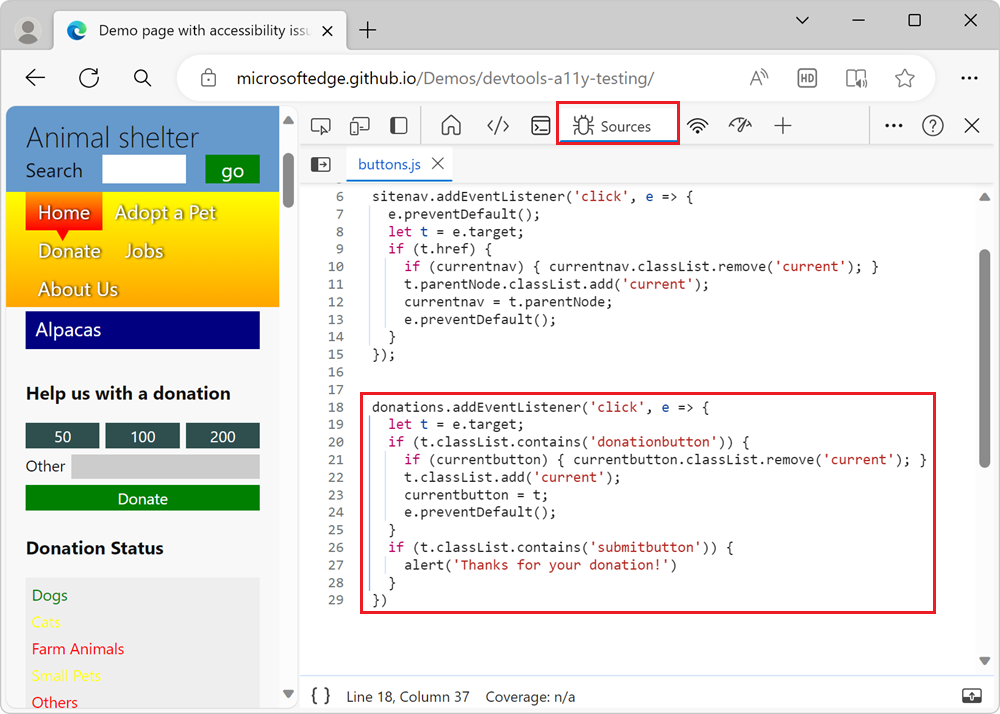

# Analyze keyboard support on forms

This article uses the **Inspect** tool and **Event Listeners** tab to analyze the lack of keyboard support on a demo page which has buttons that use the `<div>` element.

In the [accessibility-testing demo webpage](https://microsoftedge.github.io/Demos/devtools-a11y-testing/), in the **Donate** form, the amount buttons and **Donate** button are not accessible with a keyboard.  To test this:

1. Open the [accessibility-testing demo webpage](https://microsoftedge.github.io/Demos/devtools-a11y-testing/) in a new window or tab.

1. In the **Help us with a donation** section, click in the **Other** text box to put focus on it.

1. Try to press **Tab** or **Shift-Tab** to move focus onto the **Donate**, **50**, **100**, or **200** buttons.  The buttons are not keyboard-accessible.

Debugging the donation form requires understanding why the lack of focus styling isn't flagged as a problem with automatic testing tools like the **Issues** tool.  In this example, the buttons are implemented using `<div>` HTML elements, which aren't recognized by these tools as form controls.


<!-- ====================================================================== -->
## Analyze the lack of keyboard support by using the Inspect tool

To use the **Inspect** tool to analyze the lack of keyboard support on the demo page:

1. Open the [accessibility-testing demo webpage](https://microsoftedge.github.io/Demos/devtools-a11y-testing/) in a new window or tab.

1. Right-click anywhere in the webpage and then select **Inspect**.

1. Click the **Inspect** () button in the top-left corner of DevTools so that the button is highlighted (blue).

1. Hover over the **50**, **100**, and **200** donation button.  The Inspect tool appears on the webpage, as an overlay.  The **keyboard-focusable** row of the Inspect overlay shows that none of the donation amount buttons are keyboard-accessible, as indicated by a gray crossed-out circle:

   

   The buttons have no name, and have a role of `generic` because they are `<div>` elements, which means that the buttons aren't accessible to assistive technology.

1. When the **Inspect** tool is active, on the webpage, select the **Other** input text box, above the **Donate** button.  The **Elements** tool opens, showing the DOM tree for the webpage.  The element `<input id="freedonation" class="smallinput">` is selected.

   ```html
   <div class="donationrow">
       <div class="donationbutton">50</div>
       <div class="donationbutton">100</div>
       <div class="donationbutton">200</div>
   </div>
   <div class="donationrow">
       <label for="freedonation">Other</label>
       <input id="freedonation" class="smallinput">
   </div>
   <div class="donationrow">
       <div class="submitbutton">Donate</div>
   </div>
   ```

   The use of the `<label>` and `<input>` elements on the **Other** text box is valid, which means that the **Other** label is correctly linked with the input text box.  The `<input>` text box is also keyboard-accessible.  The rest of the form's markup uses `<div>` elements, which are easy to style with CSS, but have no meaning for assistive technology and aren't keyboard-accessible.


<!-- ====================================================================== -->
## Analyze the lack of keyboard support by using the Event Listeners tab

The form's functionality is created by using JavaScript, and you can test this by checking the **Event Listeners** tab, as follows:

1. Open the [accessibility-testing demo webpage](https://microsoftedge.github.io/Demos/devtools-a11y-testing/) in a new window or tab.

1. Right-click the **Other** text box in the webpage, and then select **Inspect**. The **Elements** tool opens, and the `<input id="freedonation" class="smallinput">` element is selected.

1. With the element `<input id="freedonation" class="smallinput">` still selected in the DOM tree, select the **Event Listeners** tab to the right of the **Styles** tab, and then expand the `click` event listener.

   

1. Click the `buttons.js:18` link.  The **Sources** tool opens, showing the applied JavaScript:

   

   Here's a code listing of the applied JavaScript:

    ```javascript
    donations.addEventListener('click', e => {
      let t = e.target;
      if (t.classList.contains('donationbutton')) {
        if (currentbutton) { currentbutton.classList.remove('current'); }
        t.classList.add('current');
        currentbutton = t;
        e.preventDefault();
      }
      if (t.classList.contains('submitbutton')) {
        alert('Thanks for your donation!')
      }
    })
    ```
    
Using a `click` event listener to run code when a button is used is a good practice, because a `click` event fires both on mouse pointer and keyboard interaction.  However, the **Donate** button is implemented by using a `<div>` HTML element, which can't be focused with the keyboard.  The `click` event only runs when you use a mouse or another source of a `click` event, such as a special button that's available on some keyboards.

This is a classic example where JavaScript was added to recreate the functionality that `<button>` elements provide natively.  Simulating the functionality of buttons by using `<div>` elements ended up producing an inaccessible experience.
