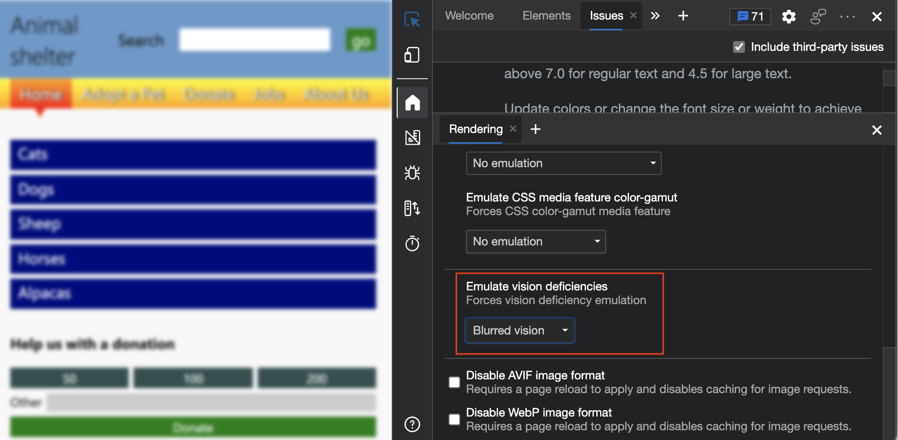

# Verify that a page is usable with blurred vision

<!-- Rendering tool: Emulate vision deficiencies: Blurred vision -->

To simulate blurred vision, in the **Rendering** tool, use the **Emulate vision deficiencies** menu.  When you use this feature with the demo webpage, you can see that the drop shadow on the text in the upper menu makes it hard to read the menu items.

To check whether a webpage is usable with blurred vision:

1. Open the [accessibility-testing demo webpage](https://microsoftedge.github.io/Demos/devtools-a11y-testing/) in a new window or tab.

1. Right-click anywhere in the webpage and then select **Inspect**.  Or, press `F12`.  DevTools opens next to the webpage.

1. Press **Esc** to open the Drawer at the bottom of DevTools.  Click the **+** icon at the top of the Drawer to display the list of tools, and then select **Rendering**.

1. In the **Emulate vision deficiencies** dropdown list, select **Blurred vision**.

   

    Notice that the `text-shadow` CSS property makes the text of the menu items difficult to read on the upper menu. For example, see the **Home**, **Adopt a Pet**, and other menu items.

1. In the **Rendering** tool, in **Emulate vision deficiencies**, select **No emulation** to remove the blurred vision simulation.

<!-- ====================================================================== -->
## See also

*  [Emulate vision deficiencies](emulate-vision-deficiencies.md)
*  [Overview of accessibility testing using DevTools](accessibility-testing-in-devtools.md)
