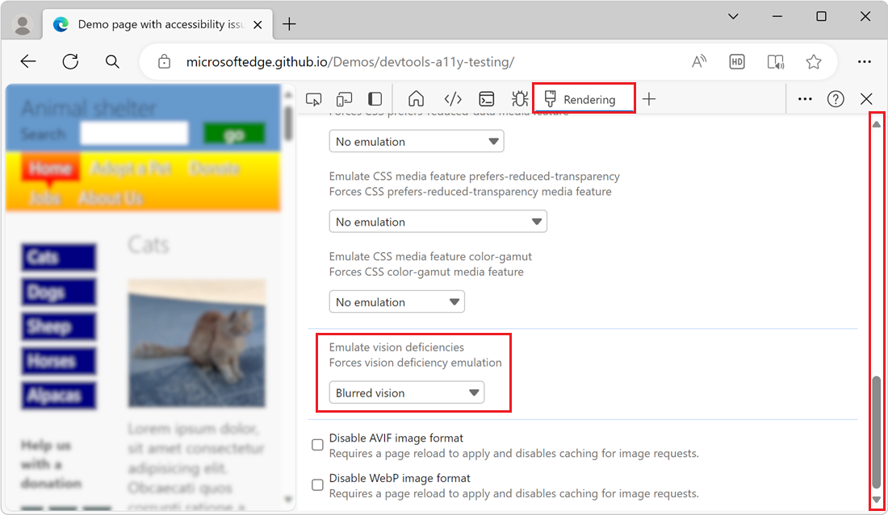

# Verify that a page is usable with blurred vision

<!-- Rendering tool: Emulate vision deficiencies: Blurred vision -->

To simulate blurred vision, in the **Rendering** tool, use the **Emulate vision deficiencies** menu.  When you use this feature with the [accessibility-testing demo webpage](https://microsoftedge.github.io/Demos/devtools-a11y-testing/), you can see that the drop shadow on the text in the upper menu makes it hard to read the menu items.

To check whether a webpage is usable with blurred vision:

1. Open the [accessibility-testing demo webpage](https://microsoftedge.github.io/Demos/devtools-a11y-testing/) in a new window or tab.

1. To open DevTools, right-click the webpage, and then select **Inspect**.  Or, press **Ctrl+Shift+I** (Windows, Linux) or **Command+Option+I** (macOS).  DevTools opens.

1. In DevTools, on the Activity Bar, click the **More tools** () button, and then select **Rendering**.

1. In the **Rendering** tool, scroll to the **Emulate vision deficiencies** section.

1. In the **Emulate vision deficiencies** section, select **Blurred vision**:

   

    Blurred-vision simulation reveals that on the upper menu, the `text-shadow` CSS property makes the text of the menu items (such as **Home** and **Adopt a Pet**) difficult to read.

1. To remove the blurred-vision simulation, in the **Rendering** tool, in **Emulate vision deficiencies**, select **No emulation**.

<!-- ====================================================================== -->
## See also

*  [Emulate vision deficiencies](emulate-vision-deficiencies.md)
