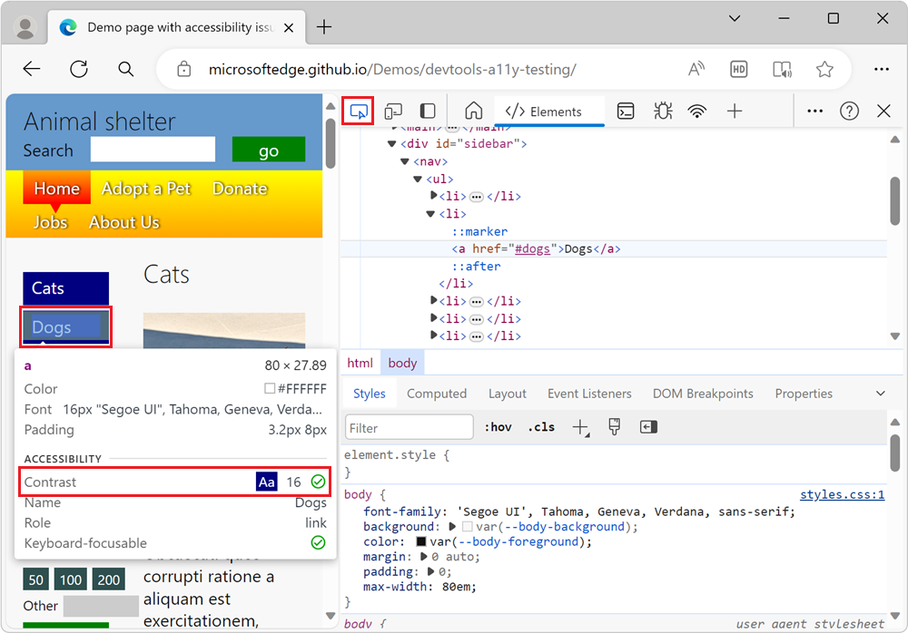
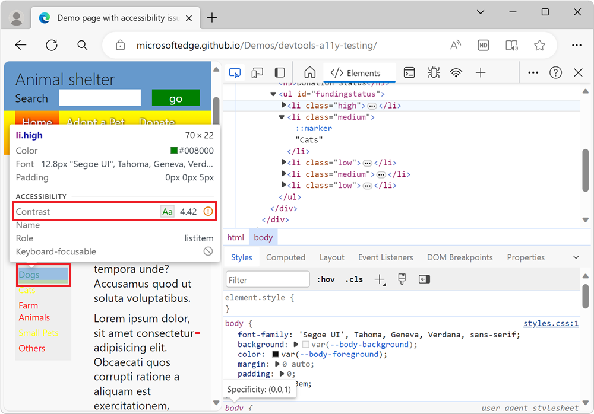
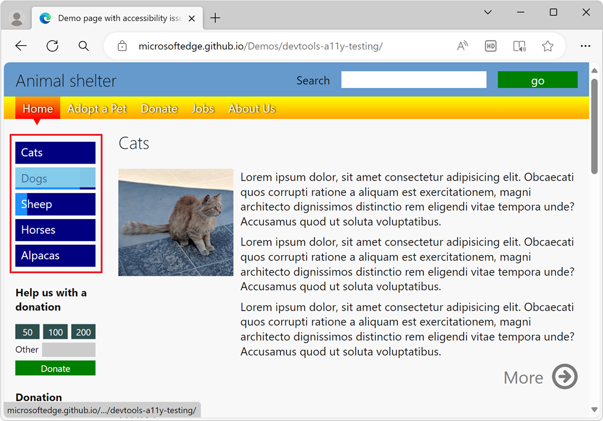
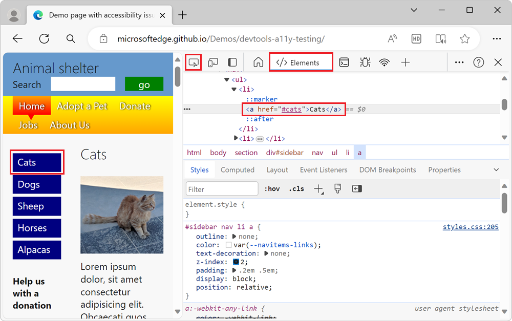
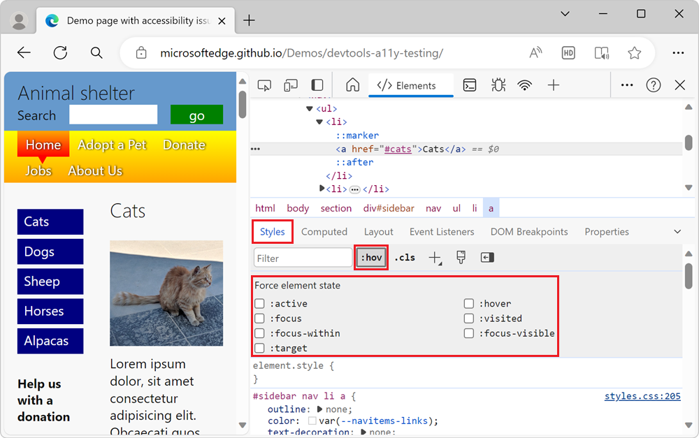
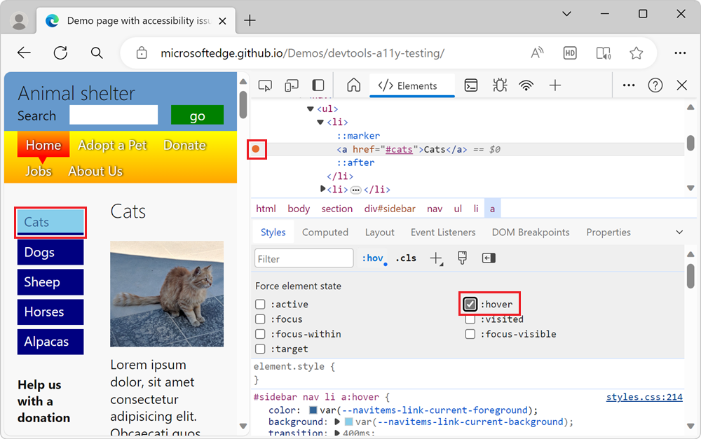
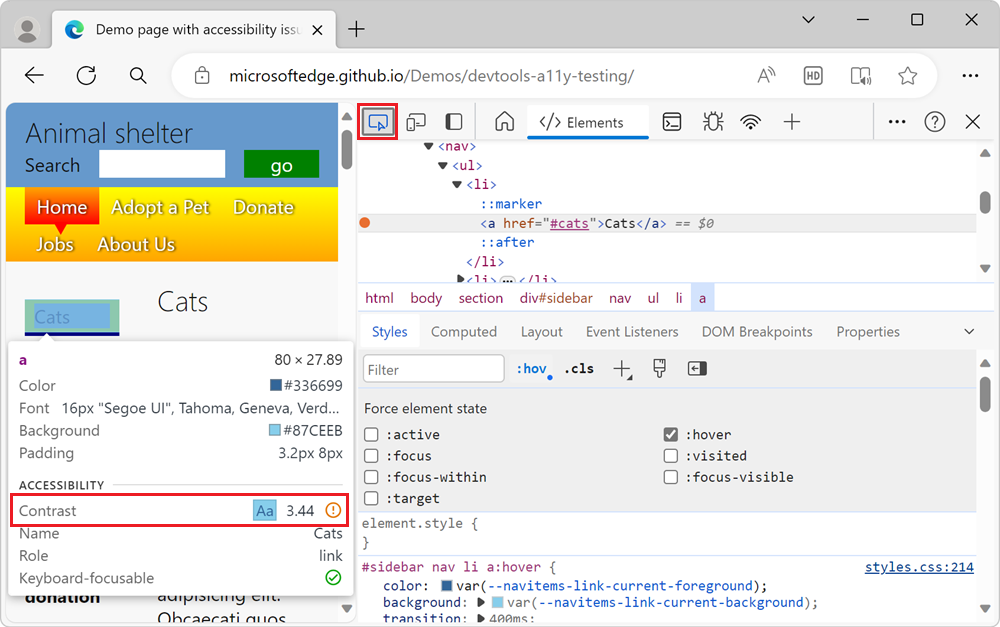

# Verify accessibility of all states of elements

<!-- 5. STYLES: TOGGLE STATE -->

Check the accessibility of all states of elements, such as text color contrast during the `hover` state.  The **Inspect** tool reports accessibility issues for one state at a time.  To check accessibility of the various states of elements, in the **Styles** tab, use the **:hov** (**Toggle Element State**) section of the **Styles** pane, as described in this article.

We first show why state simulation is necessary when using the **Inspect** tool, and then we show how to use state simulation.

<!-- ====================================================================== -->
## Checking text color contrast in the default state

<!-- Inspect tool: information overlay: Accessibility section: Contrast row -->

To check the text color contrast of individual elements on a webpage, use the page overlay of the **Inspect** tool:

1. Open the [accessibility-testing demo webpage](https://microsoftedge.github.io/Demos/devtools-a11y-testing/) in a new window or tab.

1. To open DevTools, right-click the webpage, and then select **Inspect**.  Or, press **Ctrl+Shift+I** (Windows, Linux) or **Command+Option+I** (macOS).  DevTools opens.

1. Click the **Inspect** () button in the top-left corner of DevTools so that the button is highlighted (blue).

1. Hover over elements in the rendered webpage.  The **Inspect** tool's information overlay appears, showing information about the element under the mouse pointer.

   If contrast information is available, the **Inspect** overlay shows the contrast ratio and a checkbox item.  A green check mark icon indicates there's enough contrast, and a yellow alert icon indicates that there's not enough contrast.

   For example, the links in the sidebar navigation menu have enough contrast, as shown in the **Inspect** overlay:

   

   The green **Dogs** list item in the **Donation status** section doesn't have enough contrast, and so is flagged by a warning in the **Inspect** overlay:

   

<!-- ====================================================================== -->
## Hovering when the Inspect tool is active doesn't show the text-color contrast for the hover state

The **Inspect** tool's information overlay only represents a single state.  Elements on the page can have different states, all of which need to be tested.  For example, when you hover the mouse pointer over the menu of the accessibility-testing demo page, the menu items change color.

First, confirm that your animations run when not using the Inspect tool:

1. Open the [accessibility-testing demo webpage](https://microsoftedge.github.io/Demos/devtools-a11y-testing/) in a new window or tab.

1. Hover over the blue menu items in the sidebar navigation menu.  The color of the menu item is animated on hover:

   

Next, confirm that your animations don't run when using the Inspect tool:

1. Right-click anywhere in the webpage and then select **Inspect**.  Or, press **F12**.  DevTools opens next to the webpage.

1. Click the **Inspect** tool () button in the top-left corner of DevTools.

1. In the rendered webpage, hover over the blue links on the sidebar navigation menu.  The animations for the menu items don't run.  Instead, the menu items are displayed using color highlighting for the flexbox overlay.

   When using the **Inspect** tool, you can't reach the `hover` state on elements to test the text contrast ratio, because the `hover` state in your styles isn't triggered.

Checking for sufficient text contrast this way isn't enough, because the elements on the page could have different states.

<!-- ====================================================================== -->
## Use state simulation to simulate the hover state of an animated menu item

<!-- Elements tool: Styles pane: "Toggle Element State" icon tooltip; displays "Force element state" section -->

When the **Inspect** tool is active, instead of hovering over an animated element, you need to simulate the state of the menu item.  To simulate the state of a menu item, use the state simulation in the **Styles** pane.  The **Styles** pane has a **:hov** (**Toggle Element State**) button, which displays a group of checkboxes labeled **Force element state**.

To turn on the hover state while using the Inspect tool:

1. Open the [accessibility-testing demo webpage](https://microsoftedge.github.io/Demos/devtools-a11y-testing/) in a new window or tab.

1. Right-click anywhere in the webpage and then select **Inspect**.  Or, press **F12**.  DevTools opens next to the webpage.

1. Click the **Inspect** () button in the top-left corner of DevTools so that the icon is highlighted (blue).

1. In the rendered webpage, click the blue **Cats** link in the sidebar navigation menu.  The **Elements** tool opens, with the element `<a href="#cats">Cats</a>` selected:

   

1. In the **Styles** panel, click **Toggle Element State** (**:hov**) button.  The **Force element state** checkboxes section appears:

   

1. Click the **:hover** checkbox.  In the DOM, to the left of the element `<a href="#cats">Cats</a>`, a yellow dot appears, indicating that the element has a simulated state.  The **Cats** menu item now appears in the webpage as if the pointer were hovering over it, and any animation that's on the menu item might run:

   

<!-- ------------------------------ -->
#### Check contrast of the element when hovering over it

After the simulated state is applied, you can use the **Inspect** tool again to check the contrast of the element when the user hovers over it, as follows:

1. Continuing from above, click the **Inspect** () button in the top-left corner of DevTools so that the icon is highlighted (blue).

1. Hover over the blue **Cats** link in the sidebar navigation menu.  The link is now light blue, because of the simulated hover state.  The **Inspect** tool's information overlay appears, showing an orange exclamation point in the **Contrast** row, indicating that the contrast isn't high enough:

   

State simulation is also a good way to check whether you considered different user needs, such as the needs of keyboard users.  By using the **Force element state** checkboxes, you can simulate the `:focus` state and check if focusable elements change to indicate that they have focus.  The lack of an indicator when an element has focus is an accessibility problem.  To learn more, see [Analyze the lack of indication of keyboard focus](./test-analyze-no-focus-indicator.md).
