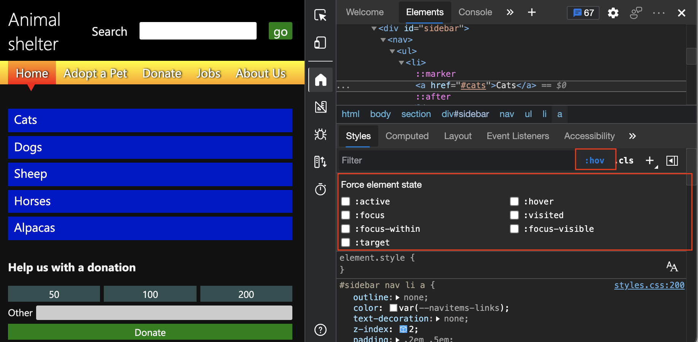

# Verify accessibility of all states of elements

<!-- 5. STYLES: TOGGLE STATE -->

Check the accessibility of all states of elements, such as text color contrast during the `hover` state.  The **Inspect** tool reports accessibility issues for one state at a time.  To check accessibility of the various states of elements, in the **Styles** tab, select **\:hov** (**Toggle Element State**), as described in this article.

We first show why state simulation is necessary using the **Inspect** tool, and then we show how to use state simulation.

<!-- ====================================================================== -->
## Checking text color contrast in the default state

<!-- Inspect tool: information overlay: Accessibility section: Contrast row -->

In addition to the automatic color-contrast tests in the **Issues** tool, you can also use the **Inspect** tool to check whether individual page elements have enough contrast.  If contrast information is available, the **Inspect** overlay shows the contrast ratio and a checkbox item.  A green check mark icon indicates there's enough contrast, and a yellow alert icon indicates that there's not enough contrast.

For example, the links in the sidebar navigation menu have enough contrast, as shown in the **Inspect** overlay:

The green **Dogs** list item in the **Donation status** section doesn't have enough contrast, and so is flagged by a warning in the **Inspect** overlay:

<!-- ====================================================================== -->
## Hovering when the Inspect tool is active doesn't show the text-color contrast for the hover state

The **Inspect** tool's information overlay only represents a single state.  Elements on the page can have different states, all of which need to be tested.  For example, when you hover the mouse pointer over the menu of the accessibility-testing demo page, you get an animation that changes the colors.

First, confirm that your animations run when not using the Inspect tool:

1. Open the [accessibility-testing demo webpage](https://microsoftedge.github.io/Demos/devtools-a11y-testing/) in a new window or tab.

1. Right-click anywhere in the webpage and then select **Inspect**.  Or, press **F12**.  DevTools opens next to the webpage.

1. In the rendered webpage, hover over the blue menu items in the sidebar navigation menu.  Notice that each item has an animation.

   

Next, confirm that your animations don't run when using the Inspect tool:

1. Click the **Inspect** tool () button in the top-left corner of DevTools.

   The **Inspect** tool icon is highlighted; for example, it changes from gray to blue.

   When the Inspect tool is used, animations on the menu items won't run when you hover over them.  When using the Inspect tool, you can't reach the `hover` state on menu items to test the contrast ratio, because the `hover` state in your styles isn't triggered.

1. In the rendered webpage, hover over the blue links on the sidebar navigation menu.  The animations for the menu items don't run.  Instead, the menu items are displayed using color highlighting for the flexbox overlay.

Checking for sufficient text contrast this way isn't enough, because the elements on the page could have different states.

<!-- ====================================================================== -->
## Use state simulation to simulate the hover state of an animated menu item

<!-- Elements tool: Styles pane: "Toggle Element State" icon tooltip; displays "Force element state" section -->

When the **Inspect** tool is active, instead of hovering over an animated element, you need to simulate the state of the menu item.  To simulate the state of a menu item, use the state simulation in the **Styles** pane.  The **Styles** pane has a **\:hov** (**Toggle Element State**) button, which displays a group of checkboxes labeled **Force element state**.

To turn on the hover state while using the Inspect tool:

1. Open the [accessibility-testing demo webpage](https://microsoftedge.github.io/Demos/devtools-a11y-testing/) in a new window or tab.

1. Right-click anywhere in the webpage and then select **Inspect**.  Or, press **F12**.  DevTools opens next to the webpage.

1. Click the **Inspect** () button in the top-left corner of DevTools so that the icon is highlighted (blue).

1. In the rendered webpage, select the blue **Cats** link in the sidebar navigation menu.  The **Elements** tool opens, with the element `<a href="#cats">Cats</a>` selected.

   

1. Select the **Styles** tab.  The selected `a` element has a `hover` state in the CSS that is applied to it, but that's not visible in the **Styles** pane.

1. In the **Styles** pane, to the right of the style rule `#sidebar nav li a`, select the `styles.css` link.  The **Sources** tool opens.  Then find the CSS pseudo-class rule `#sidebar nav li a:hover`.  This rule doesn't run when the **Inspect** tool is active.  We'll simulate running this state rule in the next steps.

1. Select the **Elements** tool.  Then in the **Styles** pane, select the **:hov** (**Toggle Element State**) button.  The **Force element state** checkboxes section is displayed.

   

1. Click the **:hover** checkbox.  In the DOM, to the left of the element `<a href="#cats">Cats</a>`, a yellow dot appears, indicating that the element has a simulated state.  The **Cats** menu item now appears in the webpage as if the pointer were hovering over it.  The animation on the menu item might run.

   

    After the simulated state is applied, you can use the **Inspect** tool again to check the contrast of the element when the user hovers over it, as follows.

1. Select the **Inspect** () button in the top-left corner of DevTools so that the icon is highlighted (blue).

1. Hover over the blue **Cats** link in the sidebar navigation menu.  The link is now light blue, because of the simulated hover animation.  The **Inspect** tool's information overlay appears, showing an orange exclamation point in the **Contrast** row, indicating that the contrast isn't high enough.

   

State simulation is also a good way to check whether you considered different user needs, such as the needs of keyboard users.  By using the **Force element state** checkboxes, you can simulate the `:focus` state to discover that the UI remains unchanged when it has focus. This lack of an indicator when an element has focus is a problem.

<!-- ====================================================================== -->
## See also

*  [Overview of accessibility testing using DevTools](accessibility-testing-in-devtools.md)
