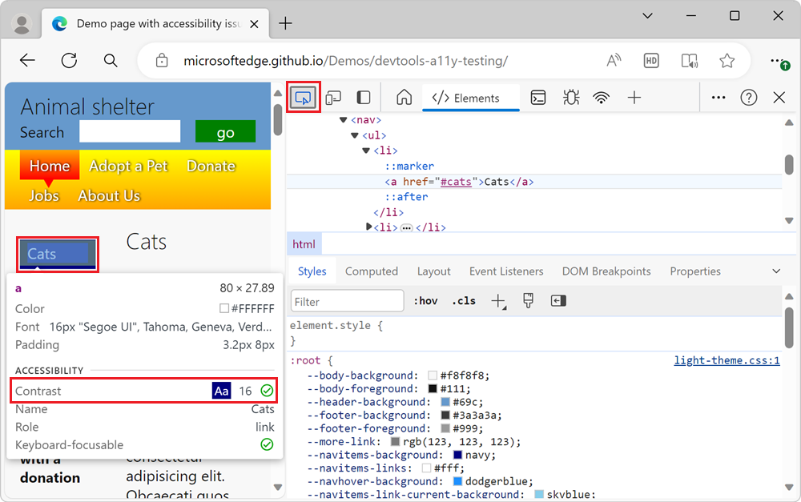
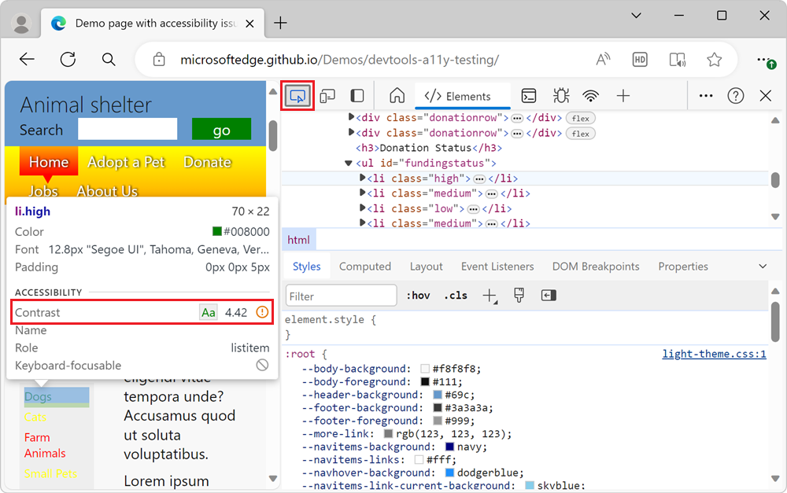

# Check text-color contrast in the default state using the Inspect tool

<!-- Inspect tool: information overlay: Accessibility section: Contrast row -->

Check text color contrast in the default state by using the **Inspect** tool.  The **Inspect** tool's information overlay on the webpage has an **Accessibility** section that includes **Contrast** information.

<!-- Inspect tool -->
For elements that have text, the **Inspect** tool's information overlay shows the following:
*  The contrast ratio of text versus background colors.
*  A green check mark icon for elements with enough contrast.
*  A yellow alert icon for elements that don't have enough contrast.

In some cases, contrast is affected by setting the browser to light theme or dark theme.

As an example, on the [accessibility-testing demo webpage](https://microsoftedge.github.io/Demos/devtools-a11y-testing/), the blue links of the sidebar navigation menu have enough contrast, but the green **Dogs** link in the **Donation status** section doesn't have enough contrast.  Examine those elements by using the **Inspect** tool, as follows:

1. Open the [accessibility-testing demo webpage](https://microsoftedge.github.io/Demos/devtools-a11y-testing/) in a new window or tab.

1. Right-click anywhere in the webpage, and then select **Inspect**.  Or, press **F12**.  DevTools opens next to the webpage.

1. Click the **Inspect** () button in the top-left corner of DevTools so that the icon is highlighted (blue).

1. In the rendered webpage, hover over the blue **Cats** link of the sidebar navigation menu.  The **Inspect** tool's information overlay appears.  In the **Accessibility** section of the information overlay, a green checkmark appears on the **Contrast** row, indicating that this element has enough contrast of text color versus background color:

   

1. In the rendered webpage, in the **Donation Status** section, hover over the **Dogs** link.  The **Inspect** tool's information overlay shows an orange exclamation point on the **Contrast** row, indicating that this element doesn't have enough contrast of text versus background colors:

   

<!-- ====================================================================== -->
## Different options to inspect text-color contrast in DevTools

Use the following DevTools features to inspect text-color contrast:

*  Use the **Inspect** tool (as an information overlay on the webpage) to check whether an individual page element has enough text-color contrast.  The **Inspect** tool's information overlay includes an **Accessibility** section that has a **Contrast** information row.  The **Inspect** tool only shows text-contrast information for the current state.  This approach is described in the current article.

*  The **Issues** tool automatically reports any color-contrast issues for the entire webpage, when text and background color don't contrast enough.  This approach is described in [Verify that text colors have enough contrast](./test-issues-tool.md#verify-that-text-colors-have-enough-contrast).

*  Emulate a non-default state, such as the `hover` state.  To do this, click the **Toggle Element State** (**:hov**) button in the **Styles** pane, which displays the **Force element state** checkboxes section.  This feature is described in [Verify accessibility of all states of elements](./test-inspect-states.md).

<!-- ====================================================================== -->
## See also

*  [Verify accessibility of all states of elements](test-inspect-states.md)
*  [Use the Inspect tool to detect accessibility issues by hovering over the webpage](test-inspect-tool.md)
