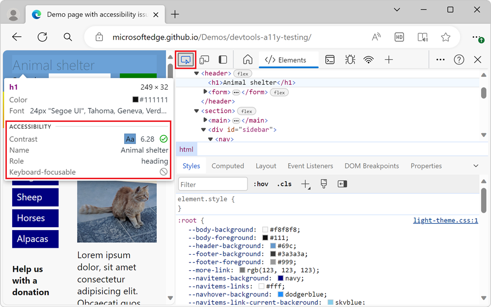
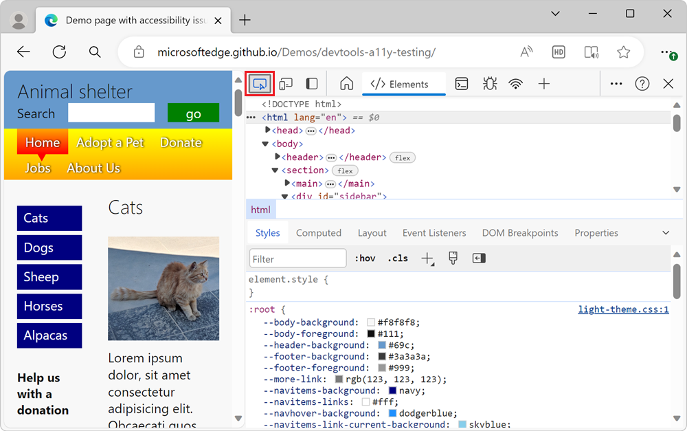

# Use the Inspect tool to detect accessibility issues by hovering over the webpage

The **Inspect** tool displays information about individual elements as you hover over the rendered webpage, including accessibility information.
In contrast, the **Issues** tool automatically reports issues for the entire webpage.

The **Inspect** tool button () is in the upper-left corner of DevTools.  When you click the **Inspect** tool button, the button turns blue, indicating that the **Inspect** tool is active.

When the **Inspect** tool is active, hovering over any element on the rendered webpage displays the **Inspect** overlay. This overlay displays general information and accessibility information about that element.  The **Accessibility** section of the **Inspect** overlay displays information about text-color contrast, screen reader text, and keyboard support:

The main article about the **Inspect** tool is [Analyze HTML pages using the Inspect tool](../css/inspect.md).  The present article focuses on the accessibility features of the **Inspect** tool.

<!-- ====================================================================== -->
## Check individual elements for text contrast, screen reader text, and keyboard support

<!-- Inspect tool: Accessibility section of overlay -->

1. Open the [accessibility-testing demo webpage](https://microsoftedge.github.io/Demos/devtools-a11y-testing/) in a new window or tab.

1. Right-click anywhere in the webpage and then select **Inspect**.  Or, press **F12**.  DevTools opens next to the webpage.

1. Click the **Inspect** () button in the top-left corner of DevTools so that the icon is highlighted (blue):

   

1. Hover over any element in the rendered demo webpage.  The **Inspect** tool shows an information overlay next to the element within the rendered webpage. The information overlay contains an **Accessibility** section:

   

The **Accessibility** section contains the following information:

* **Contrast** defines whether an element can be understood by people with low vision.  The [contrast ratio](https://www.w3.org/TR/WCAG21/#dfn-contrast-ratio) as defined by the [WCAG Guidelines](https://www.w3.org/TR/WCAG21/) indicates whether there is enough contrast or not.
  * A green check mark icon indicates enough contrast.
  * An orange exclamation-point icon indicates that the contrast is insufficient.

* **Name** and **Role** are what assistive technology such as screen readers will report about the element.
  * The **Name** is the text content of the hovered element.  For the element `<a href="/">About Us</a>`, the **Name** that's shown in the **Inspect** tool is **About Us**.
  * The **Role** of the element.  This is usually the element name, such as `article`, `img` , `link`, or `heading`.  The `div` and `span` elements are referred to as `generic`.

* **Keyboard-focusable** indicates whether users can reach the element regardless of input device.
  * A green check mark icon indicates that the element is keyboard-focusable.
  * A gray circle with diagonal line indicates that the element isn't keyboard-focusable.

<!-- ====================================================================== -->
## Additional information in the Inspect overlay

<!-- general info about the Inspect tool, not particularly focused on accessibility -->

The top part of the **Inspect** overlay, which is above the **Accessibility** section, lists the following details of the element.

*  Layout type. If the element is positioned using a flexbox or grid, an icon () is displayed.
*  Name of the element, such as `h1`, `h2`, or `div`.
*  The dimensions of the element in pixels.
*  The color as a color swatch (or a small, colored square) and as a string (such as `#336699`).
*  Font information, such as size and font families.
*  Margin and padding in pixels.

<!-- ====================================================================== -->
## See also

*  [Analyze HTML pages using the Inspect tool](../css/inspect.md)
*  [Inspect a node](../dom/index.md#inspect-a-node)
*  [Check text-color contrast in the default state using the Inspect tool](./test-inspect-text-contrast.md)
