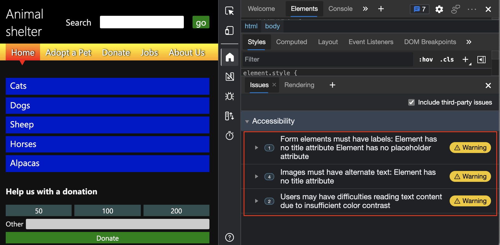

# Automatically test a webpage for accessibility issues

The **Issues** tool includes an **Accessibility** section that automatically reports issues such as missing alternative text on images, missing labels on form fields, and insufficient contrast of text colors.  The **Issues** tool is within the **Drawer** at the bottom of DevTools.  This article uses the accessibility-testing demo webpage to step through using the **Accessibility** section of the **Issues** tool.

There are several ways to open the **Issues** tool, such as:

*  Click the **Issues counter** () in the upper right of DevTools.

*  In the **Elements** tool, in the DOM tree, press **Shift** while clicking a wavy underline on an element.

*  In the **Command Menu**, type **issues**, select **Show Issues**, and then press **Enter**.


<!-- ====================================================================== -->
## View the Accessibility section of the Issues tool

1. Open the [accessibility-testing demo webpage](https://microsoftedge.github.io/Demos/devtools-a11y-testing/) in a new window or tab.

1. Right-click anywhere in the webpage and then select **Inspect**.  Or, press **F12**.  DevTools opens next to the webpage.

   In the upper right, the **Issues counter** () appears.  The **Issues counter** is a speech-bubble icon along with the number of automatically detected issues.

   

1. Refresh the page, because some issues are reported based on network requests.  Notice the updated count in the **Issues counter**.

1. Click the **Issues counter**.  The **Issues** tool opens, in the **Drawer** at the bottom of DevTools.

   

1. On the **Issues** tab, expand the **Accessibility** section.


<!-- ====================================================================== -->
## Verify that input fields have labels

To check whether input fields have labels connected to them, use the **Issues** tool, which automatically checks the entire webpage and reports this issue in the **Accessibility** section.

1. Open the [accessibility-testing demo webpage](https://microsoftedge.github.io/Demos/devtools-a11y-testing/) in a new window or tab.

1. Right-click anywhere in the webpage and then select **Inspect**.  Or, press **F12**.  DevTools opens next to the webpage.

1. In the upper right, click the **Issues counter** ().  The **Issues** tool opens, in the **Drawer** at the bottom of DevTools.

1. On the **Issues** tab, expand the **Accessibility** section.

1. Expand the **Warning** `Form elements must have labels: Element has no title attribute Element has no placeholder attribute`.

1. Click the **Open in Elements** link.

   
    
   The **Elements** tool opens, with the element highlighted in the DOM tree.  The **Styles** pane displays the applied CSS rules for the element.
  
   The following code is now displayed:

   ```html
   <label>Search</label>
   <input type="search">
   <input type="submit" value="go">
   ```

   In the above code, the `label` element is used incorrectly, because there is no connection between the `label` element and a particular `input` element.  To connect the `label` element to a specific `input` element, use any of the following options:

   *  Nest the `input` element within the `label` element.

   *  In the `label` element, add a `for` attribute that matches an `id` attribute of the `input` element.

There's also another way to test for lack of connections between elements:

1. In the **Elements** tool, select the `<label>Search</label>` element in the DOM tree.

   On the webpage, notice that focus only appears on the **Search** label, and not the input text box.  The correct implementation would put focus on the `search` input text box and the **Search** label.

1. As an example of a correct connection, select the **Other** label on the donation form.

   A focus-indicator box correctly appears on the input text box next to the **Other** label, because there are matching `for` and `id` attribute values.

1. In the **Issues tool**, click the **Further reading** to learn more about the issue.  To open the link in a new tab, press **Ctrl** (Windows, Linux) or **Command** (macOS) while clicking the link:

   


<!-- ====================================================================== -->
## Verify that images have alt text

Basic accessibility testing requires making sure alternative text (also called _alt text_) is provided for images.

To automatically check whether alt text is provided for images, use the **Issues** tool, which has an **Accessibility** section.  The **Issues** tool is located in the **Drawer** at the bottom of DevTools.

1. Open the [accessibility-testing demo webpage](https://microsoftedge.github.io/Demos/devtools-a11y-testing/) in a new window or tab.

1. Right-click anywhere in the webpage and then select **Inspect**.  Or, press **F12**.  DevTools opens next to the webpage.

1. In the upper right of DevTools, click the **Issues** counter.  The **Issues** tool opens.

1. On the **Issues** tab, expand the warning `Images must have alternate text: Element has no title attribute`.  There are four instances of images that lack alt text:

   

See [Images must have alternate text](https://dequeuniversity.com/rules/axe/4.1/image-alt).


<!-- ====================================================================== -->
## Verify that text colors have enough contrast

To automatically check whether text colors have enough contrast, use the **Issues** tool, which has an **Accessibility** section.  The **Issues** tool is located in the **Drawer** at the bottom of DevTools.

1. Open the [accessibility-testing demo webpage](https://microsoftedge.github.io/Demos/devtools-a11y-testing/) in a new window or tab.

1. Right-click anywhere in the webpage and then select **Inspect**.  Or, press **F12**.  DevTools opens next to the webpage.

1. In the upper right of DevTools, click the **Issues** counter.  The **Issues** tool opens.

   There might be warnings that two elements on the demo webpage don't have enough contrast.

   

1. Depending on your settings, the **Issues** tab might have a warning like **Users may have difficulties reading text content due to insufficient color contrast**.   You can expand that warning, and then expand **Affected resources**.  A list of elements appears with a list of elements that don't have enough contrast.

1. Click the `li.high` element.  In the rendered webpage, the **Dogs** link in the **Donate** section is highlighted, displaying a small information overlay.  This is the same overlay that appears when you hover over an element in the DOM tree in the **Elements** tool.

   


### Wavy underlines in the DOM tree indicate automatically detected issues

The DOM tree in the **Elements** tool flags issues directly in the HTML with wavy underlines.  These issues are reported by the **Issues** tool.  When you press **Shift** while clicking any element with a wavy underline, the **Issues tool** opens.

1. In the **Elements** tool, in the DOM tree, press **Shift** while clicking the element `<input type="search">`, which has a wavy line under `input`.  The **Issues tool** is displayed, and shows the issue for that element.

   


<!-- ====================================================================== -->
## See also

*  [Find and fix problems using the Issues tool](../issues/index.md)
