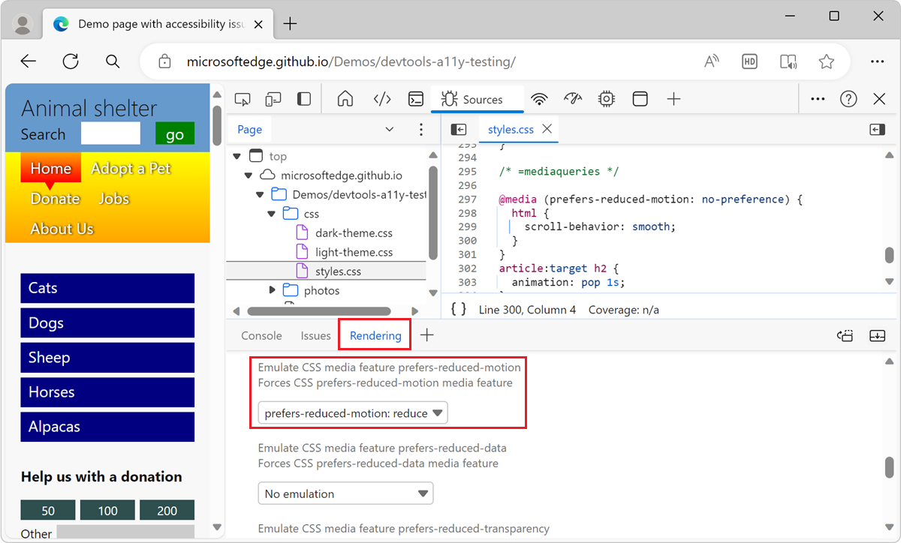

# Verify that a page is usable with UI animation turned off

A webpage should not show animations to a user who turned off animations in the operating system.  Animations can help the usability of a product, but they can also cause distraction, confusion, or nausea.

To check that a webpage is usable with UI animation turned off (reduced motion), in the **Rendering** tool, use the **Emulate CSS media feature prefers-reduced-motion** dropdown list.

In the [accessibility-testing demo webpage](https://microsoftedge.github.io/Demos/devtools-a11y-testing/), when you turn off animations in the operating system, or emulate that settings by using DevTools, the webpage doesn't use smooth scrolling when you select the links of the sidebar navigation menu.  This is achieved by wrapping the smooth-scrolling setting in CSS in a media query, and then using the **Rendering** tool to emulate the operating system setting for reduced animation.

To check whether the page is usable with animations turned off:

1. Open the [accessibility-testing demo webpage](https://microsoftedge.github.io/Demos/devtools-a11y-testing/) in a new window or tab.

1. Right-click anywhere in the webpage and then select **Inspect**.  Or, press **F12**.  DevTools opens next to the webpage.

1. In DevTools, on the **Activity Bar**, select the **Sources** tab.  If that tab isn't visible, click the **More tools** () button.

1. In the **Sources** tool's **Navigation** pane on the left, select `styles.css`.  The CSS file appears in the **Editor** pane.

1. Press **Ctrl+F** on Windows/Linux or **Command+F** on macOS, and then enter `@media`.  The following CSS media query is displayed, which confirms that it is used on the webpage:

    ```css
    @media (prefers-reduced-motion: no-preference) {
      html {
        scroll-behavior: smooth;
      }
    }
    ```


<!-- ====================================================================== -->
## Emulate the operating system setting to reduce animation

To emulate the operating system setting to reduce animation:

1. Press **Esc** to open the **Quick View** panel at the bottom of DevTools.  Click the **More tools** () button on the **Quick View** toolbar to see the list of tools, and then select **Rendering**.

1. In the **Emulate CSS media feature prefers-reduced-motion** dropdown list, select **prefers-reduced-motion: reduced**.

   

1. In the webpage, click the blue menu items, such as **Horses** or **Alpacas**.  Now the webpage instantly scrolls to the selected section, rather than using the smooth-scrolling animation.

1. In the **Rendering** tool, below **Emulate CSS media feature prefers-reduced-motion**, select **No emulation** to remove this setting.

Notice that the demo webpage still runs the following animations, even with the above media query and emulation settings. When building your website, make sure you fix all similar animations:
*  Animation of the blue menu items when you hover over them.
*  Animation of the circles on the **More** links when you hover over them.


<!-- ====================================================================== -->
## See also

*  [Reduced motion simulation](reduced-motion-simulation.md)
