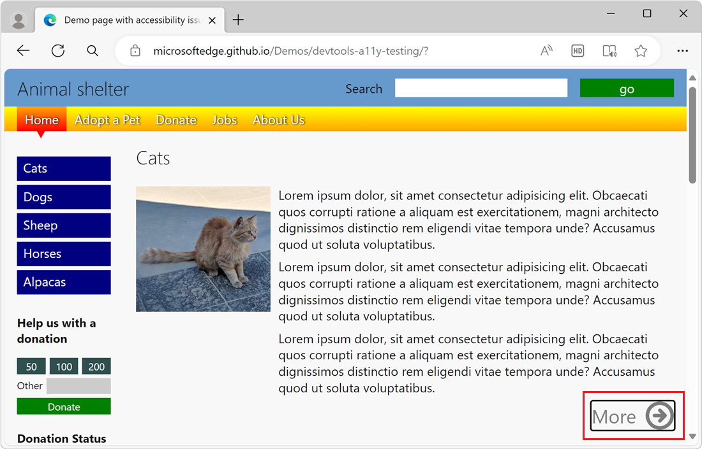
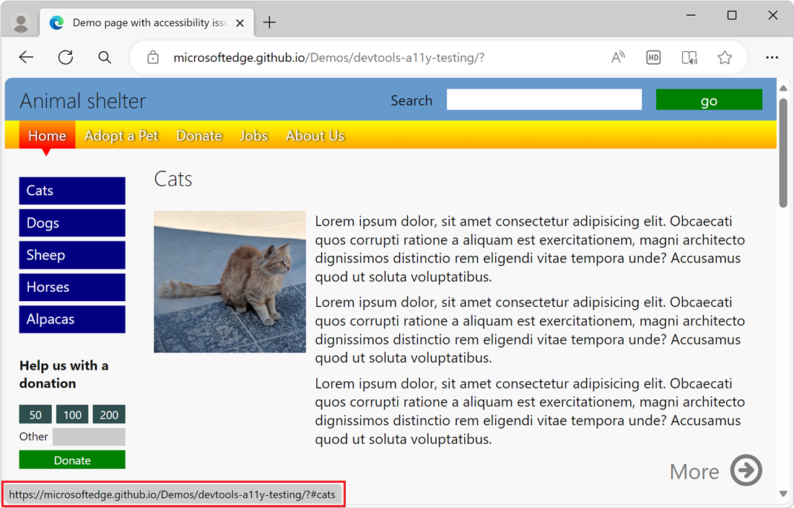
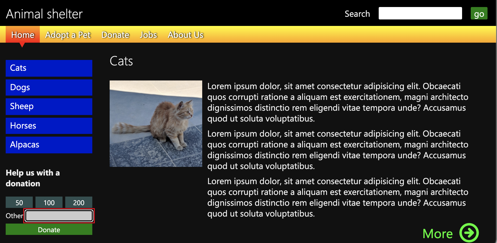
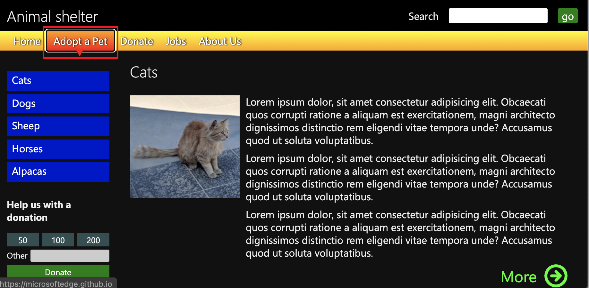

# Check for keyboard support by using the Tab and Enter keys

It's important that the user interface of a webpage works when using just a keyboard, because not all users have a pointer or touch device, and not all users can see webpages.  Make sure that you can use the **Tab** key to move the focus to each form control on a webpage, and make sure that you can use the **Enter** key to submit forms.

<!-- ------------------------------ -->
## Ways to test keyboard support

You can test the usability of a webpage for keyboard users in several ways:

*  By using the keyboard, particularly the **Tab**, **Shift+Tab**, and **Enter** keys.  This approach is described in this article.

*  Check for keyboard support for an individual element by using the **Inspect** tool.  The **Inspect** tool's information overlay includes an **Accessibility** section that includes a **Keyboard-focusable** row.  See [Use the Inspect tool to detect accessibility issues by hovering over the webpage](./test-inspect-tool.md).

*  Check the **Issues** report's **Accessibility** section for keyboard support issues.  See [Automatically test a webpage for accessibility issues](./test-issues-tool.md).

<!-- ====================================================================== -->
## Checking a webpage for keyboard accessibility issues

To check the [accessibility-testing demo webpage](https://microsoftedge.github.io/Demos/devtools-a11y-testing/) for accessibility issues by using a keyboard rather than a mouse:

1. Open the [accessibility-testing demo webpage](https://microsoftedge.github.io/Demos/devtools-a11y-testing/) in a new window or tab.

1. Use a keyboard to navigate the demo document, using the **Tab** or **Shift+Tab** keys to jump from element to element.  On the demo webpage, the **Tab** key first moves focus to the search form in the `header` section.

1. Press **Tab** to put focus on a button, and then press **Enter** to click the focused button.  For example, in the demo page, press **Tab** to put focus on the **Search** field, and then press **Enter** to submit the search.  This approach produces the same result as selecting the **go** button.  Selecting **Enter** to send the **Search** form works correctly.

1. Press **Tab** again.  The next element you put focus on is the first **More** link in the `content` section of the webpage, as indicated by an outline:

   

1. Press **Tab** several more times until you pass the last **More** link.  The page scrolls up and you seem to be on an element of the page, but there's no way to tell which element it is.

1. Notice the URL in the bottom left.  If you look to the bottom left of the screen (or if you use a screen reader), you realize that you are on the sidebar navigation menu with blue links, because the browser shows the URL that the **Cats** link points to (`#cats`).

   

1. Press **Tab** again, to get to the entry field in the donation form.  However, you can't reach the buttons above the text box by selecting **Tab**. You can't use the keyboard to put focus on the **50**, **100**, or **200** buttons and then select them.  Also, selecting **Enter** doesn't submit the donation form.

   

1. Selecting **Tab** again puts focus on the top navigation bar of the page, with menu buttons for **Home**, **Adopt a Pet**, **Donate**, **Jobs**, and **About Us**.  Press **Tab** or **Shift+Tab** to put focus on a menu button, as indicated by a focus outline.  Then press **Enter** to access that section of the webpage.

   

<!-- ------------------------------ -->
#### Issues found that need to be fixed

Based on the above walkthrough, we found the following issues that need to be fixed:

*  When using a keyboard, the blue links of the sidebar navigation menu don't visually indicate which link has focus.  See [Analyze the lack of indication of keyboard focus](./test-analyze-no-focus-indicator.md).

*  In the donation form, the amount buttons and the **Donate** button don't work with a keyboard.  See [Analyze the lack of keyboard support in a form](./test-analyze-no-keyboard-support.md).

*  The order of the keyboard access through sections of the page isn't correct.  You navigate through all the **More** links in the document before you reach the sidebar navigation menu.  By the time the **Tab** key puts focus on the sidebar navigation menu, you've already traversed all the page content. The sidebar navigation menu was intended to provide easy access to the page content.

   For more information on how to solve this issue, see [Test keyboard support using the Source Order Viewer](./test-tab-key-source-order-viewer.md).
