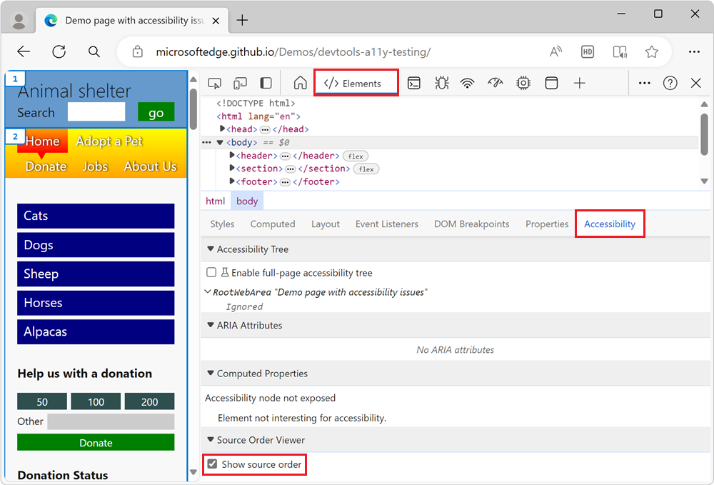
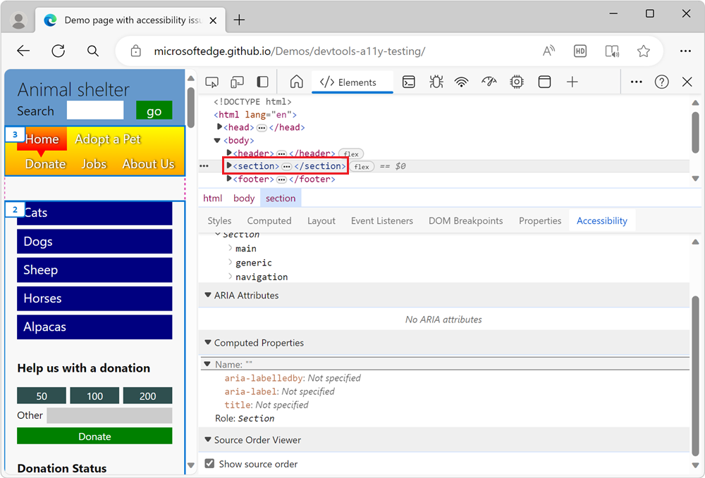

# Test keyboard support using the Source Order Viewer

The source order of a document is important for assistive technology, and can be different than the order in which elements appear on the rendered page.  The _source order_ is the order in which the elements of the webpage appear in the HTML source code.  Using CSS, you can re-order page elements in a visual way, which means that it's possible for the visual and source order of a webpage to be different.

Assistive technology, such as screen readers, usually follow the source order and ignore the visual order of the elements in the webpage.

To ensure that the document has a logical order, whether it's being access with assistive technology or not, use the **Source Order Viewer** to label different page elements with numbers that specify the order in the source code of the document.  The **Source Order Viewer** is in the **Accessibility** tab (near the **Styles** tab).

<!-- ====================================================================== -->
## Analyzing the order of keyboard access through sections of the page

The [accessibility-testing demo webpage](https://microsoftedge.github.io/Demos/devtools-a11y-testing/) has a counterintuitive tabbing order, where keyboard users access the sidebar navigation menu only after tabbing through all the **More** links.  The sidebar navigation menu is meant to be a shortcut to reach deep into the page content.  But because you need to go through the entire page before you reach the sidebar navigation menu, that navigation menu is ineffective for keyboard users.

The **Tab** key order on the demo page is:

1. The **Search** field, then the **go** button for the **Search** field.

1. The **More** button in the **Cats** section, to go to a "Cats" webpage.  Then the other **More** buttons, for Dogs, Sheep, Horses, and then Alpacas.

1. The blue links of the sidebar navigation menu: **Cats**, **Dogs**, **Sheep**, **Horses**, and then **Alpacas**.

1. The donation text box in the donation form.

1. The buttons in the top navigation bar: **Home**, **Adopt a pet**, **Donate**, **Jobs**, and then **About Us**.

1. The browser's top-of-window interface.

The reason for the confusing **Tab** key order is that the order experienced when using a keyboard is determined by the source order of the document.  The order experienced using a keyboard can be modified using the `tabindex` attribute on elements, which takes that element out of the source order.

In the source code of the document, the sidebar navigation menu appears after the main content of the webpage.  CSS was used to position the sidebar navigation menu above most of the main content of the webpage.

You can test the order of page elements by using the **Source Order Viewer** in the **Accessibility** tab.

### Activating and using the Source Order Viewer

To activate and use the Source Order Viewer, with the demo page:

1. Open the [accessibility-testing demo webpage](https://microsoftedge.github.io/Demos/devtools-a11y-testing/) in a new window or tab.

1. To open DevTools, right-click the webpage, and then select **Inspect**.  Or, press **Ctrl+Shift+I** (Windows, Linux) or **Command+Option+I** (macOS).  DevTools opens.

1. In DevTools, on the **Activity Bar**, select the **Elements** tab.  If that tab isn't visible, click the **More tools** () button.

1. In the **Elements** tool, to the right of the **Styles** tab, select the **Accessibility** tab.

1. In the **Source Order Viewer** section, select the **Show source order** checkbox.

   In the rendered webpage, numbers appear, indicating the **Tab** order as controlled by the order of lines of code in the source file:

   

1. In the DOM tree in the **Elements** tool, select a major layout element, such as the `section` element.

   The tab order numbers are now displayed on children of the `section` element, indicating the source order of the different children:

   

1. Scroll the page to see all of the numbers and check how the source order of the different elements differs from the visual order of the elements.
