<!-- Copyright Katherine Jackson 

   Licensed under the Apache License, Version 2.0 (the "License");
   you may not use this file except in compliance with the License.
   You may obtain a copy of the License at

       https://www.apache.org/licenses/LICENSE-2.0

   Unless required by applicable law or agreed to in writing, software
   distributed under the License is distributed on an "AS IS" BASIS,
   WITHOUT WARRANTIES OR CONDITIONS OF ANY KIND, either express or implied.
   See the License for the specific language governing permissions and
   limitations under the License. -->

# DevTools for Beginners: Get Started with HTML and the DOM 

This is the first in a series of tutorials that teach you the basics of web
development. You will also learn about a set of web developer tools called Microsoft Edge
DevTools that can increase your productivity.

In this particular tutorial, you learn about HTML and the DOM. HTML is one of the core
technologies of web development. It is the language that controls the structure and content
of webpages. The DOM is also related to the structure and content of webpages, but you'll
learn more about that later.

## Goals 

You are going to learn web development by actually building your own
website. By the time you complete all of the tutorials in the *DevTools for Beginners* series,
your finished site will look like **Figure 1**.

<figure>
  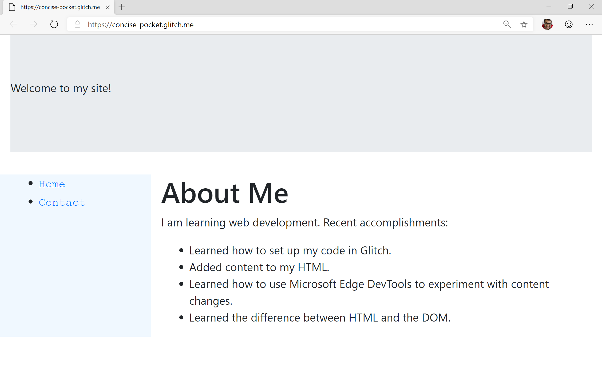
  <figcaption>
    <b>Figure 1</b>. The finished site
  </figcaption>
</figure>

By the end of this tutorial, you will understand:

* How HTML and the DOM create the content that you see on webpages.
* How Microsoft Edge DevTools can help you experiment with HTML and DOM changes.
* The difference between HTML and the DOM.

You'll also have a real website! You can use this site to host your resume or blog.

## Prerequisites 

Before attempting this tutorial, complete the following prerequisites:

* If you're unfamiliar with HTML, read [Getting Started with
  HTML](https://developer.mozilla.org/docs/Learn/HTML/Introduction_to_HTML/Getting_started).
* Download the [Microsoft Edge](https://www.microsoftedgeinsider.com) web browser. This tutorial uses a set 
  of web development tools, called the Microsoft Edge DevTools, that are built into Microsoft Edge.

## Set up your code 

You're going to build your site in an online code editor called Glitch.

1. Open the [source code](https://glitch.com/edit/#!/alluring-shock?path=index.html).
   This tab will be called the **editor tab** throughout this tutorial.

     <figure>
       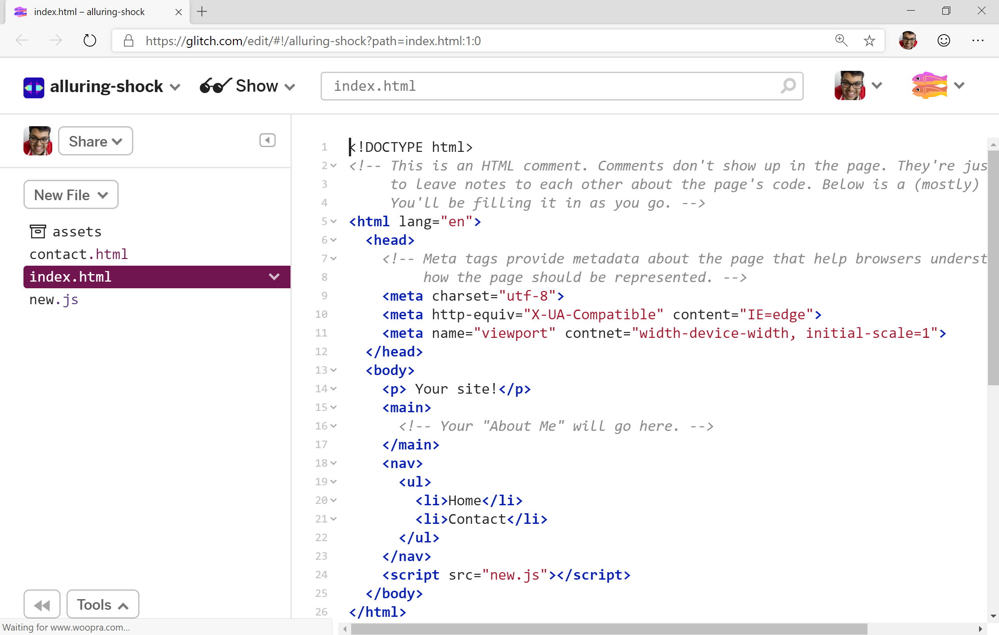
       <figcaption>
         <b>Figure 2</b>. The editor tab
       </figcaption>
     </figure>

2. Click **alluring-shock**. The Project Options menu opens in the top-left corner.

     <figure>
       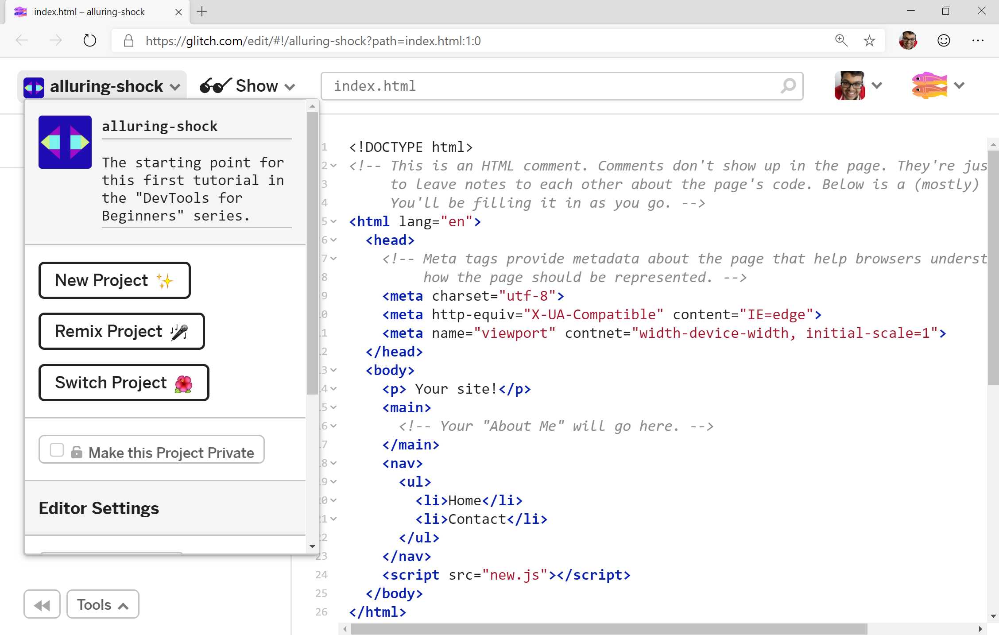
       <figcaption>
         <b>Figure 3</b>. The Project Options menu
       </figcaption>
     </figure>

3. Click **Remix Project**. Glitch creates a copy of the project that you can
   edit and randomly generates a new name for the project. The content is
   the same as before.

     <figure>
       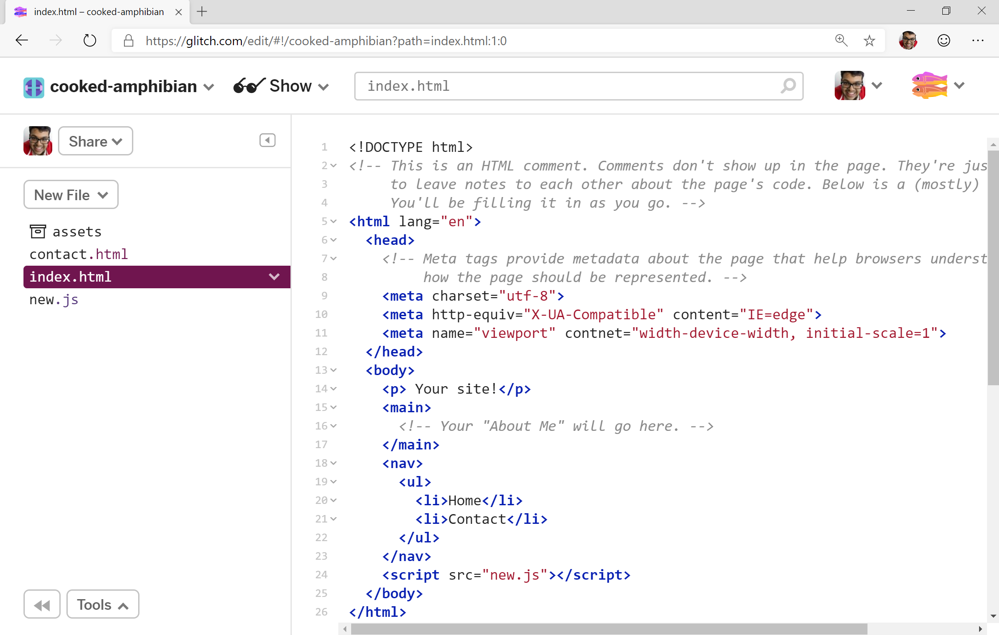
       <figcaption>
         <b>Figure 4</b>. The remixed project
       </figcaption>
     </figure>

4. If you plan on completing the next tutorial in this series, click **Sign In** and sign 
   in to Glitch with your GitHub or Facebook account. If you don't sign in you will lose the
   ability to edit this project once you close the editing tab.

5. Click **Show** and select **In a New Window**. A new tab opens, showing you the live page.
   This tab will be called the **live tab** throughout this tutorial.

     <figure>
       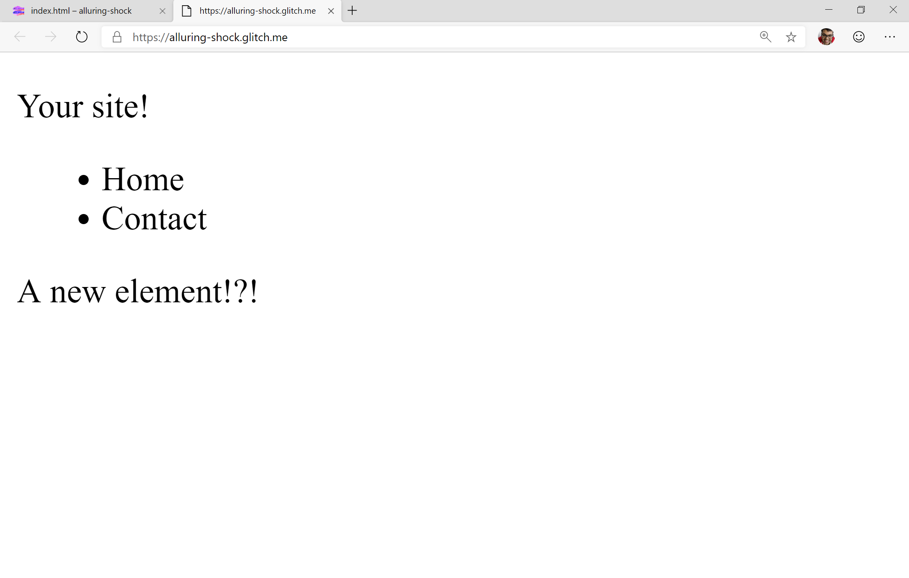
       <figcaption>
         <b>Figure 5</b>. The live tab
       </figcaption>
     </figure>

## Add content 

Your site is pretty empty. Follow the steps below to add some
content to it!

1. In the **editor tab**, replace `<!-- You're "About Me" will go here. -->`
   with `<h1>About Me</h1>`.
   
   ```html
   ...
   <body>
      <p> Your site!</p>
      <main>
        <h1>About Me</h1>
      </main>
   ...
   ```

     <figure>
       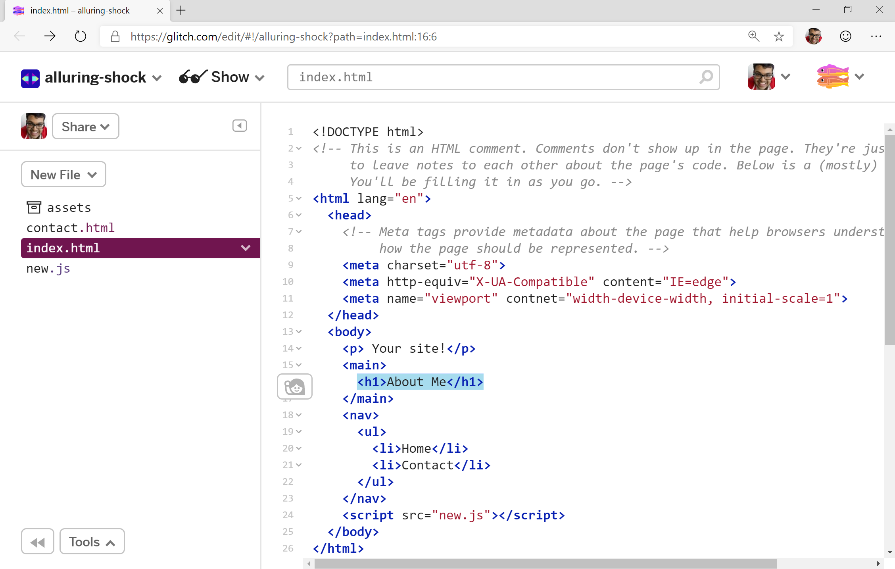
       <figcaption>
         <b>Figure 6</b>. The new code is highlighted in the editor tab
       </figcaption>
     </figure>

2. View your changes in the **live tab**. The text `About Me` is visible on the page. 
   It's larger than the rest of the text, because the `<h1>` element represents
   a section heading. Your web browser automatically styles headings in larger
   font sizes.

     <figure>
       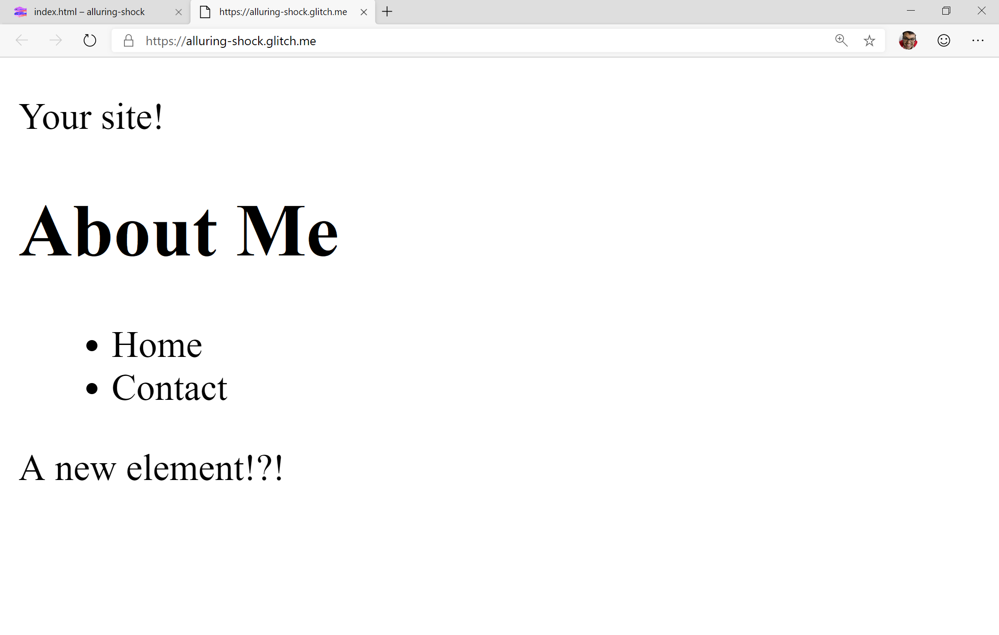
       <figcaption>
         <b>Figure 7</b>. The new heading is visible in the live tab
       </figcaption>
     </figure>

3. Back in the **editor tab**, insert `<p>I am learning HTML. Recent accomplishments:</p>` on the line below
   where you just put `<h1>About Me</h1>`.

   ```html
   ...
   <body>
      <p> Your site!</p>
      <main>
        <h1>About Me</h1>
        <p>I am learning web development. Recent accomplishments:</p>
      </main>
   ...
   ```

     <figure>
       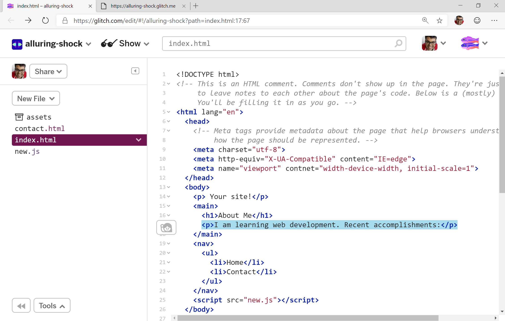
       <figcaption>
         <b>Figure 8</b>. The new code is highlighted in the editor tab
       </figcaption>
     </figure>

4. View your change in the **live tab**.
5. Back in the **editor tab**, add a list of your accomplishments:

   ```html
   ...
      <p>I am learning web development. Recent accomplishments:</p>
      <ul>
        <li>Learned how to set up my code in Glitch.</li>
        <li>Added content to my HTML.</li>
        <li>TODO: Learn how to use Microsoft Edge DevTools to experiment with content changes.</li>
        <li>TODO: Learn the difference between HTML and the DOM.</li>
      </ul>
   ...
   ```

     <figure>
       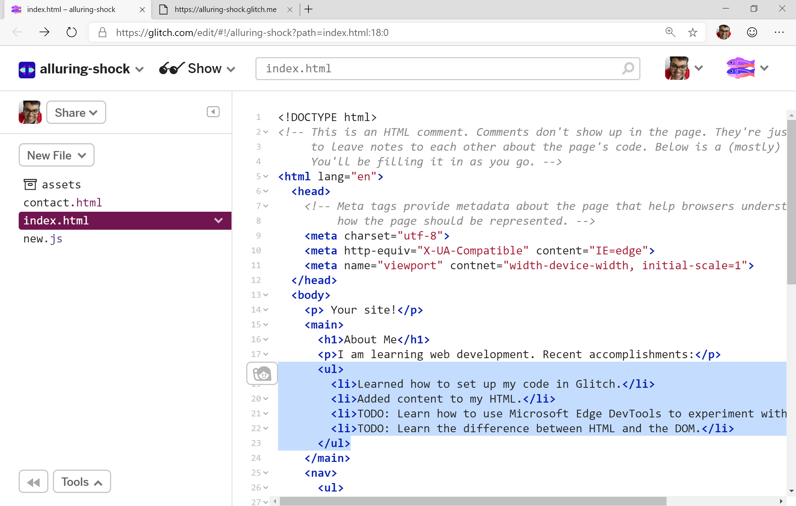
       <figcaption>
         <b>Figure 4</b>. The new code is highlighted in the editor tab
       </figcaption>
     </figure>

6. Again, go back to the **live tab** to make sure that the new content is displaying correctly.

     <figure>
       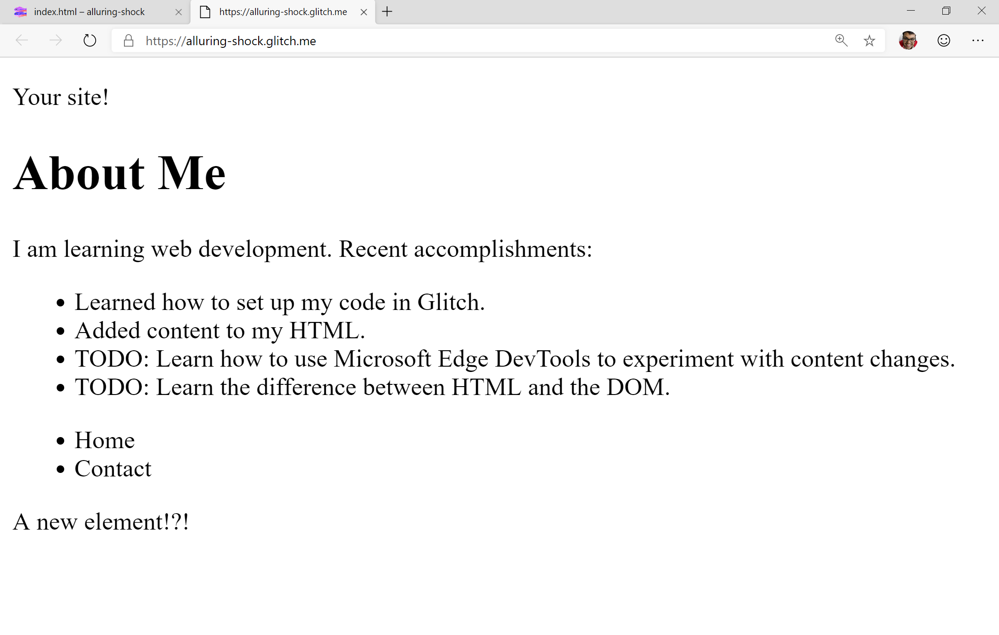
       <figcaption>
         <b>Figure 4</b>. The new list is visible in the live tab
       </figcaption>
     </figure>

## Experiment with content changes in Microsoft Edge DevTools 

If you were developing a big page with a lot of HTML, you can imagine that it might be
somewhat tedious to go back-and-forth between the editor tab and the live tab hundreds of times
in order to see your changes, especially if you weren't sure what exactly to put on the page.
Microsoft Edge DevTools can help you experiment with content changes without ever leaving the live tab.

### Learn the difference between HTML and the DOM 

Before you start editing your content from Microsoft Edge DevTools, it's helpful to understand
the difference between HTML and the DOM. The best way to learn is by example:

1. Go to the **live tab**. At the bottom of your page you see the text `A new element!?!`.

     <figure>
       
       <figcaption>
         <b>Figure 9</b>. At the bottom of the page the textd <code>A new element!?!</code> can
         be seen
       </figcaption>
     </figure>

2. Go back to the **editor tab** and try to find this text in `index.html`. It's not there!

     <figure>
       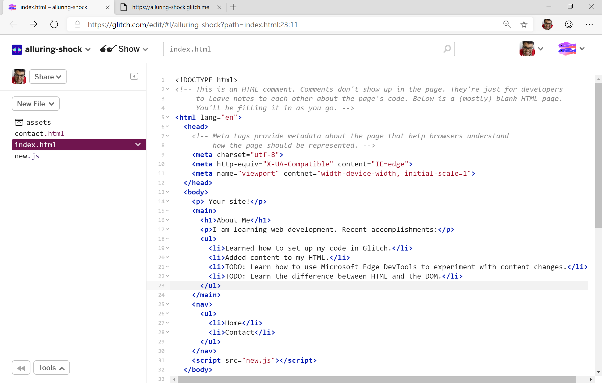
       <figcaption>
         <b>Figure 10</b>. The mystery text <code>A new element!?!</code> is nowhere to
         be found in <code>index.html</code>
       </figcaption>
     </figure>

3. Go back to the **live tab**, right-click `A new element!?!`, and select **Inspect**.

     <figure>
       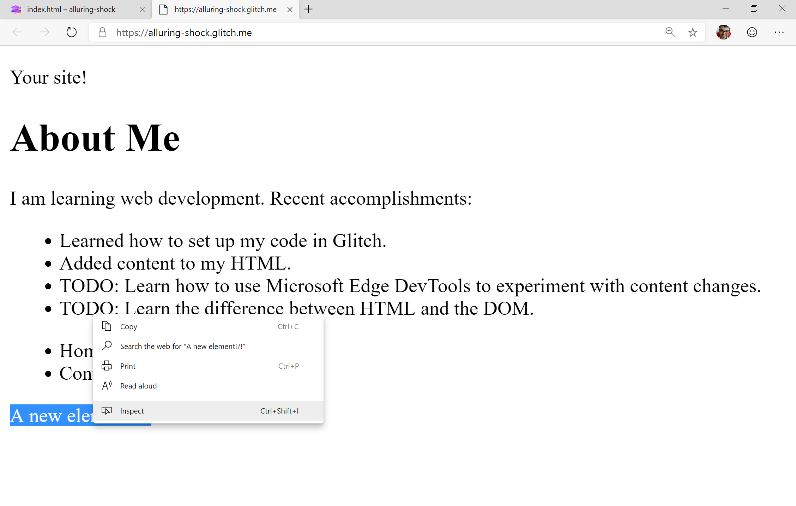
       <figcaption>
         <b>Figure 11</b>. Inspecting some text
       </figcaption>
     </figure>

   DevTools opens up alongside your page. `<div>A new element!?!</div>` is highlighted blue. 
   Although this structure in DevTools looks like your HTML, it is actually the **DOM Tree**.

     <figure>
       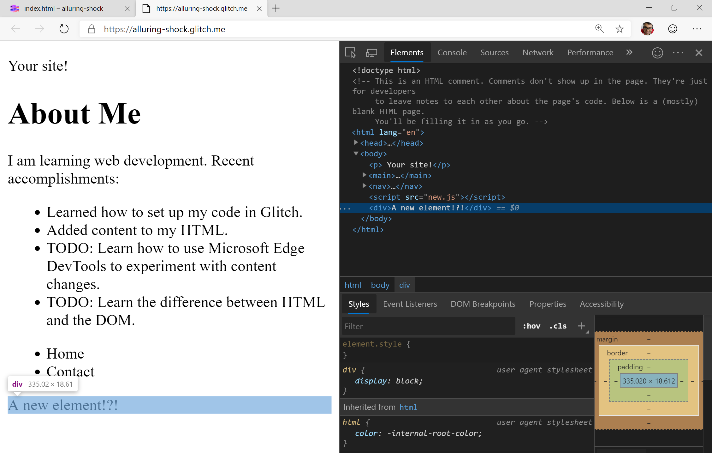
       <figcaption>
         <b>Figure 12</b>. DevTools is open alongside the page
       </figcaption>
     </figure>

When your page loads, the browser takes your HTML to create the *initial* content of the page. The
DOM represents the *current* content of the page, which can change over time.
The mysterious `<div>A new element!?!</div` content is added to your page because of the
`<script src="new.js"></script>` tag at the bottom of your HTML. This tag causes some JavaScript
code to run. You'll learn more about JavaScript in a later tutorial, but for now think of it as a
programming language that can change the content of your page. In this particular case, JavaScript
code adds `<div>A new element!?!</div>` to your page. That is why this mystery text is visible on
your live page, but not in your HTML.

### Edit the DOM 

If you want to quickly experiment with content changes without ever leaving the live tab,
try DevTools.

1. In DevTools, right-click `Your site!` and select **Edit as HTML**.

     <figure>
       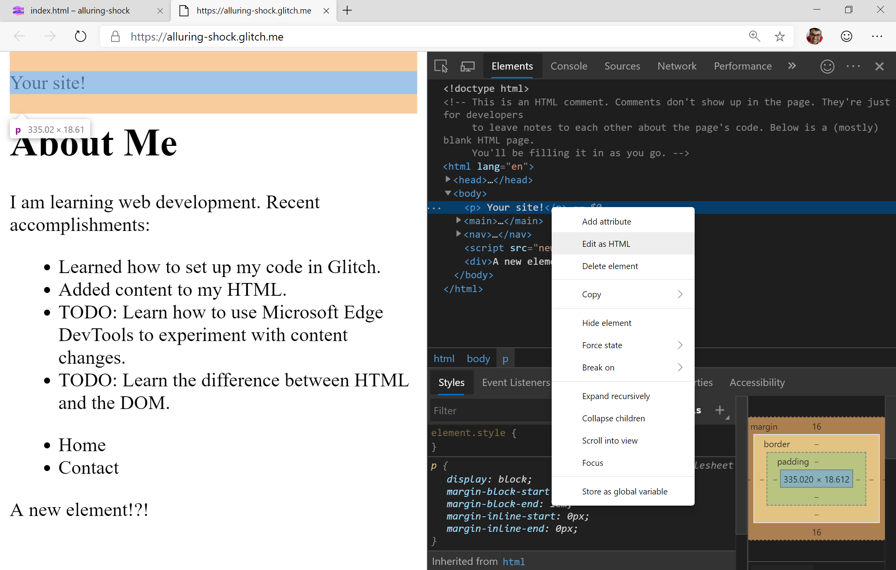
       <figcaption>
         <b>Figure 13</b>. Editing the node as HTML
       </figcaption>
     </figure>

2. Replace `<p>Your site!</p>` with the code below.

    ```html
    <header>
      <p><b>Welcome to my site!</b></p>
      <button>Download my resume</button>
    </header>
    ```

     <figure>
       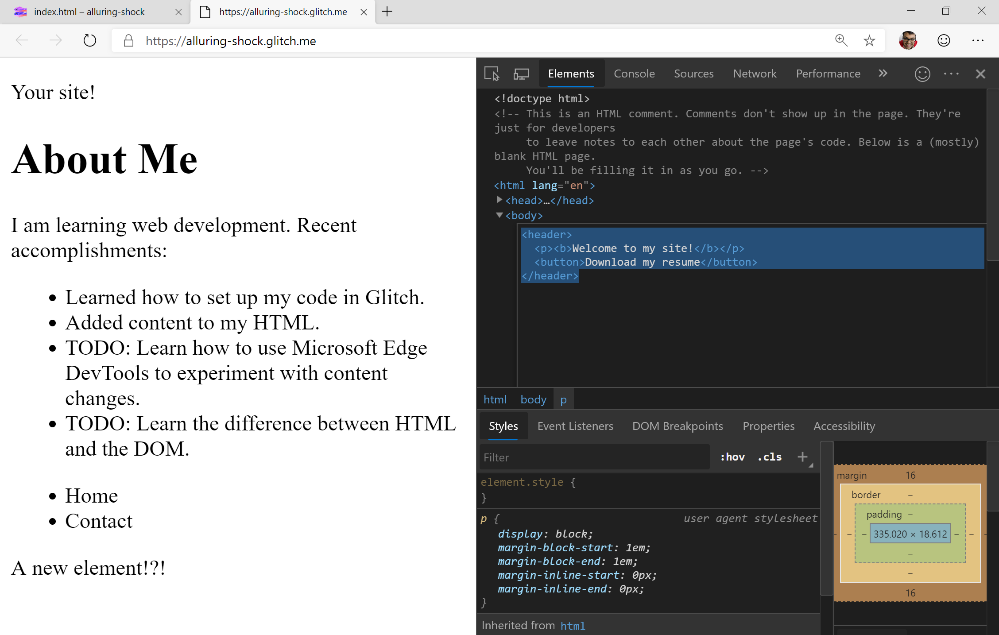
       <figcaption>
         <b>Figure 14</b>. Editing the node as HTML
       </figcaption>
     </figure>

3. Press `Control` + `Enter` \(Windows\) or `Command` + `Enter` \(macOS\) to save your changes, or click outside of the box.  Your changes automatically show up in the live view of your page.  The text `Your site!` has been replaced with the new content.  

     <figure>
       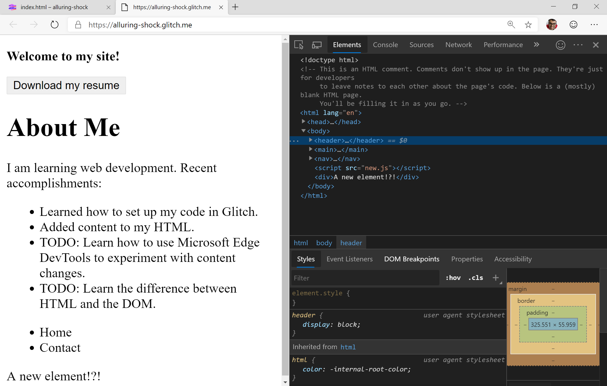
       <figcaption>
         <b>Figure 15</b>. The new content shows up immediately on the page
       </figcaption>
     </figure>

This workflow is only good for experimenting with content changes. If you reload the page or close the
tab, your changes will be gone forever. If you're using this workflow and you want to save your changes,
you need to manually copy those changes over to your HTML.

The next couple of sections show you some more ways that you can change content from the DOM Tree.

## Reorder nodes 

You can also change the order of DOM nodes. For example, on your web page the navigation menu is near the
bottom. To move it to the top:

1. Find the `<nav>` node in the **DOM Tree** of DevTools.

     <figure>
       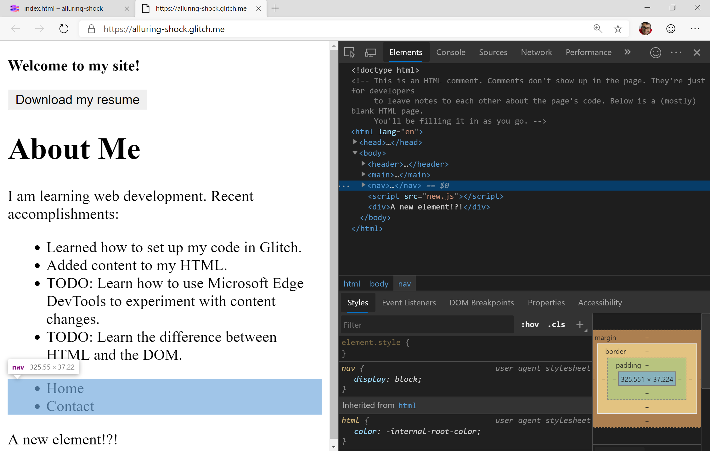
       <figcaption>
         <b>Figure 16</b>. The nav node is highlighted blue in DevTools
       </figcaption>
     </figure>

2. Drag the `<nav>` node to the top, so that it's the first child below the `<body>` node.

     <figure>
       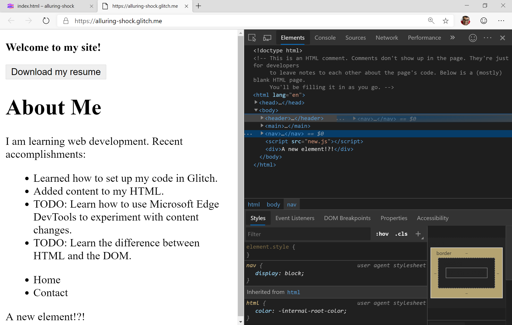
       <figcaption>
         <b>Figure 17</b>. Dragging the nav node to the top
       </figcaption>
     </figure>

    The `<nav>` node is now displaying at the top of your page.

     <figure>
       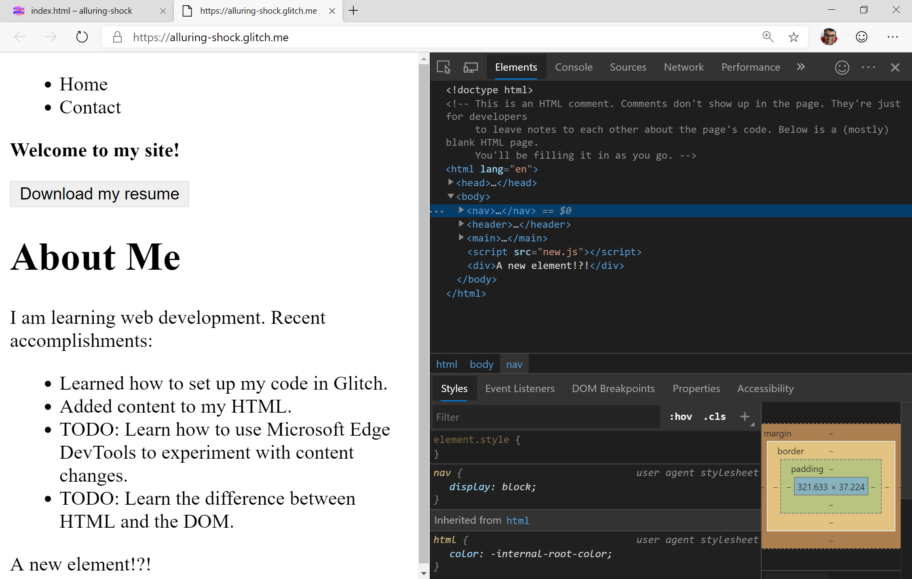
       <figcaption>
         <b>Figure 18</b>. The nav node is at the top of the page
       </figcaption>
     </figure>

### Delete a node 

You can also remove nodes from the DOM Tree.

1. In the **DOM Tree**, click `<div>A new element!?!</div>`. DevTools highlights the node blue.

     <figure>
       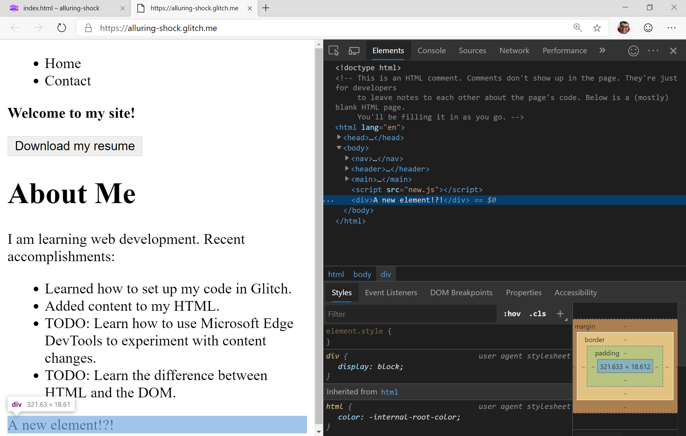
       <figcaption>
         <b>Figure 19</b>. Selecting the node to be deleted
       </figcaption>
     </figure>

2. Press the `Delete` key on your keyboard. The `<div>A new element!?!</div>` node is removed
   from your DOM Tree.

     <figure>
       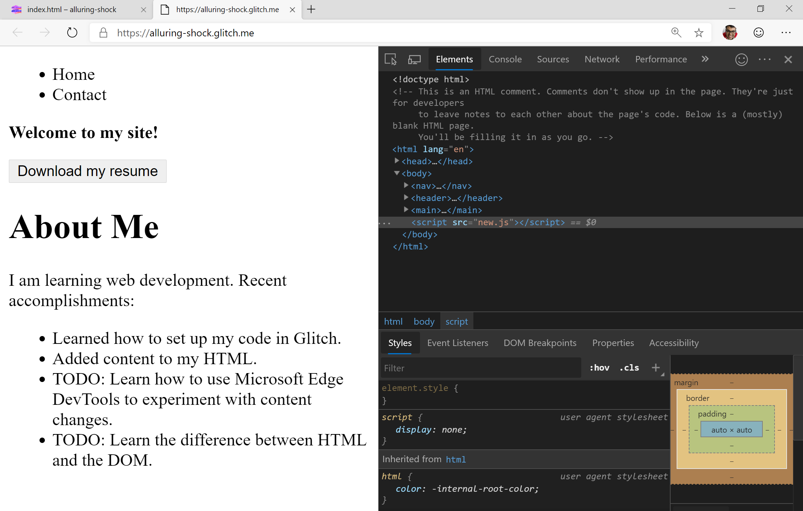
       <figcaption>
         <b>Figure 20</b>. The node has been deleted
       </figcaption>
     </figure>

## Copy your changes 

You're almost done. You've made a few changes to your page in DevTools, but they're not yet saved to your
source code.

1. Refresh your **live tab**. The changes that you made in the DOM Tree disappear. In particular,
   the text `Your site!` returns to the top of the      page, and the text `A new element!?!` returns to the
   bottom.

     <figure>
       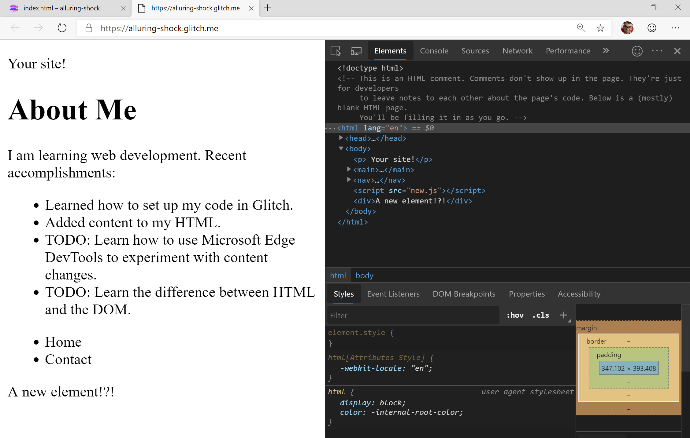
       <figcaption>
         <b>Figure 21</b>. The changes that you've made are gone
       </figcaption>
     </figure>

2. Copy the code below.

   ```html
   <!DOCTYPE html>
   <html lang="en">
     <head>
       <meta charset="utf-8">
       <meta http-equiv="X-UA-Compatible" content="IE=edge">
       <meta name="viewport" content="width=device-width, initial-scale=1">
     </head>
     <body>
       <header>
         <p>Welcome to my site!</p>
       </header>
       <nav>
         <ul>
           <li><a href="/">Home</a></li>
           <li><a href="/contact.html">Contact</a></li>
         </ul>
       </nav>
       <main>
         <h1>About Me</h1>
         <p>I am learning web development. Recent accomplishments:</p>
         <ul>
           <li>Learned how to set up my code in Glitch.</li>
           <li>Added content to my HTML.</li>
           <li>Learned how to use Microsoft Edge DevTools to experiment with content changes.</li>
           <li>Learned the difference between HTML and the DOM.</li>
         </ul>
       </main>
     </body>
   </html>
   ```

3. Go back to the **editor tab** and replace the contents of your `index.html` file with the code that
   you just copied.

     <figure>
       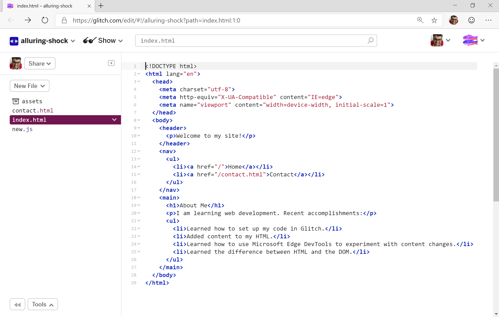
       <figcaption>
         <b>Figure 22</b>. How your <code>index.html</code> file should look
       </figcaption>
     </figure>

## Next steps 

* Complete the next tutorial in this series, [Get Started with CSS](./css.md), to learn how to style your page
  and experiment with style changes in Microsoft Edge DevTools.
* Read [Introduction to the DOM](https://developer.mozilla.org/en-US/docs/Web/API/Document_Object_Model/Introduction) to learn more about the DOM.
* Check out a course like [Introduction to Web Development](https://www.coursera.org/learn/web-development) to get
  more hands-on web development experience.

> [!NOTE]
> Portions of this page are modifications based on work created and [shared by Google](https://developers.google.com/terms/site-policies) and used according to terms 
  described in the [Creative Commons Attribution 4.0 International License](https://creativecommons.org/licenses/by/4.0/). The original page can be found [here](https://developers.google.com/web/tools/chrome-devtools/beginners/html) and is authored by [Katherine Jackson](https://developers.google.com/web/resources/contributors/katjackson) (Technical Writer Intern, Chrome DevTools).
  
<a rel="license" href="https://creativecommons.org/licenses/by/4.0/"></a><br />This work is licensed under a <a rel="license" href="https://creativecommons.org/licenses/by/4.0/">Creative Commons Attribution 4.0 International License</a>.