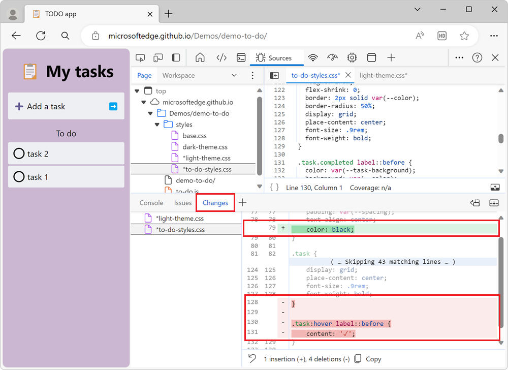

# Track changes to files using the Changes tool

The **Changes** tool tracks any changes that you've made to CSS or JavaScript in DevTools.  It shows you what changes to make to your actual source files after you've successfully used DevTools to modify a copy of your webpage files that are sent from the server:

Use the **Changes** tool to quickly display all your changes in order to re-apply those changes to the actual source files in your source code editor.

<!-- ====================================================================== -->
## Open the Changes tool by clicking the More Tools icon

On the **Activity Bar** or **Quick View** toolbar, click the **More tools** () button, and then select **Changes**:

The **Changes** tool opens in the **Activity Bar** or in the **Quick View**, depending on which toolbar you used.

<!-- ====================================================================== -->
## Open the Changes tool by using the Command Menu

To open the **Changes** tool using the **Command Menu**:

1. To open the **Command Menu**, press **Ctrl+Shift+P** on Windows/Linux or **Command+Shift+P** on Mac.

1. Start typing **changes**.  The **Show Changes** command is highlighted:

   

1. Press **Enter**.  The **Changes** tool opens in the **Quick View** panel:
   
   

See also:
* [Run commands in the Command Menu](../command-menu/index.md)

<!-- ====================================================================== -->
## Interpret added lines, removed lines, and differences in a line

Each modified file is listed in the side pane.  Selecting a file shows the modifications as a `diff` view.  You won't see the entire file, but only the lines that have changed, along with a few lines above and below the changed lines, for context.

The following diff view shows that there were two modifications in different parts of a file.  One change is an insertion, and one change is several deleted lines:

| Type of change | Indicator |
|---|--|
| Removed line | Each line that was removed from the code is preceded by a `-` and is colored red. |
| Added line | Each new line has a `+` in front of it and is colored green. |
| Changed line | An adjacent pair of lines, with a `-` line and then a `+` line. |

Changes are represented as insertion or deletion of individual lines of code, in the two columns of line numbers.  The left column represents line numbers in the old file, and the right column represents lines numbers in the new file.

<!-- ====================================================================== -->
## Open a changed file in the Sources tool

Clicking a modified line in the **Changes** tool opens the file in the [Sources](../sources/index.md) tool, scrolled to the modified line.

<!-- ====================================================================== -->
## Undo all changes

To undo all changes, at the bottom of the **Changes** tool, click the **Revert all changes to current file** () button:

<!-- ====================================================================== -->
## Horizontally scroll entries

When you've made a change to a minified file, the **Changes** tool enables you to scroll horizontally, to display all of your minified code:

To scroll horizontally, click the horizontal scrollbar, or press the left or right arrow keys.
