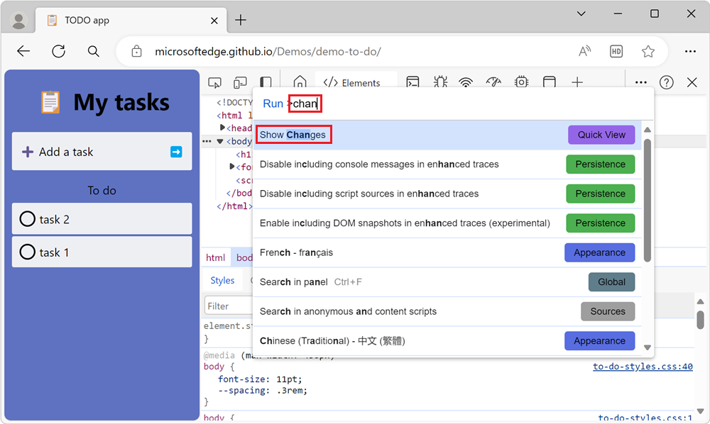
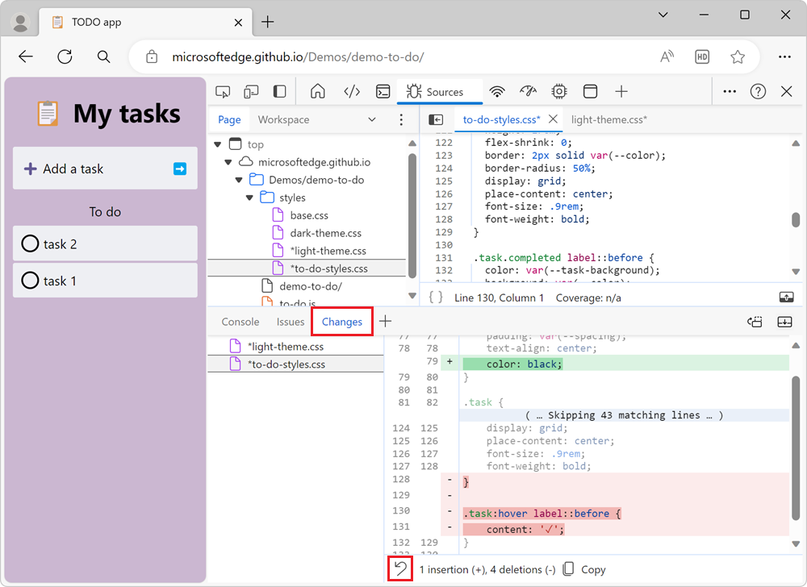
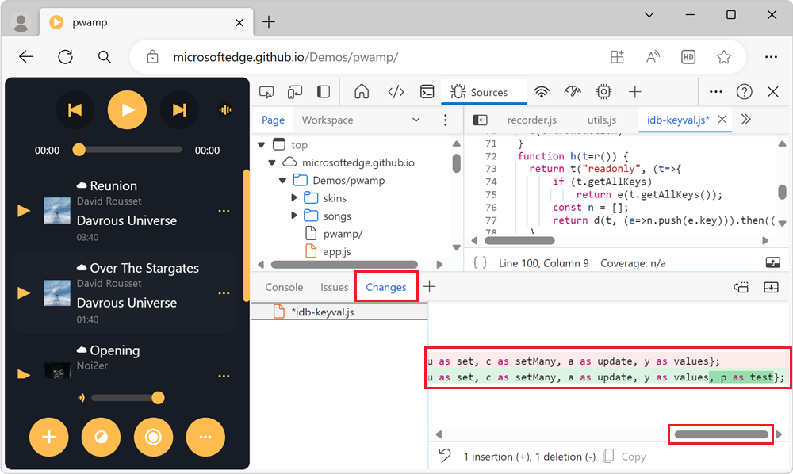

# Track changes to files using the Changes tool

The **Changes tool** tracks any changes you've made to CSS or JavaScript in DevTools.  It shows you what changes to make to your actual source files after you've successfully used DevTools to modify your webpage files sent from the server.

Use the **Changes** tool to quickly display all your changes in order to re-apply those changes to the actual source files in your editor (in your Integrated Development Environment; IDE).

In DevTools, use any of the following ways to open the **Changes** tool.  The **Changes tool** is a **Drawer** tool; by default, it opens in the **Drawer**.

<!-- ====================================================================== -->
## Open the Changes tool by right-clicking in a changed file

In the [Sources](../sources/index.md) tool, right-click any file that shows that it was changed, and then select **Local modifications**:

<!-- ====================================================================== -->
## Open the Changes tool by clicking the More Tools icon

On the main toolbar or **Drawer** toolbar, click the **More Tools** (`+`) icon and then select **Changes**:

The **Changes** tool appears in the main toolbar or in the **Drawer**, depending on which toolbar you used.

<!-- ====================================================================== -->
## Open the Changes tool by clicking the Customize DevTools icon

Click **Customize and control DevTools** (`...`), point to **More tools**, and then select **Changes**:

<!-- ====================================================================== -->
## Open the Changes tool by using the Command Menu

Open the [Command Menu](../command-menu/index.md) by pressing **Ctrl+Shift+P** on Windows/Linux or **Command+Shift+P** on Mac, and then type **changes**.  The **Show Changes** command is highlighted; press **Enter**.

<!-- ====================================================================== -->
## Interpret added lines, removed lines, and differences in a line

Each modified file is listed in the side pane.  Selecting a file shows the modifications as a `diff` view.  You won't see the entire file, but only the lines that have changed, along with a few lines above and below the changed lines, for context.

A diff view of the file shows that there were two modifications in different parts of the file.  One change is a deletion and an insertion, and one change is a deleted line.

| Type of change | Indicator |
|---|--|
| Removed line | Each line that was removed from the code is preceded by a `-` and is colored red. |
| Added line | Each new line has a `+` in front of it and is colored green. |
| Changed line | An adjacent pair of lines, with a `-` line and then a `+` line. |

Changes are represented as insertion or deletion of individual lines of code, in the two columns of line numbers.  The left column represents line numbers in the old file, and the right column represents lines numbers in the new file.

<!-- ====================================================================== -->
## Open a changed file in the Sources tool

Clicking a modified line in the **Changes** tool opens the file in the [Sources](../sources/index.md) tool, scrolled to the modified line.

<!-- ====================================================================== -->
## Undo all changes

To undo all changes, click the **Revert all changes to the current file** button, shown as a looped arrow:

<!-- ====================================================================== -->
## Horizontally scroll entries

When you have made a change to a minified file, the **Changes tool** enables you to scroll horizontally to display all of your minified code.  To scroll horizontally, click the horizontal scrollbar or press the arrow keys.

