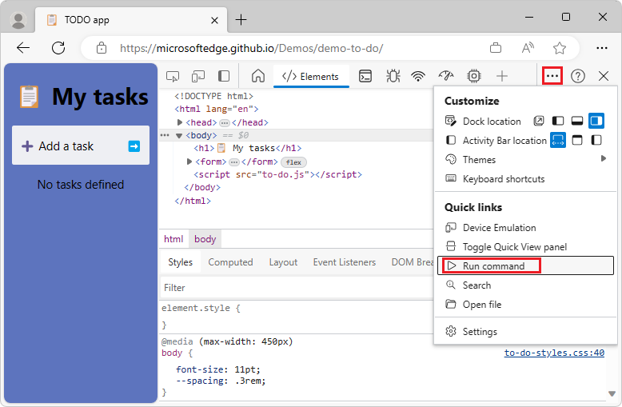

<!-- Copyright Kayce Basques

   Licensed under the Apache License, Version 2.0 (the "License");
   you may not use this file except in compliance with the License.
   You may obtain a copy of the License at

       https://www.apache.org/licenses/LICENSE-2.0

   Unless required by applicable law or agreed to in writing, software
   distributed under the License is distributed on an "AS IS" BASIS,
   WITHOUT WARRANTIES OR CONDITIONS OF ANY KIND, either express or implied.
   See the License for the specific language governing permissions and
   limitations under the License.  -->
# Run commands in the Command Menu

The Command Menu provides a fast way to navigate the Microsoft Edge DevTools UI and accomplish common tasks.  The Command Menu is similar to the [Command Palette in Visual Studio Code](https://code.visualstudio.com/docs/getstarted/userinterface#_command-palette):

<!-- ====================================================================== -->
## Open the Command Menu

To open the Command Menu:

1. To open DevTools, right-click a webpage and then select **Inspect**.

1. Click the **Customize and control DevTools** () button, and then select **Run command**:

   

   Or, press **Ctrl+Shift+P** (Windows, Linux) or **Command+Shift+P** (macOS).

   The Command Menu initially opens with a `>` character prepended to its text box:

   

1. Start typing a keyword, and then select a command from the filtered list.

<!-- ====================================================================== -->
## Display other available actions

To show other kinds of Command Menu actions besides **Run Command**, delete the `>` character and then type **?**:

Available actions include:
* **Open File**
* **Run Command**
* **Go to Symbol**
* **Go to Line**
* **Run Snippet**

The actions other than **Run Command** require input, such as a filename or line number.

<!-- ====================================================================== -->
## See also

* [Keyboard shortcuts](../shortcuts/index.md)
* [Navigate DevTools with assistive technology](../accessibility/navigation.md)
* [Customize keyboard shortcuts](../customize/shortcuts.md)

<!-- ====================================================================== -->
> [!NOTE]
> Portions of this page are modifications based on work created and [shared by Google](https://developers.google.com/terms/site-policies) and used according to terms described in the [Creative Commons Attribution 4.0 International License](https://creativecommons.org/licenses/by/4.0).
> The original page is found [here](https://developer.chrome.com/docs/devtools/command-menu/) and is authored by [Kayce Basques](https://developers.google.com/web/resources/contributors/kaycebasques) (Technical Writer, Chrome DevTools & Lighthouse).

This work is licensed under a [Creative Commons Attribution 4.0 International License](https://creativecommons.org/licenses/by/4.0).
