<!-- Copyright Kayce Basques

   Licensed under the Apache License, Version 2.0 (the "License");
   you may not use this file except in compliance with the License.
   You may obtain a copy of the License at

       https://www.apache.org/licenses/LICENSE-2.0

   Unless required by applicable law or agreed to in writing, software
   distributed under the License is distributed on an "AS IS" BASIS,
   WITHOUT WARRANTIES OR CONDITIONS OF ANY KIND, either express or implied.
   See the License for the specific language governing permissions and
   limitations under the License.  -->
# Console object API Reference
<!-- orig:
# Console API reference
-->

Use the `console` object's methods to write messages to the **Console** from your JavaScript.

You can also enter these methods into the **Console**.  For example, in the **Console**, to enter a `console` method that takes a variable:

1. In the **Sources** tool, in the Debugger, set a breakpoint in your JavaScript code.

1. In the Debugger, step through your code.

1. When you are in a valid context so that the desired variable is in-scope, enter a method of the `console` object into the **Console** tool.  The result is displayed in the **Console**.

<br/><br/>

---

<!-- ====================================================================== -->
## assert

Writes an [error](#error) to the **Console** when `expression` evaluates to `false`.

```javascript
console.assert(expression, object)
```

[Log level](reference.md#persist-messages-across-page-loads): `Error`

### Example

```javascript
const x = 5;
const y = 3;
const reason = 'x is expected to be less than y';
console.assert(x < y, {x, y, reason});
```

#### Output

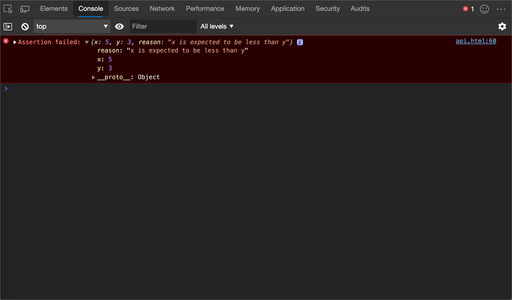

<br/><br/>

---

<!-- ====================================================================== -->
## clear

Clears the **Console**.

If [Preserve Log](reference.md#filter-by-log-level) is turned on, the [clear](#clear) method is turned off.

```javascript
console.clear()
```

### See also

* [Clear the Console](reference.md#clear-the-console)

<br/><br/>

---

<!-- ====================================================================== -->
## count

Writes the number of times that the [count](#count) method has been invoked at the same line and with the same `label`.  Use the [countReset](#countreset) method to reset the count.

```javascript
console.count([label])
```

[Log level](reference.md#persist-messages-across-page-loads): `Info`

### Example

```javascript
console.count();
console.count('coffee');
console.count();
console.count();
```

#### Output

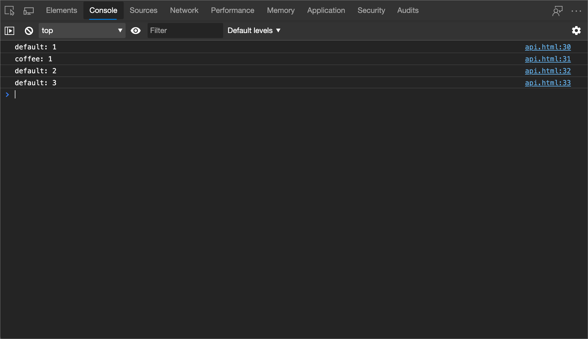

<br/><br/>

---

<!-- ====================================================================== -->
## countReset

Resets a count.

```javascript
console.countReset([label])
```

### Example

```javascript
console.countReset();
console.countReset('coffee');
```

<br/><br/>

---

<!-- ====================================================================== -->
## debug

Identical to the [log](#log) method, except different log level.

```javascript
console.debug(object [, object, ...])
```

[Log level](reference.md#persist-messages-across-page-loads): `Verbose`

### Example

```javascript
console.debug('debug');
```

#### Output

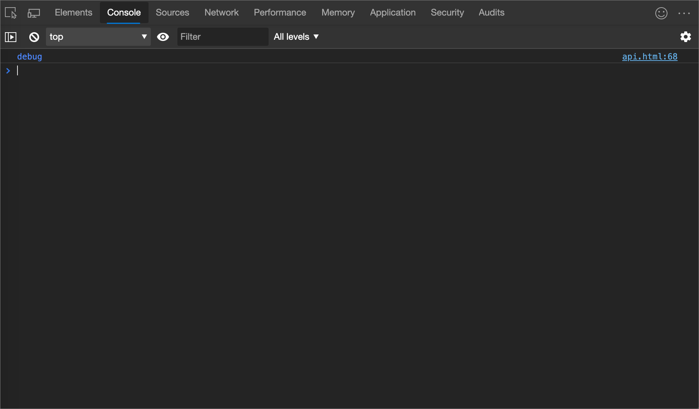

<br/><br/>

---

<!-- ====================================================================== -->
## dir

Prints a JSON representation of the specified object.

```javascript
console.dir(object)
```

[Log level](reference.md#persist-messages-across-page-loads): `Info`

### Example

```javascript
console.dir(document.head);
```

#### Output

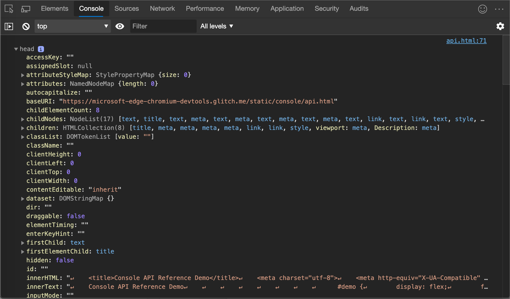

<br/><br/>

---

<!-- ====================================================================== -->
## dirxml

Prints an XML representation of the descendants of `node`.

```javascript
console.dirxml(node)
```

[Log level](reference.md#persist-messages-across-page-loads): `Info`

### Example

```javascript
console.dirxml(document);
```

#### Output

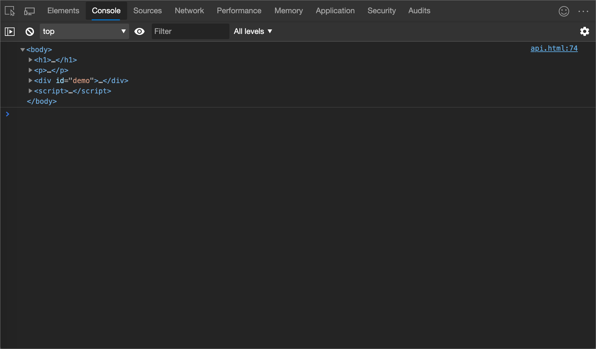

<br/><br/>

---

<!-- ====================================================================== -->
## error

Prints the `object` to the **Console**, formats it as an error, and includes a stack trace.

```javascript
console.error(object [, object, ...])
```

[Log level](reference.md#persist-messages-across-page-loads): `Error`

### Example

```javascript
console.error("I'm sorry, Dave.  I'm afraid I can't do that.");
```

#### Output

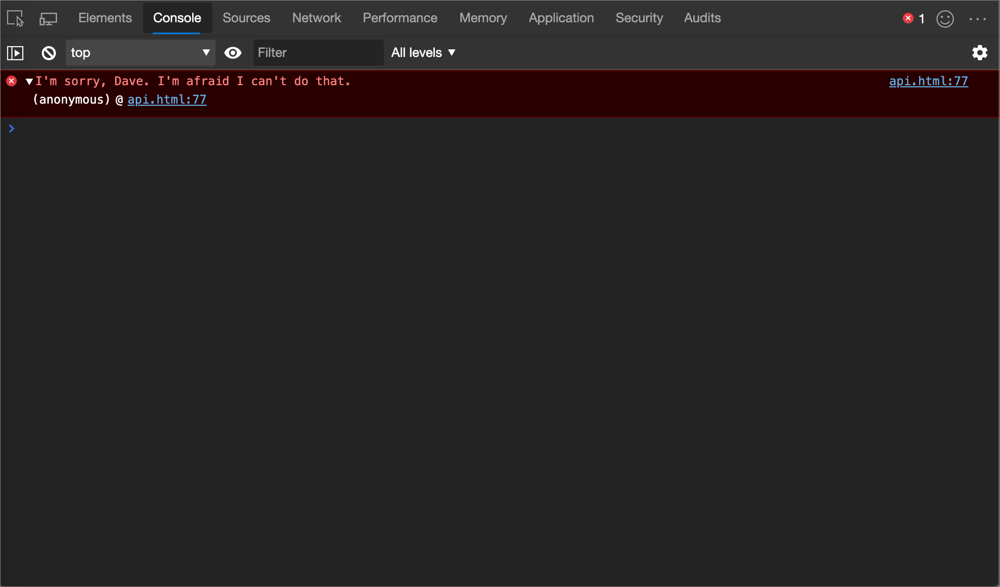

<br/><br/>

---

<!-- ====================================================================== -->
## group

Visually groups messages together until the [groupEnd](#groupend) method is used.  Use the [groupCollapsed](#groupcollapsed) method to collapse the group when it initially logs to the **Console**.

```javascript
console.group(label)
```

### Example

```javascript
const label = 'Adolescent Irradiated Espionage Tortoises';
console.group(label);
console.info('Leo');
console.info('Mike');
console.info('Don');
console.info('Raph');
console.groupEnd(label);
```

#### Output

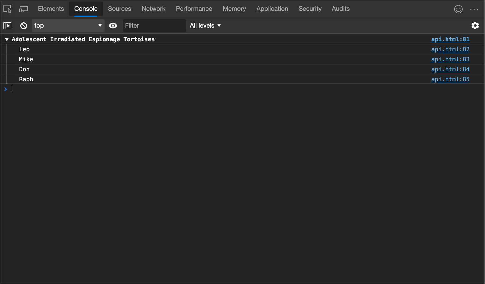

<br/><br/>

---

<!-- ====================================================================== -->
## groupCollapsed

Identical to the [log](#log) method, except the group is initially collapsed when it logs to the **Console**.

```javascript
console.groupCollapsed(label)
```

<br/><br/>

---

<!-- ====================================================================== -->
## groupEnd

Stops visually grouping messages.  See the [group](#group) method.

```javascript
console.groupEnd(label)
```

<br/><br/>

---

<!-- ====================================================================== -->
## info

Identical to the [log](#log) method.

```javascript
console.info(object [, object, ...])
```

[Log level](reference.md#persist-messages-across-page-loads): `Info`

### Example

```javascript
console.info('info');
```

#### Output


<br/><br/>

---

<!-- ====================================================================== -->
## log

Prints a message to the **Console**.

```javascript
console.log(object [, object, ...])
```

[Log level](reference.md#persist-messages-across-page-loads): `Info`

### Example

```javascript
console.log('log');
```

#### Output

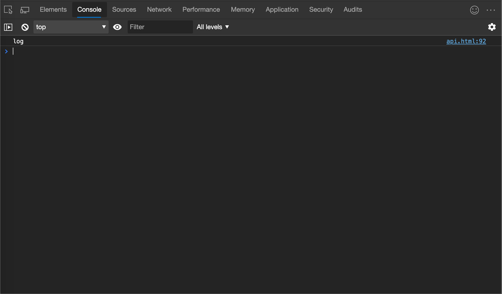

<br/><br/>

---

<!-- ====================================================================== -->
## table

Logs an array of objects as a table.

```javascript
console.table(array)
```

[Log level](reference.md#persist-messages-across-page-loads): `Info`

### Example

```javascript
console.table([
      {
         first: 'René',
         last: 'Magritte',
      },
      {
         first: 'Chaim',
         last: 'Soutine',
         birthday: '18930113',
      },
      {
         first: 'Henri',
         last: 'Matisse',
      }
]);
```

#### Output

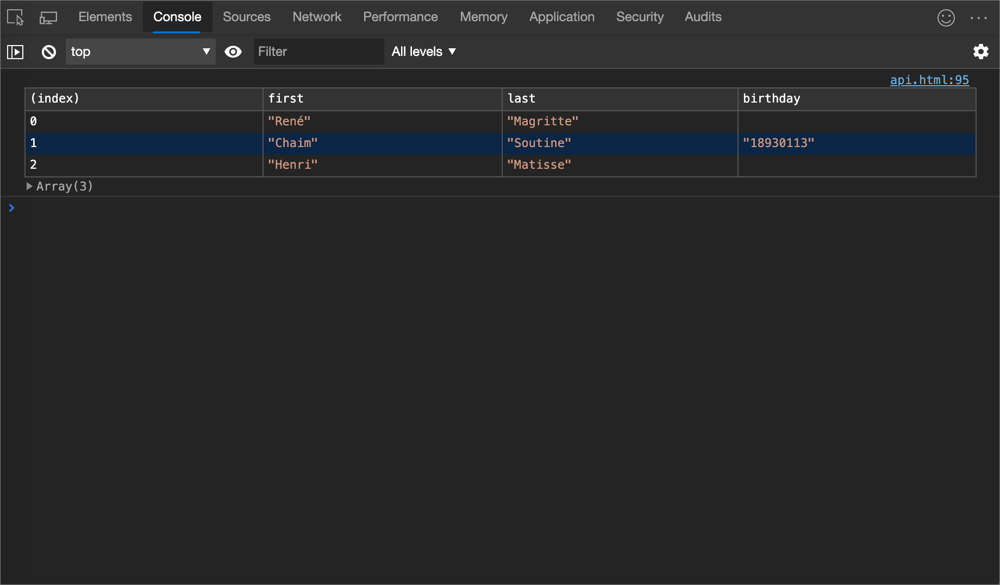

<br/><br/>

---

<!-- ====================================================================== -->
## time

Starts a new timer.  Use the [timeEnd](#timeend) method to stop the timer and print the elapsed time to the **Console**.

```javascript
console.time([label])
```

### Example

```javascript
console.time();
for (var i = 0; i < 100000; i++) {
      let square = i ** 2;
}
console.timeEnd();
```

#### Output

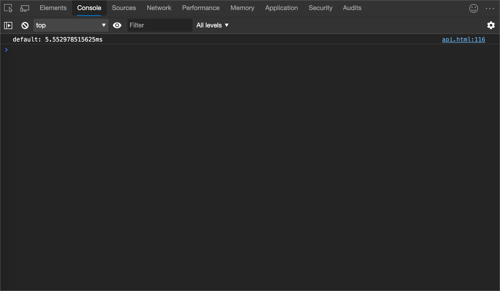

<br/><br/>

---

<!-- ====================================================================== -->
## timeEnd

Stops a timer.  For more information, see the [time](#time) method.

```javascript
console.timeEnd([label])
```

[Log level](reference.md#persist-messages-across-page-loads): `Info`

<br/><br/>

---

<!-- ====================================================================== -->
## trace

Prints a stack trace to the **Console**.

```javascript
console.trace()
```

[Log level](reference.md#persist-messages-across-page-loads): `Info`

### Example

```javascript
const first = () => { second(); };
const second = () => { third(); };
const third = () => { fourth(); };
const fourth = () => { console.trace(); };
first();
```

#### Output

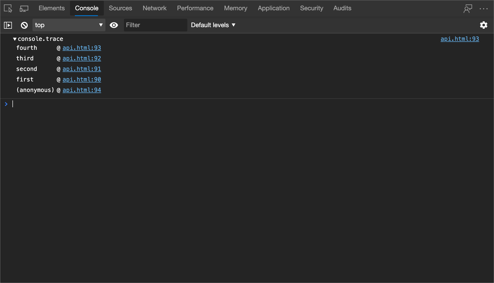

<br/><br/>

---

<!-- ====================================================================== -->
## warn

Prints a warning to the **Console**.

```javascript
console.warn(object [, object, ...])
```

[Log level](reference.md#persist-messages-across-page-loads): `Warning`

### Example

```javascript
console.warn('warn');
```

#### Output

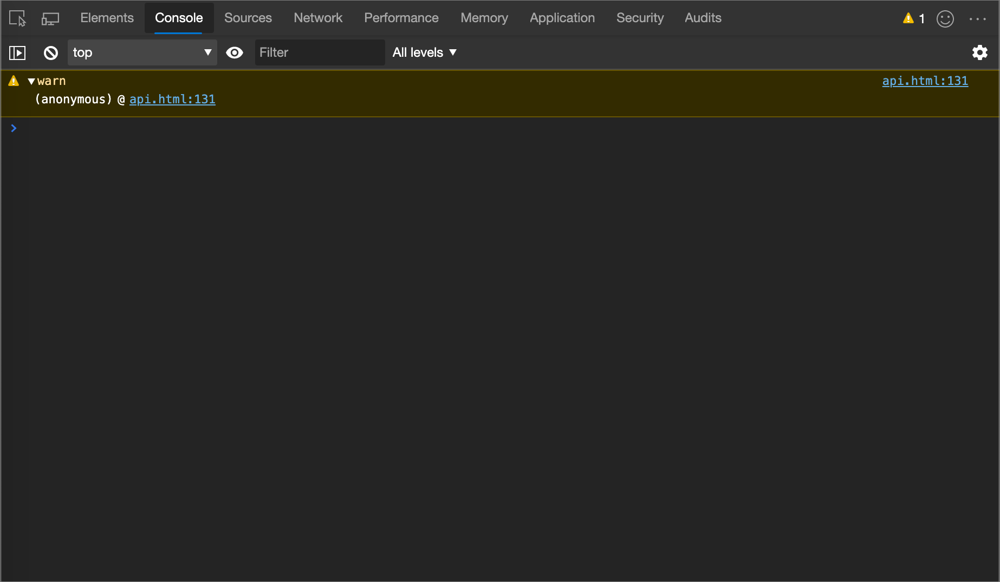

<br/><br/>

---

<!-- ====================================================================== -->
## See also

<!-- if an article's title is adequately descriptive, and the article is in the same TOC bucket as the present article, don't much need a link here: -->
* [MDN Web Docs > `console` object Reference](https://developer.mozilla.org/docs/Web/API/Console) - Has a summary overview of the methods, and has one page per method, with additional syntax details.
* [Log messages in the Console tool](console-log.md) - An interactive introduction.
* [Console tool utility functions and selectors](utilities.md) - **Console**-only utility methods, such as `debug()` and `monitorEvents()`.


<!-- ====================================================================== -->
> [!NOTE]
> Portions of this page are modifications based on work created and [shared by Google](https://developers.google.com/terms/site-policies) and used according to terms described in the [Creative Commons Attribution 4.0 International License](https://creativecommons.org/licenses/by/4.0).
> The original page is found [here](https://developer.chrome.com/docs/devtools/console/api/) and is authored by [Kayce Basques](https://developers.google.com/web/resources/contributors/kaycebasques) (Technical Writer, Chrome DevTools & Lighthouse).

[](https://creativecommons.org/licenses/by/4.0)
This work is licensed under a [Creative Commons Attribution 4.0 International License](https://creativecommons.org/licenses/by/4.0).
